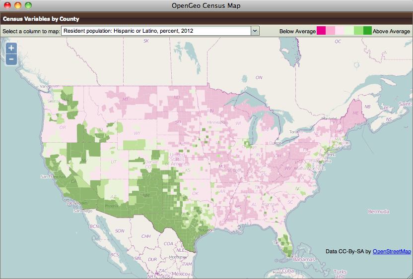

Framing the Map with OpenLayers 3
~~~~~~~~~~~~~~~~~~~~~~~~~~~~~~~~~

We already saw our map visualized in a bare `OpenLayers`_ map frame in the *Layer Preview* section of GeoServer. 

We want an application that provides a user interface component that manipulates the source WMS URL, altering the URL `viewparams <http://docs.geoserver.org/stable/en/user/data/database/sqlview.html#using-a-parametric-sql-view>`_ parameter.

We'll build the app using `Bootstrap`_ for a straightforward layout with CSS, and `OpenLayers`_ as the map component.

The base HTML page, `censusmap-ol3.html`_, contains script and stylesheet includes bringing in our various libraries. A custom stylesheet gives us a fullscreen map with a legend overlay. Bootstrap css classes are used to style the navigation bar. Containers for the map and a header navigation bar with the aforementioned topics dropdown are also included, and an image element with the legend image from a WMS *GetLegendGraphic* request is put inside the map container.

.. code-block:: html

    <!DOCTYPE html>
    <html>
      <head>
        <title>Boundless Census Map</title>
        <!-- Bootstrap -->
        <link rel="stylesheet" href="resources/bootstrap/css/bootstrap.min.css" type="text/css">
        <link rel="stylesheet" href="resources/bootstrap/css/bootstrap-theme.min.css" type="text/css">
        <!-- OpenLayers -->
        <link rel="stylesheet" href="resources/ol3/ol.css">
        
        <!-- Our Application -->
        
      </head>
      <body>
        <nav class="navbar navbar-inverse navbar-fixed-top" role="navigation">
          

            <a class="navbar-brand" href="#">Boundless Census Map</a>
          

          <form class="navbar-form navbar-right">
            

              <select id="topics" class="form-control"></select>
            

          </form>
        </nav>
        

          <!-- GetLegendGraphic, customized with some LEGEND_OPTIONS -->
          
        

        
      </body>
    </html>

The real code is in the `censusmap-ol3.js`_ file. We start by creating an `OpenStreetMap`_ base layer, and adding our parameterized census layer on top as an image layer with a `WMS Layer source`_.

.. code-block:: javascript

    // Base map
    var osmLayer = new ol.layer.Tile({source: new ol.source.OSM()});

    // Census map layer
    var wmsLayer = new ol.layer.Image({
      source: new ol.source.ImageWMS({
        url: 'http://apps.opengeo.org/geoserver/wms',
        params: {'LAYERS': 'opengeo:normalized'}
      }),
      opacity: 0.6
    });

    // Map object
    olMap = new ol.Map({
      target: 'map',
      renderer: ol.RendererHint.CANVAS,
      layers: [osmLayer, wmsLayer],
      view: new ol.View2D({
        center: [-10764594.0, 4523072.0],
        zoom: 5
      })
    });

We configure an `OpenLayers Map`_, assign the layers, and give it a map view with a center and zoom level. Now the map will load.

The *select* element with the id *topics* will be our drop-down list of available columns. We load the `DataDict.txt`_ file, and fill the *select* element with its contents. This is done by adding an *option* child for each line.

.. code-block:: javascript

    // Load variables into dropdown
    var topics = document.getElementById('topics');
    var xhr = new XMLHttpRequest();
    xhr.open("GET", "../data/DataDict.txt");
    xhr.onload = function() {
      var lines = xhr.responseText.split('\n');
      // We start at line 3 - line 1 is column names, line 2 is not a variable
      for (var i = 2, ii = lines.length; i < ii; ++i) {
        var option = document.createElement('option');
        option.value = lines[i].substr(0, 10).trim();
        option.innerHTML = lines[i].substr(10, 105).trim();
        topics.appendChild(option);
      }
    };
    xhr.send();

Finally, we add an *onchange* event handler for the dropdown, which updates the layer with WMS parameters for the selected variable when a new topic/layer is selected.

.. code-block:: javascript

    // Add behaviour to dropdown
    topics.onchange = function() {
      wmsLayer.getSource().updateParams({
        'viewparams': 'column:' + topics.options[topics.selectedIndex].value
      });
    };

Look at the the `censusmap-ol3.js`_ file to see the whole application in one page.

When we open the `censusmap-ol3.html`_ file, we see the application in action.

Bonus Task
~~~~~~~~~~

With some additional markup and css plus a few more lines of JavaScript code, we can even handle map clicks: When clicking on the map, we send a WMS GetFeatureInfo request, and display the result in a popup.

Most of the following markup, css and JavaScript code comes directly from the `OpenLayers Popup Example`_. The only difference is that we use ``ol.Map#getFeatureInfo()`` instead of just displaying the clicked coordinates.

First we need some markup for the popup, which we add to our HTML page, inside the map div. With popup added, the map div looks like this:

.. code-block:: html

  

      <button id="popup-closer" class="close">&times;</button>
      

  

To style the popup, we need some additional css in the existing ``<style>`` block on our HTML page:

.. code-block:: css

  .ol-popup {
    display: none;
    position: absolute;
    background-color: white;
    -moz-box-shadow: 0 1px 4px rgba(0,0,0,0.2);
    -webkit-filter: drop-shadow(0 1px 4px rgba(0,0,0,0.2));
    filter: drop-shadow(0 1px 4px rgba(0,0,0,0.2));
    padding: 15px;
    border-radius: 10px;
    border: 1px solid #cccccc;
    bottom: 12px;
    left: -50px;
  }
  .ol-popup:after, .ol-popup:before {
    top: 100%;
    border: solid transparent;
    content: " ";
    height: 0;
    width: 0;
    position: absolute;
    pointer-events: none;
  }
  .ol-popup:after {
    border-top-color: white;
    border-width: 10px;
    left: 48px;
    margin-left: -10px;
  }
  .ol-popup:before {
    border-top-color: #cccccc;
    border-width: 11px;
    left: 48px;
    margin-left: -11px;
  }
  .ol-popup .close {
    position: absolute;
    top: 2px;
    right: 8px;
  }
  .ol-popup iframe {
    width: 400px;
    height: 120px;
    border: 0;
  }

Finally, we need some JavaScript to add behaviour to the popup's close button, to create an ``ol.Overlay`` so the popup is anchored to the map, and to trigger a GetFeatureInfo request when the map is clicked:

.. code-block:: javascript

  // Create an ol.Overlay with the popup so it is anchored to the map
  var popupContainer = document.getElementById('popup');
  var popup = new ol.Overlay({
    element: popupContainer
  });
  olMap.addOverlay(popup);

  // Handle map clicks to send a GetFeatureInfo request and open the popup
  olMap.on('singleclick', function(evt) {
    olMap.getFeatureInfo({
      pixel: evt.getPixel(),
      success: function (info) {
        var mapCoordinate = evt.getCoordinate();
        popup.setPosition(mapCoordinate);
        document.getElementById('popup-content').innerHTML = info.join('');
        popupContainer.style.display = 'block';
      }
    });
  });

  // Add behaviour to the popup's close button
  document.getElementById('popup-closer').onclick = function() {
    popupContainer.style.display = 'none';
    return false;
  };

Conclusion
----------

We've built an application for browsing 51 different census variables, using less than 51 lines of JavaScript application code, and demonstrating:

* SQL views provide a powerful means of manipulating data on the fly.
* Standard deviations make for attractive visualization breaks.
* Professionally generated color palettes are better than programmer generated ones.
* Simple OpenLayers applications are easy to build.
* Census data can be really, really interesting!
* The applicatin is easy to extend. With 20 more lines of code we can handle clicks and display feature information.

.. _WMS Layer source: http://ol3js.org/en/master/apidoc/ol.source.ImageWMS.html
.. _OpenLayers Map: http://ol3js.org/en/master/apidoc/ol.Map.html
.. _OpenLayers Popup Example: http://ol3js.org/en/master/examples/popup.html
.. _OpenStreetMap: http://openstreetmap.org
.. _Suite installation instructions: http://suite.opengeo.org/opengeo-docs/installation/index.html
.. _OpenLayers: http://ol3js.org
.. _Bootstrap: http://getbootstrap.com
.. _censusmap-ol3.js: _static/code/censusmap-ol3.js
.. _censusmap-ol3.html: _static/code/censusmap-ol3.html
.. _DataDict.txt: _static/data/DataDict.txt
.. _DataSet.txt: _static/data/DataSet.txt
.. _stddev.xml: _static/data/stddev.xml
.. _Create a spatial database: http://suite.opengeo.org/opengeo-docs/dataadmin/pgGettingStarted/createdb.html

