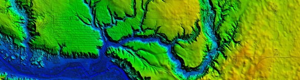
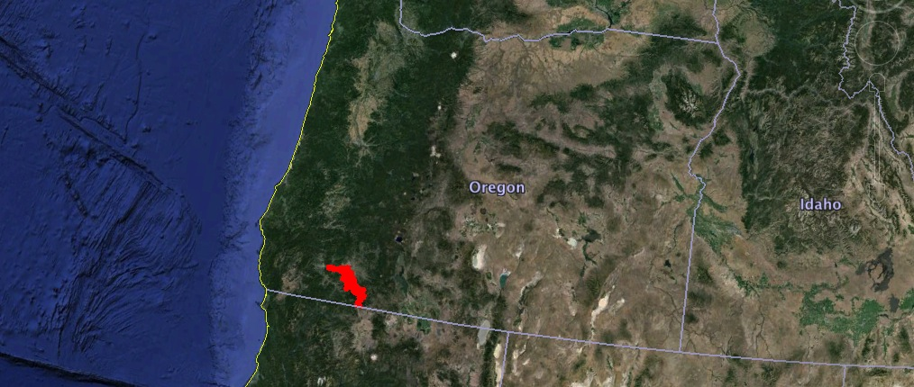
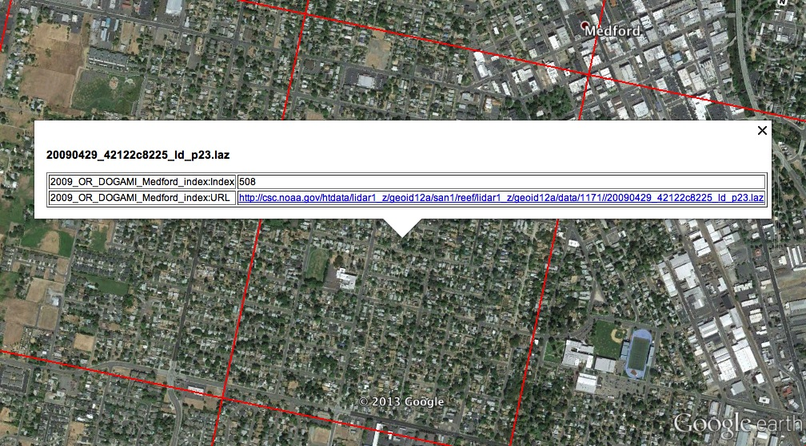
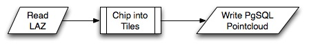
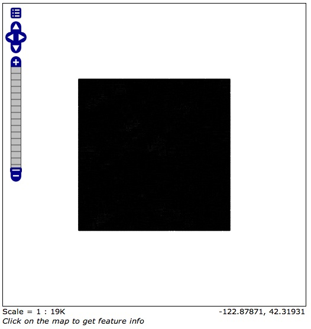
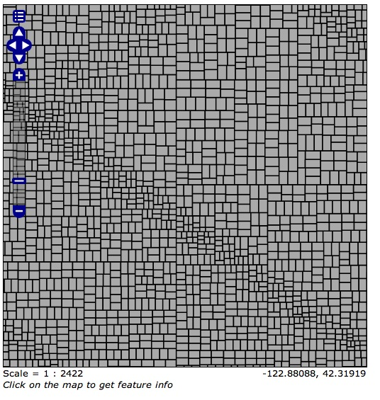
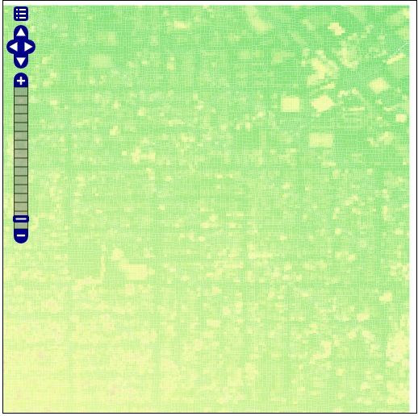

.. note:: 

  Check out the `final elevated buildings in Google Earth <_static/buildings-elevated.kml>`_ and play!

Introduction
============

`LIDAR`_ data is accumulating in companies and government agencies around the world as acquisition costs fall and potential uses grow. Site surveys, detailed flood plain mapping, and infrastructure inventories are all making extensive use of the laser range-finding technology.

`LIDAR`_ works by sending out pulses of laser light, then measuring the reflections that return, and how long it takes for the return to arrive. Using this information, the position of the reflection can be calculated relative to the sensor. Among the information that is generally included in LIDAR data files are:

* the x, y and z coordinates of the reflection points;
* the red, green, and blue components of the reflection;
* the intensity of the reflection;
* other reflections that came from the same pulse--known as "first return", "second return", "third return"--which can occur in forested areas, for example, with one return from the top of the tree canopy and others from further down;
* the time of the pulse;
* the angle of the reflection relative to the sensor; and
* many other sensor-specific measurements.

The scanners will generate billions of pulses in a large survey, each of which will have all the above information (and more) measured. 

Suffice to say, LIDAR data can be both really complex, and **really large!**

A lot of LIDAR uses are very particular, whether generating building site models to measure from or evaluating the state of physical infrastructure, but once the work is done, what's a good way to store LIDAR for future uses?

The most common storage system so far is the desk drawer, but new database technology is opening up the possibility to keep the data live and online, available for analytical and visualization uses.

This tutorial will explore loading and exploiting a LIDAR data set:

* downloading the data and loading it into PostgreSQL using the LIDAR tools included in `OpenGeo Suite 4`_;
* visualizing and exposing some of the data using GeoServer and Google Earth;
* analyzing and elevating a building footprints layer against the LIDAR; and,
* visualizing the elevated buildings using GeoServer and Google Early.

Installing Software
===================

Install the following software:

* `OpenGeo Suite 4`_
  
  * Ubuntu users: Ensure that the `postgresql-9.3-pointcloud` extension for PostgreSQL and `pdal` LIDAR tools are installed, they may not be automatically installed with the `opengeo` package.
  * RHEL/Centos users: Ensure that the `pointcloud-postgresql93` extension for PostgreSQL and `pdal` LIDAR tools are installed, they may not be automatically installed with the `opengeo` package.
  * All users: Check that you can run the command-line `pdal` and `shp2pgsql` programs.
  
* `Google Earth <http://earth.google.com>`_

.. note::

  Once you've installed Suite, ensure that 
  
  * you can connect to the database with PgAdmin or `psql`, and 
  * you can connect to GeoServer (http://localhost:8080/geoserver/) using your web browser

Getting Data
============

LIDAR
-----

Thanks to open data initiatives, both LIDAR data and vector data are not hard to come by. This workshop uses data from the State of Oregon.

For LIDAR data, we'll use a survey `conducted by the Oregon Departing of Geology in 2009 <http://catalog.data.gov/dataset/2009-oregon-department-of-geology-and-mineral-industries-dogami-lidar-medfordc9f32>`_. It covers a large area of Jackson County, including the City of Medford.

The data is collected into individual "LASZIP" files, of about 70MB in size each. For simplicity we're only going to use one tile, but there's no reason you could not use multiple tiles for this example.

.. image:: ./img/lidar_area.jpg
   :width: 98%

The `data directory <http://www.csc.noaa.gov/htdata/lidar1_z/geoid12a/data/1171/>`_ includes all the tiles as well as a shape file that provides a spatial index of where each tile is.

The tile we are going to use covers both a residential and commercial area of Medford.

**Download** LIDAR tile `20090429_42122c8225_ld_p23.laz <http://www.csc.noaa.gov/htdata/lidar1_z/geoid12a/data/1171/20090429_42122c8225_ld_p23.laz>`_ now.

.. note::

  **How did you get that footprint file into Google Earth?** 
  
  `OpenGeo Suite 4`_ ships with a collection of "command line tools", including the very useful `ogr2ogr` tool that allows format conversion. After downloading and unzipping the `tileindex.zip <http://www.csc.noaa.gov/htdata/lidar1_z/geoid12a/data/1171/tileindex.zip>`_ file, just run::
  
    ogr2ogr -f KML tileindex.kml 2009_OR_DOGAMI_Medford_index.shx

Building Footprints
-------------------

In our analysis, we'll be using the LIDAR data to determine the height of the buildings within our LIDAR tile. To do that, we need building outlines! Fortunately, Jackson County has an `open data program <http://www.smartmap.org/Portal/gis-data.aspx>`_.

**Download** the shape file `BuildingFootprints.zip <http://www.smartmap.org/Portal/SharedFiles/Download.aspx?pageid=2&mid=2&fileid=43>`_ now.

Loading LIDAR into the Database
===============================

We are going to load the LIDAR data into a table in PostgreSQL, and then do spatial analysis on it using PostGIS, so we will need a new database with appropriate extensions turned on.

* Create a new database named `lidar`
* Enable the `pointcloud`, `postgis`, and `pointcloud_postgis` extensions.

.. code-block:: sql

  CREATE EXTENSION postgis;
  CREATE EXTENSION pointcloud;
  CREATE EXTENSION pointcloud_postgis;

Now we can load the data!

PDAL
----

`PDAL`_, the "point data abstraction library", is for manipulating spatial point cloud data. In includes a code library (for integration into applications) and a command-line tool (`pdal`, an application that uses the library). Point clouds are often captured by LIDAR sensors but also captured using stereo photogrammetry, pulsed sonar, and many other sensor types.

We can use the `pdal` command-line program to read some metadata about our LAZ file::

  pdal info --input 20090429_42122c8225_ld_p23.laz --schema
  
The `--schema` information shows us all the dimensions in the file, which are many: "X", "Y", "Z", "Intensity", "ReturnNumber", "NumberOfReturns", "ScanDirectionFlag", "EdgeOfFlightLine", "Classification", "ScanAngleRank", "UserData", "PointSourceId", and "Time".

We can also read file-level metadata::

  pdal info --input 20090429_42122c8225_ld_p23.laz --metadata --xml
  
The return is an unformatted XML mess, unfortunately, but if you read the `formatted file <_static/lidar_metadata.xml>`_ you can find lots of interesting information

* the spatial reference of the data is geographic coordinates (lon/lat) in WGS84
* the bounds of the data are (-122.8874999,42.3125),(-122.8749998,42.325)
* the data were created using "TerraScan" software

We can also use `PDAL`_ to build up a processing pipeline that can

* read and write to different point cloud formats
  * Oracle PointCloud
  * PostgreSQL PointCloud (what we are using)
  * LAS/LAZ
  * Text/CSV
* translate, rescale and reproject the points
* generate a grid from points
* calculate the bounds of a point collection
* crack a big collection of points into smaller coherent "tiles"
* add color to points from an external raster image

We are going to build up a "pipeline" to read our LAZ file, crack the collection into smaller 400-point tiles, and then write the data into our `lidar` database.

The PDAL "`pipeline file <http://www.pointcloud.org/pipeline/index.html>`_" is an XML file that describes the processing. Each process wraps the process preceding it, resulting in a "nesting dolls" structure, in which the first process (the reader) is in the center and the last (the writer) is on the outside.

Here is our pipeline file. Note that we are using "EPSG:4326" are your spatial referencing system, since that's what we learned from the metadata. **Copy this into a pipeline file**, `laz2pg.xml <_static/laz2pg.xml>`_:

.. code-block:: xml

  <?xml version="1.0" encoding="utf-8"?>
  <Pipeline version="1.0">
    <Writer type="drivers.pgpointcloud.writer">
      <Option name="connection">dbname='lidar' user='postgres'</Option>
      <Option name="table">medford</Option>
      <Option name="srid">4326</Option>
      <Filter type="filters.chipper">
        <Option name="capacity">400</Option>
        <Filter type="filters.cache">
          <Reader type="drivers.las.reader">
            <Option name="filename">20090429_42122c8225_ld_p23.laz</Option>
            <Option name="spatialreference">EPSG:4326</Option>
          </Reader>
        </Filter>
      </Filter>
    </Writer>
  </Pipeline>

Now we are ready to run the data loading process::

  pdal pipeline laz2pg.xml 

When the process is complete, there will be a new table in the database::

                             Table "public.medford"
   Column |    Type    |                      Modifiers                       
  --------+------------+------------------------------------------------------
   id     | integer    | not null default nextval('medford_id_seq'::regclass)
   pa     | pcpatch(1) | 
  Indexes:
      "medford_pkey" PRIMARY KEY, btree (id)

Note the type of the `pa` column in the database, it is `pcpatch(1)`. The `pcpatch` part refers to the data type, which is a collection of point cloud points, grouped into a square area, a "patch" of data. The `(1)` part refers to the "format" of the points inside the patch: how many dimensions each point has, and what those dimensions are. You can see the format entry by reading the `pointcloud_formats` table.

.. code-block:: sql

  SELECT * FROM pointcloud_formats WHERE pcid = 1;
  
The `schema` column is hard to read in the output format from PostgreSQL, but a `formatted version <_static/lidar_schema.xml>`_ is easier to understand.

We can use our knowledge of the schema, and the functions in the `pointcloud` extension to learn more about our point cloud data.

.. code-block::sql

  -- How many points are in our cloud? (11418635)
  SELECT Sum(PC_NumPoints(pa)) 
  FROM medford;
 
  -- What is the average elevation of the first patch? (439.384)
  WITH pts AS (
    SELECT PC_Explode(pa) AS pt
    FROM medford LIMIT 1
  )
  SELECT Avg(PC_Get(pt,'Z')) FROM pts;

  -- What does the first point look like?
  WITH pts AS (
    SELECT PC_Explode(pa) AS pt
    FROM medford LIMIT 1
  )
  SELECT PC_AsText(pt) FROM pts LIMIT 1;
  -- {
  --  "pcid":1,
  --  "pt":[-122.887,42.3125,439.384,42,1,1,1,0,1,6,181,343,419629,1.14073e+07,0]
  -- }
  
  -- How many tiles do we have? (28547)
  SELECT Count(*) 
  FROM medford;

  -- What is the min/max elevation in our cloud? (421.20/467.413)
  SELECT 
    Min(PC_PatchMin(pa, 'z')) AS min,
    Max(PC_PatchMax(pa, 'z')) AS max
  FROM medford;

  -- What does a patch look like as a geometry?
  SELECT st_asewkt(pa::geometry) FROM medford LIMIT 1;
  -- SRID=4326;POLYGON((-122.8874998 42.3125002,-122.8874998 42.312613,
  -- -122.8874414 42.312613,-122.8874414 42.3125002,-122.8874998 42.3125002))
  
  -- What does a point look like as a geometry?
  WITH pts AS (
    SELECT PC_Explode(pa) AS pt
    FROM medford LIMIT 1
  )
  SELECT ST_AsEWKT(pt::geometry) FROM pts LIMIT 1;
  -- SRID=4326;POINT(-122.8874601 42.3125002 439.384)

Putting LIDAR on the Map
========================

The trouble with LIDAR is that there's just so darn much of it! This very very small example data set includes 11 MILLION points. Drawing them on a map would be very slow, and not very visually instructive. 

To view a summary of our data, we will put the point patches from the database onto a map.

GeoServer can only map PostGIS geometries, so we'll use the cast from `pcpatch` to `geometry` to create a polygon view of the data.

.. code-block:: sql

  CREATE VIEW medford_patches AS 
  SELECT 
    pa::geometry(Polygon, 4326) AS geom,
    PC_PatchAvg(pa, 'Z') AS elevation
  FROM medford;

Now set up a GeoServer layer that reads from the view

* `Log in to GeoServer <http://suite.opengeo.org/docs/4.0/geoserver/webadmin/basics.html#welcome-page>`_.
* `Add a new PostGIS store <http://suite.opengeo.org/docs/4.0/geoserver/webadmin/data/stores.html#adding-a-store>`_.

  .. image:: ./img/gs_newstore.jpg
  
* Add a new layer, publishing the `medford_patches` layer.
* Configure the `medford_patches` layer.

  * On the “Data” tab:

    * Native bounding box, click on “Compute from data”
    * Lat/Lon bounding box, click on “Compute from native bounds”

  * On the “Tile Caching” tab:

    * Tile Caching, uncheck “Create cached layer for this layer”
    * Click “Save”

We now have a viewable layer!

* Go to the "Layer Preview" page
* In the entry for `medford_patches` click the "Go" link

Whoa, a big black square! 

What's going on here? Zoom in a few steps and things become clearer.
  

There are 28547 patches, and all drawn on one small preview, they look like a dark mass. But zoomed in, we can see the detail of the small blocks of points, each with about 400 points inside. 

However, as dark splotches, they leave much to be desired! It would be nicer if they were colored according to their elevation, so we need to **add a Style** to GeoServer with the colors we desire.

* Configure a new style in GeoServer by going to the *Styles* section, and selecting **Add a new style**.
* Set the style name to *elevation_ramp*
* Set the style workspace to *opengeo* 
* Paste in the style definition (below) for elevation_ramp.xml and hit the *Save* button at the bottom

.. code-block:: xml

  <?xml version="1.0" encoding="ISO-8859-1"?>
  <StyledLayerDescriptor version="1.0.0"
    xmlns="http://www.opengis.net/sld"
    xmlns:ogc="http://www.opengis.net/ogc"
    xmlns:xlink="http://www.w3.org/1999/xlink"
    xmlns:xsi="http://www.w3.org/2001/XMLSchema-instance"
    xmlns:gml="http://www.opengis.net/gml"
    xsi:schemaLocation="http://www.opengis.net/sld
    http://schemas.opengis.net/sld/1.0.0/StyledLayerDescriptor.xsd">

    <NamedLayer>
      <Name>opengeo:elevation_ramp</Name>
      <UserStyle>
        <Name>Elevation Color Ramp</Name>
        <FeatureTypeStyle>
          <Rule>
            <PolygonSymbolizer>
              <Fill>
                <CssParameter name="fill">
                  <ogc:Function name="Interpolate">
                
                    <!-- Property to transform -->
                    <ogc:PropertyName>elevation</ogc:PropertyName>

                    <!-- Interpolation curve definition pairs (input, output) -->
                    <ogc:Literal>420</ogc:Literal>
                    <ogc:Literal>#6EDC6E</ogc:Literal>

                    <ogc:Literal>440</ogc:Literal>
                    <ogc:Literal>#F0FAA0</ogc:Literal>

                    <ogc:Literal>460</ogc:Literal>
                    <ogc:Literal>#E6DCAA</ogc:Literal>

                    <ogc:Literal>480</ogc:Literal>
                    <ogc:Literal>#DCDCDC</ogc:Literal>

                    <ogc:Literal>2500</ogc:Literal>
                    <ogc:Literal>#FFFFFF</ogc:Literal>

                    <!-- Interpolation method -->
                    <ogc:Literal>color</ogc:Literal>

                  <!-- Interpolation mode - defaults to linear -->
                  </ogc:Function>
                </CssParameter>
              </Fill>
            </PolygonSymbolizer>
          </Rule>
        </FeatureTypeStyle>
      </UserStyle>
    </NamedLayer>
  </StyledLayerDescriptor>
  
This is not a standard SLD style, it doesn't have rules defining the color breaks. Instead, it uses the `<ogc:Function>` `Interpolate` to create a continuous color ramp style, with color breaks suggested in this `blog post <http://blog.thematicmapping.org/2012/06/creating-color-relief-and-slope-shading.html>`_.

* Go to the *Layers* section
* Select the *medford_patches* layer to configure
* Under *Default style* select the *elevation_ramp* entry
* Click on *Save* at the bottom on the page

Now, go to the *Layer Preview* section, and under *medford_patches* click *Go*.

Now the (small) variation in the patch elevation can be seen. In fact, the variation is so small over the tile that larger commercial buildings actually stand out from the ground they are sitting on.

Putting Buildings on the Map
============================

Unzip the **BuildingFootprints.zip** file we downloaded earlier, you should end up with a collection of files::

  BuildingFootprints.shx  
  BuildingFootprints.dbf  
  BuildingFootprints.prj  
  BuildingFootprints.sbn  
  BuildingFootprints.sbx  
  BuildingFootprints.shp  
  BuildingFootprints.shp.xml  

We are going to load the buildings into the database as a spatial table, but before we do, we need to figure out what "spatial reference ID" or "SRID" to use to tie the coordinates of the file down to the earth. 

The contents of the `BuildingFootprints.prj` are what we're interested in::

  PROJCS["NAD_1983_StatePlane_Oregon_South_FIPS_3602_Feet_Intl",
    GEOGCS["GCS_North_American_1983",
      DATUM["D_North_American_1983",
        SPHEROID["GRS_1980",6378137.0,298.257222101]],
      PRIMEM["Greenwich",0.0],
      UNIT["Degree",0.0174532925199433]],
    PROJECTION["Lambert_Conformal_Conic"],
    PARAMETER["False_Easting",4921259.842519685],
    PARAMETER["False_Northing",0.0],
    PARAMETER["Central_Meridian",-120.5],
    PARAMETER["Standard_Parallel_1",42.33333333333334],
    PARAMETER["Standard_Parallel_2",44.0],
    PARAMETER["Latitude_Of_Origin",41.66666666666666],
    UNIT["Foot",0.3048]]

It's pretty clear this is "Oregon Stateplane NAD83 in Feet", but what "SRID" number should we use? 

* Go to http://prj2epsg.org
* Paste in the definition from `BuildingFootprints.prj`
* The answer is `2270 <http://prj2epsg.org/epsg/2270>`_

So, now we can load the data, using `shp2pgsql`, into a table named `buildings`::

  shp2pgsql -s 2270 -D BuildingFootprints.shp buildings | psql -d lidar 
  
Now we have a `buildings` table::

            Table "public.buildings"
     Column   |            Type           
  ------------+-----------------------------
   gid        | integer                     
   objectid   | numeric(10,0)               
   layer      | character varying(32)       
   elevation  | numeric                     
   shape_star | numeric                     
   shape_stle | numeric                     
   shape_area | numeric                     
   shape_len  | numeric                     
   geom       | geometry(MultiPolygon,2270) 
  Indexes:
      "buildings_pkey" PRIMARY KEY, btree (gid)

Since our LIDAR data is all in geographic coordinates (EPSG:4326) and we're going to have to integrate them, we'll avoid coordinate system mis-match issues by transforming the buildings into geographics right now:

.. code-block:: sql

  -- Update SRID and transform all geoms
  ALTER TABLE buildings
  ALTER COLUMN geom
  TYPE geometry(MultiPolygon,4326)
  USING ST_Transform(geom, 4326);

  -- Index the table
  CREATE INDEX buildings_gix ON buildings USING GIST (geom);
  

    
Topics TO DO
============

* Enable pointcloud, postgis, pointcloud_postgis
* Create PDAL chain and load
* Metadata about LIDAR (pdal info? PC\_*)
* Thematic view of chip outlines in GeoServer
  * http://docs.geoserver.org/latest/en/user/styling/sld-tipstricks/transformation-func.html#interpolate
  * http://blog.thematicmapping.org/2012/06/creating-color-relief-and-slope-shading.html
  * visualize it using interpolation transformation on the chip boundaries
  * visualize it using interpolation transformation on the points?
* Load buildings
  * http://prj2epsg.org/epsg/2270
  * note on coordinate systems, matching them to LIDAR?
  * find elevation of a building footprint
  * find elevations of all of them, add to table
* KML output template for buildings
  * Using Heights TMPL to extrude
  * http://docs.geoserver.org/stable/en/user/googleearth/tutorials/heights/heights.html#tutorials-heights
  
::

  <altitudeMode>absolute</altitudeMode>
  <extrude>1</extrude>

.. _OpenGeo Suite 4: http://suite.opengeo.org/opengeo-docs/installation/index.html
.. _LIDAR: http://en.wikipedia.org/wiki/Lidar
.. _PDAL: http://pointcloud.org

