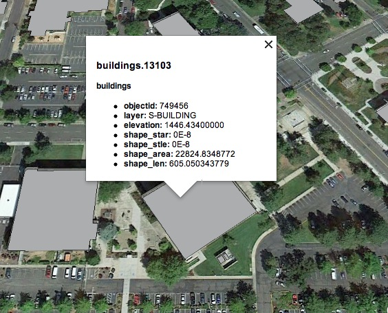
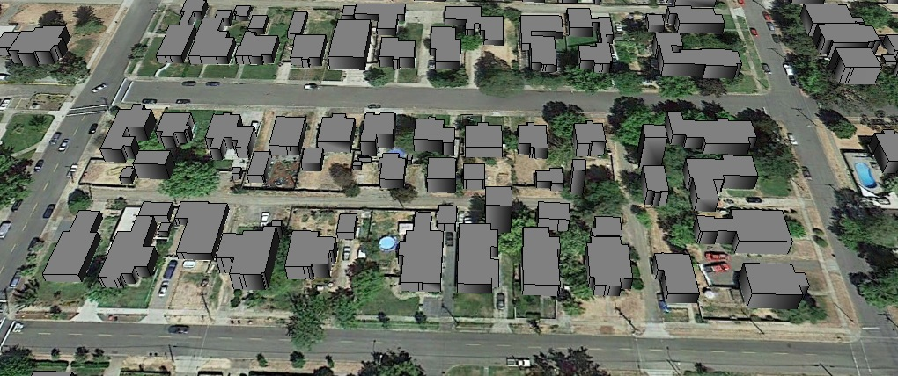
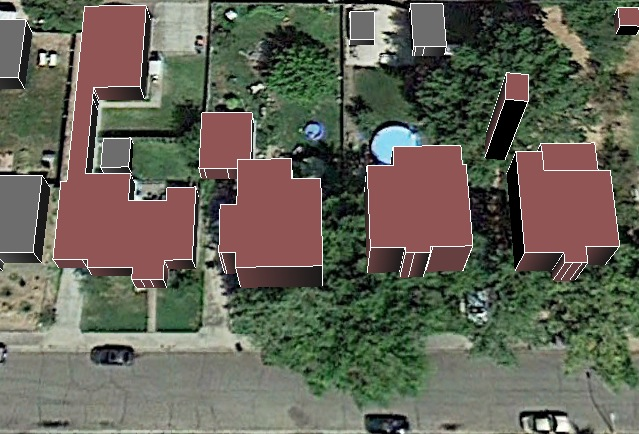
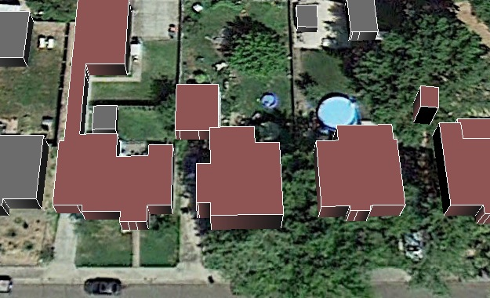

.. Check out the `final elevated buildings in Google Earth <http://apps.opengeo.org:8080/geoserver/wms/kml?layers=opengeo:buildings&mode=refresh&kmscore=50&format_options=lookatbbox:bbox=-122.8808,42.3311,-122.8806,42.3313>`_ and play!

Introduction
============

`LIDAR`_ data is accumulating in companies and government agencies around the world as acquisition costs fall and potential uses grow. Site surveys, detailed flood plain mapping, and infrastructure inventories are all making extensive use of the laser range-finding technology.

.. image:: ./img/lidar_pic.jpg
   :width: 98%

`LIDAR`_ works by sending out pulses of laser light, then measuring the reflections that return, and how long it takes for the return to arrive. Using this information, the position of the reflection can be calculated relative to the sensor. Among the information that is generally included in LIDAR data files are:

* the x, y and z coordinates of the reflection points;
* the red, green, and blue components of the reflection;
* the intensity of the reflection;
* other reflections that came from the same pulse--known as "first return", "second return", "third return"--which can occur in forested areas, for example, with one return from the top of the tree canopy and others from further down;
* the time of the pulse;
* the angle of the reflection relative to the sensor; and
* many other sensor-specific measurements.

The scanners will generate billions of pulses in a large survey, each of which will have all the above information (and more) measured. 

Suffice to say, LIDAR data can be both really complex, and **really large!**

A lot of LIDAR uses are very particular, whether generating building site models to measure from or evaluating the state of physical infrastructure, but once the work is done, what's a good way to store LIDAR for future uses?

The most common storage system so far is the desk drawer, but new database technology is opening up the possibility to keep the data live and online, available for analytical and visualization uses.

This tutorial will explore loading and exploiting a LIDAR data set:

* downloading the data and loading it into PostgreSQL using the LIDAR tools included in `OpenGeo Suite 4`_;
* visualizing and exposing some of the data using GeoServer and Google Earth;
* analyzing and elevating a building footprints layer against the LIDAR; and,
* visualizing the elevated buildings using GeoServer and Google Earth.

Installing Software
===================

Install the following software:

* `OpenGeo Suite 4`_
  
  * Ubuntu users: Ensure that the `postgresql-9.3-pointcloud` extension for PostgreSQL and `pdal` LIDAR tools are installed, they may not be automatically installed with the `opengeo` package.
  * RHEL/Centos users: Ensure that the `pointcloud-postgresql93` extension for PostgreSQL and `pdal` LIDAR tools are installed, they may not be automatically installed with the `opengeo` package.
  * All users: Check that you can run the command-line `pdal` and `shp2pgsql` programs.
  * **Windows users**: As of November 2013, Suite 4 does not include the `pdal` tools, which will make this tutorial hard to complete. The next minor release of the Suite for Windows should include `pdal`.
  
* `Google Earth <http://earth.google.com>`_

.. note::

  Once you've installed Suite, ensure that 
  
  * you can connect to the database with PgAdmin or `psql`, and 
  * you can connect to GeoServer at http://localhost:8080/geoserver/ using your web browser

Getting Data
============

LIDAR
-----

Thanks to open data initiatives, both LIDAR data and vector data are not hard to come by. This workshop uses data from the State of Oregon.

For LIDAR data, we'll use a survey `conducted by the Oregon Department of Geology in 2009 <http://catalog.data.gov/dataset/2009-oregon-department-of-geology-and-mineral-industries-dogami-lidar-medfordc9f32>`_ and stored by NOAA. It covers a large area of Jackson County, including the City of Medford.

.. image:: ./img/oregon.jpg
   :width: 98%

The data is collected into individual "LASZIP" files, of about 70MB in size each. For simplicity we're only going to use one file, but there's no reason you could not use multiple files for this example.

.. image:: ./img/lidar_area.jpg
   :width: 98%

The `NOAA data directory <http://www.csc.noaa.gov/htdata/lidar1_z/geoid12a/data/1171/>`_ includes all the files as well as a shape file that provides a spatial index of where each file is.

The file we are going to use covers both a residential and commercial area of Medford.

.. image:: ./img/lidar_tile.jpg
   :width: 98%

**Download** LIDAR file `20090429_42122c8225_ld_p23.laz <http://www.csc.noaa.gov/htdata/lidar1_z/geoid12a/data/1171/20090429_42122c8225_ld_p23.laz>`_ now.

.. note::

  **How did you get that footprint file into Google Earth?** 
  
  `OpenGeo Suite 4`_ ships with a collection of "command line tools", including the very useful `ogr2ogr` tool that allows format conversion. After downloading and unzipping the `tileindex.zip <http://www.csc.noaa.gov/htdata/lidar1_z/geoid12a/data/1171/tileindex.zip>`_ file, just run::
  
    ogr2ogr -f KML tileindex.kml 2009_OR_DOGAMI_Medford_index.shp

Building Footprints
-------------------

In our analysis, we'll be using the LIDAR data to determine the height of the buildings within our LIDAR file. To do that, we need building outlines! Fortunately, Jackson County has an `open data program <http://gis.jacksoncounty.org/Portal/gis-data.aspx>`_.

**Download** the shape file `BuildingFootprints.zip <http://gis.jacksoncounty.org/Portal/SharedFiles/Download.aspx?pageid=2&mid=2&fileid=43>`_ now.

Loading LIDAR into the Database
===============================

We are going to load the LIDAR data into a table in PostgreSQL, and then do spatial analysis on it using PostGIS, so we will need a new database with appropriate extensions turned on.

* Create a new database named `lidar`
* Enable the `pointcloud`, `postgis`, and `pointcloud_postgis` extensions.

.. code-block:: sql

  CREATE EXTENSION postgis;
  CREATE EXTENSION pointcloud;
  CREATE EXTENSION pointcloud_postgis;

Now we can load the data!

PDAL
----

`PDAL`_, the "point data abstraction library", is for manipulating spatial point cloud data. It includes a code library (for integration into applications) and a command-line tool, `pdal`, that makes use of the library. Point clouds are often captured by LIDAR sensors but also captured using stereo photogrammetry, pulsed sonar, and many other sensor types.

We can use the `pdal` command-line program to read some metadata about our LAZ file::

  pdal info --input 20090429_42122c8225_ld_p23.laz --schema
  
The `--schema` information shows us all the dimensions in the file, which are many: "X", "Y", "Z", "Intensity", "ReturnNumber", "NumberOfReturns", "ScanDirectionFlag", "EdgeOfFlightLine", "Classification", "ScanAngleRank", "UserData", "PointSourceId", and "Time".

We can also read file-level metadata::

  pdal info --input 20090429_42122c8225_ld_p23.laz --metadata --xml
  
The return is an unformatted XML mess, unfortunately, but if you read the `formatted file <_static/lidar_metadata.xml>`_ you can find lots of interesting information

* the spatial reference of the data is geographic coordinates (lon/lat) in WGS84
* the bounds of the data are (-122.8874999,42.3125),(-122.8749998,42.325)
* the data were created using "TerraScan" software

We can also use `PDAL`_ to build up a processing pipeline that can

* read and write to different point cloud formats

  * Oracle PointCloud
  * PostgreSQL PointCloud (what we are using)
  * LAS/LAZ
  * Text/CSV

* translate, rescale and reproject the points
* generate a grid from points
* calculate the bounds of a point collection
* crack a big collection of points into smaller coherent "patches"
* add color to points from an external raster image

We are going to build up a "pipeline" to read our LAZ file, crack the collection into smaller 400-point patches, and then write the data into our `lidar` database.

.. image:: ./img/pdal_flow.jpg
  :class: inline

The PDAL "`pipeline file <http://www.pointcloud.org/pipeline.html>`_" is an XML file that describes the processing. Each process wraps the process preceding it, resulting in a "nesting dolls" structure, in which the first process (the reader) is in the center and the last (the writer) is on the outside.

Here is our pipeline file. Note that we are using "EPSG:4326" for the spatial referencing system, since that's what we learned from the metadata. 

* Our reader is a `drivers.las.reader`,
* our writer is a `drivers.pgpointcloud.writer`, and
* in between, we are applying a `filters.chipper`.
* For more information about PDAL pipeline filters and reader/writers see the `stage reference documentation <http://www.pointcloud.org/stages/index.html>`_.

**Copy this into a pipeline file**, `laz2pg.xml <_static/laz2pg.xml>`_:

.. code-block:: xml

  <?xml version="1.0" encoding="utf-8"?>
  <Pipeline version="1.0">
    <Writer type="drivers.pgpointcloud.writer">
      <Option name="connection">dbname='lidar' user='postgres'</Option>
      <Option name="table">medford</Option>
      <Option name="srid">4326</Option>
      <Filter type="filters.chipper">
        <Option name="capacity">400</Option>
        <Filter type="filters.cache">
          <Reader type="drivers.las.reader">
            <Option name="filename">20090429_42122c8225_ld_p23.laz</Option>
            <Option name="spatialreference">EPSG:4326</Option>
          </Reader>
        </Filter>
      </Filter>
    </Writer>
  </Pipeline>

Now we are ready to run the data loading process::

  pdal pipeline laz2pg.xml 

When the process is complete, there will be a new table in the database::

                             Table "public.medford"
   Column |    Type    |                      Modifiers                       
  --------+------------+------------------------------------------------------
   id     | integer    | not null default nextval('medford_id_seq'::regclass)
   pa     | pcpatch(1) | 
  Indexes:
      "medford_pkey" PRIMARY KEY, btree (id)

Note the type of the `pa` column in the database, it is `pcpatch(1)`. The `pcpatch` part refers to the data type, which is a collection of point cloud points, grouped into a square area, a "patch" of data. The `(1)` part refers to the "format" of the points inside the patch: how many dimensions each point has, and what those dimensions are. You can see the format entry by reading the `pointcloud_formats` table.

.. code-block:: sql

  SELECT * FROM pointcloud_formats WHERE pcid = 1;
  
The `schema` column is hard to read in the output format from PostgreSQL, but a `formatted version <_static/lidar_schema.xml>`_ is easier to understand.

We can use our knowledge of the schema, and the functions in the `pointcloud` extension to learn more about our point cloud data.

.. code-block:: sql

  -- How many points are in our cloud? (11418635)
  SELECT Sum(PC_NumPoints(pa)) 
  FROM medford;
 
  -- What is the average elevation of the first patch? (439.384)
  WITH pts AS (
    SELECT PC_Explode(pa) AS pt
    FROM medford LIMIT 1
  )
  SELECT Avg(PC_Get(pt,'Z')) FROM pts;

  -- What does the first point look like?
  WITH pts AS (
    SELECT PC_Explode(pa) AS pt
    FROM medford LIMIT 1
  )
  SELECT PC_AsText(pt) FROM pts LIMIT 1;
  -- {
  --  "pcid":1,
  --  "pt":[-122.887,42.3125,439.384,42,1,1,1,0,1,6,181,343,419629,1.14073e+07,0]
  -- }
  
  -- How many patches do we have? (28547)
  SELECT Count(*) 
  FROM medford;

  -- What is the min/max elevation in our cloud? (421.20/467.413)
  SELECT 
    Min(PC_PatchMin(pa, 'z')) AS min,
    Max(PC_PatchMax(pa, 'z')) AS max
  FROM medford;

  -- What does a patch look like as a geometry?
  SELECT st_asewkt(pa::geometry) FROM medford LIMIT 1;
  -- SRID=4326;POLYGON((-122.8874998 42.3125002,-122.8874998 42.312613,
  -- -122.8874414 42.312613,-122.8874414 42.3125002,-122.8874998 42.3125002))
  
  -- What does a point look like as a geometry?
  WITH pts AS (
    SELECT PC_Explode(pa) AS pt
    FROM medford LIMIT 1
  )
  SELECT ST_AsEWKT(pt::geometry) FROM pts LIMIT 1;
  -- SRID=4326;POINT(-122.8874601 42.3125002 439.384)

There is more information about the `pointcloud` database extension and the SQL functions available in it the `extension documentation page <https://github.com/pramsey/pointcloud/blob/master/README.md>`_.

Putting LIDAR on the Map
========================

The trouble with LIDAR is that there's just so darn much of it! This very very small example data set includes 11 MILLION points. Drawing them on a map would be very slow, and not very visually instructive. 

To view a summary of our data, we will put the point patches from the database onto a map.

GeoServer can only map PostGIS geometries, so we'll use the cast from `pcpatch` to `geometry` to create a polygon view of the data.

.. code-block:: sql

  CREATE VIEW medford_patches AS 
  SELECT 
    pa::geometry(Polygon, 4326) AS geom,
    PC_PatchAvg(pa, 'Z') AS elevation
  FROM medford;

Now set up a GeoServer layer that reads from the view

* `Log in to GeoServer <http://suite.opengeo.org/docs/4.0/geoserver/webadmin/basics.html#welcome-page>`_.
* `Add a new PostGIS store <http://suite.opengeo.org/docs/4.0/geoserver/webadmin/data/stores.html#adding-a-store>`_.

  .. image:: ./img/gs_newstore.jpg
  
* Add a new layer, publishing the `medford_patches` layer.
* Configure the `medford_patches` layer.

  * On the “Data” tab:

    * Native bounding box, click on “Compute from data”
    * Lat/Lon bounding box, click on “Compute from native bounds”

  * On the “Tile Caching” tab:

    * Tile Caching, uncheck “Create cached layer for this layer”
    * Click “Save”

We now have a viewable layer!

* Go to the "Layer Preview" page
* In the entry for `medford_patches` click the "Go" link

Whoa, a big black square! 

.. image:: ./img/patches_far.jpg

What's going on here? Zoom in a few steps and things become clearer.
  
.. image:: ./img/patches_near.jpg

There are 28547 patches and, when all drawn on one small preview, they look like a dark mass. But zoomed in, we can see the detail of the small blocks of points, each with about 400 points inside. 

However, as dark splotches, they leave much to be desired! It would be nicer if they were colored according to their elevation, so we need to **add a Style** to GeoServer with the colors we desire.

* Configure a new style in GeoServer by going to the *Styles* section, and selecting **Add a new style**.
* Set the style name to *elevation_ramp*
* Set the style workspace to be blank (that is, a global style)
* Paste in the style definition (below) for `elevation_ramp.xml <_static/elevation_ramp.xml>`_ and hit the *Save* button at the bottom.

.. code-block:: xml

  <?xml version="1.0" encoding="ISO-8859-1"?>
  <StyledLayerDescriptor version="1.0.0"
    xmlns="http://www.opengis.net/sld"
    xmlns:ogc="http://www.opengis.net/ogc"
    xmlns:xlink="http://www.w3.org/1999/xlink"
    xmlns:xsi="http://www.w3.org/2001/XMLSchema-instance"
    xmlns:gml="http://www.opengis.net/gml"
    xsi:schemaLocation="http://www.opengis.net/sld
    http://schemas.opengis.net/sld/1.0.0/StyledLayerDescriptor.xsd">

    <NamedLayer>
      <Name>opengeo:elevation_ramp</Name>
      <UserStyle>
        <Name>Elevation Color Ramp</Name>
        <FeatureTypeStyle>
          <Rule>
            <PolygonSymbolizer>
              <Fill>
                <CssParameter name="fill">
                  <ogc:Function name="Interpolate">
                
                    <!-- Property to transform -->
                    <ogc:PropertyName>elevation</ogc:PropertyName>

                    <!-- Interpolation curve definition pairs (input, output) -->
                    <ogc:Literal>420</ogc:Literal>
                    <ogc:Literal>#6EDC6E</ogc:Literal>

                    <ogc:Literal>440</ogc:Literal>
                    <ogc:Literal>#F0FAA0</ogc:Literal>

                    <ogc:Literal>460</ogc:Literal>
                    <ogc:Literal>#E6DCAA</ogc:Literal>

                    <ogc:Literal>480</ogc:Literal>
                    <ogc:Literal>#DCDCDC</ogc:Literal>

                    <ogc:Literal>2500</ogc:Literal>
                    <ogc:Literal>#FFFFFF</ogc:Literal>

                    <!-- Interpolation method -->
                    <ogc:Literal>color</ogc:Literal>

                  <!-- Interpolation mode - defaults to linear -->
                  </ogc:Function>
                </CssParameter>
              </Fill>
            </PolygonSymbolizer>
          </Rule>
        </FeatureTypeStyle>
      </UserStyle>
    </NamedLayer>
  </StyledLayerDescriptor>
  
This is not a standard SLD style, it doesn't have rules defining the color breaks. Instead, it uses GeoServers's `interpolated styling feature <http://docs.geoserver.org/latest/en/user/styling/sld-tipstricks/transformation-func.html#interpolate>`_ to create a continuous color ramp style, using the color breaks suggested in this `blog post <http://blog.thematicmapping.org/2012/06/creating-color-relief-and-slope-shading.html>`_.

* Go to the *Layers* section
* Select the *medford_patches* layer to configure
* Under *Default style* select the *elevation_ramp* entry
* Click on *Save* at the bottom on the page

Now, go to the *Layer Preview* section, and under *medford_patches* click *Go*.

.. image:: ./img/patches_colored.jpg

Now the (small) variation in the patch elevation can be seen. In fact, the variation is so small over the file extent that larger commercial buildings actually stand out from the ground they are sitting on.

Putting Buildings on the Map
============================

Unzip the **BuildingFootprints.zip** file we downloaded earlier, and you should end up with a collection of files::

  BuildingFootprints.shx  
  BuildingFootprints.dbf  
  BuildingFootprints.prj  
  BuildingFootprints.sbn  
  BuildingFootprints.sbx  
  BuildingFootprints.shp  
  BuildingFootprints.shp.xml  

We are going to load the buildings into the database as a spatial table, but before we do, we need to figure out what "spatial reference ID" or "SRID" to use to tie the coordinates of the file down to the earth. 

The contents of the `BuildingFootprints.prj` are what we're interested in::

  PROJCS["NAD_1983_StatePlane_Oregon_South_FIPS_3602_Feet_Intl",
    GEOGCS["GCS_North_American_1983",
      DATUM["D_North_American_1983",
        SPHEROID["GRS_1980",6378137.0,298.257222101]],
      PRIMEM["Greenwich",0.0],
      UNIT["Degree",0.0174532925199433]],
    PROJECTION["Lambert_Conformal_Conic"],
    PARAMETER["False_Easting",4921259.842519685],
    PARAMETER["False_Northing",0.0],
    PARAMETER["Central_Meridian",-120.5],
    PARAMETER["Standard_Parallel_1",42.33333333333334],
    PARAMETER["Standard_Parallel_2",44.0],
    PARAMETER["Latitude_Of_Origin",41.66666666666666],
    UNIT["Foot",0.3048]]

It's pretty clear this is "Oregon Stateplane NAD83 in Feet", but what "SRID" number should we use? 

* Go to http://prj2epsg.org
* Paste in the definition from `BuildingFootprints.prj`
* The answer is `2270 <http://prj2epsg.org/epsg/2270>`_

Using `shp2pgsql` we can load the data into a table named `buildings`::

  shp2pgsql -s 2270 -D BuildingFootprints.shp buildings | psql -d lidar 
  
Now we have a `buildings` table::

            Table "public.buildings"
     Column   |            Type
  ------------+-----------------------------
   gid        | integer
   objectid   | numeric(10,0) 
   layer      | character varying(32) 
   elevation  | numeric 
   shape_star | numeric 
   shape_stle | numeric 
   shape_area | numeric 
   shape_len  | numeric 
   geom       | geometry(MultiPolygon,2270) 
  Indexes:
      "buildings_pkey" PRIMARY KEY, btree (gid)

Since our LIDAR data is all in geographic coordinates (EPSG:4326) and we're going to have to integrate them, we'll avoid coordinate system mis-match issues by transforming the buildings into geographics right now:

.. code-block:: sql

  -- Update SRID and transform all geoms
  ALTER TABLE buildings
  ALTER COLUMN geom
  TYPE geometry(MultiPolygon,4326)
  USING ST_Transform(geom, 4326);

  -- Index the table
  CREATE INDEX buildings_gix ON buildings USING GIST (geom);
  
To make the rest of our analysis go faster, we'll delete all the buildings that don't line up with our LIDAR example data.

.. code-block:: sql

  -- Find the LIDAR extent
  SELECT st_extent(pa::geometry) FROM medford;
  -- BOX(-122.8874999 42.3125,-122.8749998 42.325)

  -- Delete unneeded building polygons
  DELETE FROM buildings 
  WHERE NOT ST_Contains(
    ST_MakeEnvelope(-122.8874999, 42.3125, -122.8749998, 42.325, 4326),
    geom);

Now, publish the buildings in GeoServer.

* Add a new layer, publishing the `buildings` layer.
* Configure the `buildings` layer.

  * On the "Data" tab:

    * Native bounding box, click on “Compute from data”
    * Lat/Lon bounding box, click on “Compute from native bounds”

  * On the "Publishing" tab:

    * Set the `KML options <http://docs.geoserver.org/stable/en/user/googleearth/features/kmlregionation.html>`_
    
    .. image:: ./img/gs_kmlconfig.jpg
    
  * On the "Tile Caching" tab:

    * Tile Caching, uncheck "Create cached layer for this layer"
    * Click "Save"

We now have a viewable layer! View it in KML (you might have to zoom in) using the `KML reflector <http://docs.geoserver.org/latest/en/user/googleearth/features/kmlreflector.html>`_ feature of GeoServer.

* http://localhost:8080/geoserver/wms/kml?layers=opengeo:buildings&format_options=lookatbbox:bbox=-122.8808,42.3311,-122.8806,42.3313&mode=refresh&kmscore=50

.. note::

  As you zoom in, you'll notice Google Earth refreshing the view from time to time, as GeoServer generates new raster overviews. Eventually, the updates stop, as you get close enough that GeoServer sends KML vectors instead of rasters. You can alter the switch over point by changing the `kmscore <http://docs.geoserver.org/stable/en/user/googleearth/features/kmlscoring.html>`_ parameter in the KML URL: smaller values bias towards using rasters, larger ones bias towards using vectors.
  
When you get zoomed right in, you'll notice something odd about our buildings: **they are flat!** We want 3D buildings, how can we get them? We'll start by calculating the building heights, using our pointcloud data.

Buildings & Pointclouds
=======================

Let's zoom in and find a particular building to analyze (if you zoom in close enough to get vector KML, the buildings become clickable)

We can see building #13103 (that's the primary key `gid` from the database) has a limited number of attributes, but including an elevation, 1446.43! Our LIDAR data ranged about 450 meters, so the elevation on the buildings is probably in feet.

What elevation can we calculate for building #13103 using the LIDAR table?

Here's how the logic works visually.

* Start with the building.

  .. image:: ./img/pc_analysis_1.png
  
* Find all the patches that intersect that building.

  .. image:: ./img/pc_analysis_2.png

* Turn those patches into individual points.

  .. image:: ./img/pc_analysis_3.png

* Filter those points using the building outline.

  .. image:: ./img/pc_analysis_4.png
  
* Finally average the point elevations to get a value for the building.

Here's what it looks like in SQL.

.. code-block:: sql

  -- We run a set of subqueries sequentially using 
  -- the "with" keyword
  WITH 
  -- Get the one building we are interested in
  building AS (
    SELECT geom FROM buildings 
    WHERE buildings.gid = 13103
  ),
  -- All the patches that intersect that building
  patches AS (
    SELECT pa FROM medford 
    JOIN building ON PC_Intersects(pa, geom)
  ),
  -- All the points in that patch
  pa_pts AS (
    SELECT PC_Explode(pa) AS pts FROM patches
  ),
  -- All the points in our one building
  building_pts AS (
    SELECT pts FROM pa_pts JOIN building
    ON ST_Intersects(geom, pts::geometry)
  )
  -- Summarize those points by elevation
  SELECT 
    Avg(PC_Get(pts, 'z')) AS lidar_meters
  FROM building_pts;
  
And the result is **441.075 meters**, which is **1447.1** feet, which is almost exactly the same as the value from the buildings file, 1446.43!

That's pretty intense, but can we add LIDAR-derived elevation to **all our buildings?** Yes, but it will take some processing time. First we add a column to accept the value, then we run an update.

.. code-block:: sql

  -- Add column for our calculate Z value
  ALTER TABLE buildings ADD COLUMN z real;

  -- Update into the column
  UPDATE buildings SET z = elevs.z
  FROM (
    -- For every building, all intersecting patches
    WITH patches AS (
      SELECT 
        buildings.gid AS buildings_gid,
        medford.id AS medford_id,
        medford.pa AS pa
      FROM medford
      JOIN buildings
      ON PC_Intersects(pa, geom)
    ),
    -- Explode those patches into points, remembering
    -- which building they were associated with
    pa_pts AS (
      SELECT buildings_gid, PC_Explode(pa) AS pts FROM patches
    )
    -- Use the building associations to efficiently
    -- spatially test the points against the building footprints
    -- Summarize per building
    SELECT 
      buildings_gid,
      Avg(PC_Get(pts, 'z')) AS z 
    FROM pa_pts 
    JOIN buildings
    ON buildings.gid = buildings_gid
    WHERE ST_Intersects(buildings.geom, pts::geometry)
    GROUP BY buildings_gid
  ) AS elevs
  -- Join calculated elevations to original buildings table
  WHERE elevs.buildings_gid = gid;

Our table is updated! Check out the original and calculated elevations (we have to convert the `z` column from meters to feet to compare it with the `elevation` column):

.. code-block:: sql

  SELECT z AS z_m, z*3.28084 AS z_ft, elevation AS elevation_ft
  FROM buildings;

They are in pretty good agreement::

     z_m   |       z_ft       | elevation_ft  
  ---------+------------------+---------------
   438.128 | 1437.42663560303 | 1434.43000000
   433.556 |  1422.4291678418 | 1413.63200000
   435.489 | 1428.76987573853 | 1406.25400000
   439.244 | 1441.09014682129 | 1422.58200000
   433.738 | 1423.02460105347 | 1416.93600000
   429.648 | 1409.60687857788 | 1403.92400000
   437.264 | 1434.59264585083 | 1425.84000000
   430.607 | 1412.75115040894 | 1404.03675300

In case we want to visualize it later, let's put the elevation difference (in meters) into the table as well:

.. code-block:: sql

  -- Add a column for elevation difference
  ALTER TABLE buildings ADD COLUMN z_diff real;
  -- Save the elevation difference (in meters)
  UPDATE buildings SET z_diff = z - elevation/3.28084;
  
Elevation versus Height
=======================
  
Rarely does one stand in front of a building and ask "I wonder how far above sea-level that building is?"  Practically, what we are interested in is the building **heights**, but so far we have calculated the building **elevations**.

**How can we calculate building heights?** We need to calculate the elevation of the ground, and subtract that from the elevation of the building.

We have a good source of elevation information over all whole study area, in the form of the LIDAR data. What we need are features that are at ground height, nearby to buildings, and not occluded by other non-ground features. 

**Road center-lines** are almost guaranteed to be free of occluding structures (with the exception of the occasional overpass) and are almost always at the prevailing "ground level". If we calculate the elevation of road center-lines, we can determine building height by subtracting the elevation of the nearest road from the elevation of the building.

* From the `Jackson County data portal <http://www.smartmap.org/Portal/gis-data.aspx>`_, we can download the `road center-lines (Streets.shp.zip) <http://www.smartmap.org/Portal/SharedFiles/Download.aspx?pageid=2&mid=2&fileid=68>`_ for the county.

* Unzip the file and load the streets into PostGIS::

    shp2pgsql -s 2270 -D Streets.shp streets | psql -d lidar 
  
* Convert the streets into geographic coordinates to match the buildings and LIDAR data

  .. code-block:: sql

    -- Update SRID and transform all geoms
    ALTER TABLE streets
    ALTER COLUMN geom
    TYPE geometry(MultiLineString,4326)
    USING ST_Transform(geom, 4326);

    -- Index the table
    CREATE INDEX streets_gix ON streets USING GIST (geom);

    -- Delete unneeded streets
    DELETE FROM streets 
    WHERE NOT ST_Contains(
      ST_MakeEnvelope(-122.8874999,42.3125,-122.8749998,42.325,4326), 
      geom);

* Add a streets `z` column to hold the elevation information, and populate it from LIDAR

  .. code-block:: sql

    -- Add column for our calculated Z value
    ALTER TABLE streets ADD COLUMN z real;

    -- Add a column for buffered streets
    ALTER TABLE streets 
    ADD COLUMN geom_buffered geometry(Polygon, 4326);
    
    -- Buffer the streets into the column
    UPDATE streets 
    SET geom_buffered = ST_Buffer(geom::geography, 2)::geometry;
    
    -- Index the buffered streets
    CREATE INDEX streets_buffered_gix 
    ON streets USING GIST (geom_buffered);
    
    -- Update into the column
    UPDATE streets SET z = elevs.z
    FROM (
      -- For every street, all intersecting patches
      WITH patches AS (
        SELECT 
          streets.gid AS streets_gid,
          medford.id AS medford_id,
          medford.pa AS pa
        FROM medford
        JOIN streets
        ON PC_Intersects(pa, geom)
      ),
      -- Explode those patches into points, remembering
      -- which streets they were associated with
      pa_pts AS (
        SELECT streets_gid, PC_Explode(pa) AS pts FROM patches
      )
      -- Use the streets associations to efficiently
      -- spatially test the points against a street buffer
      -- Summarize per street
      SELECT 
        streets_gid,
        Avg(PC_Get(pts, 'z')) AS z 
      FROM pa_pts 
      JOIN streets
      ON streets.gid = streets_gid
      WHERE ST_Intersects(geom_buffered, pts::geometry)
      GROUP BY streets_gid
    ) AS elevs
    -- Join calculated elevations to original buildings table
    WHERE elevs.streets_gid = gid;

* Add a buildings `height` column to hold the height information, and populate it from the streets

  .. code-block:: sql

    -- Add column for our calculated height
    ALTER TABLE buildings ADD COLUMN height real;

    -- Update the building heights by subtracting elevation of 
    -- the nearest street from the elevation of the building
    UPDATE buildings SET height = heights.height
    FROM (
      WITH candidates AS (
        SELECT 
          b.gid AS building_gid, 
          s.gid AS street_gid, 
          s.z AS streets_z, 
          b.z as buildings_z
        FROM buildings b, streets s
        WHERE ST_DWithin(b.geom, s.geom, 0.001)
        ORDER BY 
          building_gid, 
          ST_Distance(b.geom, s.geom)
      )
      SELECT DISTINCT ON (building_gid) 
        building_gid, street_gid,  
        buildings_z - streets_z AS height
      FROM candidates
    ) AS heights
    WHERE heights.building_gid = buildings.gid;

Putting 3D Buildings on the Map
===============================

Now that we have elevations (twice!) on our buildings data and height data too, we can make an even more visually compelling display by "extruding" the footprints.

* First, navigate to the `buildings` layer configuration.

  * Under the "Data" tab, click the "Reload feature type..." link so GeoServer is aware of our new `height`, `z` and `z_diff` columns.
  
    .. image:: ./img/gs_reloadft.jpg

* Now you need to find your GeoServer "data directory"
  
  * Under Linux, look under `/var/lib/opengeo/geoserver`
  * Under OSX, look under `\$HOME/Library/Containers/com.boundlessgeo.geoserver/Data/Library/Application Support/GeoServer/data_dir`
  * Under Windows, look under `C:\\ProgramData\\Boundless\\OpenGeo\\geoserver`
  
* Inside the data directory, locate the `workspaces/opengeo/lidar/buildings` directory
* Create a text file in that directory named `height.ftl` with the contents `${height.value}`

That's it! Now open up the layer in KML and zoom in close to see the result:

* http://localhost:8080/geoserver/wms/kml?layers=opengeo:buildings&mode=refresh&kmscore=50&format_options=lookatbbox:bbox=-122.8808,42.3311,-122.8806,42.3313

Trees Make the Buildings Grow
=============================

If you explore the 3D KML view of the buildings for a while, you may come across some odd neighborhoods, like this one.

Three story mansions seem a bit out of place in this residential area, and what's with the clock tower in the back yard? Something is amiss here.

What we're seeing is the effect of the tree canopy on the LIDAR data. The laser pulses are reflecting back from the trees as well as the houses, and the trees overhand the footprint of the buildings, so the average elevation of points within the building polygons is artificially inflated.

How can we fix this?

LIDAR data of trees will generate more than one return reflection for each outgoing pulse, and the further away the reflection, the later the light will return. Rather than generating our buildings heights as the average of **all** LIDAR points, we want to average only the **last returns** for each pulse; the returns that are the deepest.

We can generate this kind of average just by filtering our input points, only the "last return"--those points for which "return number" is equal to "number of returns".

However, a lot of pulses that hit trees will just bounce back once from the outer canopy, giving *only* a first return. What are we going to do?

One answer would be to *only* work with last returns that came from multi-return pulses. But that would leave *no* data in areas without tree cover. So we need an approach that can do the right thing with tree canopies *and* without them. 

A simple solution is to heavily weight last returns that are from multi-return pulses, so that in areas of mixed return types, the deeper returns have more effect. We can do this be replacing our ``Avg()`` function in the LIDAR calculation with a weighted average:

.. code-block:: sql

  -- numerator
  Sum(CASE WHEN PC_Get(pts,'ReturnNumber') = 1
       THEN PC_Get(pts, 'z')
       WHEN PC_Get(pts,'ReturnNumber') = 2
       THEN 10*PC_Get(pts, 'z')
       ELSE 100*PC_Get(pts, 'z') END) /
  -- denominator
  Sum(CASE WHEN PC_Get(pts,'ReturnNumber') = 1
      THEN 1
      WHEN PC_Get(pts,'ReturnNumber') = 2
      THEN 10
      ELSE 100 END) AS z

Now we're ready to re-run both our elevation calculation and our height calculation to see the effect on the final KML output.

.. code-block:: sql

  -- Update into the buildings Z column
  UPDATE buildings SET z = elevs.z
  FROM (
    -- For every building, all intersecting patches
    WITH patches AS (
      SELECT 
        buildings.gid AS buildings_gid,
        medford.id AS medford_id,
        medford.pa AS pa
      FROM medford
      JOIN buildings
      ON PC_Intersects(pa, geom)
    ),
    -- Explode those patches into points, remembering
    -- which building they were associated with
    pa_pts AS (
      SELECT buildings_gid, PC_Explode(pa) AS pts FROM patches
    )
    -- Use the building associations to efficiently
    -- spatially test the points against the building footprints
    -- Summarize per building
    SELECT 
      buildings_gid,
      -- Use a weighted average that heavily favors
      -- multi-return pulses
      Sum(CASE WHEN PC_Get(pts,'ReturnNumber') = 1
           THEN PC_Get(pts, 'z')
           WHEN PC_Get(pts,'ReturnNumber') = 2
           THEN 10*PC_Get(pts, 'z')
           ELSE 100*PC_Get(pts, 'z') END) /
      Sum(CASE WHEN PC_Get(pts,'ReturnNumber') = 1
          THEN 1
          WHEN PC_Get(pts,'ReturnNumber') = 2
          THEN 10
          ELSE 100 END) AS z
    FROM pa_pts 
    JOIN buildings
    ON buildings.gid = buildings_gid
    WHERE ST_Intersects(buildings.geom, pts::geometry)
    -- Only use the last returns in this calculation
    AND PC_Get(pts,'ReturnNumber') = PC_Get(pts,'NumberOfReturns')
    GROUP BY buildings_gid
  ) AS elevs
  -- Join calculated elevations to original buildings table
  WHERE elevs.buildings_gid = gid;
  
  -- Update the building heights by subtracting elevation of 
  -- the nearest street from the elevation of the building
  UPDATE buildings SET height = heights.height
  FROM (
    WITH candidates AS (
      SELECT 
        b.gid AS building_gid, 
        s.gid AS street_gid, 
        s.z AS streets_z, 
        b.z as buildings_z
      FROM buildings b, streets s
      WHERE ST_DWithin(b.geom, s.geom, 0.001)
      ORDER BY 
        building_gid, 
        ST_Distance(b.geom, s.geom)
    )
    SELECT DISTINCT ON (building_gid) 
      building_gid, street_gid,  
      buildings_z - streets_z AS height
    FROM candidates
  ) AS heights
  WHERE heights.building_gid = buildings.gid;

Now have a look at the buildings in 3D. The clock tower is cut down to size, and the multi-story mansions are much reduced. 

The canopy data is still slightly biasing up the results--a more sophisticated filtering technique would be needed to get a true "bare earth" LIDAR point-cloud--but in general our simple filter and weighted average have done the trick!

Conclusion
==========

We've successfully carried out analysis and visualization of small LIDAR data set

* Loaded the data via the PDAL command-line tools
* Styled the data using GeoServer's interpolated style
* Added elevation to vector features using SQL analysis
* Visualized 3D vectors using KML output

.. _OpenGeo Suite 4: http://suite.opengeo.org/opengeo-docs/installation/index.html
.. _LIDAR: http://en.wikipedia.org/wiki/Lidar
.. _PDAL: http://pointcloud.org

