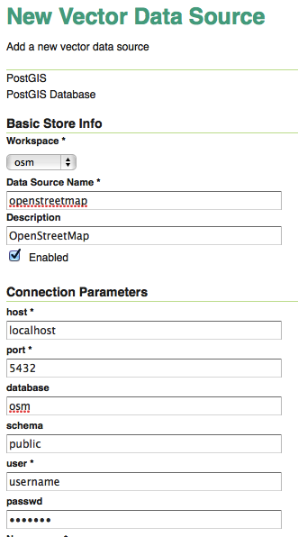
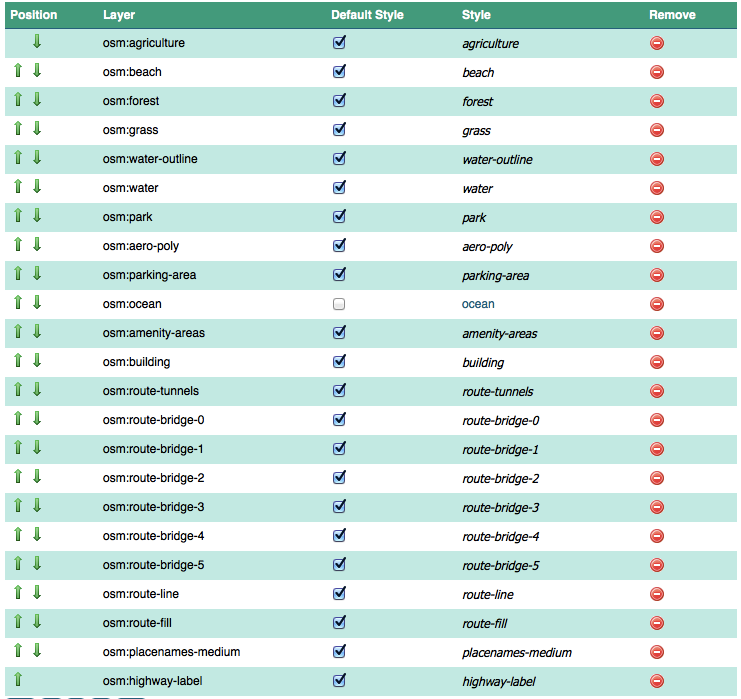
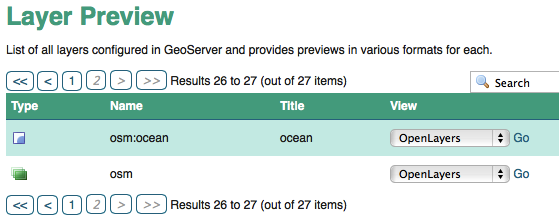
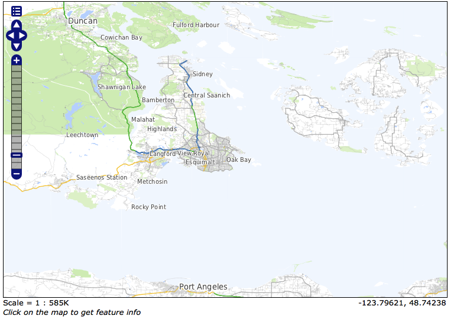

.. note::

  Check out the `demonstration map <_static/osm-full.html>`_ to see the final product!

Introduction
============

`OpenStreetMap`_ (OSM) contains a wealth of data, kept up to date by a world-wide community of mappers. It is to map data what open source is to software: a unique and collaborative way to build shared knowledge.

Building a map using OSM data can be daunting: you have to extract data from the central server, or find a download package; choose and use tools convert it into the working database; choose and use a rendering chain to produce a cartographic product; and, choose and use a tool to publish that product.

.. image:: ./img/map1.png
   :width: 95%

This tutorial will explore deploying a cartographic product using a small set of easy-to-install tools:

* `OpenGeo Suite`_, for rendering the data and publishing it to the world.
* ``bash`` scripts and ``curl`` to automate map configuration.

Installation
============

* Follow the `Suite installation instructions`_ to install OpenGeo Suite.
* Start up the Suite and
 
  * `Connect to the database`_ server.
  * `Create a spatial database`_ named ``osm`` to hold the data.
  

Download the Data
=================

OSM City Data
-------------

We will be building a street map of a single city. To keep data volumes small, we will be working with Victoria, British Columbia for this example.

Extracts of OpenStreetMap data for individiual cities are available from `Mapzen metro extracts <https://mapzen.com/metro-extracts>`_. We will be using the extract for `Victoria, BC <https://s3.amazonaws.com/metro-extracts.mapzen.com/victoria.osm2pgsql-shapefiles.zip>`_, download it and unzip.

* https://s3.amazonaws.com/metro-extracts.mapzen.com/victoria.osm2pgsql-shapefiles.zip

Inside the zip archive are a point file, line file and polygon file. In order to line the table names up with our processing later in this tutorial, we will name them ``planet_osm_point``, ``planet_osm_line`` and ``planet_osm_polygon`` during import. If you import with the `pgShapeLoader`_ GUI, remember to

* set the SRID of the data to 4326 (longitude/latitude)
* set the table names appropriately as above
* set the geometry column name to ``way``

Or, you can use the commandline ``shp2pgsql`` utility and do the uploads this way::

  shp2pgsql -g way -s 4326 -I -D -i -S victoria.osm-point.shp planet_osm_point | psql osm
  shp2pgsql -g way -s 4326 -I -D -i -S victoria.osm-line.shp planet_osm_line | psql osm
  shp2pgsql -g way -s 4326 -I -D -i victoria.osm-polygon.shp planet_osm_polygon | psql osm

Note that we're "piping" (using the "|" character) the output of the conversion directly to the ``psql`` utility. You might need to add some connection flags there to connect to your local database. There are a lot of ``shp2pgsql`` loader flags in play here, so it's worth listing what they all do:

* ``-g`` controls the column name to use for geometries, we use "way"
* ``-s`` controls the SRID to apply to the data, we use "4326" for "WGS84 lon/lat"
* ``-I`` adds a spatial index to the table after loading
* ``-D`` uses "dump" mode for a faster loading process
* ``-i`` ensures that all integer types use 32-bit integers
* ``-S`` ensures that geometry column types are "simple" not "aggregate" (eg, "linestring", not "multilinestring")

OSM Ocean Data
--------------

The OSM city files include roads and land features, but not coastlines or ocean features. In order to get mapping-ready ocean, we need to download a different file.

You can download the `whole ocean file <http://openstreetmapdata.com/data/water-polygons>`_ from http://openstreetmapdata.com. However, it's really large, and takes some processing to use in a small project. You can download a clipped set of oceans for our test area from here:

* http://files.opengeo.org/workshopmaterials/victoria.ocean.zip

Once you have downloaded the ocean file, unzip it, then load it into the database::

  shp2pgsql -g geom -s 4326 -I -D ocean.shp ocean | psql osm

Clipping Your Own Ocean
~~~~~~~~~~~~~~~~~~~~~~~

If you want to download the big file and clip it yourself, here are the steps.

* Download the full ocean polygon file, from http://openstreetmapdata.com/data/water-polygons
* Load the file into an ``ocean_all`` table, so it can be clipped down to size in the database::

    shp2pgsql -s 4326 -I -D water_polygons.shp ocean_all | psql osm

* Clip the ``ocean_all`` table to the working area ``ocean`` table using this SQL. It first
  calculates the extent of the working area, then uses that extent to clip the world table
  down to just the local extent.

  .. code-block:: sql

    CREATE TABLE ocean AS
    WITH bounds AS (
      SELECT ST_SetSRID(ST_Extent(way)::geometry,4326) AS geom 
      FROM planet_osm_line
      )
    SELECT 1 AS id, ST_Intersection(b.geom, o.geom) AS geom
    FROM bounds b, ocean_all o
    WHERE ST_Intersects(b.geom, o.geom);

Create Layer Tables
===================

Right now we have just four OSM tables: points, lines, polygons and (oddball) ocean. To build a map, we are going to subset the generic tables into more "layer-like" tables, using queries against the OSM tags.

Run the SQL commands in `create_tables.sql`_. They will create the following tables, and associated spatial indexes:

* aero-poly
* agriculture
* amenity-areas
* beach
* building
* forest
* grass
* highway-label
* park
* parking-area
* placenames-medium
* route-bridge-0
* route-bridge-1
* route-bridge-2
* route-bridge-3
* route-bridge-4
* route-bridge-5
* route-fill
* route-line
* route-tunnels
* route-turning-circles
* water-outline
* water
* wetland

If you want to get rid of the tables, here's a `drop_tables.sql`_ file to use. And of course, we have already loaded an ``ocean`` table, so that is in the database **too**!

* ocean

There is also a `create_views.sql`_ file (and `drop_views.sql`_ too), which does the same transformation, only without copying data. Using views instead of tables will cause your map rendering to run slower, however.

Configure GeoServer
===================

Create Workspace
----------------

We will store our database and view and style definitions in a single "workspace" for easier management. `Login to GeoServer`_, and create a new `workspace`_.

.. image:: img/workspace.png

Use ``osm`` as the workspace name, to match up to the rest of the tutorial.

Create Data Store
-----------------

We need to connect to our PostGIS database that holds all our tables, so define a new `PostGIS data store <http://suite.opengeo.org/opengeo-docs/geoserver/data/database/postgis.html>`_.

* Choose ``osm`` as the workspace
* Use ``openstreetmap`` as the store name
* Add the other connection parameters to your database below

Add Layers and Styles
---------------------

Because building a cartographic product from 25 input layers is a complex undertaking, we aren't going to go layer by layer, but rather upload an existing configuration into GeoServer to product the output.

* All the styles for this exercise are in `sld.zip`_. Download and unzip it.

.. note:: 

   These styles were automatically derived from the "`OSM streets <https://github.com/mapbox/open-streets-style>`_" stylesheet.

Now, there are two approaches to applying the styles, a manual approach and an automatic approach.

Manual Style Loading
~~~~~~~~~~~~~~~~~~~~

For each SLD file in the directory, carry out the following steps:

* Go to the *Styles* configuration panel.

  * Add a new style, using the name of your SLD file (without the ``.sld`` extension)
  * Select the ``osm`` workspace.
  * Upload or copy the content from the SLD file into the editor.
  * Save.

* Go to the *Layers* configuration panel.

  * Add a new resource from the PostGIS ``openstreetmap`` store.
  * Select the table that matches your SLD file name. 
  * Calculate the native and geographic bounds by clicking the right links.
  * Go to the "Publishing" tab.
  * Select as the default style, the new style you just created that shares a name with this layer.
  * Save.
  
Repeat until every SLD file has been used to create a style, and associated with an appropriate layer/table in the database.

Automatic Style Loading
~~~~~~~~~~~~~~~~~~~~~~~

If you have Linux or OSX, you can use the automatic approach (if you are good at Windows scripting, you can probably adapt this approach). This requires the ``curl`` utility, which is available by default on Linux and OSX.

This script assumes you are using a standard bash shell. It uses the `GeoServer REST API <http://suite.opengeo.org/opengeo-docs/geoserver/rest/index.html>`_ to alter the configuration catalogue without requiring pointing and clicking.

* Enter the directory that contains the SLD files.
* Run the `SLD_create.sh`_ script below. (If you have changed your "admin" password, or used different names for the workspace or datastore, you may need to alter the script.)

.. code-block:: sh

  #  script to add layer/style information
  #  for every SLD file in our collection
  #
  restapi=http://localhost:8080/geoserver/rest
  login=admin:geoserver
  workspace=osm
  store=openstreetmap

  for sldfile in *.sld; do

    # strip the extension from the filename to use for layer/style names
    layername=`basename $sldfile .sld`

    # create a new featuretype in the store, assuming the table
    # already exists in the database and is named $layername
    # this step automatically creates a layer of the same name
    # as a side effect
    curl -v -u $login -XPOST -H "Content-type: text/xml" \
      -d "<featureType><name>$layername</name></featureType>" \
      $restapi/workspaces/$workspace/datastores/$store/featuretypes?recalculate=nativebbox,latlonbbox

    # create an empty style object in the workspace, using the same name
    curl -v -u $login -XPOST -H "Content-type: text/xml" \
      -d "" \
      $restapi/workspaces/$workspace/styles

    # upload the SLD definition to the style
    curl -v -u $login -XPUT -H "Content-type: application/vnd.ogc.sld+xml" \
      -d @$sldfile \
      $restapi/workspaces/$workspace/styles/$layername

    # associate the style with the layer as the default style
    curl -v -u $login -XPUT -H "Content-type: text/xml" \
      -d "<layer><enabled>true</enabled><defaultStyle><name>$layername</name><workspace>$workspace</workspace></defaultStyle></layer>" \
      $restapi/layers/$workspace:$layername

  done

The script runs one iteration for each SLD file, using the file name to create a layer/featuretype that matches the table in the database with that name, and populates an associated style with it. (If you want to reverse the process, there's an `SLD_delete.sh`_ script too.)

Once you're done, click on the *Styles* and *Layers* panes to see the results.

.. image:: ./img/layers.png

.. image:: ./img/styles.png

Create a Layer Group
--------------------

Manual Layer Group
~~~~~~~~~~~~~~~~~~

Now we have 25 layers, all nicely styled... but we don't want 25 layers, we want one map! 

Again, you can hand-build a layer group, go to the *Layer Groups* pane, and create a new layer group named ``osm``, then follow the screenshot below, adding and ordering layers.

Automatic Layer Group
~~~~~~~~~~~~~~~~~~~~~

We can use a single ``curl`` call to add a layer group definition.

Create a `layergroup.xml`_ file with the following content:

.. code-block:: xml

  <layerGroup>
    <name>osm</name>
    <title>OpenStreetMap Base</title>
    <layers>
      <layer>agriculture</layer>
      <layer>beach</layer>
      <layer>forest</layer>
      <layer>grass</layer>
      <layer>water-outline</layer>
      <layer>water</layer>
      <layer>ocean</layer>
      <layer>park</layer>
      <layer>aero-poly</layer>
      <layer>parking-area</layer>
      <layer>amenity-areas</layer>
      <layer>building</layer>
      <layer>route-tunnels</layer>
      <layer>route-bridge-0</layer>
      <layer>route-bridge-1</layer>
      <layer>route-bridge-2</layer>
      <layer>route-bridge-3</layer>
      <layer>route-bridge-4</layer>
      <layer>route-bridge-5</layer>
      <layer>route-line</layer>
      <layer>route-fill</layer>
      <layer>placenames-medium</layer>
      <layer>highway-label</layer>
    </layers>
  </layerGroup>

Now, run the following command to upload it to the server (you may need to change the login credentials if you have altered them from the default)::

  curl -v -u admin:geoserver -XPOST -d@layergroup.xml -H "Content-type: text/xml" \
    http://localhost:8080/geoserver/rest/layergroups

If you find you want to change the definition, you can delete it from the catalogue with the command below, and then run the upload again::

  curl -v -u admin:geoserver -XDELETE \
    http://localhost:8080/geoserver/rest/layergroups/osm

View the Result
===============

Now that all the layers and styles and layer groups are configured, you can see the result!

Go to the *Layer Preview* panel, and and find the entry for the ``osm`` layer group. It may be on the second page of results.

Open it up (Click "Go" after the OpenLayers dropdown), and you'll see the result of our styling.

Alter the SLDs
==============

You can edit the SLDs directly from the *Styles* pane, one at a time. This has the advantage of providing access to the "Validate" function, which is important to ensure the changes you are making are valid SLD.

For batch changes (global changes to things like font names, for example) sometimes it's easier to update all the SLD files in your local directory, and then re-upload them. For the re-upload process, the following script provides a quick way to refresh all the SLD files on the server in one pass:

.. code-block:: sh

  # Update SLDs
  restapi=http://localhost:8080/geoserver/rest
  login=admin:geoserver
  for sldfile in *.sld; do
    layername=`basename $sldfile .sld`
    # upload the SLD definition to the style
    curl -v -u $login -XPUT -H "Content-type: application/vnd.ogc.sld+xml" \
      -d @$sldfile $restapi/workspaces/osm/styles/$layername
  done

Nicer Web Interface
===================

The default `OpenLayers`_ viewer is convenient, but not very attractive. Here is some code for a simple `OpenLayers3`_ viewer that uses the ``osm`` layer group as a base map element.

.. code-block:: html

  <!doctype html>
  <html lang="en">
    <head>
      <link rel="stylesheet" href="http://ol3js.org/en/master/css/ol.css" type="text/css">
      
      
      <title>OpenStreetMap Base</title>
    </head>
    <body>
      

      
    </body>
  </html>
 
 
Check out the `demonstration map <_static/osm-full.html>`_ online to see the final product!

Conclusion
==========

In this tutorial, we have seen:

* How to create an attractive cartographic base map from OSM
* How to carry out bulk operations on the GeoServer catalogue using the REST API
* How to wrap a layer group in a simple `OpenLayers3`_ map window

To go on learning, you might want to alter the SLD definitions. Add some labelling at lower scales, change colors, and so on.

The possibilities are endless!

.. _sld.zip: _static/sld.zip
.. _SLD_create.sh: _static/sld/SLD_create.sh
.. _SLD_delete.sh: _static/sld/SLD_delete.sh
.. _create_tables.sql: _static/create_tables.sql
.. _drop_tables.sql: _static/drop_tables.sql
.. _create_views.sql: _static/create_views.sql
.. _drop_views.sql: _static/drop_views.sql
.. _layergroup.xml: _static/layergroup.xml

.. _OpenLayers3: http://ol3js.org
.. _OpenLayers: http://openlayers.org
.. _OpenGeo Suite: http://boundlessgeo.com/solutions/opengeo-suite/
.. _OpenStreetMap: http://openstreetmap.org
.. _Suite installation instructions: http://suite.opengeo.org/opengeo-docs/installation/index.html
.. _Create a spatial database: http://suite.opengeo.org/opengeo-docs/dataadmin/pgGettingStarted/createdb.html
.. _Connect to the database: http://suite.opengeo.org/opengeo-docs/dataadmin/pgGettingStarted/pgadmin.html
.. _Overpass API: http://wiki.openstreetmap.org/wiki/Overpass_API
.. _Login to GeoServer: http://suite.opengeo.org/opengeo-docs/geoserver/gettingstarted/web-admin-quickstart/index.html
.. _workspace: http://suite.opengeo.org/opengeo-docs/geoserver/webadmin/data/workspaces.html
.. _JSON: http://www.json.org
.. _pgShapeLoader: http://suite.opengeo.org/opengeo-docs/dataadmin/pgGettingStarted/pgshapeloader.html

.. _GeoExt: http://www.geoext.org/
.. _ExtJS: http://www.sencha.com/products/extjs

