Introduction
------------

At Boundless we champion open standards as well as open source. The great thing about using open standards is that technology outside of OpenGeo Suite snaps into place when we need it. One piece of functionality that hasn’t existed in Suite is routing, which allows us to calculate the fastest, cheapest or shortest path between two points.

The tool in this case is `pgRouting <http://pgrouting.org/>`_, which is an extension to PostgreSQL and PostGIS that can generate such paths. With the right data set, this allows us to easily create a routing application with OpenGeo Suite to help our users find the optimal route based on their criteria.

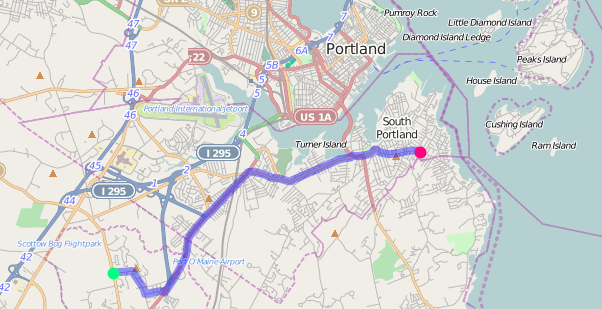

Understanding shortest-path routing
-----------------------------------

The first thing to understand about shortest-path routing is that there is nothing fundamentally spatial about it, but it does integrate very well with spatial applications. As an analogy, compare the early London Tube maps which `situate stations geographically <http://homepage.ntlworld.com/clivebillson/tube/tube.html#1932>`_ with the familiar `schematic-style maps <http://homepage.ntlworld.com/clivebillson/tube/tube.html#1933>`_ that replaced them in the 1930s. 

pgRouting needs a 'routing network' loaded into a PostgreSQL database that shows the relative position of other stations rather than their actual spatial positions. When the networks *do* contain spatial data, however, we can build accurate routing applications that show the shortest route through the network and what route it translates into spatially.

Requirements
------------

We will need the following software during our tutorial:

* OpenGeo Suite 4
* pgRouting 2

.. note::

   There are many ways to install pgRouting, depending on your system's operating system and architecture. The following steps can be used to install pgRouting on 64-bit Ubuntu 12.04 alongside OpenGeo Suite 4.0.2:

   .. code-block:: bash

       wget http://ftp.debian.org/debian/pool/main/p/pgrouting/postgresql-9.3-pgrouting_2.0.0-2_amd64.deb
       wget http://ftp.debian.org/debian/pool/main/c/cgal/libcgal10_4.4-1+b1_amd64.deb
       wget http://ftp.debian.org/debian/pool/main/b/boost1.54/libboost-thread1.54.0_1.54.0-5_amd64.deb
       wget http://ftp.debian.org/debian/pool/main/b/boost1.54/libboost-system1.54.0_1.54.0-5_amd64.deb
       wget http://ftp.debian.org/debian/pool/main/b/boost1.55/libboost-thread1.55.0_1.55.0+dfsg-1_amd64.deb
       wget http://ftp.debian.org/debian/pool/main/b/boost1.55/libboost-system1.55.0_1.55.0+dfsg-1_amd64.deb

       sudo dpkg -i libboost-system1.54.0_1.54.0-5_amd64.deb
       sudo dpkg -i libboost-thread1.54.0_1.54.0-5_amd64.deb 
       sudo dpkg -i libboost-system1.55.0_1.55.0+dfsg-1_amd64.deb 
       sudo dpkg -i libboost-thread1.55.0_1.55.0+dfsg-1_amd64.deb 
       sudo dpkg -i libcgal10_4.4-1+b1_amd64.deb
       sudo dpkg -i postgresql-9.3-pgrouting_2.0.0-2_amd64.deb 

Follow Boundless’s documentation on installing OpenGeo Suite and make sure that PostgreSQL is configured for use with GeoServer as described in `our documentation <http://suite.opengeo.org/docs/latest/installation/index.html>`_.

You should be familiar with the following topics before starting this tutorial:

* publishing data in GeoServer
* creating SQL Views
* basic SQL syntax
* basic JavaScript

Preparing data
--------------

The `OpenStreetMap <http://openstreetmap.org>`_ project is the natural place to turn when looking for free, high-quality spatial data; we’ll make use of it to build a mapping application for the city of Portland, Maine (but any other location should work equally well). 

There are some `programs <http://wiki.openstreetmap.org/wiki/Osm2pgsql>`_ that can be used to generate a routing network from OpenStreetMap data, but we’ll just stick to the tools that ship with OpenGeo Suite to do our data preparation.

Our first stop will be to download the city-specific OpenStreetMap data for our target location; MapZen provides `excerpts for many world cities <https://mapzen.com/metro-extracts/>`_ in ShapeFile format, but we could just have easily used `osm2pgsql <http://wiki.openstreetmap.org/wiki/Osm2pgsql>`_ to get data for anywhere else in the world. 

Download the `OSM2PGSQL SHP for Portland Me <http://wiki.openstreetmap.org/wiki/Osm2pgsql>`_ and extract the files::

  $ wget https://s3.amazonaws.com/metro-extracts.mapzen.com/portland-me.osm2pgsql-shapefiles.zip
  $ unzip portland-me.osm2pgsql-shapefiles.zip

We next need to create a new `routing` database in PostgreSQL into which we will be importing our data. We also need to enable the spatial PostGIS functions::

  $ createdb routing;
  $ psql -c "CREATE EXTENSION postgis;" routing

The OSM data we are using stores all features in three ShapeFiles, one each for points, lines and polygons. Road data is stored in the `portland-me.osm-line.shp` file, but it also contains other features that we are not interested in. If we look at the data, we’ll notice that roads and other ways always have a value for the attribute `highway` and non-road features have an empty value for this attribute. 

Our first goals for importing will be to only take lines which are actually roads into our database. Our second goal will be to eliminate the unnecessary attributes that come with the OSM data. Of the 57 attributes in the original ShapeFile, only the following are of interest to us: `highway`; `name`, `oneway`; and `surface`. Finally, we’ll convert the data from EPSG:4326 to EPSG:3857, which is better suited for viewing city-level data.

We can use OGR, to load the data into the database accomplish all of the goals we set ourselves above:

* `-where "highway <> ''"`: only take lines whose `highway` attribute is not empty
* `-select 'name,highway,oneway,surface'`: take the desired attributes only
* `-f PostgreSQL PG:"dbname=routing user=postgres"`: load the data into Postgres
* `-lco GEOMETRY_NAME=the_geom:` store the geometry in an attribute named `the_geom`
* `-lco FID=id`: store the geometry in an attribute named `id`
* `-nln edges`: store the data in a table called `edges`
* `-t_srs EPSG:3857`: convert the data to Google Mercator

Putting these all together we get the following command::

  $ ogr2ogr \ 
      -where "highway <> ''" \
      -select 'name,highway,oneway,surface' \
      -lco GEOMETRY_NAME=the_geom \
      -lco FID=id \
      -t_srs EPSG:3857 \
      -f PostgreSQL PG:"dbname=routing user=postgres" \
      -nln edges portland-me.osm-line.shp \

Building a network
------------------

As we discussed earlier, pgRouting needs a network of vertices (the stations in our metro analogy) and edges (which connect two stations) to calculate routes rather than the spatial data that we just loaded. Our next step will be to use functions that are included in pgRouting to generate the network from our spatial data.

We start by launching the PostgreSQL shell and then loading the pgRouting extension::

  $ psql routing
  # CREATE EXTENSION pgrouting;

One minor change we can make at this point is to rename our geometry and primary key columns from the default i

The function that we will be using, `pgr_createTopology`, will create a new table which contains all the starting and ending points of all lines in the edges table (without duplicating shared point).

For example, if we imagine this very simple metro network, the function will identify the four stations marked in red.

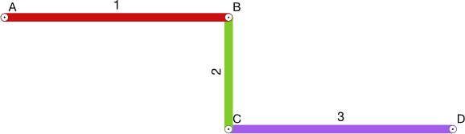

Finally, the function will add the source and target stations to each of the segments, such that A has a source of 1 and a target of 2, and so on for edges B and C.

To accommodate `pgr_createTopology`, we need to add `source` and `target` columns to our `edges` table and then execute the command. Note that we have to indicate the name of the table (`'edges'`) and the tolerance for considering two vertices the same in the network.

.. code-block:: sql

  ALTER TABLE edges ADD source INT4;
  ALTER TABLE edges ADD target INT4;
  SELECT pgr_createTopology('edges', 1);

We can now check to see if the `source` and `target columns in our `edges` database have been filled in. There should also be a new `edges_vertices_pgr` table which enumerates all the vertices in the network that pgRouting has detected.

We haven’t quite solved the network problem yet, however. `pgr_createTopology` does a good job of finding vertices when they are shared between two edges, but what about when a road terminates in the middle of another road?

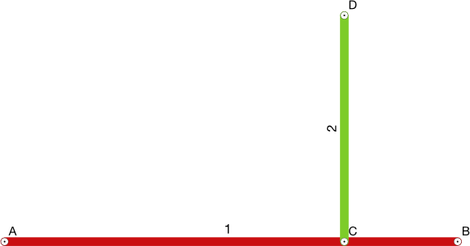

In the example above, we will again have four vertices, but there is no path between point 1 and point 4 since point 3 is not shared between the two line segments.

To handle these cases, pgRouting has an additional function, `pgr_nodeNetwork`, which will split segment B into two new edges C and D, so that point 3 can serve as a shared vertex.

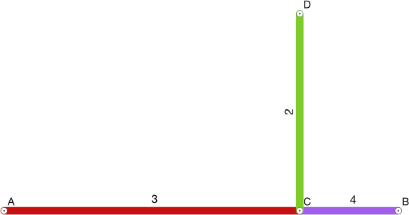

The new `edges_noded` table that is created by `pgr_nodeNetwork` contains an attribute named `old_id` to indicate which original edge each new edge derived from. From the example above, edges C and D would both have an `old_id` set to B. 

.. code-block:: sql

  SELECT pgr_nodeNetwork('edges', 1);

Our new edges_noded table can now be used in a call to pgr_createTopology to add the new source and target values.

.. code-block:: sql

  SELECT pgr_createTopology('edges_noded', 1);

Because `pgr_nodeNetwork` does not copy all the attribute information from the original table to the new noded table, so we have to move the name, `highway` (which we will rename `type` to better reflect the meaning), `oneway` and `surface` columns over ourselves.

First add the new columns.

.. code-block:: sql

  ALTER TABLE edges_noded 
    ADD COLUMN name VARCHAR, 
    ADD COLUMN type VARCHAR, 
    ADD COLUMN oneway VARCHAR, 
    ADD COLUMN surface VARCHAR;

Then copy the data from the original table.

.. code-block:: sql

  UPDATE edges_noded AS new
  SET
    name = old.name, 
    type = old.highway, 
    oneway = old.oneway, 
    surface = old.surface 
  FROM edges AS old 
  WHERE new.old_id = old.id;

Determining cost
----------------

In addition to having a network that shows connections, pgRouting also needs to know the ‘cost’ of travelling over any of the edges. What cost means depends on the application: it could be an actual cost (such as your metro fare); the total distance travelled; time; or any other metric when move from point to point.

In our application, we will support both a distance and a time cost. To improve performance, we will pre-calculate the time to travel by car on all of our entries in the `edges_noded` table. Time will be calculated based on the type of road (cars travel faster on primary roads than secondary for example); a query in our database shows us the different types of edges encoded in our database.

.. code-block:: sql

  SELECT DISTINCT(type) from edges_noded;

      type     
  ----------------
   motorway
   motorway_link
   steps
   secondary
   tertiary
   trunk
   secondary_link
   path
   unclassified
   proposed
   cycleway
   trunk_link
   primary
   track
   tertiary_link
   raceway
   residential
   construction
   primary_link
   service
   footway

A number of these (steps, path, footway, cycleway, proposed and construction) are clearly not suitable for vehicle so for these we will provide a cost of `-1` (pgRouting interprets negative numbers as impassable edges). For the remainder, we will need to assign an average speed and use this to populate a new `time` column in our table. We will additionally add a `distance` column to save on calculating the length of our edges on each request.

.. code-block:: sql

  ALTER TABLE edges_noded ADD distance FLOAT8;
  ALTER TABLE edges_noded ADD time FLOAT8;
  UPDATE edges_noded SET distance = ST_Length(ST_Transform(the_geom, 4326)::geography) / 1000;

Based on the distance, type and surface we can now estimate the amount of time needed to traverse each edge. Because the type and surface information is only stored in the original `edges` table, we will need to refer to it in our update. The OpenStreetMap website gives us some indication as to the `relative speed <http://wiki.openstreetmap.org/wiki/Routing>`_ for various road types.

.. code-block:: sql

  UPDATE edges_noded SET
    time = 
    CASE type
      WHEN 'steps' THEN -1
      WHEN 'path' THEN -1
      WHEN 'footway' THEN -1
      WHEN 'cycleway' THEN -1
      WHEN 'proposed' THEN -1
      WHEN 'construction' THEN -1 
      WHEN 'raceway' THEN distance / 100
      WHEN 'motorway' THEN distance / 70
      WHEN 'motorway_link' THEN distance / 70
      WHEN 'trunk' THEN distance / 60
      WHEN 'trunk_link' THEN distance / 60
      WHEN 'primary' THEN distance / 55
      WHEN 'primary_link' THEN distance / 55
      WHEN 'secondary' THEN distance / 45
      WHEN 'secondary_link' THEN distance / 45
      WHEN 'tertiary' THEN distance / 45
      WHEN 'tertiary_link' THEN distance / 40
      WHEN 'unclassified' THEN distance / 35
      WHEN 'residential' THEN distance / 30
      WHEN 'living_street' THEN distance / 30
      WHEN 'service' THEN distance / 30
      WHEN 'track' THEN distance / 20
      ELSE distance / 20
    END;

Dividing the distance by our speed estimates for each road type gives us the number of hours required to travel along that segment.

There is one more data point we could have used to help fine tune how long it takes to travel along road segments.

.. code-block:: sql

  SELECT DISTINCT(surface) from edges_noded;
  
   surface 
  ---------
   
   unpaved
   paved
   gravel
   asphalt
   sand

Testing
-------

We can test that the routing works by using the `pgr_dijkstra` function (which implements `Dijkstra's algorithm <http://en.wikipedia.org/wiki/Dijkstra's_algorithm>`_) to find the shortest path between any two vertices in the network. Vertices are identified by the `id` column in the automatically-generated `edges_noded_vertices_pgr` table. Select any two `id` numbers from the table (here, vertices 1000 and 757) and run the following query.

.. code-block:: sql

  SELECT 
    id1 AS vertex, 
    id2 AS edge, 
    cost 
  FROM pgr_dijkstra('SELECT id, source::INT4, target::INT4, distance AS cost FROM edges_noded', 1000, 757, false, false) 
  ORDER BY seq;

   vertex | edge  |        cost         
  --------+-------+---------------------
     1000 |   873 | 0.00862449481177354
     1001 | 11469 |  0.0946329838309096
    11548 | 11468 |  0.0411391925170661
    11510 | 11418 |  0.0130258077805629
    11511 | 11452 |   0.010555359038939
    11536 | 11453 |  0.0500946880163133
    11537 | 11454 |  0.0128158392635584
    11538 | 11455 |   0.225115465905455
      757 |    -1 |                   0

Note how we pass a sub-query as an argument to `pgr_dijkstra`. This is us telling pgRouting what network to use when looking for the route, and because it is regular SQL we can fine tune what kind of route to look for. We could, for example, tell pgRouting to ignore all motorways when looking for a route by adding the following where clause: `WHERE type <> 'motorway'`. Best of all, this can be done dynamically, so we can change the routing parameters with every request.

For our purposes, we should note that if we replace `distance` with `time` in the sub-query, this will tell pgRouting to find the fastest route between the two points rather than the shortest route (remember that we travel faster on certain types of roads).

Thus far we haven’t taken one-way roads into account. The same `pgr_dijktra` algorithm can handle one-way roads if we add a `reverse_cost` column. As before, we need to set the cost to `-1` when we don't want to allow an edge to be used; therefore we will use `-1` as the `reverse_cost` when the `oneway` attribute is `yes`. If the road is not one-way, we use the same cost in the forward and reverse direction.

.. code-block:: sql

  SELECT 
    id1 AS vertex, 
    id2 AS edge, 
    cost 
  FROM pgr_dijkstra('SELECT id, source::INT4, target::INT4, distance AS cost, CASE oneway WHEN ''yes'' THEN -1 ELSE distance END AS reverse_cost FROM edges_noded', 1000, 757, true, true) 
  ORDER BY seq;

By joining the results of the query with the `edges_noded` table, we can get the complete information about the route that will be taken rather than just the edge and vertex numbers.

.. code-block:: sql

  SELECT 
    e.old_id, 
    e.name, 
    e.type, 
    e.oneway, 
    e.time AS time, 
    e.distance AS distance 
  FROM 
    pgr_dijkstra('SELECT id, source::INT4, target::INT4, distance AS cost, CASE oneway WHEN ''yes'' THEN -1 ELSE distance END AS reverse_cost FROM edges_noded', 753, 756, true, true) AS r,
    edges_noded AS e 
  WHERE r.id2 = e.id;

   old_id |        name         |    type     | oneway |  time   | distance
  --------+---------------------+-------------+--------+--------------------+
      203 | Bunker Hill Terrace | residential |        | 0.00170 | 0.05180
      203 | Bunker Hill Terrace | residential |        | 0.00592 | 0.17788
      203 | Bunker Hill Terrace | residential |        | 0.00024 | 0.00744
      210 | Two Rod Road        | residential |        | 0.00537 | 0.16137
      225 | Heritage Lane       | residential |        | 0.00021 | 0.00652
      225 | Heritage Lane       | residential |        | 0.00126 | 0.03788
      225 | Heritage Lane       | residential |        | 0.00239 | 0.07196
      225 | Heritage Lane       | residential |        | 0.00134 | 0.04047
      225 | Heritage Lane       | residential |        | 0.00034 | 0.01040
      225 | Heritage Lane       | residential |        | 0.00087 | 0.02629
      225 | Heritage Lane       | residential |        | 0.00180 | 0.05421
      225 | Heritage Lane       | residential |        | 0.00305 | 0.09156
      224 | Plymouth Drive      | residential |        | 0.00230 | 0.06914
      201 | Colonial Drive      | residential |        | 0.00096 | 0.02895
      201 | Colonial Drive      | residential |        | 0.00697 | 0.20934

Remember that we took the original lines from OpenStreetMap and split them into multiple parts using the `pgr_nodeNetwork` function. Edges created with this function will have identical `old_id`, `name`, `type` and `oneway` attributes if they came from the same original line. We will use this fact to recombine the segments in the table above using an SQL `GROUP BY` clause in conjunction with the aggregate function `sum` to calculate the total time and distance.

.. code-block:: sql

  SELECT 
    e.old_id AS id, 
    e.name, e.type, 
    e.oneway, 
    sum(e.time) AS time, 
    sum(e.distance) AS distance 
  FROM 
    pgr_dijkstra('SELECT id, source::INT4, target::INT4, distance AS cost, CASE oneway WHEN ''yes'' THEN -1 ELSE distance END AS reverse_cost FROM edges_noded', 753, 756, true, true) AS r,
    edges_noded AS e 
  WHERE r.id2 = e.id 
  GROUP BY e.old_id, e.name, e.type, e.oneway;
  
   id  |        name         |    type     | oneway |  time   | distance      
  -----+---------------------+-------------+--------+--------------------+
   203 | Bunker Hill Terrace | residential |        | 0.00790 | 0.23713
   210 | Two Rod Road        | residential |        | 0.00537 | 0.16137
   225 | Heritage Lane       | residential |        | 0.01131 | 0.33932
   224 | Plymouth Drive      | residential |        | 0.00230 | 0.06914
   201 | Colonial Drive      | residential |        | 0.00794 | 0.23829

Publishing in GeoServer
-----------------------

Our database work is now complete and we can publish an SQL View which will create a route for a given source and target vertex.

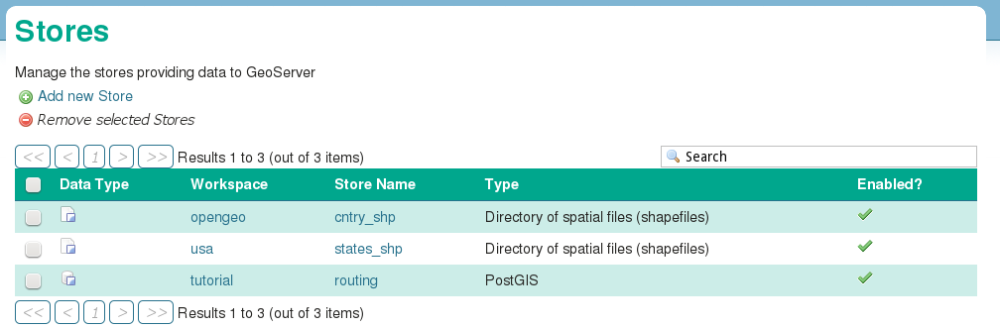

SQL View
^^^^^^^^

Configure a new SQL View named shortest_path with the following SQL query:

.. code-block:: sql

  SELECT
    min(r.seq),
    e.old_id AS id, 
    e.name,
    e.type, 
    e.oneway, 
    sum(e.time) AS time, 
    sum(e.distance) AS distance,
    ST_Union(e.the_geom)
  FROM 
    pgr_dijkstra(
     'SELECT 
      id, 
      source::INT4, 
      target::INT4, 
      %cost% AS cost, 
      CASE oneway 
        WHEN ''yes'' THEN -1 
        ELSE %cost% 
      END AS reverse_cost 
    FROM edges_noded', %source%, %target%, true, true) AS r, 
    edges_noded AS e 
  WHERE 
    r.id2 = e.id
  GROUP BY 
    e.old_id, e.name, e.type, e.oneway

The SQL View has three parameters: `source`, `target` and `cost`. The first two will be the vertex identification number and we will set `cost` to either `distance` or `time` depending on which metric we wish to use to calculate the route.

Note also the `ST_Union` call will combine the individual `lineString` segments into a single `multiLineString` geometry in the same way that we use `sum` to calculate the total time and distance costs.

For security purposes, when we are creating the SQL View, we should change the regular expression validation for `source` and `target` so that only digits are allowed `(^[\d]+$)` and cost such that the words “cost” and “distance” are allowed `(^[\w]+$)`.

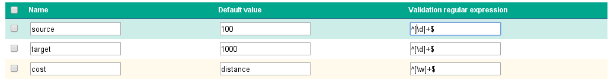

Finally, ensure that we specify which attribute will uniquely identify each feature in the route (we will use seq since pgRouting gives each segment in the route a sequence number) and the geometry type and SRID.

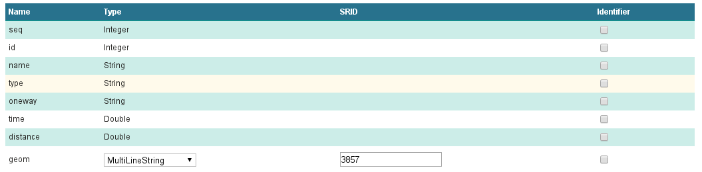

This is all that we need to configure in GeoServer to provide routes between two vertices, but our client will still need to know the vertex identification numbers, so we will also publish the automatically-created `edges_noded_vertices_pgr` table. Instead of publishing the entire table, we will create an SQL View that will find the nearest vertex to a point on the map as a way of selecting the start and end of our route.

Using the layer name `nearest_vertex`, publish the following SQL query:

.. code-block:: sql

  SELECT 
    v.id, 
    v.the_geom, 
    string_agg(distinct(e.name),',') AS name 
  FROM 
    edges_noded_vertices_pgr AS v, 
    edges_noded AS e 
  WHERE 
    v.id = (SELECT 
              id 
            FROM edges_noded_vertices_pgr 
            ORDER BY the_geom <-> ST_SetSRID(ST_MakePoint(%x%, %y%), 3857) LIMIT 1) 
    AND (e.source = v.id OR e.target = v.id) 
  GROUP BY v.id, v.the_geom

Because coordinates may contain negative numbers or decimals, make sure to change the validation regular expressions to only include digits and both of the required symbols: `^[\d.-]+$`.

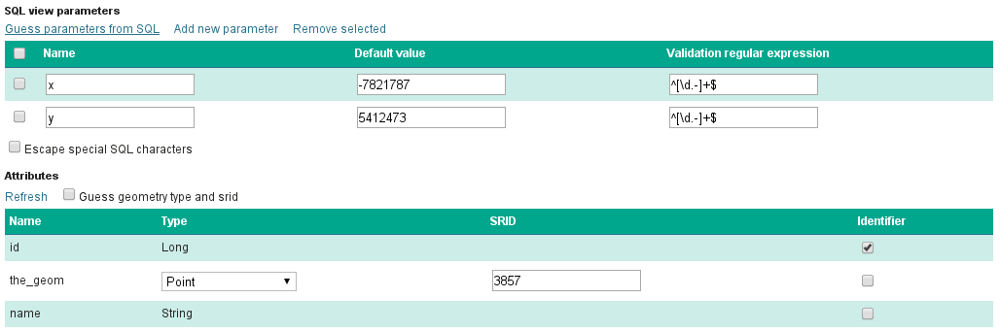

The subquery uses a trick `we have discussed elsewhere <http://workshops.boundlessgeo.com/postgis-intro/knn.html#index-based-knn>`_ to quickly find the closest point to the `x` and `y` parameters. In addition to returning the geometry of this point, we will also create a list of all roads which meet at the vertex for use in identifying it to the user. As an example, the query will return the following record, which we can also see in the original OpenStreetMap data::

  10973 | Congress Street,Free Street,High Street

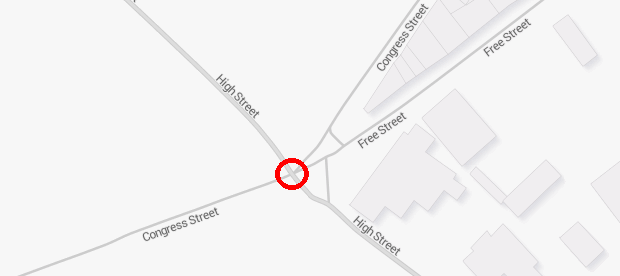

Finally, if we publish the `edges_noded_vertices_pgr` and the `edges_noded` tables themselves, we can preview our routing network in GeoServer. This is not required for our application but it helps visualise the data we will be working with.

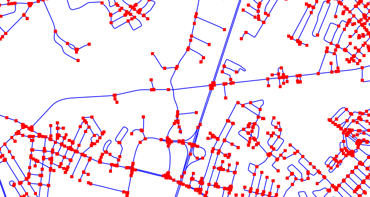

OpenLayers client
-----------------

To interact with our routing algorithm we will need a client which can make standard OGR requests to GeoServer for our nearest_vertex and shortest_path layers. We will be implementing a very simple client with this tutorial that will let the user drag markers for the route’s start and destination and then will update the map with a line indicating the shortest route between the two points. The client will be written in OpenLayers 3 with a small amount of JQuery.

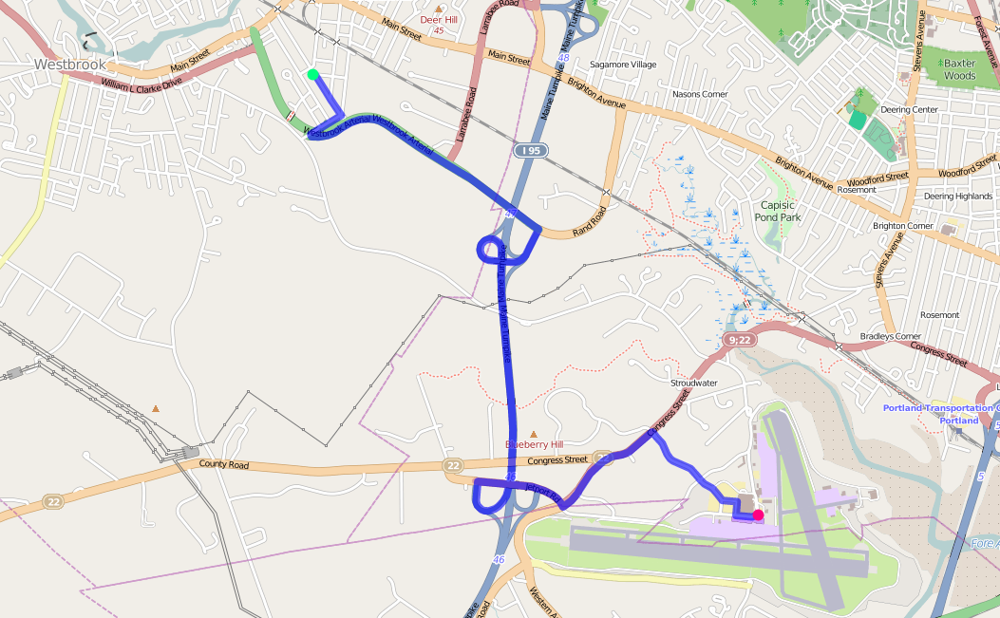

HTML document
^^^^^^^^^^^^^
We will first need a skeleton HTML file that will load the OpenLayers and JQuery libraries, set up the map position and then start our routing.js script.

.. code-block:: html

  <!doctype html>
  <html lang="en">
    <head>
      <meta charset="utf-8">
      <title>OpenGeo Suite Routing</title>
      
      
      
    </head>
    <body>
      

      
    </body>
  </html>

Script
^^^^^^

We can now build our routing.js step-by-step, starting with some variable declarations:

.. code-block:: javascript

  var geoserverUrl = 'http://localhost:8080/geoserver';
  var pointerDown = false;
  var currentMarker = null;
  var changed = false;
  var routeLayer;
  var routeSource;

The base map for our application will be OpenStreetMap tiles, which OpenLayers 3 supports as a layer type.

.. code-block:: javascript

  // set the starting view 
  var view = new ol.View2D({
    center: ol.proj.transform([-70.26, 43.67], 'EPSG:4326', 'EPSG:3857'),
    zoom: 12
  });
  
  var viewProjection = (view.getProjection());
  
  // create the map with OSM data
  var map = new ol.Map({
    target: 'map',
    layers: [
      new ol.layer.Tile({
        source: new ol.source.OSM()
      })
    ],
    view: view
  });

We will next create two features in central Portland which will represent the start point (green) and end point (red) of the route.

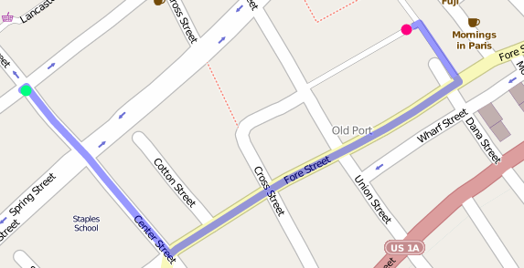

Because the user can drag the markers into new positions, we will add a callback named `changeHandler` which will be triggered whenever a marker is moved.

.. code-block:: javascript

  // create source feature
  var sourceMarker = new ol.Feature({
    geometry: new ol.geom.Point(
        ol.proj.transform([-70.26, 43.665], 'EPSG:4326', 'EPSG:3857'))
  });

  // create style (green point)
  sourceMarker.setStyle(
      [new ol.style.Style({
        image: new ol.style.Circle({
          radius: 6,
          fill: new ol.style.Fill({
            color: 'rgba(0, 255, 128, 1)'
          })
        })
      })]
  );
  sourceMarker.on('change', changeHandler);

  // create target feature
  var targetMarker = new ol.Feature({
    geometry: new ol.geom.Point(
        ol.proj.transform([-70.255, 43.67], 'EPSG:4326', 'EPSG:3857'))
  });

  // create style (red point)
  targetMarker.setStyle(
      [new ol.style.Style({
        image: new ol.style.Circle({
          radius: 6,
          fill: new ol.style.Fill({
            color: 'rgba(255, 0, 128, 1)'
          })
        })
      })]
  );
  targetMarker.on('change', changeHandler);
  
The change handler for a marker movement is very simple: we will keep a record of the marker that moved and indicate that our route has changed.

.. code-block:: javascript

  function changeHandler(e) {
    if (pointerDown) {
      changed = true;
      currentMarker = e.target;
    }
  }

Now that the markers have been created, we can add them to our map as an overlay and tell OpenLayers that they can be modified (that is to say, moved) by user interaction.

.. code-block:: javascript

  var markers = new ol.FeatureOverlay({
    features: [sourceMarker, targetMarker],
    map: map
  });
  
  var modify = new ol.interaction.Modify({
    features: markers.getFeatures(),
    tolerance: 20
  });
  map.addInteraction(modify);

We need to register when the user has started or stopped dragging a marker so that we know when to recalculate our route. We do this by registering the mouse button down and mouse button up events.

.. code-block:: javascript

  map.on('pointerdown', function(evt) {
    pointerDown = true;
  });
  
  map.on('pointerup', function(evt) {
    pointerDown = false;

    // if we were dragging a marker, recalculate the route
    if (currentMarker) {
      getVertex(currentMarker);
      getRoute();
      currentMarker = null;
   }
  });

The last step before working on the client's communications with GeoServer is to create a timer that will trigger every quarter of a second, which allows us to update the route periodically while moving a marker to a new location.

.. note::

  Depending on your server speed you may wish to increase or decrease the `250` milisecond refresh rate.

.. code-block:: javascript 

  window.setInterval(function(){
    if (currentMarker && changed) {
      getVertex(currentMarker);
      getRoute();
      changed = false;
    }
  }, 250);

In the code above, we can see calls to two key functions: `getVertex` and `getRoute`. These both initiate WFS calls to GeoServer to get feature information. `getVertex` retrieves the closest vertex in the network to the current marker's position while `getRoute` calculates the shortest path between the two markers.

`getVertex` uses the current coordinates of a marker and passes them as `x` and `y` parameters to the `nearest_vertex` SQL View we created in GeoServer. The WFS GetFeature request will be captured as JSON and passed to the `loadVertex` function for processing.

.. code-block:: javascript 

  function getVertex(marker) {
    var coordinates = marker.getGeometry().getCoordinates();
    var url = geoserverUrl + '/wfs?service=WFS&version=1.0.0&' +
        'request=GetFeature&typeName=tutorial:nearest_vertex&' +
        'outputformat=application/json&' +
        'viewparams=x:' + coordinates[0] + ';y:' + coordinates[1];
  
    $.ajax({
       url: url,
       async: false,
       dataType: 'json',
       success: function(json) {
         loadVertex(json, marker == sourceMarker);
       }
    });
  }

`loadVertex` parses GeoServer's response and stores the nearest vertex as the start or end point of our route. We'll need the vertex `id` later to request the route from pgRouting.

.. code-block:: javascript 
  
  function loadVertex(response, isSource) {
    var geojson = new ol.format.GeoJSON();
    var features = geojson.readFeatures(response);
    if (isSource) {
      if (features.length == 0) {
        map.removeLayer(routeLayer);
        source = null;
        return;
      }
      source = features[0];
    } else {
      if (features.length == 0) {
        map.removeLayer(routeLayer);
        target = null;
        return;
      }
      target = features[0];
    }
  }

Everything we have done so far has been building up to the final WFS GetFeature call which will actually request and display the route. The `shortest_path` SQL View has three parameters, the `source` vertex, the `target` vertex and the `cost` (either distance or time).

The newly-retrieved route will be used to create a new layer to replace the previous route.

.. code-block:: javascript 
  
  function getRoute() {

    // set up the source and target vertex numbers to pass as parameters
    var viewParams = [
      'source:' + source.getId().split('.')[1],
      'target:' + target.getId().split('.')[1],
      'cost:time'
    ];
  
    var url = geoserverUrl + '/wfs?service=WFS&version=1.0.0&' +
        'request=GetFeature&typeName=tutorial:shortest_path&' +
        'outputformat=application/json&' +
        '&viewparams=' + viewParams.join(';');

    // create a new source for our layer
    routeSource = new ol.source.ServerVector({
      format: new ol.format.GeoJSON(),
      strategy: ol.loadingstrategy.all,
      loader: function(extent, resolution, projection) {
        $.ajax({
          url: url,
          dataType: 'json',
          success: loadRoute,
          async: false
        });
      },
      projection: 'EPSG:3857'
    });

    // remove the previous layer and create a new one
    map.removeLayer(routeLayer);
    routeLayer = new ol.layer.Vector({
      source: routeSource,
      style: new ol.style.Style({
        stroke: new ol.style.Stroke({
          color: 'rgba(0, 0, 255, 0.4)',
          width: 8
        })
      })
    });
  
    // add the new layer to the map
    map.addLayer(routeLayer);
  }
  
  var loadRoute = function(response) {
    var currentFeatures = routeSource.getFeatures();
    for (var i = currentFeatures.length - 1; i >= 0; --i) {
      routeSource.removeFeature(currentFeatures[i]);
    }
    routeLayer.getSource().addFeatures(routeLayer.getSource()
        .readFeatures(response));
  };

We will finish off the script by forcing the application to calculate the first route between the two markers' initial positions.

.. code-block:: javascript

  getVertex(sourceMarker);
  getVertex(targetMarker);
  getRoute();

If you install `map.html` and `routing.js` into your OpenGeo Suite's Tomcat or Jetty `root` directory, you should find your application running at http://localhost:8080/map.html.
  
Ideas for improvement
---------------------

The accuracy of the routing is good.

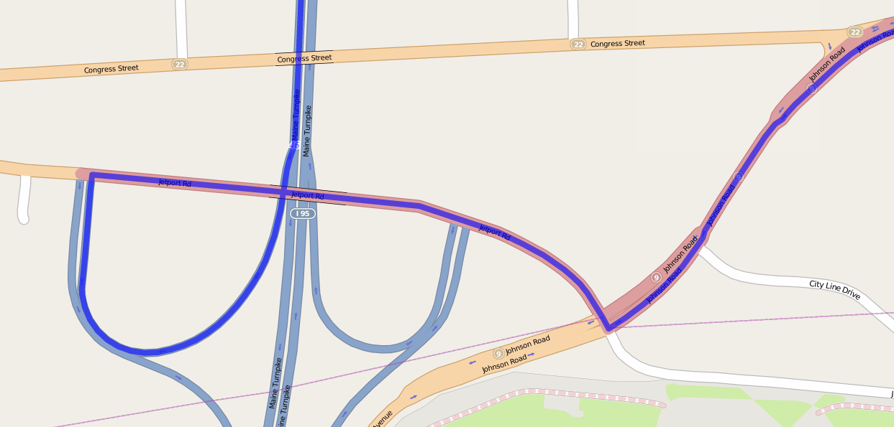

But it's not perfect.

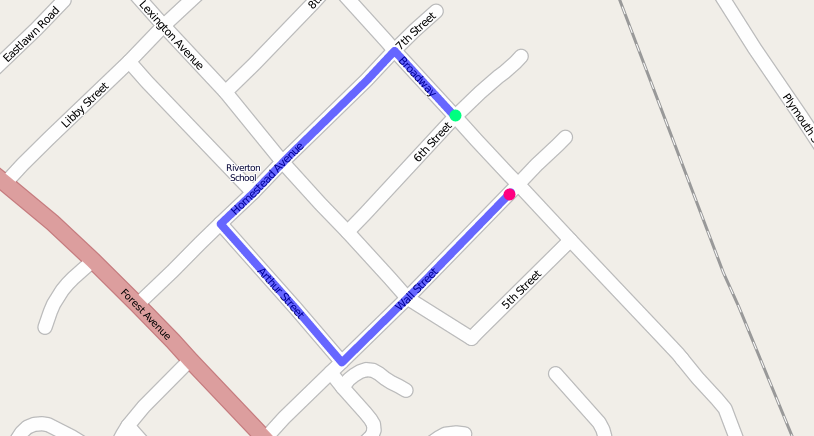

Improper routes like these occur when the original OpenStreetMap data has two vertices which should have actually been a single point, such as in the example below where there is no path between 1 and 4 because vertex 2 and vertex 3 were incorrectly located at different positions.

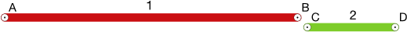

Unfortunately, there's not much we can do but wait for OpenStreetMap to receive an update to fix these broken intersections (or you can `fix it yourself! <http://wiki.openstreetmap.org/wiki/Getting_Involved>`_).

In the meantime, here are a few ideas on how we could easily improve the application:

Shortest versus fastest
^^^^^^^^^^^^^^^^^^^^^^^

Since we can easily calculate either the shortest or the fastest route, we should add an option so the user can switch between the two.

Ferry routes
^^^^^^^^^^^^

The OpenStreetMap data provides data on ferry routes between Portland and the off-shore islands. We could add those to our network.

Walking map
^^^^^^^^^^^

We could create a new SQL View which accepts all edge types, including steps, path, footway and cycleway, which we intentionally excluded earlier. Unlike the car routes, we wouldn't use a reverse cost because pedestrians are not restricted on one-way streets!

Directions
^^^^^^^^^^

The GetFeature data that the client retrieves from GeoServer includes detailed information on the route, including street names, distance and the travel time. This should all be displayed to the user along with the visualised route.

Marker names
^^^^^^^^^^^^

Our SQL vertex query returns a name attribute. We could use this to display a pop-up over the markers indicating the point we are navigating to or from.

Speed calculations
^^^^^^^^^^^^^^^^^^

We didn't incorporate the surface attribute, which can be paved, dirt, sand and so on, to fine-tune the time required to traverse an edge.

Conclusion
----------

This tutorial has demonstrated how build a routing application using OpenGeo Suite and pgRouting. In it we have learnt how to:

* import OpenStreetMap data using OGR
* build a routing network using `pgr_createTopology` and `pgr_nodeNetwork`
* estimate the time needed to travel along roads in SQL
* use `pgr_dijkstra` to do shortest-path queries
* create SQL Views in GeoServer to publish a routing service
* write a client that can make parameterised SQL queries
