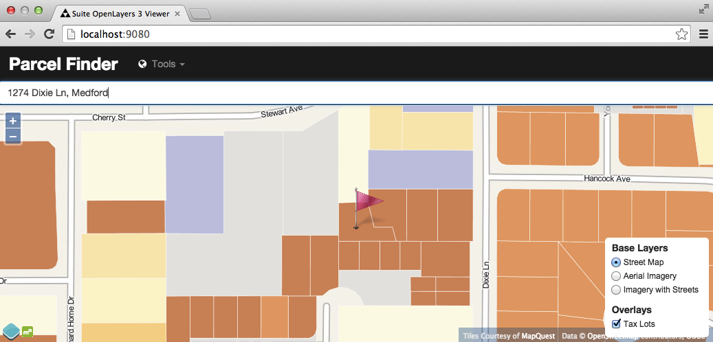

.. note:: 

  Check out the `full demonstration application <http://apps.boundlessgeo.com/apps/parcelmap>`_ and play!

Introduction
------------

The "classic" municipal GIS web application is a form that allows people to look up their house and then tells them things about that house: where it is on the map; what zoning area it's in; what school district; what the tax assessment is.

All too often, the front end to these apps is the classic multi-field form (this one from Dallas County USA):

.. image:: ./img/webform1.png 

Not only does the user have to carefully fill in many fields, if there is anything wrong in the data they enter (mis-spellings, mis-abbreviation) they won't get an answer back.

Fortunately, this user interface problem has a well-known, battle-tested solution: the **autocomplete form field**.

This tutorial will show how to build an autocomplete form field using OpenGeo Suite, and tie the field to a dynamic map view of the selected address.

The basic structure of the application will be

* Spatial tables of addresses and taxlots in PostGIS, that will be accessed with
* Full-text search capabilities from PostgreSQL, web service enabled with
* A SQL view in GeoServer, tied to
* An autocomplete form and map view in OpenLayers 3 and JQuery.

This demonstration application exercises all the tiers of the OpenGeo Suite!

Getting the Data
----------------

For this application, we'll use data from `Jackson County, Oregon <http://gis.jacksoncounty.org/Portal/gis-data.aspx>`_, which is a mid-sized county with 100 thousand address points and 90 thousand tax parcels.

* http://files.boundlessgeo.com/workshopmaterials/parcelmap-data.zip

The data are in two shape files:

* **Taxlots**, which includes a polygon for every lot.
* **SiteAddresses**, which includes a point for every physical address.

Beacuse multiple physical structures can exist on the same lot, or multiple addresses in the same complex (strata developments, for example) there are more address points than there are parcel polygons.

.. image:: ./img/parcel-address.png 

For our address auto-complete application we will want to use the address data from the **SiteAddresses** file, which has the physical structures that people associated with "an address". We can use the taxlot polygons for a backdrop layer.

Loading the Data
----------------

.. note::

  The next steps will involve some database work.

  * If you haven't already installed  OpenGeo Suite, follow the `Suite installation instructions`_.
  * `Create a spatial database`_ named ``county`` to load data into.

The ``Taxlots.shp`` and ``SiteAddresses.shp`` shape files are not in geographic coordinates, they are in a special projection that makes sense for Jackson County. Here's the projection file ``Taxlots.prj``::

  PROJCS["NAD_1983_StatePlane_Oregon_South_FIPS_3602_Feet_Intl",
    GEOGCS["GCS_North_American_1983",
      DATUM["D_North_American_1983",
        SPHEROID["GRS_1980",6378137.0,298.257222101]],
      PRIMEM["Greenwich",0.0],
      UNIT["Degree",0.0174532925199433]],
    PROJECTION["Lambert_Conformal_Conic"],
    PARAMETER["False_Easting",4921259.842519685],
    PARAMETER["False_Northing",0.0],
    PARAMETER["Central_Meridian",-120.5],
    PARAMETER["Standard_Parallel_1",42.33333333333334],
    PARAMETER["Standard_Parallel_2",44.0],
    PARAMETER["Latitude_Of_Origin",41.66666666666666],
    UNIT["Foot",0.3048]]
  
So the projection is "NAD 1983, State Plane Oregon South". But to load the data into PostGIS, we need a "spatial reference identifier" number, a single number. We can turn the ``Taxlots.prj`` definition into a number at the http://prj2epsg.org site.

.. image:: ./img/prj2epsg.png 

So, the number we want to use is **2270**.

Now, loading the **Taxlots** and **SiteAddresses** is pretty easy, either using the command line or the shape loader GUI. Just remember that our target table names are ``taxlots`` and ``siteaddresses``. Here's the command-line::

   shp2pgsql -s 2270 -D -I Taxlots.shp taxlots | psql county
   shp2pgsql -s 2270 -D -I SiteAddresses.shp siteaddresses | psql county

Here's what the ``taxlots`` table looks like::

     Column   |            Type             |   Modifiers                       
  ------------+-----------------------------+--------------
   gid        | integer                     | not null
   mapnumber  | character varying(20)       | 
   mapnum     | character varying(20)       | 
   gis_area   | double precision            | 
   maplot     | character varying(16)       | 
   account    | numeric(10,0)               | 
   lottype    | character varying(4)        | 
   feeowner   | character varying(29)       | 
   contract   | character varying(29)       | 
   incareof   | character varying(29)       | 
   address1   | character varying(29)       | 
   address2   | character varying(29)       | 
   city       | character varying(19)       | 
   state      | character varying(4)        | 
   zipcode    | numeric(10,0)               | 
   commsqft   | integer                     | 
   acreage    | double precision            | 
   impvalue   | numeric(10,0)               | 
   landvalue  | numeric(10,0)               | 
   lotdepth   | integer                     | 
   lotwidth   | integer                     | 
   propclass  | integer                     | 
   addressnum | character varying(8)        | 
   streetname | character varying(22)       | 
   buildcode  | integer                     | 
   yearblt    | integer                     | 
   taxcode    | integer                     | 
   assessimp  | numeric(10,0)               | 
   assessland | numeric(10,0)               | 
   maintenanc | integer                     | 
   tm_maplot  | character varying(18)       | 
   scheduleco | integer                     | 
   neighborho | integer                     | 
   ownersort  | character varying(5)        | 
   addsort    | character varying(5)        | 
   trssort    | character varying(5)        | 
   siteadd    | character varying(36)       | 
   taxlot     | numeric(10,0)               | 
   shape_star | numeric                     | 
   shape_stle | numeric                     | 
   geom       | geometry(MultiPolygon,2270) | 

Here's what the ``siteaddresses`` table looks like::

     Column   |         Type          |   Modifiers
  ------------+-----------------------+---------------
   gid        | integer               | not null 
   siteaddres | character varying(70) | 
   number_    | character varying(8)  | 
   sub_number | character varying(3)  | 
   prefix     | character varying(5)  | 
   streetname | character varying(50) | 
   type       | character varying(6)  | 
   suffix     | character varying(5)  | 
   space      | character varying(6)  | 
   zipcode    | character varying(10) | 
   mapnum     | character varying(12) | 
   taxlot     | character varying(7)  | 
   city       | character varying(20) | 
   floor      | integer               | 
   cad_city   | character varying(2)  | 
   wcity      | character varying(75) | 
   geom       | geometry(Point,2270)  | 

Exploring the Data
------------------

Before building our web application, let's explore the structure of the data using `QGIS`_.

* Start up QGIS and choose *Layer->Add PostGIS Layers*
* Add a new connection

  .. image:: ./img/qgis1.png
     :class: inline
  
* Choose the ``siteaddresses`` and ``taxlots`` tables'

  .. image:: ./img/qgis2.png
     :class: inline

* Click *Add*
* Click *Close*
* You may need to drag the ``siteaddresses`` layer to the top of the layer list to get the points to draw on top of the polygons

If you zoom around and explore the data a little, you'll note that while taxlots frequently contain only one site address, they don't always do so. Some tax lots contain no addresses, others contain several.

.. image:: ./img/qgis3.png

* Click the "Open Attribute Table" button on the tool bar to explore the data in each layer

  .. image:: ./img/qgis3.png

* Look closely at the ``taxlots`` table, and note the ``address1`` and ``city`` fields. These are actually the addresses of the lot *owner*,  not the address of the lot. The lot address is in the ``siteadd`` field, and is a partial address (no city, often missing the street number)::

              address1           |       city        
    -----------------------------+-------------------
     11318 SOUTHWIND LN          | SCOTTSDALE
     2242 BRENTWOOD DR           | MEDFORD
     PO BOX 359                  | PHOENIX
     610 CEDAR WOOD DR           | EAGLE POINT
     CITY HALL                   | MEDFORD
     7252 DARK HOLLOW RD         | MEDFORD
     573 LADO WAY                | SANTA BARBARA
     2430 ROCKWOOD CT            | MEDFORD
  
  
* In contrast, the data in the ``siteaddresses`` table are quite complete. The ``siteaddres``, ``city``, and ``zipcode`` columns give a complete physical address of the sort an end user might be expected to enter::

                 siteaddres             |     city      | zipcode 
    ------------------------------------+---------------+---------
     1350 WILSON RD                     | Ashland       | 97520
     11537 DEAD INDIAN MEMORIAL RD      | Ashland       | 97520
     690 REITEN DR                      | Ashland       | 97520
     705 BENJAMIN CT                    | Ashland       | 97520
     210 SUNNYVIEW ST                   | Ashland       | 97520
     5977 DARK HOLLOW RD                | Medford       | 97501
     38 SUMMIT AVE                      | Medford       | 97501
     5353 DARK HOLLOW RD                | Medford       | 97501
     983 COVE RD                        | Ashland       | 97520
     300 SKYCREST DR                    | Ashland       | 97520

So, in order to provide a user-friendly parcel look-up service, we're going to have to use the actual address data in the ``siteaddresses`` table for the look-ups, and use the ``taxlots`` data initially as a backdrop layer to provide the visual context of the parcel boundary.  

Putting the Tax Lots on the Map
-------------------------------

Now we will hook up the GeoServer rendering engine to our database table.

First, we need a datastore that connects GeoServer to our ``county`` PostgreSQL database. 

* `Log in to GeoServer <http://suite.opengeo.org/opengeo-docs/geoserver/webadmin/basics.html#welcome-page>`_
* `Add a new workspace <>`_ specifying ``county`` as the workspace name and ``http:://county.us`` as the URI.

  .. image:: ./img/geoserver1.png

* `Add a new PostGIS store <http://suite.opengeo.org/opengeo-docs/geoserver/webadmin/data/stores.html#adding-a-store>`_, named ``county_postgis`` specifying the ``county`` database as the database to connect to, and using the ``county`` workspace.
 
  .. image:: ./img/geoserver2.png
 
* Add a new style, named ``taxlots`` in the ``county`` workspace, and fill it in with the content from `taxlots.sld <_static/data/taxlots.sld>`_. This "styled layer descriptor" (SLD) file gives each tax lot a color based on the ``yearblt`` column, which will provide a pretty visual map of the building history of the area.

  .. image:: ./img/geoserver3.png

* Finally, add a new layer, named ``taxlots``, using the ``county`` workspace, the ``county_postgis`` store, and the ``taxlots`` style.

  * Under *Layer* click "Add a new resource"
  * Select the ``county:county_postgis`` store
  * Click "Publish" for the ``taxlots`` table
  * Under the "Data" tab in the "Bounding Boxes" section click "Complete from data" and then "Compute from native bounds"
  * Under the "Publishing" tab, select "taxlots" as the default style
  * Click the "Save" button at the bottom of the page
  
* We now have a published layer! Go to the "Layer Preview" page and click "Go" after the "taxlots" entry. It may take some time to render (all 92,206 lots have to be drawn), but you will see a map of the tax lots.

XXXXXXXXXXXXXXXXX

Putting the Map on the Web
--------------------------

 
 

And this is what the GUI looks like:

.. image:: ./img/shploader.png

Note that, like the `census` table, the `counties` table also contains a **fips** code, so we have a common key to join the attributes to the spatial shapes for mapping

.. code-block:: text
   :emphasize-lines: 9

           Table "public.counties"
      Column   |            Type             
   ------------+-----------------------------
    gid        | integer                     
    name       | character varying(32)       
    state_name | character varying(25)       
    state_fips | character varying(2)        
    cnty_fips  | character varying(3)        
    fips       | character varying(5)        
    geom       | geometry(MultiPolygon,4326) 
   Indexes:
     "counties_pkey" PRIMARY KEY, btree (gid)
     "counties_geom_gist" gist (geom)

Drawing the Map
---------------

Our challenge now is to set up a rendering system that can easily render any of our 51 columns of census data as a map.

We could define **51 layers in GeoServer**, and set up 51 separate styles to provide attractive renderings of each variable. But that would be a lot of work, and we're **much too lazy** to do that. What we want is a **single layer** that can be re-used to render any column of interest. 

One Layer to Rule them All
~~~~~~~~~~~~~~~~~~~~~~~~~~

Using a `parametric SQL view <http://docs.geoserver.org/stable/en/user/data/database/sqlview.html#using-a-parametric-sql-view>`_ we can define a SQL-based layer definition that allows us to change the column of interest by substituting a variable when making a WMS map rendering call.

For example, this SQL definition will allow us to substitute any column we want into the map rendering chain:

.. code-block:: sql

   SELECT 
     census.fips, 
     counties.geom,
     %column% AS data
   FROM census JOIN counties USING (fips)

The query joins the `census` table data to the `counties` spatial table, and includes a `data` column, that is dynamically filled in by the `%column%` variable.

One Style to Rule them All
~~~~~~~~~~~~~~~~~~~~~~~~~~

Viewing our data via a parametric SQL view doesn't quite get us over the goal line though, because we still need to create a thematic style for the data, and the data in our **51 columns** have vastly different ranges and distributions:

* some are percentages
* some are absolute population counts
* some are medians or averages of absolutes

We need to somehow get all this different data onto one scale, preferably one that provides for easy visual comparisons between variables.

The answer is to **use the average and standard deviation of the data to normalize it** to a standard scale.

.. image:: ./img/stddev.png

For example:

* For data set **D**, suppose the **avg(D)** is **10** and the **stddev(D)** is **5**.
* What will the average and standard deviation of **(D - 10) / 5** be?
* The average will be **0** and the standard deviation will be **1**.

Let's try it on our own census data.

.. code-block:: sql

   SELECT Avg(pst045212), Stddev(pst045212) FROM census;
   
   --
   --        avg        |     stddev      
   -- ------------------+-----------------
   --  99877.2001272669 | 319578.62862369

   SELECT Avg((pst045212 - 99877.2001272669) / 319578.62862369),
          Stddev((pst045212 - 99877.2001272669) / 319578.62862369) 
   FROM census;
   
   --     avg    | stddev 
   -- -----------+--------
   --      0     |      1

So we can easily convert any of our data into a scale that centers on 0 and where one standard deviation equals one unit just by normalizing the data with the average and standard deviation!

Our new parametric SQL view will look like this:

.. code-block:: sql

   -- Precompute the Avg and StdDev,
   -- then join the tables and normalize
   WITH stats AS (
     SELECT Avg(%column%) AS avg, 
            Stddev(%column%) AS stddev 
     FROM census
   )
   SELECT 
     census.fips, 
     counties.geom,
     %column% as data
     (%column% - avg)/stddev AS normalized_data
   FROM stats, 
     census JOIN counties USING (fips)

The query first calculates the overall statistics for the column, then applies those stats to the data in the join query, serving up a normalized view of the data.

With our data normalized, we are ready to create one style to rule them all!

* Our style will have two colors, one to indicate counties "above average" and the other for "below average"
* Within those two colors it will have 3 shades, for a total of 6 bins in all
* In order to divide up the population more or less evenly, the bins will be

  * (#c51b7d) -1.0 and down (very below average) 
  * (#e9a3c9) -1.0 to -0.5 (below average) 
  * (#fde0ef) -0.5 to 0.0  (a little below average) 
  * (#e6f5d0)  0.0 to 0.5  (a little above average) 
  * (#a1d76a)  0.5 to 1.0  (above average) 
  * (#4d9221)  1.0 and up  (very above average) 

* The colors above weren't chosen randomly! I always use the `ColorBrewer <http://colorbrewer2.org/>`_ site when building themes, because ColorBrewer provides palettes that have been tested for maximum readability and to some extent aesthetic quality. Here's the palette I chose:

  .. image:: ./img/colorbrewer.png
     :width: 95%

* Configure a new style in GeoServer by going to the *Styles* section, and selecting **Add a new style**.
* Set the style name to *stddev*
* Set the style workspace to *opengeo*
* Paste in the style definition (below) for `stddev.xml`_ and hit the *Save* button at the bottom

.. code-block:: xml

   <?xml version="1.0" encoding="ISO-8859-1"?>
   <StyledLayerDescriptor version="1.0.0"
     xmlns="http://www.opengis.net/sld" 
     xmlns:ogc="http://www.opengis.net/ogc"
     xmlns:xlink="http://www.w3.org/1999/xlink" 
     xmlns:xsi="http://www.w3.org/2001/XMLSchema-instance"
     xmlns:gml="http://www.opengis.net/gml"
     xsi:schemaLocation="http://www.opengis.net/sld 
     http://schemas.opengis.net/sld/1.0.0/StyledLayerDescriptor.xsd">
     
     <NamedLayer>
       <Name>opengeo:stddev</Name>
       <UserStyle>

         <Name>Standard Deviation Ranges</Name>

         <FeatureTypeStyle>

           <Rule>
             <Name>StdDev &lt; -1.0</Name>
             <ogc:Filter>
               <ogc:PropertyIsLessThan>
                 <ogc:PropertyName>normalized_data</ogc:PropertyName>
                 <ogc:Literal>-1.0</ogc:Literal>
               </ogc:PropertyIsLessThan>
             </ogc:Filter>
             <PolygonSymbolizer>
                <Fill>
                   <!-- CssParameters allowed are fill and fill-opacity -->
                   <CssParameter name="fill">#c51b7d</CssParameter>
                </Fill>
             </PolygonSymbolizer>
           </Rule>

           <Rule>
             <Name>-1.0 &lt; StdDev &lt; -0.5</Name>
             <ogc:Filter>
               <ogc:PropertyIsBetween>
                 <ogc:PropertyName>normalized_data</ogc:PropertyName>
                 <ogc:LowerBoundary>
                   <ogc:Literal>-1.0</ogc:Literal>
                 </ogc:LowerBoundary>
                 <ogc:UpperBoundary>
                   <ogc:Literal>-0.5</ogc:Literal>
                 </ogc:UpperBoundary>
               </ogc:PropertyIsBetween>
             </ogc:Filter>
             <PolygonSymbolizer>
               <Fill>
                 <!-- CssParameters allowed are fill and fill-opacity -->
                 <CssParameter name="fill">#e9a3c9</CssParameter>
               </Fill>
             </PolygonSymbolizer>
           </Rule>

           <Rule>
             <Name>-0.5 &lt; StdDev &lt; 0.0</Name>
             <ogc:Filter>
               <ogc:PropertyIsBetween>
                 <ogc:PropertyName>normalized_data</ogc:PropertyName>
                 <ogc:LowerBoundary>
                   <ogc:Literal>-0.5</ogc:Literal>
                 </ogc:LowerBoundary>
                 <ogc:UpperBoundary>
                   <ogc:Literal>0.0</ogc:Literal>
                 </ogc:UpperBoundary>
               </ogc:PropertyIsBetween>
             </ogc:Filter>
             <PolygonSymbolizer>
               <Fill>
                 <!-- CssParameters allowed are fill and fill-opacity -->
                 <CssParameter name="fill">#fde0ef</CssParameter>
               </Fill>
             </PolygonSymbolizer>
           </Rule>

           <Rule>
             <Name>0.0 &lt; StdDev &lt; 0.5</Name>
             <ogc:Filter>
               <ogc:PropertyIsBetween>
                 <ogc:PropertyName>normalized_data</ogc:PropertyName>
                 <ogc:LowerBoundary>
                   <ogc:Literal>0.0</ogc:Literal>
                 </ogc:LowerBoundary>
                 <ogc:UpperBoundary>
                   <ogc:Literal>0.5</ogc:Literal>
                 </ogc:UpperBoundary>
               </ogc:PropertyIsBetween>
             </ogc:Filter>
             <PolygonSymbolizer>
               <Fill>
                 <!-- CssParameters allowed are fill and fill-opacity -->
                 <CssParameter name="fill">#e6f5d0</CssParameter>
               </Fill>
             </PolygonSymbolizer>
           </Rule>

           <Rule>
             <Name>0.5 &lt; StdDev &lt; 1.0</Name>
             <ogc:Filter>
               <ogc:PropertyIsBetween>
                 <ogc:PropertyName>normalized_data</ogc:PropertyName>
                 <ogc:LowerBoundary>
                   <ogc:Literal>0.5</ogc:Literal>
                 </ogc:LowerBoundary>
                 <ogc:UpperBoundary>
                   <ogc:Literal>1.0</ogc:Literal>
                 </ogc:UpperBoundary>
               </ogc:PropertyIsBetween>
             </ogc:Filter>
             <PolygonSymbolizer>
               <Fill>
                 <!-- CssParameters allowed are fill and fill-opacity -->
                 <CssParameter name="fill">#a1d76a</CssParameter>
               </Fill>
             </PolygonSymbolizer>
           </Rule>

           <Rule>
             <Name>1.0 &lt; StdDev</Name>
             <ogc:Filter>
               <ogc:PropertyIsGreaterThan>
                 <ogc:PropertyName>normalized_data</ogc:PropertyName>
                 <ogc:Literal>1.0</ogc:Literal>
               </ogc:PropertyIsGreaterThan>
             </ogc:Filter>
             <PolygonSymbolizer>
                <Fill>
                   <!-- CssParameters allowed are fill and fill-opacity -->
                   <CssParameter name="fill">#4d9221</CssParameter>
                </Fill>
             </PolygonSymbolizer>
           </Rule>

        </FeatureTypeStyle>
       </UserStyle>
     </NamedLayer>
   </StyledLayerDescriptor>

Now we have a style, we just need to create a layer that uses it!

Creating a SQL View
~~~~~~~~~~~~~~~~~~~

First, we need a PostGIS store that connects to our database

* Go to the *Stores* section of GeoServer and *Add a new store*
* Select a *PostGIS* store
* Set the workspace to *opengeo*
* Set the datasource name to *census*
* Set the database to *census*
* Set the user to *postgres*
* Set the password to *postgres*
* Save the store

You'll be taken immediately to the *New Layer* panel (how handy) where you should:

* Click on *Configure new SQL view...*
* Set the view name to *normalized*
* Set the SQL statement to 

  .. code-block:: sql

      WITH stats AS (
        SELECT avg(%column%) AS avg, 
               stddev(%column%) AS stddev 
        FROM census
      )
      SELECT 
        census.fips, 
        counties.geom,
        counties.name || ' County' AS name,
        '%column%'::text AS variable,
        %column%::real AS data,
        (%column% - avg)/stddev AS normalized_data
      FROM stats, 
        census JOIN counties USING (fips)

* Click the *Guess parameters from SQL* link in the "SQL view parameters" section
* Set the default value of the "column" parameter to *pst045212*
* Check the "Guess geometry type and srid" box
* Click the *Refresh* link in the "Attributes" section
* Select the *fips* column as the "Identifier"
* Click *Save*

You'll be taken immediately to the *Edit Layer* panel (how handy) where you should:

* In the *Data* tab

  * Under "Bounding Boxes" click *Compute from data*
  * Under "Bounding Boxes" click *Compute from native bounds*

* In the *Publishing* tab

  * Set the *Default Style* to *stddev*

* In the *Tile Caching* tab

  * *Uncheck* the "Create a cached layer for this layer" entry
  * Hit the *Save* button
 
That's it, the layer is ready!

* Go to the *Layer Preview* section
* For the "opengeo:normalized" layer, click *Go*

.. image:: ./img/preview.png

We can change the column we're viewing by altering the *column* view parameter in the WMS request URL.

* Here is the default column: 
  http://apps.opengeo.org/geoserver/opengeo/wms/reflect?layers=opengeo:normalized
* Here is the **edu685211** column:
  http://apps.opengeo.org/geoserver/opengeo/wms/reflect?layers=opengeo:normalized&viewparams=column:edu685211
* Here is the **rhi425212** column:
  http://apps.opengeo.org/geoserver/opengeo/wms/reflect?layers=opengeo:normalized&viewparams=column:rhi425212

The column names that the census uses are **pretty opaque** aren't they? What we need is a web app that lets us see nice human readable column information, and also lets us change the column we're viewing on the fly.

Building the App
----------------

Preparing the Metadata
~~~~~~~~~~~~~~~~~~~~~~

The first thing we need for our app is a data file that maps the short, meaningless column names in our *census* table to human readable information. Fortunately, the `DataDict.txt`_ file we downloaded earlier has all the information we need. Here's a couple example lines::

   POP010210 Resident population (April 1 - complete count) 2010                                                      ABS    0      308745538          82   308745538  CENSUS
   AGE135212 Resident population under 5 years, percent, 2012                                                         PCT    1            6.4         0.0        13.3  CENSUS

Each line has the column name, a human readable description, and some other metadata about the column. Fortunately the information is all aligned in the text file, so the same field starts at the same text position in each line:

+------------------+----------------+--------+
| Column           | Start Position | Length |
+==================+================+========+
| Name             | 1              | 10     |
+------------------+----------------+--------+
| Description      | 11             | 105    |
+------------------+----------------+--------+
| Units            | 116            | 4      |
+------------------+----------------+--------+
| # Decimal Places | 120            | 7      |
+------------------+----------------+--------+
| Total            | 127            | 12     |
+------------------+----------------+--------+
| Min              | 139            | 12     |
+------------------+----------------+--------+
| Max              | 151            | 12     |
+------------------+----------------+--------+
| Source           | 163            | 8      |
+------------------+----------------+--------+

We're going to consume the first two columns of this information in a JavaScript web application. The text file can easily be read in and split into lines. So with start position and length of Name and Description it will be easy to extract these and to populate a topics dropdown.

Framing the Map
~~~~~~~~~~~~~~~

We already saw our map visualized in a bare `OpenLayers`_ map frame in the *Layer Preview* section of GeoServer. 

We want an application that provides a user interface component that manipulates the source WMS URL, altering the URL `viewparams <http://docs.geoserver.org/stable/en/user/data/database/sqlview.html#using-a-parametric-sql-view>`_ parameter.

We'll build the app using `Bootstrap`_ for a straightforward layout with CSS, and `OpenLayers`_ as the map component.

The base HTML page, `censusmap.html`_, contains script and stylesheet includes bringing in our various libraries. A custom stylesheet gives us a fullscreen map with a legend overlay. Bootstrap css classes are used to style the navigation bar. Containers for the map and a header navigation bar with the aforementioned topics dropdown are also included, and an image element with the legend image from a WMS *GetLegendGraphic* request is put inside the map container.

.. code-block:: html

  <!DOCTYPE html>
  <html>
    <head>
      <title>Boundless Census Map</title>
      <!-- Bootstrap -->
      <link rel="stylesheet" href="resources/bootstrap/css/bootstrap.min.css" type="text/css">
      <link rel="stylesheet" href="resources/bootstrap/css/bootstrap-theme.min.css" type="text/css">
      
      
      <!-- OpenLayers -->
      <link rel="stylesheet" href="resources/ol3/ol.css">
      
      <!-- Our Application -->
      
    </head>
    <body>
      <nav class="navbar navbar-inverse navbar-fixed-top" role="navigation">
        

          <a class="navbar-brand" href="#">Boundless Census Map</a>
        

        <form class="navbar-form navbar-right">
          

            <select id="topics" class="form-control"></select>
          

        </form>
      </nav>
      

        <!-- GetLegendGraphic, customized with some LEGEND_OPTIONS -->
        
      

      
    </body>
  </html>

The real code is in the `censusmap.js`_ file. We start by creating an `OpenStreetMap`_ base layer, and adding our parameterized census layer on top as an image layer with a `WMS Layer source`_.

.. code-block:: javascript

  // Base map
  var osmLayer = new ol.layer.Tile({source: new ol.source.OSM()});

  // Census map layer
  var wmsLayer = new ol.layer.Image({
    source: new ol.source.ImageWMS({
      url: 'http://apps.opengeo.org/geoserver/wms',
      params: {'LAYERS': 'opengeo:normalized'}
    }),
    opacity: 0.6
  });

  // Map object
  olMap = new ol.Map({
    target: 'map',
    renderer: ol.RendererHint.CANVAS,
    layers: [osmLayer, wmsLayer],
    view: new ol.View({
      center: [-10764594.0, 4523072.0],
      zoom: 5
    })
  });

We configure an `OpenLayers Map`_, assign the layers, and give it a map view with a center and zoom level. Now the map will load.

The *select* element with the id *topics* will be our drop-down list of available columns. We load the `DataDict.txt`_ file, and fill the *select* element with its contents. This is done by adding an *option* child for each line.

.. code-block:: javascript

  // Load variables into dropdown
  $.get("../data/DataDict.txt", function(response) {
    // We start at line 3 - line 1 is column names, line 2 is not a variable
    $(response.split('\n').splice(2)).each(function(index, line) {
      $('#topics').append($('<option>')
        .val(line.substr(0, 10).trim())
        .html(line.substr(10, 105).trim()));
    });
  });

Finally, we add an *onchange* event handler for the dropdown, which updates the layer with WMS parameters for the selected variable when a new topic/layer is selected.

.. code-block:: javascript

  // Add behaviour to dropdown
  $('#topics').change(function() {
    wmsLayer.getSource().updateParams({
      'viewparams': 'column:' + $('#topics>option:selected').val()
    });
  });

Look at the the `censusmap.js`_ file to see the whole application in one page.

When we open the `censusmap.html`_ file, we see the application in action.

.. image:: ./img/census_hispanic.png 
   :width: 95%

Clickability
~~~~~~~~~~~~

With some additional markup and css plus a few more lines of JavaScript code, we can even handle map clicks: When clicking on the map, we send a WMS GetFeatureInfo request, and display the result in a popup.

Most of the following markup, css and JavaScript code comes directly from the `OpenLayers Popup Example`_. The only difference is that we use ``ol.Map#getFeatureInfo()`` instead of just displaying the clicked coordinates.

First we need some markup for the popup, which we add to our HTML page, inside the map div. With popup added, the map div looks like this:

.. code-block:: html

  

    <!-- GetLegendGraphic, customized with some LEGEND_OPTIONS -->
    
    

  

To style the popup, we need some additional css in the existing ``<style>`` block on our HTML page:

.. code-block:: css

  .popover {
    max-width: 440px;
  }
  .popover-title {
    float: right;
    background: none;
    border: 0;
    cursor: pointer;
  }
  .popover-content iframe {
    width: 400px;
    height: 120px;
    border: 0;
  }

Finally, we need some JavaScript to add behaviour to the popup's close button, to create an ``ol.Overlay`` so the popup is anchored to the map, and to trigger a GetFeatureInfo request when the map is clicked:

.. code-block:: javascript

  // Create an ol.Overlay with a popup anchored to the map
  var popup = new ol.Overlay({
    element: $('#popup')
  });
  olMap.addOverlay(popup);

  // Handle map clicks to send a GetFeatureInfo request and open the popup
  olMap.on('singleclick', function(evt) {
    olMap.getFeatureInfo({
      pixel: evt.getPixel(),
      success: function (info) {
        popup.setPosition(evt.getCoordinate());
        $('#popup')
          .popover({content: info.join('')})
          .popover('show');
        // Close popup when user clicks on the 'x'
        $('.popover-title').click(function() {
          $('#popup').popover('hide');
        });
      }
    });
  });

Conclusion
----------

We've built an application for browsing 51 different census variables, using less than 51 lines of JavaScript application code, and demonstrating:

* SQL views provide a powerful means of manipulating data on the fly.
* Standard deviations make for attractive visualization breaks.
* Professionally generated color palettes are better than programmer generated ones.
* Simple OpenLayers applications are easy to build.
* Census data can be really, really interesting!
* The application is easy to extend. With 20 more lines of code we can handle clicks and display feature information.

.. _Suite installation instructions: http://suite.opengeo.org/opengeo-docs/installation/index.html
.. _OpenLayers: http://ol3js.org
.. _Bootstrap: http://getbootstrap.com
.. _Create a spatial database: http://suite.opengeo.org/opengeo-docs/dataadmin/pgGettingStarted/createdb.html
.. _QGIS: http://boundlessgeo.com/qgis
.. _WMS Layer source: http://ol3js.org/en/master/apidoc/ol.source.ImageWMS.html
.. _OpenLayers Map: http://ol3js.org/en/master/apidoc/ol.Map.html
.. _OpenLayers Popup Example: http://ol3js.org/en/master/examples/popup.html
.. _OpenStreetMap: http://openstreetmap.org
