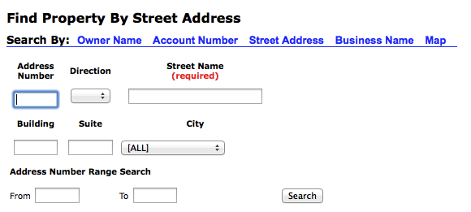
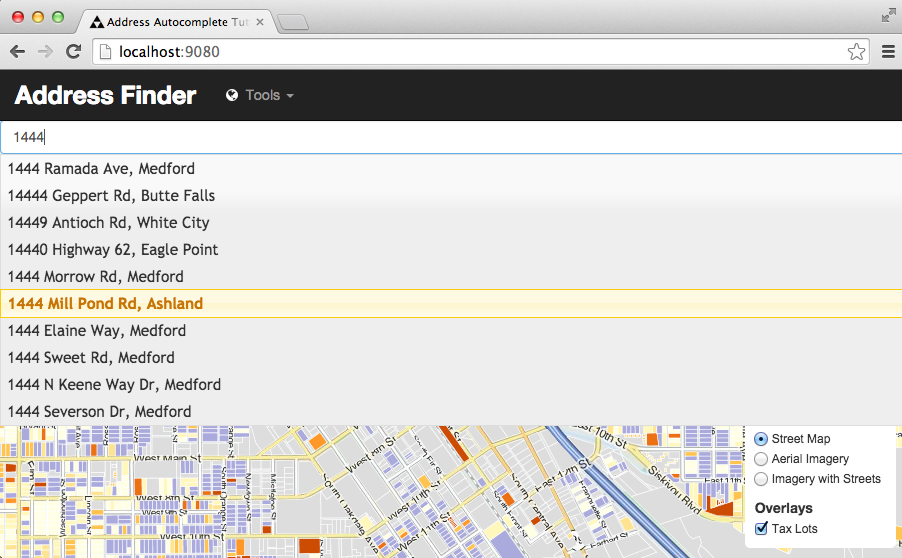
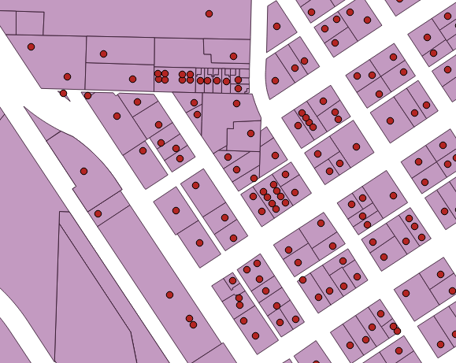
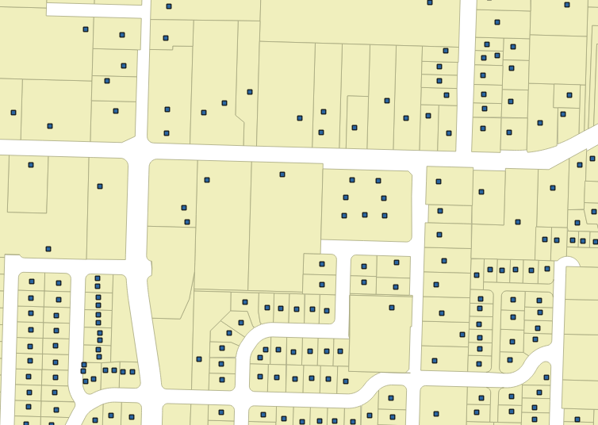

.. note:: 

  Check out the `online demonstration application <http://apps.boundlessgeo.com/apps/parcelmap>`_ and play!

Introduction
------------

The "classic" municipal GIS web application is a form that allows people to look up their house and then tells them things about that house: where it is on the map; what zoning area it's in; what school district; what the tax assessment is.

All too often, the front end to these apps is the classic multi-field form (this one from Dallas County USA):

Not only does the user have to carefully fill in many fields, if there is anything wrong in the data they enter (mis-spellings, mis-abbreviation) they won't get an answer back.

Fortunately, this user interface problem has a well-known, battle-tested solution: the **autocomplete form field**.

This tutorial will show how to build an autocomplete form field using OpenGeo Suite, and tie the field to a dynamic map view of the selected address.

While this example is about autocompleting addresses, the technique can be used for almost any kind of data to create single-entry search forms. 

Why have separate "record number", "keyword search", "author search" fields on a form, when you can have a single field that transparently and quickly provides relevant alternatives no matter what the user chooses to input? Full-text search autocomplete fields are a form-based hammer suitable for almost any data entry nail.

The basic structure of the application will be:

* Spatial tables of addresses and taxlots in PostGIS, that will be accessed with
* Full-text search capabilities from PostgreSQL, web service enabled with
* A SQL view in GeoServer, tied to
* An autocomplete form and map view in OpenLayers 3 and JQuery.

This demonstration application exercises all the tiers of OpenGeo Suite!

Getting the Data
----------------

For this application, we'll use data from `Jackson County, Oregon <http://gis.jacksoncounty.org/Portal/gis-data.aspx>`_, which is a mid-sized county with 100 thousand address points and 90 thousand tax parcels.

* http://files.boundlessgeo.com/workshopmaterials/parcelmap-data.zip

The data are in two shape files:

* **Taxlots**, which includes a polygon for every lot.
* **SiteAddresses**, which includes a point for every physical address.

Because multiple physical structures can exist on the same lot, or multiple addresses in the same complex (strata developments, for example) there are more address points than there are parcel polygons.

For our address auto-complete application we will want to use the address data from the **SiteAddresses** file, which has the physical structures that people associate with "an address". We can use the taxlot polygons for a backdrop layer.

Loading the Data
----------------

.. note::

  The next steps will involve some database work.

  * If you haven't already installed  OpenGeo Suite, follow the `Suite installation instructions`_.
  * `Create a spatial database`_ named ``county`` to load data into.

The ``Taxlots.shp`` and ``SiteAddresses.shp`` shape files are not in geographic coordinates, they are in a special projection that makes sense for Jackson County. Here's the projection file ``Taxlots.prj``::

  PROJCS["NAD_1983_StatePlane_Oregon_South_FIPS_3602_Feet_Intl",
    GEOGCS["GCS_North_American_1983",
      DATUM["D_North_American_1983",
        SPHEROID["GRS_1980",6378137.0,298.257222101]],
      PRIMEM["Greenwich",0.0],
      UNIT["Degree",0.0174532925199433]],
    PROJECTION["Lambert_Conformal_Conic"],
    PARAMETER["False_Easting",4921259.842519685],
    PARAMETER["False_Northing",0.0],
    PARAMETER["Central_Meridian",-120.5],
    PARAMETER["Standard_Parallel_1",42.33333333333334],
    PARAMETER["Standard_Parallel_2",44.0],
    PARAMETER["Latitude_Of_Origin",41.66666666666666],
    UNIT["Foot",0.3048]]
  
So the projection is "NAD 1983, State Plane Oregon South". But to load the data into PostGIS, we need a "spatial reference identifier" number, a single number. We can turn the ``Taxlots.prj`` definition into a number at the http://prj2epsg.org site.

.. image:: ./img/prj2epsg.png 

So, the number we want to use is **2270**.

Now, loading the **Taxlots** and **SiteAddresses** is pretty easy, either using the command line or the shape loader GUI. Just remember that our target table names are ``taxlots`` and ``siteaddresses``. Here's the command-line::

   shp2pgsql -s 2270 -D -I Taxlots.shp taxlots | psql county
   shp2pgsql -s 2270 -D -I SiteAddresses.shp siteaddresses | psql county

Here's what the ``taxlots`` table looks like::

     Column   |            Type             |   Modifiers                       
  ------------+-----------------------------+--------------
   gid        | integer                     | not null
   mapnumber  | character varying(20)       | 
   mapnum     | character varying(20)       | 
   gis_area   | double precision            | 
   maplot     | character varying(16)       | 
   account    | numeric(10,0)               | 
   lottype    | character varying(4)        | 
   feeowner   | character varying(29)       | 
   contract   | character varying(29)       | 
   incareof   | character varying(29)       | 
   address1   | character varying(29)       | 
   address2   | character varying(29)       | 
   city       | character varying(19)       | 
   state      | character varying(4)        | 
   zipcode    | numeric(10,0)               | 
   commsqft   | integer                     | 
   acreage    | double precision            | 
   impvalue   | numeric(10,0)               | 
   landvalue  | numeric(10,0)               | 
   lotdepth   | integer                     | 
   lotwidth   | integer                     | 
   propclass  | integer                     | 
   addressnum | character varying(8)        | 
   streetname | character varying(22)       | 
   buildcode  | integer                     | 
   yearblt    | integer                     | 
   taxcode    | integer                     | 
   assessimp  | numeric(10,0)               | 
   assessland | numeric(10,0)               | 
   maintenanc | integer                     | 
   tm_maplot  | character varying(18)       | 
   scheduleco | integer                     | 
   neighborho | integer                     | 
   ownersort  | character varying(5)        | 
   addsort    | character varying(5)        | 
   trssort    | character varying(5)        | 
   siteadd    | character varying(36)       | 
   taxlot     | numeric(10,0)               | 
   shape_star | numeric                     | 
   shape_stle | numeric                     | 
   geom       | geometry(MultiPolygon,2270) | 

Here's what the ``siteaddresses`` table looks like::

     Column   |         Type          |   Modifiers
  ------------+-----------------------+---------------
   gid        | integer               | not null 
   siteaddres | character varying(70) | 
   number_    | character varying(8)  | 
   sub_number | character varying(3)  | 
   prefix     | character varying(5)  | 
   streetname | character varying(50) | 
   type       | character varying(6)  | 
   suffix     | character varying(5)  | 
   space      | character varying(6)  | 
   zipcode    | character varying(10) | 
   mapnum     | character varying(12) | 
   taxlot     | character varying(7)  | 
   city       | character varying(20) | 
   floor      | integer               | 
   cad_city   | character varying(2)  | 
   wcity      | character varying(75) | 
   geom       | geometry(Point,2270)  | 

Exploring the Data
------------------

Before building our web application, let's explore the structure of the data using `QGIS`_.

* Start up QGIS and choose *Layer->Add PostGIS Layers*
* Add a new connection

  .. image:: ./img/qgis1.png
  
* Choose the ``siteaddresses`` and ``taxlots`` tables'

  .. image:: ./img/qgis2.png

* Click *Add*
* Click *Close*
* You may need to drag the ``siteaddresses`` layer to the top of the layer list to get the points to draw on top of the polygons

If you zoom around and explore the data a little, you'll note that while taxlots frequently contain only one site address, they don't always do so. Some tax lots contain no addresses, others contain several.

* Click the "Open Attribute Table" button on the tool bar to explore the data in each layer

  .. image:: ./img/qgis4.png

* Look closely at the ``taxlots`` table, and note the ``address1`` and ``city`` fields. These are actually the addresses of the lot *owner*,  not the address of the lot. The lot address is in the ``siteadd`` field, and is a partial address (no city, often missing the street number)::

              address1           |       city        
    -----------------------------+-------------------
     11318 SOUTHWIND LN          | SCOTTSDALE
     2242 BRENTWOOD DR           | MEDFORD
     PO BOX 359                  | PHOENIX
     610 CEDAR WOOD DR           | EAGLE POINT
     CITY HALL                   | MEDFORD
     7252 DARK HOLLOW RD         | MEDFORD
     573 LADO WAY                | SANTA BARBARA
     2430 ROCKWOOD CT            | MEDFORD
  
  
* In contrast, the data in the ``siteaddresses`` table are quite complete. The ``siteaddres``, ``city``, and ``zipcode`` columns give a complete physical address of the sort an end user might be expected to enter::

                 siteaddres             |     city      | zipcode 
    ------------------------------------+---------------+---------
     1350 WILSON RD                     | Ashland       | 97520
     11537 DEAD INDIAN MEMORIAL RD      | Ashland       | 97520
     690 REITEN DR                      | Ashland       | 97520
     705 BENJAMIN CT                    | Ashland       | 97520
     210 SUNNYVIEW ST                   | Ashland       | 97520
     5977 DARK HOLLOW RD                | Medford       | 97501
     38 SUMMIT AVE                      | Medford       | 97501
     5353 DARK HOLLOW RD                | Medford       | 97501
     983 COVE RD                        | Ashland       | 97520
     300 SKYCREST DR                    | Ashland       | 97520

So, in order to provide a user-friendly parcel look-up service, we're going to have to use the actual address data in the ``siteaddresses`` table for the look-ups, and use the ``taxlots`` data initially as a backdrop layer to provide the visual context of the parcel boundary.  

Putting the Tax Lots on the Map
-------------------------------

Now we will hook up the GeoServer rendering engine to our database table.

First, we need a datastore that connects GeoServer to our ``county`` PostgreSQL database. 

* `Log in to GeoServer <http://suite.opengeo.org/opengeo-docs/geoserver/webadmin/basics.html#welcome-page>`_
* `Add a new workspace <http://suite.opengeo.org/opengeo-docs/geoserver/webadmin/data/workspaces.html#adding-a-workspace>`_ specifying ``county`` as the workspace name and ``http:://county.us`` as the URI.

  .. image:: ./img/geoserver1.png

* `Add a new PostGIS store <http://suite.opengeo.org/opengeo-docs/geoserver/webadmin/data/stores.html#adding-a-store>`_, named ``county_postgis`` specifying the ``county`` database as the database to connect to, and using the ``county`` workspace.
 
  .. image:: ./img/geoserver2.png
 
* Add a new style, named ``taxlots`` in the ``county`` workspace, and fill it in with the content from `taxlots.sld <_static/data/taxlots.sld>`_. This "styled layer descriptor" (SLD) file gives each tax lot a color based on the ``yearblt`` column, which will provide a pretty visual map of the building history of the area.

  .. image:: ./img/geoserver3.png

* Finally, add a new layer, named ``taxlots``, using the ``county`` workspace, the ``county_postgis`` store, and the ``taxlots`` style.

  * Under *Layer* click "Add a new resource"
  * Select the ``county:county_postgis`` store
  * Click "Publish" for the ``taxlots`` table
  * Under the "Data" tab in the "Bounding Boxes" section click "Complete from data" and then "Compute from native bounds"
  * Under the "Publishing" tab, select "taxlots" as the default style
  * Click the "Save" button at the bottom of the page
  
* We now have a published layer! Go to the "Layer Preview" page and click "Go" after the "taxlots" entry. It may take some time to render (all 92,206 lots have to be drawn), but you will see a map of the tax lots.

  .. image:: ./img/geoserver4.png
     :class: inline

Fast Address Searching
----------------------

We are going to  build an "`autocomplete <http://jqueryui.com/autocomplete/>`_" web component that takes in partial inputs and returns a list of candidate selections: that means we are going to be performing a lot of queries, and we have to **return results really fast** so that users get a good experience.

* Open the `PgAdmin`_ application and connect to the ``county`` database. 
* Check how many addresses we will be working with:

  .. code-block:: sql
  
     SELECT Count(*) FROM siteaddresses;
     
So, over **100,000** address records to search, how can we quickly search them to find candidate addresses based on partial input from the user? By using `PostgreSQL's full-text search <http://www.postgresql.org/docs/current/static/textsearch.html>`_ capabilities!

PostgreSQL's full-text search includes a number of useful features:

* **Matching partial words.** Since we'll be running the searches automatically when the user is in the middle of typing, handling partial word matches is important.
* **Ranking results based on match quality.** We'll only want to show the top N results in our autocomplete form.
* **Synonym dictionaries.** Addresses include words and abbreviations that mean the same thing, handling them as synonyms could be useful.

Adding a Text Search Column
~~~~~~~~~~~~~~~~~~~~~~~~~~~

Since we'll be searching address strings, the first step is to combine the relevant columns into a single text-searchable column. If you were searching a classic document database, this column might combine the title, abstract and body columns into on searchable column. In our case we'll combine the ``siteaddres``, ``city`` and ``zipcode`` columns into a single column

.. code-block:: sql

   SELECT siteaddres || ' ' || city || ' ' || zipcode AS str
     FROM siteaddresses 
     LIMIT 100;

The column type for a for a text searchable column is ``tsvector`` so first we add the searchable column, then fill it with relevant data.

.. code-block:: sql

   -- Add a column for the text search data
   ALTER TABLE siteaddresses ADD COLUMN ts tsvector;
   
   -- Populate text search column by joining together relevant fields 
   -- into a single string
   UPDATE siteaddresses 
     SET ts  = to_tsvector('simple', siteaddres || ' ' || city || ' ' || zipcode) 
     WHERE siteaddres IS NOT NULL;

Now that we have a column suitable for text searching, we can try out some queries and see how fast they go. 

Querying a Text Search Column
~~~~~~~~~~~~~~~~~~~~~~~~~~~~~

PostgreSQL allows `text search queries <http://www.postgresql.org/docs/current/static/textsearch-controls.html#TEXTSEARCH-PARSING-QUERIES>`_ to be logically structured so that they search out documents that include all words, any words, or a combination of those conditions using **and (&)** and **or (|)** clauses. We'll be searching exlusively for results that have *all* the query terms, so we'll be using **and** clauses exclusively.

Let's find all the records with "120 CINDY CT" in them:

.. code-block:: sql

   SELECT siteaddres, city
   FROM siteaddresses
   WHERE ts @@ to_tsquery('simple','120 & CINDY & CT');

Look at the timing to see how fast the record is found in the 100,000 record table (pretty fast).

.. note::

   **What is this 'simple' parameter?**
   
   In both the ``ts_tsvector()`` and the ``to_tsquery()`` functions we used to populate and query the full-text column, we applied an extra argument "simple". This argument tells the system what dictionary to use when processing the text. There are default dictionaries for "english", "french", "german" and many other languages in PostgreSQL. Language-based dictionaries apply specific language dependent rules for things like:
   
   * Omitting "stop words" ("the", "it", "an", "a") from queries and indexes because they don't help searching. 
   * Applying  "stemming" so that similar words ("oaks" and "oak", "swim" and "swimming") can be matched automatically.
   * Using synonym dictionaries so that identical constructions ("1st" and "first") and similar words ("run" and "sprint") can be resolved by a single query.
   
   For street addresses, we don't want the "english" language dictionary set to be applied to our queries or terms. That would do things like remove single letters ("N" for north, "S" from south) from the index, alter street names through stemming, and so on. We want a more literal interpretation of our strings, so we go with the "simple" dictionary, which removes extraneous white space and punctuation, but otherwise leaves things alone.

Partial Matching and Ranking
~~~~~~~~~~~~~~~~~~~~~~~~~~~~

For our autocomplete field, we will be receiving partially typed inputs and looking for the "best match" set of options. That means we need to do partial matches on words.

For example, suppose instead of "120 CINDY CT", a user had only typed up to "120 CI". What options can we provide? If we just search for "120 CI", we get no results.

.. code-block:: sql

   SELECT siteaddres, city
   FROM siteaddresses
   WHERE ts @@ to_tsquery('simple','120 & CI');

However, we can specify that the word "CI" is actually only the first part of the word, by appending ":\*" to the text search query string to specify `prefix matching <http://www.postgresql.org/docs/current/static/textsearch-controls.html#TEXTSEARCH-PARSING-QUERIES>`_ for that word.

.. code-block:: sql

   SELECT siteaddres, city
   FROM siteaddresses
   WHERE ts @@ to_tsquery('simple','120 & CI:*');

Now we're getting back 11 options, all of which include "120 Ci" in one way or another. It would be nice if we got them back in "best to worst" order, so let's reorganize our query and include a `ranking function`_. We move the ``to_tsquery()`` function to a subquery so that the query evaluation only has to run once, and we can use it both in the index operation and in the `ranking function`_, ``ts_rank_cd()``.

.. code-block:: sql
   :emphasize-lines: 4
   
   SELECT 
     siteaddres, 
     city, 
     ts_rank_cd(ts, query) AS rank
   FROM siteaddresses,
        to_tsquery('simple','120 & CI:*') AS query
   WHERE ts @@ query
   ORDER BY rank DESC
   LIMIT 10;

Full-text Query Input and Output
~~~~~~~~~~~~~~~~~~~~~~~~~~~~~~~~
 
Output
^^^^^^ 

The results of the full text query are going to be displayed to an end user, so we'd like them to look as nice as possible. Right now the results look like this::

       siteaddres     |     city      | rank  
  --------------------+---------------+-------
   120 CINDY CT       | Shady Cove    |   0.1
   120 FAITH CIR      | Talent        |  0.05
   120 OFFORD CIR     | Jacksonville  |  0.05

We can only display one field in the autocomplete output, so we need to bring the ``siteaddres`` and ``city`` together. It would also be nice if the case were not mixed. We could uppercase both fields, but it would be even nicer to use initial capitalization instead.

.. code-block:: sql
   :emphasize-lines: 2

   SELECT 
     initcap(siteaddres || ', ' || city) AS address, 
     ts_rank_cd(ts, query) AS rank
   FROM siteaddresses,
        to_tsquery('simple','120 & CI:*') AS query
   WHERE ts @@ query
   ORDER BY rank DESC;

That looks nicer::

                address              | rank  
  -----------------------------------+-------
   120 Cindy Ct, Shady Cove          |   0.1
   120 Faith Cir, Talent             |  0.05
   120 Offord Cir, Jacksonville      |  0.05

Input
^^^^^ 

When we hook up the query to an autocomplete field, the string the autocomplete sends back to the database will not be formatted for use as a full-text search query. Somewhere in our software, we need to do that reformatting. Rather than doing it at the client tier in JavaScript, we'll do it at the database tier in SQL.

For any input string, we're going to want to remove extraneous spaces, put an "&" character between every word, and put a ":\*" string after the last word, to indicate a partial match. 

The ":\*" partial match is important because the autocomplete will frequently be sending back a query string when the user is only partway through typing a word, and we want to find **all** the matches that make sense for that partially entered final word.

.. code-block:: sql

   -- An SQL function to wrap up the pre-processing step that takes
   -- an unformated query string and converts it to a tsquery for
   -- use in the full-text search
   CREATE OR REPLACE FUNCTION to_tsquery_partial(text)
     RETURNS tsquery AS $$
       SELECT to_tsquery('simple', 
              array_to_string(
              regexp_split_to_array(
              trim($1),E'\\s+'),' & ') || 
              CASE WHEN $1 ~ ' $' THEN '' ELSE ':*' END)
     $$ LANGUAGE 'sql';

   -- Input:  100 old high   
   -- Output: 100 & old & high:*
   SELECT to_tsquery_partial('100 old high');

Once we have a proper full-text search query string, we can plug it into a search query.

.. code-block:: sql
   :emphasize-lines: 6

   SELECT 
     initcap(a.siteaddres || ', ' || city) AS address, 
     a.gid AS gid,
     ts_rank_cd(a.ts, query) AS rank
   FROM siteaddresses AS a,
        to_tsquery_partial('100 old high') AS query
   WHERE ts @@ query
   ORDER BY rank DESC 
   LIMIT 10;

Our plain query string is turned into a full-text query, and run against the table for a very fast partial match return (check the query timing), exactly what we want!

Configuring the Address Search Web Service
------------------------------------------

Now that we have a good database query, we need to expose it as a web service (a URL) that the autocomplete field can use pull candidate matches into the web browser.

* `Log in to GeoServer <http://suite.opengeo.org/opengeo-docs/geoserver/webadmin/basics.html#welcome-page>`_

* Add a new layer, named ``taxlots``, using the ``county`` workspace, and the ``county_postgis`` store.

  * Under *Layer* click "Add a new resource"
  * Select the ``county:county_postgis`` store
  * Click the "Configure new SQL view..." link

    .. image:: ./img/sqlview1.png 

  * Set the name of the view to ``address_autocomplete``
    
  * Set the SQL statement for the view to be
  
    .. code-block:: sql
    
       SELECT 
         initcap(a.siteaddres || ', ' || city) AS address, 
         a.gid AS gid,
         a.geom AS geom,
         ts_rank_cd(a.ts, query) AS rank
       FROM siteaddresses AS a,
            to_tsquery_partial('100 old high') AS query
       WHERE ts @@ query
       ORDER BY rank DESC 
       LIMIT 10;
       
  * Click the "Guess parameters from SQL..." link, and ensure the paramter is named "query", the default value is "1" and keep teh default regular expression filter.
  
    .. image:: ./img/sqlview3.png 
  
  * Click the "Guess geometry type and id" check box, and ensure the geometry type is "Point", the SRID is "2270" and that the "gid" column is selected as the unique identifier.

    .. image:: ./img/sqlview4.png 
  
  * Click the "Save" button.
  * In the "Data" tab, click the "Compute from data" and "Compute from native bounds" links to update the bounding box information.

    .. image:: ./img/sqlview5.png 

  * In the "Tile Caching" tab, un-check the "Create a cached layer for this layer" option.
  * Click the "Save" button.

That's it! Now we have an address search service, accessible over the web. 

* http://localhost:8080/geoserver/ows?service=WFS&version=2.0.0&request=GetFeature&typeName=county:address_autocomplete&outputFormat=application/json&srsName=EPSG:3857&viewparams=query:100+old+high

By using the WFS end point, we can query using a string and get back a GeoJSON feature collection of potentially matching records. Here's the output from the call above (pretty-printed for easier reading.

.. code-block:: javascript 

  {
     "crs" : {
        "type" : "EPSG",
        "properties" : {
           "code" : "3857"
        }
     },
     "totalFeatures" : 1,
     "features" : [
        {
           "geometry_name" : "geom",
           "geometry" : {
              "coordinates" : [
                 -13671227.5903573,
                 5258470.52569557
              ],
              "type" : "Point"
           },
           "id" : "address_autocomplete.31410",
           "type" : "Feature",
           "properties" : {
              "address" : "100 Old Highway 62, Trail",
              "rank" : 0.1
           }
        }
     ],
     "type" : "FeatureCollection"
  }

Building the Web Application
----------------------------

Now we have two parts of our address autocomplete application set up:

* the database tier is loaded and indexed for full-text search; and
* the web services tier is configured and exposes our full-text search as a web service.

Now we need a web application to exercise those tiers.

.. note:: 

   If you want to skip the step-by-step process below and read along through a complete application, you can `download the finished application <_static/code/parcelmap.zip>`_ as a zip file.

Basic SDK and Application Setup
~~~~~~~~~~~~~~~~~~~~~~~~~~~~~~~

We will be using the Suite SDK as the starting point to build our application.

* `Install the Suite SDK <http://suite.opengeo.org/4.1/webapps/install.html>`_
* Confirm that you can run the SDK utility::

    suite-sdk
   
  You should see a usage screen like this::
  
    Usage: suite-sdk <command> <args>

    List of commands:
        create      Create a new application.
        debug       Run an existing application in debug mode.
        package     Create a WAR file.
    
    See 'suite-sdk <command> --help' for more detail on a specific command.

* Create a new SDK application named ``parcelmap`` using the following command::

    suite-sdk create parcelmap ol3view

  This creates a blank web application using an `Openlayers 3 viewer template <http://suite.opengeo.org/4.1/webapps/ol3/templates.html>`_ as the starting point.
  
  Inside the application template you'll find the following contents::

    buildjs.cfg
    index.html
    src/app		
    src/bootstrap	
    src/font-awesome	
    src/ol3
    src/bootbox		
    src/css		
    src/jquery

  The important parts for building our application are the ``index.html`` file, which is the default start page for the app, and the ``src/app`` directory, which contains the Javascript for our app. The other contents are useful support libraries, that are used by the template, and that we can use in our app as well.

  * `Bootstrap`_
  * `Font Awesome`_
  * `OpenLayers`_
  * `Bootbox`_
  * `JQuery`_

* Now fire up the SDK in debugging mode to view the template app::

    suite-sdk debug parcelmap

  The debug mode allows you to work against the code in your application as if it were already deployed to a application server, by providing a small proxy server that connects back to a remote GeoServer. 
  
  .. note:: 
     
     By default the SDK debug mode connects to your local GeoServer on port 8080, but it can be `configured <http://suite.opengeo.org/4.1/webapps/sdk.html#accessing-geoserver-while-testing>`_ (with the ``-g`` flag) to access other servers, which is useful if you're building an application against a remote production or staging server.

  You can connect to the proxy server on port 9080 of your machine: 
  
  * http://localhost:9080
  
  .. image:: ./img/ol3view.png

* Now we have the start of an application! The first thing we want to do is replace the states layer with our tax lots layer, and set the initial extent to the area of interest (Jackson County). Open the ``src/app/app.js`` file, and make changes to the configuration section as follows:

  .. literalinclude:: ../static/code/parcelmap/src/app/app.js
     :language: js
     :start-after: TUTORIAL CHANGE #1
     :end-before: !TUTORIAL CHANGE #1

  This replaces the states layer with our taxlots layer and sets the initial zoom and center to be in Jackson County. After you make the changes, reload the app page.
    
  .. image:: ./img/app1.png
  
* Now we need to add the autocomplete form element to the application. We'll be using the `JQuery UI autocomplete`_ widget, so before we add the HTML form element, we need to get the `JQuery UI`_ code into our application.

  #. Download the `JQuery UI library <_static/code/jquery-ui-1.11.2.zip>`_.
  #. Unzip the archive into the ``src/jquery`` directory of the application. You should end up with a directory named ``src/jquery/jquery-ui-1.11.2``. 
  #. Edit the ``index.html`` file in the ``parcelmap`` app and add/alter following lines to reference the JQuery UI library and to change the application title.
  
     .. code-block:: html
        :emphasize-lines: 5-7
     
        
        

        <!-- TUTORIAL CHANGE #2 -->
        <link rel="stylesheet" href="src/jquery/jquery-ui-1.11.2/jquery-ui.css">
        
        <title>Address Autocomplete Tutorial</title>
        <!-- !TUTORIAL CHANGE #2 -->

* Change the visible title of the application by locating the current title.

  .. code-block:: html
  
     <a class="navbar-brand" href="#">Application Template</a>
  
  Change it to our new title.
  
  .. code-block:: html
  
     <!-- TUTORIAL CHANGE #3 -->
     <a class="navbar-brand" href="#">Address Finder</a>
     <!-- TUTORIAL CHANGE #3 -->
  
* Now we're ready to add in the form element that will hold our autocomplete text. Edit the ``index.html`` file and add an input element after the "navigation" ``
`` and before the "map" ``
``.

  .. code-block:: html
     :emphasize-lines: 6
  
     

      ...
     

     <!-- TUTORIAL CHANGE #4 -->
     
<input id="address" type="text" class="form-control" placeholder="Start typing an address" />

     <!-- !TUTORIAL CHANGE #4 -->

     

      ...
     

  The application now *looks* just like we want, but it doesn't actually *do* anything with input, yet.
  
  .. image:: ./img/app2.png

Adding Behaviour to the Input Form 
~~~~~~~~~~~~~~~~~~~~~~~~~~~~~~~~~~

To add input behaviour to the application, go back to editing the ``src/app/app.js`` file. We are going to bind the HTML form element to the JQuery autocomplete widget, and then customize the autocomplete to call the GeoServer full-text search web service we set up in the earlier sections.

* First, bind the form to the JQuery autocomplete. Add the following code at the very end of the ``src/app/app.js`` file.

  .. code-block:: javascript
  
      // TUTORIAL CHANGE #5 
      $( "#address" ).autocomplete({

        // How many charaters before we fire the 'source' function?
        minLength: 1, 

        // Given a request string, do something to figure out what
        // a good set of options would be, and call the reponse function
        // with those options as an argument.
        source: function( requestStr, responseFunc ) {},

        // Given a selection event, do something with the 
        // ui element that was clicked on.
        select: function( event, ui ) {}

      });
      // !TUTORIAL CHANGE #5
  
  At this point the autocomplete code is hooked up, but doesn't *do* anything. The autocomplete works via the "source" call-back function. This function takes in a string (from the form) and calls a response function when it has data ready for the form to give to the user.
  
* First we'll add a utility function (to the bottom of ``src/app/apps.js``) for handling GeoServer view paramters. This function just takes an associative array and turns it into `a standard "viewparams" format <http://docs.geoserver.org/stable/en/user/data/database/sqlview.html#using-a-parametric-sql-view>`_ that GeoServer wants to receive for parameterized requests.

  .. literalinclude:: ../static/code/parcelmap/src/app/app.js
     :language: js
     :start-after: TUTORIAL CHANGE #6
     :end-before: !TUTORIAL CHANGE #6

* Now we're ready to add the main function, the one that calls the web service. Add the following ``addressSource`` function to the bottom of ``src/app/apps.js``

  .. literalinclude:: ../static/code/parcelmap/src/app/app.js
     :language: js
     :start-after: TUTORIAL CHANGE #7
     :end-before: !TUTORIAL CHANGE #7

  That's a lot of code, but what it is doing is pretty simple.
  
  * Some string clean-up on the input string from the user.
  * Forming that string into a ``viewparams`` entry for GeoServer.
  * Setting up the WFS parameters for the call to our address completing web service.
  * Actually calling the web service.
  * When a return value is received, converting GeoJSON return into an array for the autocomplete widget to consume.
  
  Once you have the function, you just have to hook it up to the autocomplete widget by using it in the ``source`` attribute. Change the value of ``source`` to ``addressSource``.
  
  .. code-block:: javascript
     :emphasize-lines: 9
  
      $( "#address" ).autocomplete({

        // How many charaters before we fire the 'source' function?
        minLength: 1, 

        // Given a request string, do something to figure out what
        // a good set of options would be, and call the reponse function
        // with those options as an argument.
        source: addressSource,
        
        // Given a selection event, do something with the 
        // ui element that was clicked on.
        select: function( event, ui ) {}

      });
  
  Now we can **see autocomplete in action**! Reload your page and start typing into the form!
  
  .. image:: ./img/app3.png
  
* Autocomplete is very cool, but to really make this demo look great we need an action on selection. The action which makes the most sense is a basic "zoom to the thing selected" action, which is what we'll add.

  #. Copy the `flag.png <_static/code/parcelmap/flag.png>`_ file into the same directory as ``index.html``
  #. We will re-use the existing ``highlight`` vector layer from the template as our highlight layer. Since we're styling points instead of polygons, we'll need to change the style of the layer to a point marker (using our flag image). Add the following at the end of ``src/app/app.js``.

     .. literalinclude:: ../static/code/parcelmap/src/app/app.js
        :language: js
        :start-after: TUTORIAL CHANGE #8
        :end-before: !TUTORIAL CHANGE #8
     
  #. Now add the following ``addressSelect`` function to the end of ``src/app/app.js``.
  
     .. literalinclude:: ../static/code/parcelmap/src/app/app.js
        :language: js
        :start-after: TUTORIAL CHANGE #9
        :end-before: !TUTORIAL CHANGE #9

  #. Finally, alter the autocomplete widget to call the ``addressSelect`` on a selection event.
    
     .. code-block:: javascript
        :emphasize-lines: 13

        $( "#address" ).autocomplete({

          // How many charaters before we fire the 'source' function?
          minLength: 1, 

          // Given a request string, do something to figure out what
          // a good set of options would be, and call the reponse function
          // with those options as an argument.
          source: addressSource,
  
          // Given a selection event, do something with the 
          // ui element that was clicked on.
          select: addressSelect

        });
  
* That's it! High performance autocomplete on a data set of 100,000 address points, with a web interface and user-friendly single-field form interface.

  .. image:: ./img/app4.png

Deploying the Application
-------------------------

So far, we have been building and testing our app locally, which is fine for the development phase. But now that we're done, how would we deploy it to a production server?

First, we need to package the code up into a `J2EE war file <http://en.wikipedia.org/wiki/WAR_(file_format)>`_.
Using the Suite SDK command, run the ``package`` command (this example works for OSX and Linux, use ``C:\\Temp`` as a target path in Windows)::

  suite-sdk package parcelmap /tmp
  
The output looks like this::

  Packaging application ...
  Buildfile: /usr/local/opengeo/sdk/build.xml
  ...
  package:
  Building war: /tmp/parcelmap.war

  BUILD SUCCESSFUL
  Total time: 2 seconds

Now we have a J2EE war, and we just need to copy it up to the GeoServer application server.

* For Linux installations of Suite, copy the war file to ``/usr/share/opengeo/apps``. The application should become available at http://servername/apps/parcelmap 
* For generic J2EE installations, where Suite is running as a war file itself in a J2EE container, just drop the war file into the J2EE deployment directory, or use an admin tool to upload it.

More Topics
-----------

For more practice, try out these enhancements to the basic app!

Layer Opacity
~~~~~~~~~~~~~

The taxlots layer is added without any transparency applied to it, so it overwhelms the base map. We can fix that by tracking down the ``ol.layer.Tile`` layer that uses the ``wmsSource`` and changing the opacity of that tile layer:

.. literalinclude:: ../static/code/parcelmap/src/app/app.js
   :language: js
   :start-after: TUTORIAL CHANGE #10
   :end-before: !TUTORIAL CHANGE #10
   :emphasize-lines: 4

Mapping the Suggestions
~~~~~~~~~~~~~~~~~~~~~~~

Seeing the suggestions in a list is nice, but we have a map hanging around, why not show them on the map at the same time?

* In the ``addressSource`` function, find the code that loops through the GeoJSON document returned from the WFS.
* Before the loop, clear the contents of the ``highlight`` vector source.
* Inside the loop, add each feature to the source.
* After the loop, zoom the map to the extent of the source.

Respecting Proximity
~~~~~~~~~~~~~~~~~~~~

Right now the search service returns the first 10 results in order of text search ranking quality. But we have a map, shouldn't we also bias towards matches that are near the center of the map view?

* You will have to pass the current center of the map to the WFS view the ``viewparams``.
* You will have to alter the SQL in the GeoServer SQL view layer to include a distance test.
* Note that the text search ``ts_rank`` function returns values between 0 and 1. Depending on how you scale your "distance to center" metric you can make it more or less important relative to the text metric.

De-emphasizing the Map
~~~~~~~~~~~~~~~~~~~~~~

Criticisms of "map my parcel" apps tend to (rightly) note that they are overly map-centric. People generally know *where* their parcels are, what they want to know is *other information* about their parcel. A page layout with a small inset map, but predominated by information like tax valuation, and so on, would be more useful. Learning more about the `Bootstrap`_ layout library will help with this.

.. Search Quality
   ~~~~~~~~~~~~~~
   TODO: Add dictionary stuff here

Conclusion
----------

We've built an application that does loose auto-magical completion using a corpus of physical street addresses, using only a handful of extra code on top of our template framework, and demonstrating many important capabilities of OpenGeo Suite.

* Full-text search provides a very powerful means of sorting through records without having to do field-by-field data entry forms.
* SQL views allow arbitrary database processes to be exposed as web services. Using JSON as the output format type and JavaScript clients make this a lightweight and high-performance web services gateway.
* JavaScript and JQuery provide easy infrastructure for rich interactions like autocomplete on the web.

Check out the `online demonstration application <http://apps.boundlessgeo.com/apps/parcelmap>`_ and play!

.. _Suite installation instructions: http://suite.opengeo.org/opengeo-docs/installation/index.html
.. _OpenLayers: http://ol3js.org
.. _Bootstrap: http://getbootstrap.com
.. _Create a spatial database: http://suite.opengeo.org/opengeo-docs/dataadmin/pgGettingStarted/createdb.html
.. _QGIS: http://boundlessgeo.com/qgis
.. _WMS Layer source: http://ol3js.org/en/master/apidoc/ol.source.ImageWMS.html
.. _OpenLayers Map: http://ol3js.org/en/master/apidoc/ol.Map.html
.. _OpenLayers Popup Example: http://ol3js.org/en/master/examples/popup.html
.. _OpenStreetMap: http://openstreetmap.org
.. _PgAdmin: http://suite.opengeo.org/4.1/dataadmin/pgGettingStarted/pgadmin.html
.. _ranking function: http://www.postgresql.org/docs/current/static/textsearch-controls.html#TEXTSEARCH-RANKING
.. _Font Awesome: http://fortawesome.github.io/Font-Awesome/
.. _Bootbox: http://bootboxjs.com
.. _JQuery: http://jquery.com
.. _JQuery UI: http://jqueryui.com
.. _JQuery UI autocomplete: http://jqueryui.com/autocomplete/
