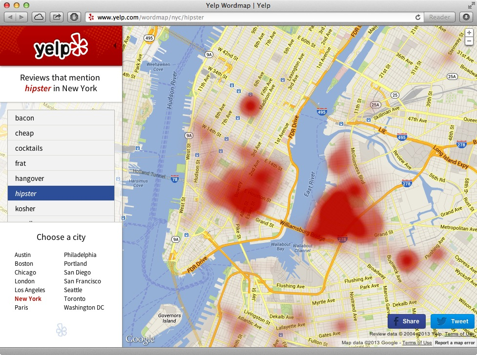
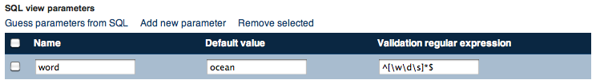
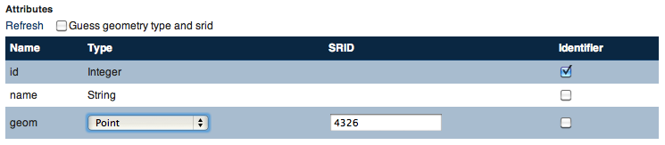
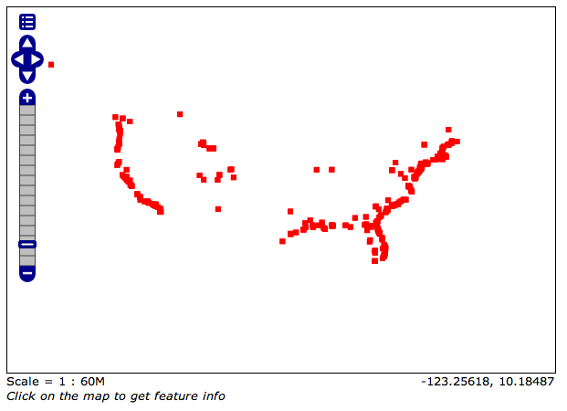
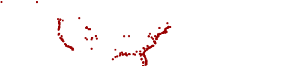
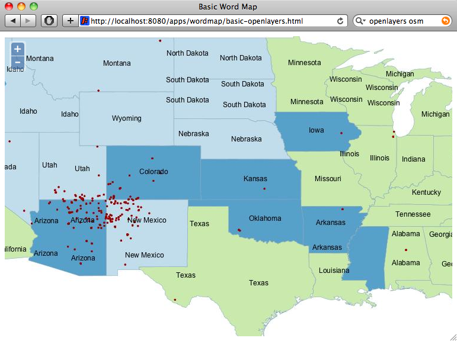
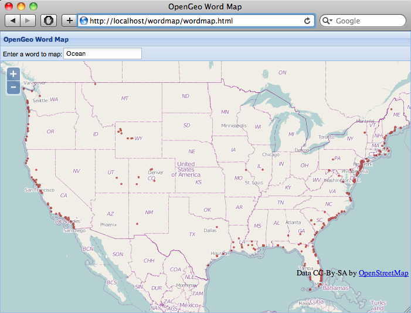
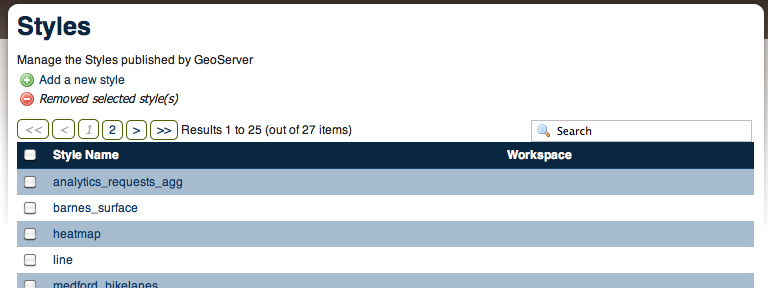
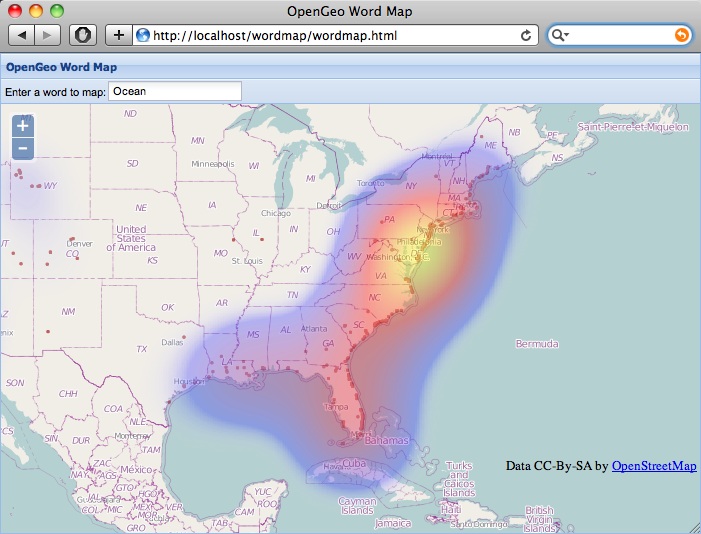

.. note::

  Check out the `full demonstration application <_static/wordmap-full.html>`_ and play!

Introduction
------------

In June of 2013, `blogs and news feeds <http://news.ca.msn.com/top-stories/yelps-word-map-means-never-having-to-dine-with-hipsters-again>`_ were clogged by viral stories about Yelp's "`word maps <http://www.yelp.com/wordmap/nyc/hipster>`_", attractive heat maps that combined word mining of yelp reviews with a heat map presentation to identify concentrations of "similar" restaurants or businesses. Words like "hipster" and "tourist" figured prominently.

The word-driven heat map is a cool idea, and could be applied to all kinds of textual databases. The main requirement is that word occurrences obey some kind of clumping, so that the heat maps shows a discernible pattern.

For this adventure in map building, we'll build our own version of the Yelp word map, using the following tools, which if you are following along you will want to install now:

* OpenGeo Suite (available for Linux, Mac OSX and Windows, follow the `Suite installation instructions`_)

The basic structure of the application will be

* A spatial table in PostGIS, with a full-text index on the fields we want to search for words
* A SQL view in GeoServer, exposing a parameterized full-text query
* A simple pane-based application in GeoExt allowing words to be entered and maps explored
* A rendering transformation in GeoServer, turning the points from the SQL query into a heatmap visualization

The application flow will:

* Receive a word from the GeoExt web interface, which will
* Pass it to GeoServer via a WMS URL parameter, which will
* Pass it to PostgreSQL as a SQL parameter, which will
* Run a full-text search to find a set of points whose names contain the word, which will
* Be rendered by GeoServer into a heat map visualization, which will
* Be displayed in a map window in the web interface by GeoExt. 

This application exercises all the tiers of the OpenGeo Suite!

Find the Data
-------------

The hardest part of this project, in some ways, was finding an interesting corpus of text data to feed into the map. I wracked my brain for possibilities, but in the end settled on using geographical names, for ease of access. All the other possibilities involved too much complicated pre-processing before map-making could begin.

.. note::

  Other possibilities included 

  * Street names. Would have involved processing 50 states worth of `TIGER DATA <http://www.census.gov/geo/maps-data/data/tiger.html>`_.
  * Craigslist entries. Would have involved complicated scraping and geocoding.
  * Tweets. Would have involved access to the Twitter stream.
  * Restaurant inspections. Open data records included very little free-form text.

The `geonames.org <http://geonames.org>`_ site provides direct downloads of data, so I downloaded the data for the USA.

* http://download.geonames.org/export/dump/US.zip

Looking inside the zip file, the data are in a tab-separated text tile, `US.txt`. There is also a `readme.txt` data dictionary file that describes the columns in the data file. A typical record looks like this:

::

  4045413 Temnac Bay      Temnac Bay              52.81028        173.04472       H       BAY     US              AK      016                     0               -9999   America/Adak    2010-01-30

And the data dictionary file gives the column definitions. The columns we are going to extract are **bold**:

* **geonameid, integer id of record in geonames database**
* **name, name of geographical point (utf8) varchar(200)**
* asciiname, name of geographical point in plain ascii characters, varchar(200)
* alternatenames, comma separated varchar(5000)
* **latitude, latitude in decimal degrees (wgs84)**
* **longitude, longitude in decimal degrees (wgs84)**
* feature class, see http://www.geonames.org/export/codes.html, char(1)
* **feature code, see http://www.geonames.org/export/codes.html, varchar(10)**
* country code, ISO-3166 2-letter country code, 2 characters
* cc2, alternate country codes, comma separated, ISO-3166 2-letter country code
* **admin1 code, fipscode (subject to change to iso code)**
* admin2 code, code for the second administrative division, a county in the US, see file admin2Codes.txt; varchar(80) 
* admin3 code, code for third level administrative division, varchar(20)
* admin4 code, code for fourth level administrative division, varchar(20)
* population, bigint (8 byte int) 
* elevation, in meters, integer
* dem, digital elevation model, srtm3 or gtopo30, average elevation of 3''x3'' (ca 90mx90m) or 30''x30'' (ca 900mx900m) area in meters, integer
* timezone, the timezone id (see file timeZone.txt) varchar(40)
* modification date, date of last modification in yyyy-MM-dd format

Load the Data
-------------

.. note::

  The next steps will involve some SQL to read and create new tables.

  * If you haven't already installed the OpenGeo Suite, follow the `Suite installation instructions`_.
  * `Create a spatial database`_ named `wordmap` to load data into.
  * `Connect to the database`_ with PgAdmin or psql to run SQL.

We can directly load the GeoNames text file, using the PostgreSQL `COPY command <http://www.postgresql.org/docs/current/static/sql-copy.html>`_, which supports reading table data directly from delimited text files. 

To receive the data, we need a table that has the same number of columns as the file.

.. code-block:: sql

  CREATE TABLE geonames_load (
    geonameid INTEGER PRIMARY KEY,
    name VARCHAR(200),
    asciiname VARCHAR(200),
    alternatenames VARCHAR,
    latitude FLOAT8,
    longitude FLOAT8,
    feature_class char(1),
    feature_code VARCHAR(10),
    country_code VARCHAR(2),
    cc2 VARCHAR(60),
    admin1 VARCHAR(20),
    admin2 VARCHAR(80), 
    admin3 VARCHAR(20),
    admin4 VARCHAR(20),
    population INTEGER,
    elevation INTEGER,
    dem INTEGER,
    timezone VARCHAR(40),
    modification VARCHAR(18)
  );

Once we have a blank table, we can load the file. In order to read the file, it must be in a location that is accessible by the database. I usually use the `/tmp` directory in UNIX or OSX and the `C:\\Temp` directory on Windows.

.. code-block:: sql

  COPY geonames_load FROM '/tmp/US.txt' WITH (
    FORMAT csv,
    DELIMITER E'\t',
    QUOTE '*',
    HEADER false,
    ENCODING 'UTF8'
  );

The "csv" format actually supports any separator, not just commas, and we declare our delimiter to be the tab character. As described in the `readme.txt` the GeoNames file has no header row, and the text encoding (important for handling special characters like accents and international characters) is UTF8.

Once the table is loaded, we can check out how many rows it has, then strip out just the columns we care about (the names and geometry) into a working table:

.. code-block:: sql

  -- There's over 2M records!
  SELECT Count(*) FROM geonames_load;

  -- Strip out columns we want, and create a point geometry.
  CREATE TABLE geonames AS
  SELECT 
    geonameid AS id,
    name AS name,
    admin1 AS state,
    feature_code AS kind,
    ST_SetSRID(ST_MakePoint(longitude, latitude), 4326)::Geometry(Point,4326) AS geom
  FROM geonames_load;

Finally, we can add a spatial index for faster map rendering, and declare the primary key. This will speed up viewing when we are looking at a zoomed in view of the data.

.. code-block:: sql

  ALTER TABLE geonames ADD PRIMARY KEY (id);
  CREATE INDEX geonames_gix ON geonames USING GIST (geom);

Setup Full-text Search
----------------------

In order to make an efficient word map, we need to quickly find records that have the words we're interested in. Fortunately, PostgreSQL provides a `full-text search`_ facility for fast and effective searching of text fields. Full-text search provides for automatically matching different-but-similar words (like 'tree' and 'trees') and for finding particular words in large text blocks.

Our data is not particularly word-heavy (most place names in our database consist of only two words, only a few have three or more) but full-text searching will still be more efficient than simple pattern matching, because it can make use of the full-text index.

Full-text searching makes use of specialized PostgreSQL types: `tsvector` and `tsquery`. 

* A `tsvector <http://www.postgresql.org/docs/current/static/datatype-textsearch.html>`_ is a parsing and generalization of a text string into a numerical analogue, applying specific rules for `stemming <http://en.wikipedia.org/wiki/Stemming>`_ to standardize tenses and plurals. You can see the effect of converting text to a `tsvector` by running the `to_tsvector()` function on a sentence, specifying the language of the sentence::
 
     SELECT to_tsvector('english', 'Those oaks age, but this oak is aged.');
        
          to_tsvector      
     ----------------------
      'oak':1,6 'plural':4
     (1 row)
  
  Note that the duplicate cases of the noun "oak" (singular and plural forms) have been merged, as have the verb tenses (present and past) of "bait". Full text search understands and searches words within the context of language.
   
* A `tsquery <http://www.postgresql.org/docs/current/static/datatype-textsearch.html>`_ is a type the describes both the words to be searched for, and the logic to be applied in returning the results.

Fast full-text search depends on an index build on the `tsvector` representation of one (or many) text fields. We can see the effect of the index by running a test query before and after building it.

.. code-block:: sql

  -- Watch the timing of this query
  SELECT Count(*) FROM geonames WHERE to_tsvector('english', name) @@ to_tsquery('english', 'oak');
  
  -- Build the full-text index
  CREATE INDEX geonames_fulltext_idx ON geonames USING GIN (to_tsvector('english', name));

  -- Again, watch the timing of this query
  SELECT Count(*) FROM geonames WHERE to_tsvector('english', name) @@ to_tsquery('english', 'oak');

Try different search words to get a feel for the frequency of different words in the geographic names database. 

Planning ahead, when our application sends back text from the web interface, the text may contain spaces. The `to_tsquery()` function does not like spaces, it expects each word in the query string to be separated by "&" for "logical and" or by "|" for "logical or". 

We could process the word at the client tier to have the right tokens in it, but then we'd be mixing PostgreSQL text search logic with our client logic. Instead, we'll make sure the incoming word is ready for text search by wrapping the input in a couple PostgreSQL functions.

First, to strip out any leading or training space, we'll use the `trim()` function.

.. code-block:: sql

  -- Example of space trimming
  SELECT trim('   New York ');
  
Next, we'll treat all text-with-spaces as queries that look for all the components. So we want to replace intra-word spaces with the "&" and symbol.

.. code-block:: sql

  -- Example of trimming and turning spaces into &s
  SELECT regexp_replace(trim('  New  York '), E'\\s+', '&', 'g');
  
Finally, we can put the result into a `to_tsquery()` call to run the actual query.

.. code-block:: sql

  -- Again, watch the timing of this query
  SELECT Count(*) 
  FROM geonames 
  WHERE 
   to_tsvector('english', name) @@ 
   to_tsquery('english', regexp_replace(trim('   New York '), E'\\s+', '&', 'g'));

Now, imagine that "New York" could be replaced by any word you want, and that the results could be put on a map in real time! That's what we're going to configure next.

Configure a SQL View of the Names
---------------------------------

Now we will hook up the GeoServer rendering engine to our database table.

First, we need a datastore that connects GeoServer to our `wordmap` PostgreSQL database. 

* `Log in to GeoServer <http://suite.opengeo.org/opengeo-docs/geoserver/webadmin/basics.html#welcome-page>`_
* `Add a new PostGIS store <http://suite.opengeo.org/opengeo-docs/geoserver/webadmin/data/stores.html#adding-a-store>`_, specifying the `wordmap` database as the database to connect to 
 
  .. image:: ./img/data_source_new.png
 
* Add a new SQL View layer (see below)

Define the SQL View
~~~~~~~~~~~~~~~~~~~

SQL view layers are an option in the "Add Layer" dialogue:

.. image:: ./img/newsqllayer1.png
   :width: 95%

Set the name of the layer to `geonames`, and the SQL definition to the following:

.. code-block:: sql

  SELECT id, name, geom
  FROM geonames
  WHERE 
   to_tsvector('english', name) @@ 
   to_tsquery('english', regexp_replace(trim('%word%'), E'\\s+', '&', 'g'))

This is basically the same query as our test query in the previous section. It quickly finds all the records where the name contains a particular word. In this case, instead of searching for a particular word, we put in `%word%` as a parameter. This allows us to feed any word we like into the query via GeoServer's URL parameters interface.

Once you have entered the SQL query, go down to the "SQL view parameters section" and click "Guess parameters from SQL". 

* The "word" parameter should be guessed and filled into the parameter list.
* Set the default value to "ocean".
* Set the "validation regular expression" to "^[\w\d\s]*$"
  * This expression only allows letters, numbers and spaces, including empty (zero length) values.

Now go down further to the "Attributes" section and click "Refresh". The "id", "name" and "geom" columns should be inferred from the SQL. 

* **Check** the "id" entry as the unique identifier.
* Set the "Type" of the "geom" entry to **Point**.
* Set the "SRID" of the "geom" entry to **4326**.

   
Now "Save" the SQL view.

Configure the Layer
~~~~~~~~~~~~~~~~~~~

Saving the SQL view takes you directly to the layer configuration page, with four tabs. Mostly the defaults are fine, but:

* On the "Data" tab:
  * Declared SRS, set to **EPSG:4326**
  * Native bounding box, **click on "Compute from data"**
  * Lat/Lon bounding box, **click on "Compute from native bounds"**
* On the "Tile Caching" tab:
  * Tile Caching, uncheck "Create cached layer for this layer"
  * Click "Save"

We now have a viewable layer! 

* Go to the "Layer Preview" page 
* In the entry for "geonames" click the "Go" link
 
Back when we configured the SQL view, we set the default value for our query to "ocean", so now we get a map of all the names with "ocean" in them. Not surprisingly, then tend to be coastal!

Test Parameterization
~~~~~~~~~~~~~~~~~~~~~

You can get a feel for how URL modification is going to drive this application by playing with URLs directly. If you've set up the application on your local machine, this URL should give you a picture of the default map of "ocean".

* http://suite.opengeo.org/geoserver/wms/reflect?layers=opengeo:geonames

 
.. note::

  We are using the "`WMS reflector <http://docs.geoserver.org/stable/en/user/tutorials/wmsreflector.html>`_" feature of GeoServer, that allows us to enter incomplete WMS URLs and have GeoServer fill in the other required parameters using sensible defaults. This keeps the URLs short and readable for inspection.
  
We can alter what points are mapped by changing the "word" parameter we defined earlier, using the `viewparams URL parameter <http://docs.geoserver.org/stable/en/user/data/database/sqlview.html#using-a-parametric-sql-view>`_ to pass in a new value.

* http://suite.opengeo.org/geoserver/wms/reflect?layers=opengeo:geonames&viewparams=word:navajo

The pattern of dots changes! 

It's hard to interpret the dots without a base map, and the image is kind of small, so our next step is to add a web interface to explore this dynamic layer.

Build a Simple Web Map
----------------------

You will need to build the web application somewhere that is accessible by a web browser.

.. note:: 

  The OpenGeo Suite ships with an `/apps` directory, especially for deploying your spatial apps. It has the advantage of running under the same web container as GeoServer itself, allowing applications to easily perform vector read/write operations. The `/apps` directory is in different places for different operating systems:
  
  * **OSX** in `/opt/opengeo/suite/webapps/apps`. You may need to `sudo mkdir wordmap` to get a working directory, then `sudo chown wordmap username` to take ownership of it. Then you can access your application files at http://localhost:8080/apps/wordmap
  * **Windows** in `C:\\Program Files\\OpenGeo\\OpenGeo Suite\\webapps\\apps`. Make a `wordmap` sub-directory. Then you can access your application files at http://localhost:8080/apps/wordmap
  * **Linux** in **TBD**

The simplest web map we can make just uses a bare `OpenLayers`_ map window showing a base map and our WMS map.

You will need two files, `basic-openlayers.html <_static/basic-openlayers.html>`_ and `basic-openlayers.js <_static/basic-openlayers.js>`_. In the HTML document place the following:

.. code-block:: html

  <html>
    <head>
      <title>Basic Word Map</title>
      
      
    </head>
    <body onLoad="initMap()">
    

    </body>
  </html>

The HTML document just references the OpenLayers javascript library, our javascript application file, and sets up a named "map" `
` for the OpenLayers map to bind to. In the JavaScript document, place the following.

.. code-block:: javascript

  function initMap() {
  
    // Create the map
    var map = new OpenLayers.Map("map");
    
    // Create a WMS layer, with a base layer (states) and names layer (geonames)
    var wms = new OpenLayers.Layer.WMS("GeoServer WMS", 
      "http://localhost:8080/geoserver/wms", 
      {
        layers: "usa:states,opengeo:geonames"
      });
      
    // Set the word parameter for the geonames layer
    var myWord = "Navajo";
    wms.mergeNewParams({viewparams: "word:" + myWord});
    
    // Add the layer to the map and center the map on the USA
    map.addLayer(wms);
    map.setCenter(new OpenLayers.LonLat(-100, 38), 5);

  }

The JavaScript document uses the "states" base layer from GeoServer to provide context to the "geonames" layer we are rendering. Note that we merge the "viewparams" onto the WMS URL to allow us to dynamically change what we're mapping.

   
Try changing the value of the `myWord` variable and reloading the page, to see different words being mapped.

This is pretty fun, but it would be **even better** if we could type in a word and immediately see the map change, without re-loading. We also want a heat-map rendering of the results, not just a point map!

Build a Web Application
-----------------------

To build our final application, we'll use the `ExtJS`_ framework, with the `GeoExt`_ add-on library for mapping. We won't be exercising `GeoExt`_ very hard, but using it makes it easier to make more complicated applications later on.

As with the `OpenLayers`_ example, the `ExtJS`_ HTML page is very very simple, just a holding place for library references. Since our application will be full-screen we aren't even putting anything in the document body.

.. code-block:: html

  <html>
    <head>
      <title>OpenGeo Word Map</title>

      <!-- ExtJS Scripts and Styles -->
      
      
      <link rel="stylesheet" type="text/css" href="http://cdn.sencha.com/ext/gpl/3.4.1.1/resources/css/ext-all.css" />
      <link rel="stylesheet" type="text/css" href="http://cdn.sencha.com/ext/gpl/3.4.1.1/examples/shared/examples.css" />

      <!-- OpenLayers Script -->
      

      <!-- GeoExt Script -->
      

      <!-- Our Application -->
      

    </head>
    <body>
    </body>
  </html>
  
There are a lot more libraries though!

* ExtJS libraries and style sheets
* OpenLayers library
* GeoExt library
* Our actual application script, `wordmap-simple.js <_static/wordmap-simple.js>`_

Let's go through `wordmap-simple.js <_static/wordmap-simple.js>`_ one section at a time:

.. code-block:: javascript

  // Use this word on startup
  var startWord = "Ocean";

  // Base map
  var osmLayer = new OpenLayers.Layer.OSM();

  // Point map
  var wmsLayer = new OpenLayers.Layer.WMS("WMS", "http://localhost:8080/geoserver/wms", {
    format: "image/png",
    transparent: true,
    layers: "opengeo:geonames",
    styles: "point"
  }, {
    opacity: 0.6,
    singleTile: true,
  });

  // Start with map of startWord
  wmsLayer.mergeNewParams({viewparams: "word:"+startWord});
  
As with our simple example, we start off defining our layers: an `OpenStreetMap`_ base map; and our WMS point layer. We have some extra options on the `OpenLayers WMS layer`_ this time, setting it to have a transparent background, and an overall partial opacity, so it will overlay the base map nicely.

We also define a **startWord** variable, which is the word our application will start up mapping, and add that word to the **viewparams** URL parameter.

Now things get a little more complicated:

.. code-block:: javascript
   :emphasize-lines: 3-5

   // Map with projection into (required when mixing base map with WMS)
   olMap = new OpenLayers.Map({
     projection: "EPSG:900913",
     center: [-10764594.0, 4523072.0],
     units: "m",
     layers: [wmsLayer, osmLayer],
     zoom: 4
   });

Because we are mixing a WMS map and a tiled mercator base map, we need to:

* ensure that the `OpenLayers Map`_ declares the **projection** it is using, which is web mercator to match the base map; and,
* ensure that the center point is converted to mercator before being used to center the map (hence the funny-looking coordinates for the center of the USA).

Now that the map is set up, we just need to assemble the `ExtJS`_ components into a application:

.. code-block:: javascript

  // Text field component. On 'enter' update the WMS URL
  var textField = new Ext.form.TextField({
    value: startWord,
    listeners: {
      specialkey: function(fld, e) {
        // Only update the map when the user hits 'enter' 
        if (e.getKey() == e.ENTER) {
          wmsLayer.mergeNewParams({viewparams: "word:"+fld.getValue()});
        }
      }
    }
  });

For entering new words to map, a text field. When the user hits return, we catch the event and update the WMS URL.

.. code-block:: javascript

	// Map panel, with text field embedded in top toolbar
	var mapPanel = new GeoExt.MapPanel({
	  title: "OpenGeo Geonames Heat Map",
	  tbar: ["Enter a word to map:", textField],
	  map: olMap
	});

To hold the map ("olMap"), a `GeoExt`_ map panel with the text field embedded into the toolbar ("tbar") at the top.

.. code-block:: javascript

	// Viewport wraps map panel in full-screen handler
	var viewPort = new Ext.Viewport({
	  layout: "fit",
	  items: [mapPanel]
	});

	// Start the app!
	Ext.onReady(function () {
	  viewPort.show();
	});

Finally, to produce a full-screen application, an `Ext.Viewport` component, holding the map panel. And to start the application, an `Ext.onReady()` function is always required. 

.. note::

  It is a common pattern to see ExtJS applications with the entire framework embedded within the `Ext.onReady()` call. This completely isolates the code from other objects and can help with reliability.

Here's the whole application in one code block:

.. code-block:: javascript

	// Use this word on startup
	var startWord = "ocean";

	// Base map
	var osmLayer = new OpenLayers.Layer.OSM();

	// Heat map + point map
	var wmsLayer = new OpenLayers.Layer.WMS("WMS", 
	  // Uncomment below to use your local server
	  // "http://localhost:8080/geoserver/wms", 
	  "http://suite.opengeo.org/geoserver/wms", 
	  {
	    format: "image/png8",
	    transparent: true,
	    layers: "opengeo:geonames,opengeo:geonames",
	    styles: "point,heatmap"
	  }, {
	    opacity: 0.6,
	    singleTile: true,
	  });

	// Start with map of startWord
	wmsLayer.mergeNewParams({viewparams: "word:"+startWord});

	// Map with projection into (required when mixing base map with WMS)
	olMap = new OpenLayers.Map({
	  projection: "EPSG:900913",
	  units: "m",
	  layers: [wmsLayer, osmLayer],
	  center: [-10764594.0, 4523072.0],
	  zoom: 4
	});

	// Take in user input, fire an event when complete
	var textField = new Ext.form.TextField({
	  value: startWord,
	  listeners: {
	    specialkey: function(field, e) {
	      // Only update the word map when user hits 'enter' 
	      if (e.getKey() == e.ENTER) {
	        wmsLayer.mergeNewParams({viewparams: "word:"+field.getValue()});
	      }
	    }
	  }
	});

	// Map panel, with text field embedded in top toolbar
	var mapPanel = new GeoExt.MapPanel({
	  title: "OpenGeo Geonames Heat Map",
	  tbar: ["Enter a word to map:", textField],
	  map: olMap
	});

	// Viewport wraps map panel in full-screen handler
	var viewPort = new Ext.Viewport({
	  layout: "fit",
	  items: [mapPanel]
	});

	// Start the app!
	Ext.onReady(function () {
	  viewPort.show();
	});

And what the `final result <_static/wordmap-simple.html>`_ looks like:

Add the Heat Map
----------------

So, a very pretty application, but we were promised a heat map, and so far, this is only a dot map!

Amazingly, adding a heat map is the simplest part of the whole exercise, because the OpenGeo Suite ships with a `heatmap` style already defined and ready to take input from any point source.

You can see the `heatmap` style in the GeoServer Styles panel.

To enable the heat map in our application, we just need to specify that style in our WMS URL. So make a change to the OpenLayers WMS layer in the application:

.. code-block:: javascript
  :emphasize-lines: 5,6

  // Heat map + point map
  var wmsLayer = new OpenLayers.Layer.WMS("WMS", "http://localhost:8080/geoserver/wms", {
    format: "image/png",
    transparent: true,
    layers: "opengeo:geonames,opengeo:geonames",
    styles: "point,heatmap"
  }, {
    opacity: 0.6,
    singleTile: true,
  });

Note that rather than **replacing** our point style, we are **adding** a heatmap style on top by referencing the same layer (opengeo:geonames) a second time and specifying the heatmap style for it. 

This allows us to see the original intput points as well as the heat map surface coloring.

   
Now that we have our GeoNames map, explore the naming of the USA! Here's some interesting examples:

* Resources

  * **Coal**, in the West and East
  * **Gold**, on the Pacific
   
* Species

  * **Cougar**, in the North-west only
  * **Cactus**, in the deserts
  
* Naming

  * **Canyon**, derived from the Spanish "Cañon", only appears in the West.
  * **Peak**, where there are mountains!
  * **Mississippi**, in the state, but also along the river.

* Civil War

  * Abraham **Lincoln**, from Illinois, was revered in the North and reviled in the South. See the pattern of naming?
  * Nathan Bedford **Forrest** was a Southern cavalry hero from Memphis Tennessee.
  * Robert E. **Lee**, the hero of the South, certainly has more things named for him in the South.
  * William Tecumseh **Sherman** was a Northern General who burned much of Georgia and South Carolina during his `March to the Sea <https://en.wikipedia.org/wiki/Sherman's_March_to_the_Sea>`_.

* Native Americans

  * **Navajo**, in the west
  * **Pawnee**, in Nebraska
  * **Cherokee**, originally in Tennessee then `forcibly relocated to Oklahoma <http://en.wikipedia.org/wiki/Trail_of_Tears>`_.

  
Conclusion
----------

With very little code, using existing features of the OpenGeo Suite, we've:

* Loaded over 2M geographic names records
* Published an interactive point and heat map of those records
* Created a web interface for exploring the point and heat map

The same techniques can be used to geographically explore **any point database**. Full-text filtering can be used to explore a database of documents, and simple attribute filtering can be used to explore other fields. For example:

* Visualize a species occurrence database by species and/or season observed
* Visualize a customer transaction database by purchases
* Visualize a GPS tracking database by incidents of speeding (recorded speed > legal speed)

The possibilities are endless!

.. _OpenLayers WMS Layer: http://dev.openlayers.org/docs/files/OpenLayers/Layer/WMS-js.html
.. _OpenLayers Map: http://dev.openlayers.org/docs/files/OpenLayers/Map-js.html
.. _OpenStreetMap: http://openstreetmap.org
.. _GeoExt: http://www.geoext.org/
.. _ExtJS: http://www.sencha.com/products/extjs
.. _ActivePerl: http://www.activestate.com/activeperl
.. _Suite installation instructions: http://suite.opengeo.org/opengeo-docs/installation/index.html
.. _Create a spatial database: http://suite.opengeo.org/opengeo-docs/dataadmin/pgGettingStarted/createdb.html
.. _Connect to the database: http://suite.opengeo.org/opengeo-docs/dataadmin/pgGettingStarted/pgadmin.html
.. _full-text search: http://www.postgresql.org/docs/9.2/static/textsearch-tables.html
.. _OpenLayers: http://openlayers.org
