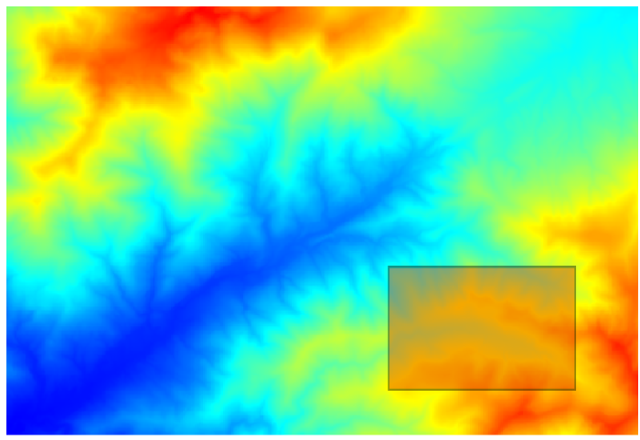
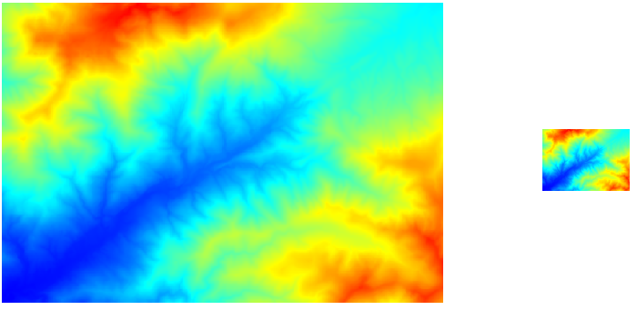
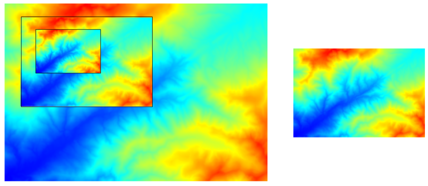

Optimizing raster data in GeoServer
=====================================

---

Goals
-----

- Increase GeoServer performance

---

Contents
---------

- Modifiying data itself
- Adjusting everything between data and GeoServer
- We will not cover further adjustments, such as styling

---

Key ideas
----------

- Minimizing data access
- Minimizing processing
- Doing in advance as much as much calculations as possible, so they don't have to be done on real-time
- Fine tuning Geoserver
- Fine tuning any other software involved

---

What are we going to see
------------------------

- Strategies for preparing data (theory) 
- Tools and examples of preparting data (practice)
- GeoServer elements to get the best out of your data
- Geoserver configuration tips

---

You already know about this!
----------------------------

- *Geoserver in production* workshop
- This workshop has a more practical approach
- This is mainly based on data, not just on GeoServer itself
- You are going to actually see how it is done

---

Preparing data
===============

---

Preparing data
----------------

- Ensure small size and fast access
- Avoid costly operations later
- Not exclusive of GeoServer

---

Problems affecting performance
---------------------------------

- Area to render smaller than image implies reading unneeded data
- Render detail lower than image resolution implies reading unneeded data
- Slow data access (too much data or too expensive to read it or to prepare it)

---

---

---

Preparing data (factors)
--------------------------

- File format and properties
- File size
- Structure/Layout
- Number of Bands/Interleaving
- CRS

- They should be combined.

---

Formats
--------

- Binary vs text-based
- Compression
- Inner tiling
- Overviews
- Color representation

---

Formats
--------

- ASC
- TIFF
- PNG
- JPEG
- JPEG2000
- Proprietary formats (MrSid, ECW)

---

Compression
--------------

- No compression
- Lossy
- Loseless
- Compression can make your files bigger!

---

Compression methods
----------------------

- JPEG 
	- lossy. 
	- visually lossless
- LZW
	- lossless
	- good for images with homogeneous areas
	- good for images with few colors	
	- recommmended for non-image data (temperature, elevation, etc.)
- Wavelets

---

Color representation
---------------------

- RGB: 3 color components stored for each pixel
- Palette: 1 index value stored for each pixel
- RGB implies larger data volume
- Paletted images imply less color detail(limited number of colors) but smaller data volume
- Depending on image characteristics
- Relation to compression method (spatial autocorrelation)

---

-----

The TIFF format
----------------

- A very versatile format
- Supports inner tiling
- Supports overviews
- Supports different compression methods
- GeoTiff
- BigTiff

---

Number of bands / interleaving
-------------------------------

- Clean unused band if multispectral
- Band interleaving generally better than pixel interleaving
	- RRRGGGBBB *vs* RGBRGBRGB

---

Strategies for data structuring
---------------------------------

- Single file
- Mosaic (tiles)
- Pyramid
- Dependent on data size and file format

---

---

---

Suggestions for data structuring
----------------------------------------------

- Assuming Tiff format in all cases
- Single (well prepared!) file for less than 4Gb
- Mosaic (with well prepared tiles!) if larger than 4Gb
- Pyramid (with well prepared mosaics!) for massive data.
- Testing.
- Balancing overhead of more complex structures

--- 

Single file
-----------

- File format/characteristics is crucial
- Optimizations for single files should be applied in all other cases as well
- "Un-tiling" is a good idea in some cases (don't abuse the advanced features)

---

Mosaic (tiles)
--------------

- Tile size (not too small)
- Tiles with inner tiling
- Tiles with overviews

---

Pyramid (overviews)
--------------------

- Number of levels (n = log2(width/tile_width))
- Resampling methods
- Each level is a mosaic

---

GDAL tools
-----------

- ``gdaltranslate`` (format conversion and reprojection)
- ``gdaladdo`` (adding overviews)
- ``gdal_retile`` (tiling)
- ``gdal_merge`` (merging, "un-tiling")
- ``rgb2pct`` (creation of paletted images)

---

``gdaltranslate``
-----------------

- Modifiers
	- ``-t_srs``. Reprojection
	- ``-co``: Format specific values (TIFF)
		- ``TILED=TRUE``
		- ``COMPRESS=JPEG/LZW``
		- ``BLOCKXSIZE``, ``BLOCKYSIZE``
	- ``-b``: Band to use

---

Data preparation demo
========================

---

Other tools
-----------

- QGIS as GDAL frontend
- Other QGIS tools

---

Other tools demo
=================

---

GeoServer elements
===================

---

ImageMosaic plugin
-------------------

- Automatically creates mosaic from result of ``gdal_retile``
- Tiles should be homogeneous
- Preinstalled with Suite
- If using already tiled data, but not from ``gdal_retile``, index file can be created manually.

---

ImagePyramid plugin
---------------------

- Based on ImageMosaic plugin
- Automatically creates pyramid for result of ``gdal_retile``
- Has to be manually installed
- If using already tiled data, but not from ``gdal_retile``, index files can be created manually.

---

Fine tuning GeoServer
======================

---

ImageMosaic plugin settings
-------------------------------

---

ImageMosaic plugin settings
-------------------------------

- From Geoserver UI
	- Mostly to set up how multithreading is used
- ``.properties`` file
	- ``Caching``
	- ``ExpandtoRGB``

---

ImagePyramid plugin settings
-----------------------------

- Based on ImageMosaic
- Similar settings and ideas

---

Coverage Access settings
---------------------------

- Used to optimize multithreaded access in mosaics
- Use 2 X #cores threads
- Threshold for WCS requests

---

JAI settings
----------------------

---

JAI settings
----------------------

- Use native JAI
- Use native ImageIO
- Enable native mosaic acceleration
- Enable Tile recycling if there are no memory problems
- Use 2 X #cores in Tile threads

---

Reprojection settings
---------------------

- ``-Dorg.geotools.referencing.resampleTolerance``
- Default value of 0.333
- Larger values mean better performance, but less precision
- Set accordingly with dataset characteristics and goals.
- Remember to select the right CRS.

