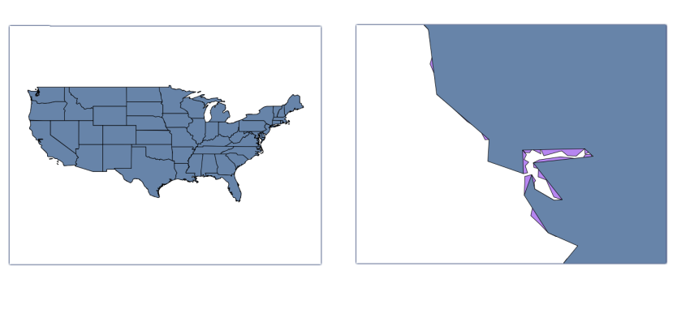

Optimizing vector data in GeoServer
=====================================

---

Goals
-----

- Increase GeoServer performance

---

Contents
---------

- Modifiying data itself
- Adjusting everything between data and GeoServer
- We will not cover further adjustments, such as styling

---

Key ideas
---------

- Minimizing data access
- Minimizing processing
- Doing in advance as much as much calculations as possible, so they don't have to be done on real-time
- Fine tuning Geoserver
- Fine tuning any other software involved
- Mainly (but not limited to) data used for rendering

---

What are we going to see
------------------------

- Strategies for preparing data (theory) 
- Tools and examples of preparing data (practice)
- GeoServer elements to get the best out of your data
- Database configuration tips
- Geoserver configuration tips

---

You already know about this!
----------------------------

- *Geoserver in production* workshop
- This workshop has a more practical approach
- This is mainly based on data, not just on GeoServer itself
- You are going to actually see how it is done

---

Preparing data
===============

---

Preparing data
----------------

- Ensure small size and fast access
- Avoid costly operations later
- Not exclusive of GeoServer

---

Problems affecting performance
---------------------------------

- Area to render smaller than image implies reading unneeded data
- Render detail lower than vector data precision resolution implies processing unneeded data (more than 1 point per pixel is useless)
- Slow data access (too much data or too expensive to read it or to prepare it)
- Filter overhead

---

---

---

Main ideas
--------------------------

- File vs Database
- File format and size
- Cleaning unneeded data
- Managing level of detail
- Splitting data
- Indexing (of both spatial and-non spatial components)
- Using the optimal CRS

---

Strategies
-----------

- Some strategies are similar to raster ones
	- Indexing / Tiling
	- Simplifying (generalization) / Pyramids
- Pre-querying
- Non-spatial indexing

---

Rendering optimizations
------------------------

- Rendering of vector data can be much more costly than rendering of raster data (more elaborated)
- Prepare data to minimize rendering computation of all kinds
- Use styling wisely to optimize data access

---

File formats
-------------

- Binary vs text-based
- Spatial indexing
- Reading vs reading/writing
- Data preparation needs external tools

---

Database
----------

- More optimized than files
- Spatial indexing
- Non-spatial indexing
- Preparation can be done with database functions

---

Cleaning unneeded data
-----------------------

- Are all attributes needed?
- Remove unused attributes

---

Generalization
----------------------------

---

Generalization
----------------------------

---

Simplifying (Generalization)
----------------------------

- Not all points are used at all scales
- Geometries can be simplified for visualization
- Level Of Detail
- Several geometries for each feature *vs* several layers
- Even changing geometry type
- Cleaning attributes differently at different scales

---

Indexing 
----------

---

Indexing 
----------

- Spatial and non-spatial
- Filter and refinement
- Increases performance of queries
- Spatial is supported in shapefiles

---

``ogr2ogr``
-----------

- Cleaning
- Splitting
- Reprojecting
- Simplifying

---

``ogr2ogr``
-----------

- Modifiers
	- ``-f``. Output format
	- ``-select``: Selection attributes
	- ``-sql``: SQL query
	- ``-t_srs``: Reprojection

---

``ogr2ogr`` demo
=================

---

GeoTools pregeneralized plugin
-------------------------------

- Tools for pregeneralizing shapefiles
- Plugin for using pregeneralized geometries in GeoServer
- Can be used with databases as well

---

Geotools pregeneralizing tool demo
===================================

---

PostGIS
--------

- ST_Simplify
- CREATE INDEX
- VACCUM ANALYZE
- CLUSTER
- Be careful with SQL views (use materialized views if needed)

---

PostGIS demo
=============

---

Fine tuning Geoserver and PostGIS
==================================

---

Fine tuning a shapefile datastore
----------------------------------

- Let GeoServer create and handle spatial indexing
- Enable *Use memory mapped buffers* and *Cache and reuse memory maps*  if running Linux (but not in Windows!)

---

PostGIS
--------

- Fine tuning Postgre.
- Default settings are conservative
- Increase sort heap (``sort_mem``)
- Increase number of connection if needed (``max_connections``)
- ``work_mem`` (related to ``max_connections``)
- ``effective_cache_size`` (1/2 - 3/4 memory)

---

Connection pooling
-------------------

- Eliminates overhead in stablishing new connection
- Available for all datastores backed up by a database
- Connection pool size
- Max number of connections
- Validate connection
- To be adjusted along with the database settings

