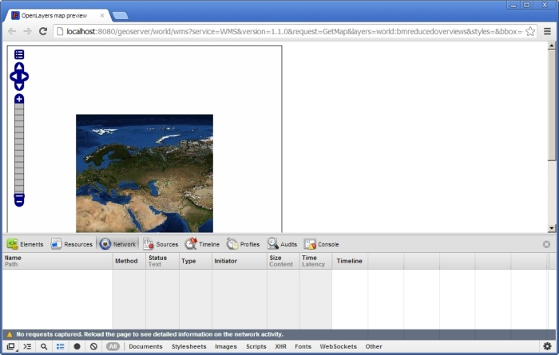
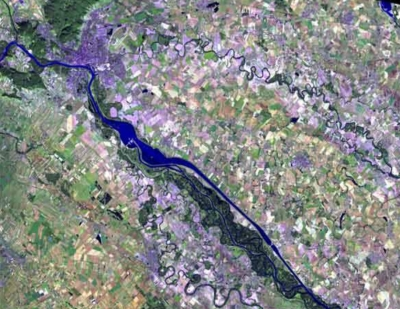
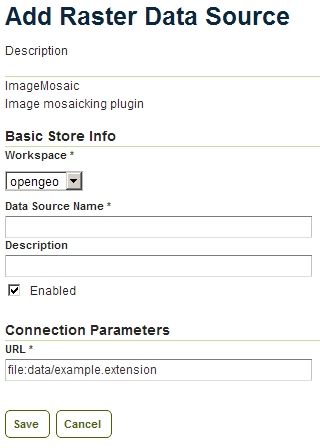
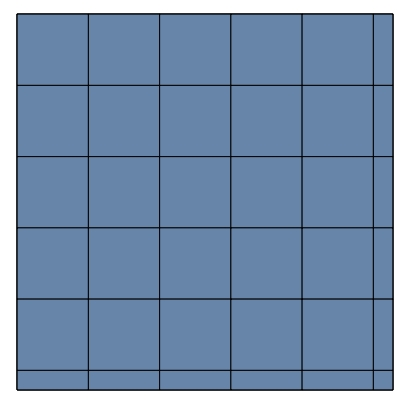
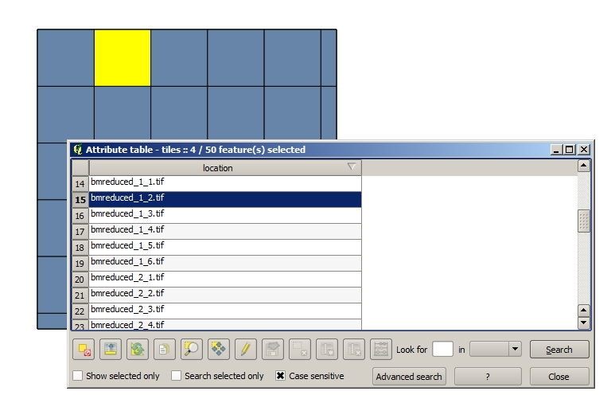

Optimizing working with raster layers in GeoServer 
====================================================

Outline 
--------

This workshop presents some of the techniques and tools that are needed to increase the performance of GeoServer when working with raster layers. Some of these techniques involve altering the data itself, while others consider how the data is structured and organized. Most of these optimizations will actually result in better raster performance when the data are used in any application. As well as these general optimizations, we describe GeoServer-specific settings, to improve performance in this case.

Introduction 
-------------

When serving raster layers with GeoServer, the performance of the system depends on many parameters. A large number of them are related to how our source data are stored, since this has a large influence on the time it takes GeoServer to read and prepare the data for display.

We can see it clearly in a simple example. Download `this zip file <http://link.to.file>`__ , which contains the same image in 4 different representations.

::

 	image1.png 
 	image2.jpg 
 	image3.tiff 
 	image4.tiff

As you can see, these are just 4 files in different formats, except for the last two ones, which are both TIFF files. We will use them to show how, although they contain the same image and might seem similar, they are different in terms of performance when used in GeoServer. Also, we will see that even using the same format, two images can give different performance depending on the adjustments used to create them.

First of all, let’s have a look at the sizes of those images.

::

	image1.png 136.052.194 
 	image2.jpg 12.480.346 
 	image3.tiff 34.896.016 
 	image4.tiff 52.921.428

PNG is clearly larger, while JPG is the smaller one. TIFF files have a similar size, closer to the size of the JPG. Without knowing how their performance will be, it seems that JPG is a good option in case we are short on storage. It might also seem that a smaller size should make the JPG format the faster one as well, but other factors apart from size are involved, and we will soon see that this is not necessarily true.

Let’s move to GeoServer now. The first thing we have to do is import the images in GeoServer. You can do this manually through the usual GeoServer interface. If you have ``curl`` installed, you can use the ``import_layers`` script that you will find in the zip file along with the image files, which imports them using Geoserver’s REST API. Just make sure GeoServer is running before executing the script.

Now is time to check how GeoServer performs when accessing these layers. We will be using Google Chrome's built-in tools to measure it (similar tools can be added to other browsers, feel free to use any other one if you prefer). Browse to your GeoServer Layer Preview page. In the row corresponding to the first image (``image1.png``), click on Go to see a preview of it in Open Layers. Once the page is loaded, press Ctrl - Shift - I (Command - Option - I if you are using Mac) to show the Chrome Developer Tools window. Select the Network tab.

You should see something like this:

As you start making requests, you will see in the lower part of the window, in the *Timeline* column, the time it has taken to respond them. Do some zooming and panning, and keep an eye on the times shown. The request times will be most of them rather large, and, due to the size of the image, it is not very smooth to pan and zoom.

Let’s change to another image, this time the JPG one. You should experience something similar. Times are a bit shorter, but still long enough to make it not very smooth to use the interface.

If you now open the first TIFF file (``image3.tiff``), it might take some time to render it the first time, when the full extent is shown, but if you zoom on it you will get much better response times. If you zoom to maximum resolution or even closer (so you can see the actual pixels), response is almost immediate and panning is smooth. That’s clearly a big difference with the previous 2 cases.

Let’s try to improve the performance at low resolution. Open the preview window of the last layer (``image4.tiff``). You will notice that it shows up faster than the other ones. If you zoom and pan now, you will see that the response is similar at all scales and there is not a difference between zoom levels in terms of performance.

This simple test demonstrates how using the right file format and the right configuration allows you to go from a bad performance system to a good performance one.

In the remainder of this workshop, we will see why this happens and how to create appropriate files and file structures for each case.

Briefly, there is a quick explanation to the results that you have just seen for those 4 test layers. In both the PNG and the JPG files, whenever some part of the image has to be rendered, the whole image has to be opened and read first, and that means a large overhead. The first TIFF image is internally divided, so when you zoom in, not all the layer data has to accessed. In both the JPG and PNG images, pixel values are written sequentially, starting from one corner of the image, and ending in the opposite one. On this first TIFF file it is structured in tiles, and the structure of that mosaic of tiles is kept as well, so there it is possible to access just the data corresponding to a smaller area within the image. Rendering the whole extent, however, still requires a full scan. The last TIFF has additional smaller images with lower resolution inside (hence its larger size), so when a full scan is needed, it is done at those resolutions instead of at the original one.

These techniques are the basis for our optimizations, and we will discuss them in this tutorial and see how to apply them with GeoServer, even when our data is not in a single file per the previous examples.

Working with raster tiles and pyramids 
----------------------------------------

When working with large raster layers, there are several optimization techniques. Some of them rely on a horizontal division, dividing the layer in smaller pieces, so only those pieces needed are accessed. The layer can be accessed partially, depending on the request. This is usually known as *tiling*.

.. image:: imgs/mosaic.png

Other techniques deal with the fact that, when used at a low scale, although the whole extent of the layer might be rendered, not all data in the layer needs to be read to create the final image to be rendered.

For instance, consider the first zoom level when you opened the layer preview. The original image has 10800 x 10800 pixels, but the image rendered in your screen is much smaller, since your display is not that big. Creating the image that you see on the screen from the original one is a time consuming process, and involves reading much more data that what is really needed, just to create a final version of the image with a coarser resolution.

A solution to this is to maintain several versions of a given layer, suitable for representation at different scales, as shown in the next figure. 

.. image:: imgs/pyramid.png

This constitutes a so-called pyramid.

By having these different versions, the amount of resampling needed is reduced, as a large amount of presampling has already been performed to calculate those versions. When an image at a given rendering scale is requested, the closest one to the scale is used, and the process is optimized.

You can see that the number of pixels in each image in the pyramid is 1/4 of the number of pixels in the image on the next level. That is, each dimension (width, height) of the image is halved, and the area previously occupied by 4 pixels is now occupied by just one. There is a progressive decrease in resolution, so all resolutions are covered and there is always an optimal one to select when responding to a given request.

Tiling and using pyramids can be applied simultaneously to improve the performance of GeoServer (and any other application using that same raster data, since this optimizations are not exclusive of GeoServer). When tiling and pyramids are applied, a raster dataset covering a given area is comprised of a set of smaller ones covering a smaller area, and several lower-resolution versions of those images exist as well, as represented in the image below.

.. image:: imgs/tilingandpyramid.png

Some file formats support internal pyramids (also called overviews) where a single file contains all the different presampled images, but others don’t support them. Also, some formats support inner tiling, while others do not, or they support it just for one pyramid level (in case they support inner pyramids). GeoServer can use image pyramids in which there are several versions of a same image and they are on different files, and in which tiling is used and each image is not just a single file but several ones. Such a file structure is much better in terms of performance, since a request covering a small part of the area covered by the image, at any scale, doesn’t imply reading the whole data available at that scale, but just the tiles overlapping the requested area.

In some cases, the tiling/pyramid capabilities of the file format are enough to have a good performance, but as we move into really large datasets, it is better to manually create a pyramid as a collection of files and folders, and let GeoServer handle that structure efficiently.

In this tutorial we will see how to use tiling and pyramids, both internal and external, so as to get the optimal configuration for our system and dataset.

Working with raster tiles and pyramids in GeoServer 
----------------------------------------------------

With the techniques outlined above, there are several possibilities for setting our GeoServer instance with a given dataset. These include.

- Having a single file, which might have inner tiles and/or overviews 
- Having a set of tiles 
- Having a pyramid

Choosing between the above configurations is mainly a matter of the size of our dataset, and the following rules can be used as general recommendations.

- If your data is smaller than 1 or 2 GB, is generally recommended to keep it in a single file, provided that it is optimized and contains proper tiles and overviews. If data is in a format that does not support that, then a mosaic of tiles should be created. However, a better option is to translate the data into a different format supporting them. 
- Data above 2 GB should be tiled in smaller files, with inner pyramids and tiles as well 
- If your data is really large, and specially if it is a dataset that is going to be used at all scales, using a external pyramid should be the selected option.

Some notes on pyramids and tiles. 
-----------------------------------

Let’s have a quick review of some ideas and concepts before we see how to setup our data, create tiles and pyramids if needed, and configuring all of them in GeoServer. Since the pyramid case is the most complex one, we will assume we are creating a pyramid. Concepts needed to understand the process include all those needed to understand the other possibilities outlined above.

Starting from a single image, creating a pyramid involves considering several factors that might affect how it serves its final goal, that is, giving better access to the different parts of the source image, at all scales.

Consider a large image to serve. We want to create an efficient pyramid to serve it with maximum performance. That involves 2 steps: tiling the image and creating the different levels of the pyramid. Here are the parameters that define the final pyramid, each of them explained:

Tile size 
^^^^^^^^^^

Tiling optimizes the amount of data that has to be read for a given area. In our original image, and at its original resolution, the whole image has to be read even if we are going to render just a small area in one of its corners. By creating tiles and storing them in separate files, just those tiles that cover the area of interest are needed.

All tiles in a pyramid (not just at the original resolution, but at everyone) have the same size, and that size has to be chosen before creating the pyramid. A small size will reduce the amount of necessary data to read for covering a given area, but if it is too small it might degrade performance. The application using the pyramid (in our case, GeoServer), has to keep an index of all available tiles, so as to know which ones are needed for a given request. More tiles means a larger database, and also a larger number of files (one for each tile), which is likely to have a negative impact on the system performance.

On the other hand, if tiles are too big, the advantage of tiling itself is lost. Tiles with a size of around 0.5-1GB are a good solution, since they are still manageable but keep the number of total tiles reduced.

As it was already mentioned, creating a tiled scheme comprised of several files does not make the use of inner tiles unnecessary. Inner tiling allows for creating larger tile files, which eventually will increase performance.

Number of levels in the pyramid 
^^^^^^^^^^^^^^^^^^^^^^^^^^^^^^^^

The base level of the pyramid will have the number of tiles defined by the tile size. Let's suppose our image has a size of 8192 x 8192 pixels If we take a tile size of 1024 x 1024 pixels, we will have 64 (8 x 8) tiles. At the top of the pyramid we will have a single tile, covering the whole extent. In between, and considering that the number of pixels (and thus, the number of tiles) multiplies by 4 in each level, we can have a level with 4 tiles (2 x 2) and another one with 16 (4 x 4) tiles. Overall, we need 4 levels to go to from the maximum resolution defined by the original image, to the top of the pyramid with a single tile.

The number of levels depends on the tile size, and the following one is the general formula to calculate the number of levels needed to complete the full pyramid.

.. math:: n = \log_2(\frac{width}{tile\_width})

We assume here that the image is square, so it has the same value for its height and width. If that is not the case, the larger value should be taken. Tiles are also assumed to be square, as this is the most common setting.

Also, in the case above, the result is an integer number. If the result is not an integer number, the truncated value (the lower integer closest to that value) should be taken.

Although that would give us the whole pyramid, it might not be necessary to create it all, and we can save disk-space by restricting the number of levels to just those we need. You should take into account that in each level the scale of the corresponding layer is divided by two, so if our original image correspond to the level of detail of a 1:100000 scale, the single-tile level correspond to a 1:800000 scale. If however, we do not plan to render that layer at that scale (because we will use a different one for scales over 1:200000), the tiles corresponding to that scale will never be used. In that case, we would just need two levels in our pyramid.

File format 
^^^^^^^^^^^^^^

Tiles can be saved in many formats, including the original format of the image from which we are creating our pyramid. Choosing the right format can have a significant influence in the performance of our system, since it influences both the size of files to be created and the amount of processing needed to get the actual image data, which might be compressed.

Formats that do not support overviews should not be used with large images, as they will result in poor performance. JPEG and PNG do not support them, but TIFF does.

ECW and MrSID are good formats that support both tiling and overviews, but unfortunately they are not open formats. GeoServer supports them, provided that the user has a valid license for using them. However, creating files in these formats is not supported natively by the applications we will describe in this tutorial, due to license issues, so we will not discuss them in more detail.

From all the available formats, the TIFF one is among the best and most popular alternatives, so we will concentrate on it. The TIFF format is complex and can be used with different settings, which have influence on how appropriate TIFF files are for being used in the context of a raster pyramid.

The first parameter to consider for a TIFF file is the compression type. TIF files can be saved with no compression at all or using several compression algorithms both lossy and lossless. Using uncompressed data is generally not a good idea, and among the compression algorithms LZW and Deflate are commonly used as lossless ones, while JPEG is a popular lossy one.

Choosing one compression or another depends on several factors. In general, if your are going to use your data primarily for rendering, JPG is a good choice, as it is a lossy one but it can be considered as visually lossless. When the data being compressed is an actual measurement (DEM, Temperature, etc) or any other value not representing an actual image, lossless compressions is a better option, as it will preserve the actual values.

LZW works better with data with repeated patterns, so it is of particular interest for those layers with large areas of a single values, such as layers that might contain large parts of no-data values or with categorical values, like the one shown below.

.. image:: imgs/categories.png

TIFF supports internal tiles, which is an interesting feature when used with large tile sizes. If your tiles are big, having each tile file internally tiled can speed up operations.

For very large files, there is support for the so-called BigTIFF format, which allows creation of files larger that 4GB, the limit for standard TIFF.

Resampling algorithm 
^^^^^^^^^^^^^^^^^^^^^^

Creating pyramids implies performing resampling operations in advance, so the application using the pyramid does not need later to do it from the original image. Resampling can be performed using different algorithms, which might result in resampled images of higher or lower quality. More complex algorithms can yield better quality images, but the time needed for the pyramid creating process might be longer.

Nearest neighbour interpolation is the simplest method, and it is not recommended for images. However, it is a good option for non-image data (Elevation data, etc), and it is important to recall that it is the only correct option to resample raster layers with categorical data in case you plan to serve them using a WCS service.

Coordinate Reference System 
^^^^^^^^^^^^^^^^^^^^^^^^^^^^

Not strictly a parameter of the pyramid itself, but it can be of importance when using its data. The goal of having a tiling/pyramid scheme is to perform in advance certain operations, so they do not have to be performed when responding to a request. Reprojecting can be a time consuming task, so choosing the right CRS for the pyramid data (“right” here meaning the one that is going to be requested more often) will increase our system performance.

This is true even in the case of having a single file (and other formats) to serve.

RGB *vs* paletted images 
^^^^^^^^^^^^^^^^^^^^^^^^

There are different ways of storing colors in an image. In the RGB color space, a color is expressed as 3 components: red, green and blue. This allows to express virtually all color that might appear in an image. This, however, it is not necessary when images have few color, and a paletted image can be used instead. It stores the RGB definition of those colors in a list, and then for each pixel it stores the index of the color in that list, so a single value is enough, instead of 3. This reduces sizes and allows for a faster reading.

Consider the two images below.

.. image:: imgs/rgb.jpg

The image on the left uses many different colors. Palettes are usually limited to 256 colors (each RGB component is on the 0-255 range, so a paletted image has the size of a single band corresponding to one of those components), and that is less than the number of colors used, but we can still use a palette, approximating colors to the closest one in the palette. We wil get a smaller file and better performance, but we will also get an image with lower quality. Providing we do not degrade the image too much, this can be used to improve performance, trading performance for quality.

On certain images, like the one on the right, using a palette does not mean less color detail, since the number of used colors is smaller.

Whatever the case you have, you can convert RGB images into paletted ones using the GDAL ``rgb2pct`` tool. GDAL is part of FWTools, and if you are running Windows, installing FWTools is the recommended way of using it. We will be using other GDAL tools for most of the examples in this tutorial.

In its most basic form, you just have to use the input filename and the desired output filename as parameters. So, to transform our ``image3.tif`` image into a paletted one named ``image3p.tiff`` we can use the following line.

::

 $rgb2pct image3.tiff image3p.tiff

The file format of the output file can be specified, but it defaults to TIFF, so there is no need to set anything, since we want a TIFF file.

As a rule of thumb, use this tool when using images like the above right one. For other images, consider your particular situation to find the right balance between image quality and performance.

Notice that there is a relation between the compression methods and the way color are stored. Images that are good for using a palette tend to be good for compression algorithms like LZW that get good compression ratios when there are groups of contiguous pixels with the same values, as it was already mentioned. This is not always true, but in most cases an image with few colors has some homogeneity and includes such blocks of pixels with a single value.

Color map conversion should be done before the other preparations we are going to see next. Since the image we are working with has a large number of different colors, and assuming that we do not want to lose color detail, we will be using the original RGB image for the following examples.

Multispectral imagery. Value interleaving 
^^^^^^^^^^^^^^^^^^^^^^^^^^^^^^^^^^^^^^^^^^^^^^^^

So far, we have assumed that the type of raster data to optimize consist of RGB (color) images or pancromatic (monochrome) ones, or non-image data, such as a DEM. Images with more bands can be, however, used, and that allows for further optimization.

Multispectral images can have a number of bands ranging from just four of them (usually the 3 ones corresponding to RGB and a infrared one) to several hundreds. They cover different regions of the electromagnetic spectrum, and to render them a so-called *false-color* composition is used. To create this composition, 3 bands among all the available ones are selected and used as RGB components, although the intensity represented in their pixel values does not represent the intensity in the frequencies corresponding to the RGB components. With those pixel values, the color of the pixel is computed.

If we are working with multispectral imagery, but our main goal is just to serve true- or false-color rendered images based on it, and not the whole set of bands through a WCS service, we can keep just the bands used for the color composition. That will result in smaller files and, thus, better performance.

If on the other hand, we're working with all the bands in the multispectral image, understanding how band values are stored can help to get some extra performance. In the case of a TIFF file, two schemes are supported.

- Pixel interleaved. All the values for a single pixel are stored together. For an RGB image that means the data looks like RGBRGBRGB - Band interleaved. All the values for a single band are stored together. For an RGB image that means the data looks like RRRGGGBBB

Band interleaved generally gives better performance when querying a section of the image, especially if it involves just reading values from a few bands. also, it tends to give better compression ratios.

On the other hand, pixel interleaved is a better option if we expect per-pixel queries. In the case of using the image to be served by GeoServer, band interleaved is likely to be the best option.

Using a single raster file. The ``gdal_translate`` and ``gdaladdo`` tools 
---------------------------------------------------------------------------

When using a single file for a raster layer, we have to make sure that the file format and its settings are correctly configured, as these are the only parameters that can be adjusted.

As we said, the TIFF format is the best option in most cases, so we will assume that we want to create one of such files to store our data. Even if we already have a TIFF file, we might need to create a new one, since it might not have tiles or overviews included, or it may use a compression algorithm different to the one we want to use.

To create a TIFF file we will use two tools from the set of GDAL tools, namely ``gdal_translate`` and ``gdaladdo``.

We will use the ``image3.tif`` file for the rest of the tutorial. You can try yourself with bigger images (which might require different options, specially as we move into the creation of pyramids). We will be using that layer for the rest of this tutorial just to keep things easy to handle, although, as we have already discussed, some techniques might not be useful to apply to an image of this size.

Once you have downloaded the image and after having installed GDAL, open a console and go to the folder where you have the image to tile.

We are going to do two things to this image: First, we will convert it into a TIF image with inner tiles. Second, we will add overviews to it. For the first task we will use ``gdal_translate``, and for the second one, ``gdaladdo``.

Run the following command in the console:

::

	$gdal_translate -of GTiff -co "TILED=YES" -co "COMPRESS=JPEG" image3.tif image.tiff

This creates a tiled GeoTIFF file named ``image.tiff`` from our source layer ``image3.tiff``. The created layer uses the JPEG compression algorithm and has inner tiles. Further configuration is possible by adding additional commands using the ``-co`` modifier. Check the `TIFF format description page <http://www.gdal.org/frmt_gtiff.html>`__ for more information. 

A common setting is to adjust the size of inner tiles, which is set to 256 x 256 by default. To set them to 2048 instead (a much more efficient size in this case), use the following sentence instead of the above one:

::

	$gdal_translate -of GTiff -co "TILED=YES" -co "COMPRESS=JPEG" -co "BLOCKXSIZE=2048" -co "BLOCKYSIZE=2048" image.tif image_tiled.tiff

Since the TIFF format supports them,, we can add overviews to allow for faster data extraction at different resolutions. This is done using the ``gdaladdo`` tool as shown next.

::

	$gdaladdo -r average image_tiled.tif 2 4 8 16

We are telling ``gdaladdo`` to use an average value resampling algorithm, and to create 4 levels of overviews. Notice how this tool requires us to explicitly set the size ratio of all levels that we want to create. We will soon see that the GDAL tool used to create an external pyramid has a different syntax for defining the levels to create.

This command does not create any new files, but adds the overviews to the input file instead.

Since we have considered the solution of having a single file with inner tiles and overviews to be optimal for sizes below 2GB, in some cases it is interesting to create a single file from an already tiled dataset, so as to have the tiles in that single file and also the overviews. Having small files will cause that many files will be opened when rendering at smaller scales, which will affect performance.

The ``gdal_merge`` tool can be used for this task. Here is an example.

::

	$gdal_merge.py -o single_file.tif -of GTiff -co "TILED=YES" *.tif

This puts all TIFF files in your current folder into a single TIFF one. ``Gdaladdo`` can be later used to add overviews to the resulting file.

The last thing we can do with ``gdal_translate`` is to remove unwanted bands, in case we are not going to use them, as explained in the previous section. To do so, we will use the ``-b`` modifier, to set the bands that we want to keep in the resulting image.

If we have a 7-band Landsat image and we want to render it using a natural color composite with bands 1, 2 and 3, we can reduce the size of the image by keeping just those 3 first bands with the following command:

::

	$gdal_translate -b 1 -b 2 -b3 landsat.tif landsat_reduced.tif

Once the optimized file is created, setting the corresponding layer in GeoServer is rather straightforward. This procedure will not be explained here.

Using a tiled mosaic. The ``gdal_retile`` tool 
-----------------------------------------------

If your data is too big for a single file, dividing it into tiles is the next option to consider. As in the case above, we will be using a tool from the set of GDAL utilities, in this case the ``gdal_retile`` tool.

Here is an example on how to tile a single image.

::

	$gdal_retile.py -targetDir tiles image.tif

That will create a set of TIFF files with all the tiles resulting from tiling the input layer.

The size of the generated tiles (256 x 256 by default) can be set with the ``-ps`` modifier. To create a set of tiles of size 2048 x 2048 (the same tiling as in the above case of having a single image file, but with several files used instead, one for each tile), use the following command instead.

::

	$gdal_retile.py -ps 2048 2048 -targetDir tiles image.tif

If your dataset is not comprised of a single layer, but a set of ones (and assuming their individual size is not optimal for using them as single layers), you can retile the whole set by using the ``-optFile`` modifier, as shown next:

::

	$gdal_retile.py -targetDir tiles --optfile filestotile.txt

The ``filestotile.txt`` file should contain a list of all image files to use as input. If you are running Windows, open a console, go to the folder where those files can be found and type the following, assuming that the current folder just contains image files you want to tile..

::

	$dir /b > files.txt

In Linux, use this line instead:

::

	$ls > files.txt

Once the tiles are created, we need to configure GeoServer to use them as a single layer, exactly like it would do if all data was contained in a single file.

Browse to your GeoServer configuration site and add a new datastore. In the next screen you will select the type of data store you want to create. You should have an ImageMosaic entry available:

.. image:: imgs/ImageMosaicEntry.jpg

Select it and you will get to the store definition page.

Select a workspace and add a name. In the *URL* field, enter the folder where the recently created tiles are found. Publish the layer and now you are ready to open the OpenLayers preview, or to access using a suitable client.

You will notice that performance is good at high resolutions (and it would be the same no matter the extent of the whole layer, as is is divided in manageable chunks), but it could be improved at lower resolutions. This is because the resulting images do not have overviews. Even if we had created it from the ``image4.tiff`` file, which contains overviews, the tiles do not have pyramids. In fact, they do not even have internal tiling, so all the performance increase that we have is because of the external tiling.

Internal tiles can be created when calling ``gdal_retile``, just like we did when using ``gdal_translate``. As it is a GDAL tool, it accepts all parameters that are valid for the output format, which are passed using the ``-co`` modifier. The following command can be used to add internal tiles with a size of 512x512 pixels

::

	$gdal_retile.py -ps 2048 2048 -co "TILED=YES" -co "BLOCKXSIZE=512" -co "BLOCKYSIZE=512" -targetDir tiles image.tif

Creating overviews has to be done with ``gdaladdo``, as we have already seen, but there is no support for multiple files. A bit of scripting is needed to automate the process of adding them to each one of the tiles in the folder.

For those who prefer a more point-and-click solution and are not familiar with batch scripting, QGIS can be used as a front-end for GDAL tools, and it contains an option for batch processing the content of a folder. In the *Raster* menu, select *Miscellaneous/Build Overviews(Pyramids)*.

.. image:: imgs/qgisoverviews.jpg

Check the *Batch mode (for processing whole directory)* check box and fill the text box below with the path to your folder. You should be able to understand the rest of options, as they are the ones used for the command-line version of ``gdaladdo``, which were described already.

Using pyramids. 
----------------

To use pyramids in GeoServer, the first thing to do is to create a directory with pyramid files and tiles.To do so, we will use the ``gdal_retile`` tool, as we did in the last case, but telling it to create the different levels, not just to tile the entry layer. This will create a folder with image files and subfolders, with a structure that GeoServer can use.

Open a console, go to the file where you have the image to tile and type the following:

::

	$gdal_retile.py -levels 4 -ps 2048 2048 -targetDir tiles image.tif

You can see that the only difference here is the ``-levels`` modifier. That tells ``gdal_retile`` to create 4 levels of overviews, which, as we already saw, is the number of levels needed to complete the whole pyramid in our case and with that tile size. In case we just need the lower levels, we can use another value less than 4.

Since the process of creating a pyramid is rather time-consuming (the volume of data that requires creating it is itself very large), it is usually a good idea to add the ``-v`` modifier, to tell ``gdal_retile`` to be verbose and tell us about the progress it is doing.

All the modifiers that we saw when using this tool just to create tiles can be used now as well. The interpolation method used to create the overviews can be set using the ``-r`` modifier. To set a bilinear interpolation instead of the default nearest neighbour, the following command line can be used.

::

	$gdal_retile.py -r bilinear -levels 4 -ps 512 512 -targetDir tiles image.tif

The result of any of the above ``gdal_retile`` commands is a set of files corresponding to the first level (which are the same ones that we created when we created the mosaic without pyramids) and then folders corresponding to the rest of levels, with correlative numbering. Each of this folders contains itself a set of tile files.

As you can see, only the tiles have been generated, and there are no additional index files. Although ``gdal_retile`` can create them, it is not needed, and GeoServer itself will take care of doing that.

Let’s configure what we have obtained as a new data source in GeoServer. To do it we need a new type datastore that is not installed with GeoServer by default: ImagePyramid. To install it, just download the corresponding ``jar`` file from the GeoServer website and drop it in the ``WEB-INF/lib`` folder of our GeoServer installation.

Now you should find the ImagePyramid datastore when creating a new datastore, and clicking on it will take you to the following configuration page:

.. image:: imgs/ConfigureImagePyramidStore.jpg

Fill the upper fields as usual, and in the *URL* field put the folder where you have just created the pyramid. Publish the layer.

When we created a MosaicImage store, GeoServer automatically added the shapefile containing the tile index. In this case, it also generates additional files that describe the structure of the pyramid and optimize using its files. In particular,

- All files in the pyramid folder (those corresponding to the original resolution), are moved to a folder named ``0``. 
- An index shapefile is created for the mosaic representing each pyramid level, and stored in the corresponding folder.

If you have a massive dataset, it is a good idea to do the first one of this steps manually just after the pyramid tiles are created. Otherwise, it might take too much time to copy the files, and the datastore creation request might expire.

Fine-Tuning GeoServer 
-----------------------

All of the instructions above refer to how data should be stored in order to have the best performance. Depending on the selected alternative, there was a different way of incorporating our raster data into GeoServer. While this ensures that our data will be better prepared to be server by GeoServer with optimal performance, there are still some settings that we can do on GeoServer itself to improve overall performance.

This section will explain all the settings available for each one of the different stores, and give some recommendations about how to adjust them to get an optimal performance.

For the case of a single layer, there is no configuration to do on GeoServer to optimize how it is used. All the optimization are in this case in the layer itself, as it was described in a previous section.

Fine-Tuning an ImageMosaic datastore 
^^^^^^^^^^^^^^^^^^^^^^^^^^^^^^^^^^^^ 

In the case of a mosaic of tiles, the way tiles are accessed can be configured from the layer configuration page. In the GeoServer Layers page, select the layer to configure.

The most interesting parameters are in the Coverage Parameters section

.. image:: imgs/MosaicSettings.jpg

The two main parameters that affect performance are *AllowMultithreading* and *USE_JAI_IMAGEREAD*

If *AllowMultithreading* is set to true, GeoServer can read more than one tile at the same time.

If *USE_JAI_IMAGEREAD* is set to true, then GeoServer will use the deferred loading mechanism of JAI, which allows tiles to be read in a streaming fashion. This is usually slower, but consumes much less memory, since tiles are not loaded in memory to create the mosaic to render. When it is set to false, an immediate loading mechanism is used, which uses more memory but provides faster performance.

Setting the *USE_JAI_IMAGEREAD* mechanism to true can cause a “Too many files opened” error, as files are left opened for the deferred loading mechanism to be available.

As a rule of thumb, set *USE_JAI_IMAGEREAD* to true if your amount of memory is restricted, and in that case, set *AllowMultithreading* to false. When there are no memory problems, switch those values (*USE_JAI_IMAGE_READ = false, AllowMultithreading = true*) for better performance.

Apart from the configuration that we can do from the GeoServer configuration page, we can manually configure some other settings. Let’s have a look at the folder where we stored our tiles. After having added our mosaic of image tiles as a new data store to GeoServer, a few new files have been created. The extra files are:

::

	sample_image
	tiles.dbf 
	tiles.fix 
	tiles.prj 
	tiles.properties 
	tiles.qix 
	tiles.shp 
	tiles.shx

These basically correspond to the files needed to define a shapefile, plus a couple of additional ones. The shapefile contains the index that makes it faster to know which tile files are needed for a given request, depending on the area covered. You can open in your favorite GIS and you will see it contains something like this:

The associated table looks like this:

The *location* field points to the file that contains the actual image data for each geometry.

Configuration parameters can be found in the .properties file, which should have a content like the following one.

::

 #-Automagically created from GeoTools
 - #Tue Oct 16 14:03:20 CEST 2012 
 Levels=0.0166666666666664,0.0166666666666664 
 Heterogeneous=true 
 AbsolutePath=false 
 Name=tiles 
 Caching=false 
 ExpandToRGB=false 
 LocationAttribute=location 
 SuggestedSPI=it.geosolutions.imageioimpl.plugins.tiff.TIFFImageReaderSpi 
 LevelsNum=1

Performance-wise, the two interesting parameters here are ``Caching`` and ``ExpandToRGB``.

If ``Caching`` is set to true, the spatial index is kept in memory, which gives a much better performance and the right tile is found much faster than when not using this feature.

This improvement is especially significant when our raster data has just one dimension, as in the example we are working on, so it is good idea to set this parameter to true in this case. However, when our data has more dimensions and the queries are not going to be based just on the indexing contained in the index file, caching generally does not mean an important improvement.

The ``ExpandToRGB`` setting can be used to increase performance in case we work with paletted images. If all images share the same palette, setting this parameter to false will improve the performance of the system. If not, then it must be false, since non-matching palettes make it necessary to expand color to RGB.

Fine-Tuning a Pyramid Image datastore 
^^^^^^^^^^^^^^^^^^^^^^^^^^^^^^^^^^^^^^ 

In the case of a pyramid, we can modify the settings both in the corresponding GeoServer page, and also in the additional files that are created by GeoServer along with the tile files. As this datastore depends directly on the ImageMosaic datastore, the configuration values are the same, and the ideas behind it are identical. Controlling how GeoServer uses multithreading is the fundamental setting to tune its performance.

Global settings for raster data 
--------------------------------

Some settings affect all kinds of raster-based data, regardless of their structure or the plugin used to access them. These settings can be accessed from the main GeoServer page, and are divided in two main groups: JAI settings and Coverage Access settings

JAI settings 
^^^^^^^^^^^^ 

GeoServer uses JAI (Java Advanced Imaging) to read images, and correct configuration of JAI can have a significant impact on the image rendering performance of GeoServer.

This is the JAI settings page:

.. image:: imgs/JAIsettings.jpg

And here are some explanations and hints for setting the available parameters.

- *Memory capacity* and *Memory threshold* are related to JAI's TileCache. Performance degrades with low values of capacity, but large values cause the cache to fill up quickly.

- *Tile Threads*. JAI utilizes a TileScheduler for tile calculation. Tile computation may make use of multi-threading for improved performance. The Tile Threads parameter sets the TileScheduler, indicating the number of threads to be used when loading tiles. As a rule of thumb, use a value equal to twice the number of cores in your machine.

- *Tile recycling*. Only enable this when memory is not a problem.

Apart from these parameters, it is important to use native JAI and ImageIO. GeoServer ships with pure-Java JAI, which does not provide such a good performance.

Coverage Access Settings 
^^^^^^^^^^^^^^^^^^^^^^^^^^ 

Coverage Access settings are mainly used to adjust how GeoServer uses multithreading, which is particularly important when using mosaics, since this controls how multiple granules can be opened simultaneously.

This is the coverage settings page.

.. image:: imgs/CASettings.jpg

And below you can find the explanation of the parameters to adjust.

- *Core Pool Size*. The core pool size of the thread pool executor. 
- *Maximum Pool Size*. The maximum pool size of the thread pool executor. The rule mentioned for the *Tile Threads* setting for JAI (using a value equal to twice the number of cores in your machine) can be applied here as well. 
- *ImageIO Cache Memory Threshold*. This setting is not important for WMS requests, since they use to be small. In the case of WCS, they can be larger, and this parameter sets the threshold above which a WCS request result is cached to disk instead of in memory before encoding it.

Reprojection settings 
^^^^^^^^^^^^^^^^^^^^^^

Geoserver uses an approximated function to reproject raster layers, instead of a pixel-by-pixel reprojection. This implies trading precision for performance. The precision that you want to have can be set when starting GeoServer, using the ``-Dorg.geotools.referencing.resampleTolerance`` modifier. By default, it has a value of 0.333. The larger the value, the lower the accuracy of the reprojection will be, but the better performance you will obtain. Depending on the amount of error that you can tolerate in your particular circumstances, you can increase or decrease this parameter.

Also, if you are serving vector data as well, or expect your images to be combined with vector layer, a larger error tolerance might produce unwanted results, since it might be easier to appreciate the distortions when images are rendered along with vector features. 