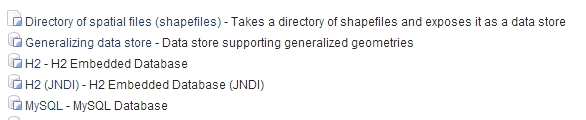
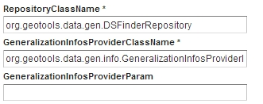
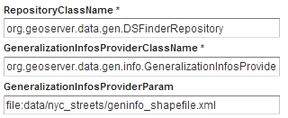
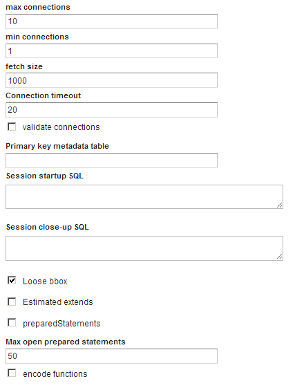

Optimizing vector layers in GeoServer
=====================================

Introduction
------------

This workshop presents some of the techniques and tools that are available to improve GeoServer performance when working with vector layers. The workshop will focus on the following :

* Data preparation—Differences between data formats and data containers
* Strategies for structuring vector data
* Optimal configuration of the corresponding vector data stores

Some of these techniques involve altering the data itself, while others consider how the data is structured and organized. Although we will cover some GeoServer-specific settings, most of these optimizations should result in improved general performance for other applications working with the same data. Configuring vector data stores applies specifically to GeoServer.

Let’s start with an example. Download `this zip file <http://link.to.file>`__ and extract the contents. The .zip file contains two files, both of which contain the same data (a road network) but in different formats—GML and shapefile. We are going to work with both formats in GeoServer and see how the differences between these file formats affect GeoServer performance. Following that, we will compare solutions and provide some recommendations for improving data access performance.

Import both vector layers into GeoServer, using the appropriate data store. Open the :guilabel:`Layers Preview` page and preview the first layer (GML format) in OpenLayers.

We will be using the Google Chrome browser in this workshop to track the response times for some data requests. If you are using another browser, just look for the corresponding plug-in to get this information. Press Ctrl+Shift+I (Command+Alt+I on a MAC) to open the Chrome Developer Tools window. Select the Network tab. You should see something similar to the following:

.. figure:: imgs/chrometools.jpg

  *Chrome browser developer tools*

As you start making requests, you will notice the time it takes to respond to each request is reported in the *Timeline* column. Zoom and pan around the layer and keep an eye on the results recorded in this column. You should see that the performance is not very good, and it usually takes some time to render the data when you change the zoom level or pan around the layer.

Repeat the same preview operation for the shapefile layer. You should notice an improvement in the response times, especially when zooming in.

Zoom to the full extent of the layer and add this to the URL:

.. code-block:: console

	&cql_filter=TYPE='motorway'

This will filter and display only the motorways instead of all roads in the layer. Although fewer roads will be displayed, you should notice that the response time stays more or less the same. Applying a filter does not have a significant impact on performance.

Finally, if you load the sample data into a PostGIS database and again preview the layer, you should see that the response times are similar to those of the shapefile-based layer. However when the same filter is applied, the response times improve.

These simple tests demonstrate the influence different data structures can have on the data access performance in GeoServer. The reasons for the variation in performance include:

* GML is a text-based format. This makes the input file much larger, incurring a larger processing overhead. GML files also contain only the raw data and do not include any indexes.

* Shapefiles are binary format. This means smaller file sizes and faster data access Shapefiles also include a spatial index file (``.shx``) which optimizes access to the data.

* PostGIS not only supports spatial indexing but also indexes the non-spatial fields. This  improves performance when applying non-spatial filters, as we were able to demonstrate in our earlier experiment. 

Selecting the right file format (data container)
------------------------------------------------

Although storing data in a database is usually preferable to a file-based storage solution, it is still possible to achieve good data access performance with file-based solutions. In the following sections, we will cover some of the data preparation recommendations for both storage options.

If you are not going to store your data in a database, choosing the right file format is critical. Some of the main factors affecting performance include:

* Text-based *versus* binary. Text based formats are always a bad idea, since they usually result in larger data volumes which means time-consuming parsing. Using a GML or a DXF file  will significantly degrade the data access performance in GeoServer. Text formats also do not support indexes, so the process for extracting a subset of the information is inefficient.

* Spatial indexing. Zooming into a given area makes it unnecessary to access the rest of the data. The process for identifying which features are within that given area is optimized when we can use a spatial index, something that most file formats do not support.

For file-based solutions, the shapefile format is usually the best option, since it is a binary format, supports spatial indexing, and is supported by GeoServer. The following examples will use shapefile data.

Shapefiles may provide better data access performance than databases (such as PostGIS), especially if a query returns a large number of features. For example, if you are rendering a feature collection at a small scale, accessing the data in a shapefile is likely to be faster than accessing equivalent data in a PostGIS database. If a query returns a small number of features, or when some other type of filtering is being applied, PostGIS data access will generally be faster, making a more robust solution for a wider scenario.

However, if you require a transactional web service (such as WFS-T) to modify the data, 
you should use a database. Regardless of any performance limitations, there are no file-based data storage solutions that support web-based transactions.

The indexing options, both spatial and non-spatial, provided by PostGIS are two of the main reasons for PostGIS's improved performance when compared to shapefiles or, specially, other file-based alternatives.

Preparing and structuring vector data
-------------------------------------

For any given data format there are no guarantees that the data is optimized, with minimal processing overheads, memory requirements, and disk read activity. There are some optimization techniques available that are independent of the data format itself, and may help improve performance particularly when viewing data at varying scales.

Some of these optimizations include:	

* Some elements of the non-spatial data may not be relevant for the service we are running, so they can be discarded.
* When a layer is rendered at a small scale, the amount of data returned is often superfluous for rendering purposes, and processing time is wasted. Having access to a simplified version of the data for rendering at smaller scales should improve performance.
* Not all of the data is required to support zoom and pan operations or using a filter query. To optimize these operations spatial and non-spatial indexing is required.

The first optimization technique is primarily a data cleaning exercise, to identify and eliminate the data that is not required. This is comparable to removing unused bands in multispectral images. By reducing the amount of data that is required to satisfy each request, file access, a potential performance bottleneck, is kept to a minimum. 

The second optimization is similar to the use of pyramids for raster layers, when several varying resolution copies of the same layer are maintained. For raster images the data is resampled, reducing processing overheads in GeoServer by eliminating the requirement to perform costly resampling on-the-fly when responding to a request.

For vector data, there is no resampling involved. GeoServer will simply render the geometry at the requested scale, rendering each point, line, or polygon individually. If the data is rendered at a small scale, this could lead to a degree of redundancy with several point features occupying the same pixel in the rendered image. The request will return more data than is required to create the image, which results in resources being wasted processing unnecessary points.

This is illustrated in the following images, representing two layers with different levels of detail. One of them has been simplified based on the other. 

.. todo:: what do you mean one is simplified based on the other?

.. figure:: imgs/generalizedandoriginal.png
   
   *Original vector layer (left) and simplified vector layer (right)*

Although these images may appear similar, it takes longer to render the higher resolution image on the left, which is several times the size of the image on the right. The image on the right was simplified, with each polygon represented by fewer points. At this viewing scale, the simplification is imperceptible. However, if the same data was rendered at a larger scale, the differences between the two images become apparent. 

.. figure:: imgs/generalizedcloseup.png
   
   *Large scale rendering of simplified and original layers*

At this scale, it would be inappropriate to use the simplified version as the rendered image looses both detail and accuracy. With the area of interest now restricted, the number of points, and therefore the amount of data returned by each query, is less of an issue. If spatial indexing is available, GeoServer will quickly identify only those geometries that are required to satisfy the request.

At the smaller scale, however, it makes sense to use the simplified version—the same results are produced in less time.

Representing features with varying levels of detail for different viewing scales is known in cartography as `generalization <http://en.wikipedia.org/wiki/Cartographic_generalization>`__. Generalization typically involves several types of modifications, which includes simplification. If detailed data is available, generalizing it for small scale viewing may involve not only simplification and also reducing the number of features, as the following illustration demonstrates.

.. figure:: imgs/generalization_agregation.png
   
   *Large scale view of simplified and original layers*

Overlapping features are reduced to just a single feature in the overview window (top right), in a process known as *aggregation*.

Changing the type of geometry could also be considered as a type of simplification. For example, a layer representing cities as polygons may be useful for viewing the data at a large scale but less useful for viewing at a small scale. In that case, the cities would be better represented as points rather than polygons.

.. todo:: diagram here would be useful to help explain the concept of generalization

Creation of indexes is the last and probably easiest part of data preparation. Spatial indexes are automatically created for shapefile data but the shapefile format does not support indexes for the non-spatial attributes. Non-spatial indexes must be created manually when a new column is added to the attribute table. We will cover this in a later section.

The next sections will cover how to apply these optimization techniques to the sample dataset. For this we will use a couple of external tools, in particular ``ogr2ogr`` and a GeoTools module for creating generalized versions of a layer. We will also cover how to perform the same optimization in a PostGIS database.

Data preparation with ``ogr2ogr``
---------------------------------

We can modify vector layers with the ``ogr2ogr`` tool, part of the `FWTools kit <http://fwtools.maptools.org/>`__. This tool allows you to convert vector files into a number of formats, and also includes some options for modifying the data. The output data can be filtered, modified, or both.

We will be using a shapefile as our input data source and generating another shapefile as the output creating, modifying the data in the process.

Of course, if your data is not in shapefile format, you can still use ``ogr2ogr`` to convert your data to a shapefile, if your original format does not provide the level of performance as the shapefile format. To convert our sample GML file into a shapefile, run the following command in a console window.

.. code-block:: console

	$ogr2ogr  -a_srs EPSG:4326 -f "ESRI Shapefile" extremadura_highway.shp extremadura_highway.gml

The first stage in data preparation involves cleaning the data to remove unnecessary fields. To clean a vector layer use the ``ogr2ogr`` tool with the ``-select`` modifier and the list of fields that should be retained in the output file.

To generate a report of the shapefile contents, use the ``ogrinfo`` tool, part of the FWTools kit.

.. code-block:: console

	$ogrinfo extremadura_highway.shp extremadura_highway -so

	INFO: Open of `extremadura_highway.shp'
	 using driver `ESRI Shapefile' successful.

	Layer name: extremadura_highway
	Geometry: Line String
	Feature Count: 32391
	Extent: (-7.612608, 37.849637) - (-4.547236, 40.585243)
	Layer SRS WKT:
	GEOGCS["WGS 84",
	    DATUM["WGS_1984",
	        SPHEROID["WGS 84",6378137,298.257223563,
	            AUTHORITY["EPSG","7030"]],
	        TOWGS84[0,0,0,0,0,0,0],
	        AUTHORITY["EPSG","6326"]],
	    PRIMEM["Greenwich",0,
	        AUTHORITY["EPSG","8901"]],
	    UNIT["degree",0.01745329251994328,
	        AUTHORITY["EPSG","9122"]],
	    AUTHORITY["EPSG","4326"]]
	RTYPE: String (17.0)
	NAME: String (99.0)
	ONEWAY: String (4.0)
	LANES: Real (11.0)

If we assume only the first two fields (``RTYPE, NAME``) are relevant for our application, we can remove remove all the other fields with the following:

.. code-block:: console

	$ogr2ogr -select RTYPE,NAME extremadura_highway_cleaned.shp extremadura_highway.shp

If we now inspect the fields in the output layer, we should see the following:

.. code-block:: console

	$ogrinfo extremadura_highway_cleaned.shp extremadura_highway_cleaned -so
	INFO: Open of `extremadura_highway.shp'
	 using driver `ESRI Shapefile' successful.

	Layer name: extremadura_highway_cleaned
	Geometry: Line String
	Feature Count: 32391
	Extent: (-7.612608, 37.849637) - (-4.547236, 40.585243)
	Layer SRS WKT:
	GEOGCS["WGS 84",
	    DATUM["WGS_1984",
	        SPHEROID["WGS 84",6378137,298.257223563,
	            AUTHORITY["EPSG","7030"]],
	        TOWGS84[0,0,0,0,0,0,0],
	        AUTHORITY["EPSG","6326"]],
	    PRIMEM["Greenwich",0,
	        AUTHORITY["EPSG","8901"]],
	    UNIT["degree",0.01745329251994328,
	        AUTHORITY["EPSG","9122"]],
	    AUTHORITY["EPSG","4326"]]
	RTYPE: String (17.0)
	NAME: String (99.0)

The shapefile ``.dbf`` file is now just 3.7MB, compared to 4.2MB in the original shapefile. That's not a significant difference in size as there weren't many unused columns in the original attributes table, but for your data this could make a real difference. Notice the 
 ``shp`` file size remains the same—the spatial data remains unaltered by this process.

The second data preparation technique we can try is simplification. For this we will use 
``ogr2ogr`` with the ``-simplify`` modifier. This will simplify the geometries in the input shapefile by a user-defined tolerance and allow us to generate a simplified (generalized) version of the shapefile for optimal large scale rendering. Reducing the number of points will produce an output file with less detail, but that loss of detail is imperceptible in the rendered image, as we previously demonstrated.

The ``-simplify`` modifier requires a distance tolerance value. By using several values, we can create a set of shapefiles covering the most commonly used scales, comparable to the different levels of a raster pyramid. The following example generates a simplified output shapefile with a distance tolerance of 0.01. As spatial reference of the layer is EPSG:4326, distance is expressed in decimal degrees.

.. code-block:: console

	$ogr2ogr -simplify 0.01 extremadura_highway_simplified_001.shp extremadura_highway.shp

When supporting varying display scales, it is not just beneficial to have generalized versions of the data but you should also consider that in some cases, some features should not be represented at certain scales. For example, it often make sense to render only motorways at small scales, and rendering other road categories at larger display scales. This can be accomplished in a number of ways, including:

* Configuring styling rules to filter features based on a given field (in our example, the type of road)
* Splitting the source data in several files, in effect prefiltering the data, and then rendering each file at the appropriate scale.

The first solution is more practical and generally preferable, but it may result in a degradation of performance in certain cases. We have already mentioned that shapefiles do not support non-spatial attribute indexing, so basing a filter on an attribute that isn't indexed is inefficient. This is one example where storing the data in a database would be preferable but that option may not always be available. 

If you have to use shapefiles, you can still implement better indexing capabilities. §
For this we will use the ``ogr2ogr`` tool with the ``-sql`` modifier, to output the results of a SQL query into a new file. Type the following line into your console window.

.. code-block:: console

	$ogr2ogr -sql "SELECT * FROM extremadura_highway_cleaned WHERE RTYPE='motorway' " motorways.shp extremadura_highway_cleaned.shp
	
Now we have two shapefiles, each one optimized for rendering at different scale. The ``MaxScaleDenominator`` and ``MinScaleDenominator`` SLD elements may be used to configure the scale dependency when it comes to styling each layer in GeoServer. No additional filtering will be required at rendering time.

.. note:: Styling rules may improve performance in a number of ways not covered in this workshop, except where some particular styling is necessary to illustrate a particular data optimization technique.

In addition to splitting the source data into into two files, you can also apply some pregeneralization as well. Since the shapefile containing only the highways features, used for small scale rendering, is likely to contain too much detail for larger scale rendering, it can also be simplified. Replace the command line above with the following to split and generalize the shapefile data in a single operation.

.. code-block:: console

	$ogr2ogr -simplify 0.01 -sql "SELECT * FROM extremadura_highway_cleaned WHERE RTYPE='motorway' " motorways.shp extremadura_highway_cleaned.shp

The last option we have with with ``ogr2ogr`` for optimizing a shapefile is the ``-t_srs`` modifier, which will reproject the data into a user-defined spatial reference. If the source shapefile has a different coordinate system to the one used for a request, the data has to be reprojected. As this is both time and resource consuming, it's better to store the data in the most frequently requested coordinate system.

The following command line will convert our vector data from its current EPSG:4326 coordinate system into EPSG:23030, a coordinate system that we might expect to be used more frequently for this area.

.. code-block:: console

	$ogr2ogr -t_srs EPSG:23030 extremadura_highway_23030 extremadura_highway.shp

Data preparation with GeoTools Pregeneralized module
----------------------------------------------------

GeoServer has a plug-in named *Generalizing data store* (not included in the OpenGeo Suite, so it has to be manually installed), which makes it easier to use pregeneralized vector layers. Although it can be used with shapefiles, like the ones we created using ``ogr2ogr``, it is particularly useful for databases as it can take advantage of database capabilities not found in shapefiles.

To install this plug-in, download it from `here<http://downloads.sourceforge.net/geoserver/geoserver-2.2.3-feature-pregeneralized-plugin.zip>`_. 

.. todo:: download it from where?

Shutdown GeoServer, extract the contents of the downloaded .zip file into the GeoServer ``WEB-INF/lib`` folder, and restart GeoServer. If you now add a new data store in GeoServer, you will see a new option :guilabel:`Generalizing data store`.

  *Generalizing data store in GeoServer*

The :guilabel:`Generalizing data store` is similar to the ImagePyramid for raster layers, supporting pregeneralized versions of a single layer, and seamlessly managing which layer is used when responding to a request. The pregeneralized version can be created as we have already seen, but in this case as we are working with a shapefile, it is also possible to use a GeoTools tool that provides a better integration. 

In your GeoServer ``WEB-INF/lib`` folder you should see a .jar file called ``gt-feature-pregeneralized-<version>.jar``. This contains the generalization tool.

In your GeoServer data folder (usually in ``<installation>/.opengeo/data_dir/data``), create a folder called ``extremadura_highway`` for our output data. In this new folder, create another folder called ``0`` and copy the base (reprojected) shapefile into it. It is important for our remaining examples to use a projected layer as we will be using distances in meters to set tolerances for the generalization process. 

Now open a console window in the data folder and enter the following:

.. code-block:: console

	$java -jar "[GeoServer-path]/WEB-INF/lib/gt-feature-pregeneralized-<version>.jar" generalize 0/extremadura_highway_23030.shp . 5,10,20,50

The list of numbers at the end of the command represent the generalization distances to use. This will create new shapefiles, each output to a folder named after the generalization distance.

To set up a :guilabel:`Generalizing data store` based on those files, we have to create an XML file describing the structure of the files. In the ``extremadura_highway`` folder, create a new file called ``geninfo_shapefile.xml`` and include the following content:

.. code-block:: xml

	<?xml version="1.0" encoding="UTF-8"?>
	<GeneralizationInfos version="1.0">
      	<GeneralizationInfo dataSourceName="file:data/extremadura_highway/0/extremadura_highway_23030.shp"  featureName="extremadura_highway_gen" baseFeatureName="extremadura_highway" geomPropertyName="geom">
              <Generalization dataSourceName="file:data/extremadura_highway/5.0/extremadura_highway_23030.shp"  distance="5" featureName="extremadura_highway" geomPropertyName="geom"/>
              <Generalization dataSourceName="file:data/extremadura_highway/10.0/extremadura_highway_23030.shp"  distance="10" featureName="extremadura_highway" geomPropertyName="geom"/>
              <Generalization dataSourceName="file:data/extremadura_highway/20.0/extremadura_highway_23030.shp"  distance="20" featureName="extremadura_highway" geomPropertyName="geom"/>
              <Generalization dataSourceName="file:data/extremadura_highway/50.0/extremadura_highway_23030.shp"  distance="50" featureName="extremadura_highway" geomPropertyName="geom"/>
      </GeneralizationInfo>
	</GeneralizationInfos>  

Now we can set up the :guilabel:`Generalizing data store` and configure it to point to this file. The default parameter values for configuring this data store are listed below:

  *Default data store parameters*

Modify the :guilabel:`GeneralizationInfosProviderParam` parameter to point to the XML file, and change the ``geotools`` package names to ``geoserver``:

  *Modified data store parameters*

Save the changes and publish your layer. 

You should also have a data store named *extremadura_highway*—in our XMl file we defined the data store ``baseFeatureName="extremadura_highway"``, created with the base layer.
 
Open a preview of the generalized data store and you should see that it is using the  different shapefiles, depending on the rendering scale. 

The :guilabel:`Generalizing data store` can work without multiple copies of the whole layer, provided that the format used supports multiple geometries associated with one feature. The shapefile format does not support this functionality as each feature can only have one geometry, resulting in redundant data. All the attributes of each feature are copied in each shapefile. The ``.dbf`` files of each shapefile are identical. However, if we are working with a database, as multiple geometries are supported, the data structure is optimized with lower disk space requirements. 

In the next section we will see how to optimize our data in a PostGIS database, including how to create pregeneralized versions within PostGIS and using them with the GeoServer :guilabel:`Generalizing data store`.

Data preparation in PostGIS 
---------------------------

The *stacked* structure, using several shapefiles, may be replaced by a structure in which all the geometries (both original and generalized) are part of the attributes of the feature. This can be accomplished with PostGIS commands, with the results stored in PostGIS and accessed from GeoServer using the :guilabel:`Generalizing data store`.

Let's import our original shapefile into PostGIS. The table structure is as follows:

.. code-block:: console

	 Column  |              Type               
	---------+---------------------------------+
	 gid     | integer                         
	 rtype   | character varying(17)           
	 name    | character varying(99)           
	 oneway  | character varying(4)            
	 lanes   | double precision                
	 geom    | geometry(MultiLineString,23030) 

We are going to add more columns with additional simplified versions of the main geometries associated with each feature. Specifically, we want four more columns and four levels of generalization, as we had with our shapefile example.

To add those columns, use the PostGIS :command:`AddGeometryColumn` function. Note the same geometry type as the original geometry must be used.

.. code-block:: sql

	SELECT AddGeometryColumn('','extremadura_highway','geom5','23030','MULTILINESTRING',2);
	SELECT AddGeometryColumn('','extremadura_highway','geom10','23030','MULTILINESTRING',2);
	SELECT AddGeometryColumn('','extremadura_highway','geom20','23030','MULTILINESTRING',2);
	SELECT AddGeometryColumn('','extremadura_highway','geom50','23030','MULTILINESTRING',2);

Now the table structure is as follows:

.. code-block:: console

	Column   |              Type               
	---------+---------------------------------+
	 gid     | integer                         
	 rtype   | character varying(17)           
	 name    | character varying(99)           
	 oneway  | character varying(4)            
	 lanes   | double precision                
	 geom    | geometry(MultiLineString,23030) 
	 geom5   | geometry(MultiLineString,23030) 
	 geom10  | geometry(MultiLineString,23030) 
	 geom20  | geometry(MultiLineString,23030) 
	 geom50  | geometry(MultiLineString,23030) 

Next we want to populate those columns with the generalized geometries. These geometries are calculated using the PostGIS :command:`ST_SimplifyPreserveTopology` function. In addition to the geometry to be simplified, the function takes a distance tolerance as an input parameter. The following SQL commands will populate the columns:

.. code-block:: sql

	UPDATE extremadura_highway SET geom5 = ST_Multi(ST_SimplifyPreserveTopology(geom,5));
	UPDATE extremadura_highway SET geom10 = ST_Multi(ST_SimplifyPreserveTopology(geom,10));
	UPDATE extremadura_highway SET geom20 = ST_Multi(ST_SimplifyPreserveTopology(geom,20));
	UPDATE extremadura_highway SET geom50 = ST_Multi(ST_SimplifyPreserveTopology(geom,50));

We use the :command:`ST_Multi()` function to get multi-geometries, since :command:`ST_SimplifyPreserveTopology` returns simple geometries.

Finally, to optimize performance, we create spatial indexes for each one of the new columns with the following SQL code:

.. code-block:: sql

	CREATE INDEX sp_index_extremadura_highway_5 ON extremadura_highway USING GIST (geom5);
	CREATE INDEX sp_index_extremadura_highway_10 ON extremadura_highway USING GIST (geom10);
	CREATE INDEX sp_index_extremadura_highway_20 ON extremadura_highway USING GIST (geom20);
	CREATE INDEX sp_index_extremadura_highway_50 ON extremadura_highway USING GIST (geom50);

Now the database contains all the data we need in the correct structure. Before returning to GeoServer and configuring a data store to connect to this new extended table, we can check that the simplified geometries contain less points than the original geometries by running the following query (only the first 10 features are checked, by using :command:`LIMIT 10`):

.. code-block:: sql

	SELECT ST_NPoints(geom) as geom, ST_NPoints(geom5) as geom5, ST_NPoints(geom10) as geom10, ST_NPoints(geom20) as geom20, ST_NPoints(geom50) as geom50 from extremadura_highway LIMIT 10;

The result is as follows:

.. code-block:: console

	 geom | geom5 | geom10 | geom20 | geom50 
	------+-------+--------+--------+--------
	    8 |     3 |      3 |      3 |      2 
	   10 |     5 |      3 |      2 |      2 
	    2 |     2 |      2 |      2 |      2
	    3 |     2 |      2 |      2 |      2 
	    3 |     2 |      2 |      2 |      2 
	    8 |     6 |      5 |      4 |      2 
	    2 |     2 |      2 |      2 |      2 
	   20 |    11 |      8 |      5 |      5
	    4 |     3 |      2 |      2 |      2 
	   27 |    10 |      7 |      6 |      3 

As with the previous example, an XML file is required to configure the :guilabel:`Generalizing data store`, but in this case, as the data store will be based on a different structure, the file is slightly different.

Create a file in your GeoServer data directory named ``geninfo_postgis.xml`` and add the following content:

.. todo:: This code should be revised to ensure it is correct and actually works.

.. code-block:: xml

 <?xml version="1.0" encoding="UTF-8"?>
    <GeneralizationInfos version="1.0">
        <GeneralizationInfo dataSourceNameSpace="extremadura" dataSourceName="postgis_extremadura"  featureName="extremadura_highway" baseFeatureName="extremadura_highway" geomPropertyName="geom">
            <Generalization dataSourceNameSpace="extremadura" dataSourceName="postgis_extremadura"  distance="5" featureName="extremadura_highway" geomPropertyName="geom5"/>
            <Generalization dataSourceNameSpace="extremadura" dataSourceName="postgis_extremadura"  distance="10" featureName="extremadura_highway" geomPropertyName="geom10"/>
            <Generalization dataSourceNameSpace="extremadura" dataSourceName="postgis_extremadura"  distance="20" featureName="extremadura_highway" geomPropertyName="geom20"/>
            <Generalization dataSourceNameSpace="extremadura" dataSourceName="postgis_extremadura"  distance="50" featureName="extremadura_highway" geomPropertyName="geom50"/>
        </GeneralizationInfo>            
    </GeneralizationInfos>    

Now you can create a :guilabel:`Generalizing data store` based on the configuration in this file.    

Indexing non-spatial attributes
^^^^^^^^^^^^^^^^^^^^^^^^^^^^^^^

We can take advantage of other PostGIS capabilities to further optimize our data, including indexing non-spatial attributes. If we are going to support filters and queries using certain attributes, adding an index to those attributes is recommended for improving performance. For example, the following command creates an index for the ``type`` attribute.

.. code-block:: sql

	CREATE INDEX type_idx ON extremadura_highway USING BTREE (type);

Materialized views
^^^^^^^^^^^^^^^^^^

Materialized views (database objects that contain the results of a query) may be useful when dealing with complex queries that may otherwise have a negative impact on performance. 
If the view is not materialized, it does not physically exist in the database, and the results are computed at request time. This has many advantages, including reducing disk space requirements, but in terms of performance a view can represent an important bottleneck. Materializing a view involves processing all the costly operations in advance, so they don't have to be computed when a request is made on the view.

PostgreSQL does not support materialized views but other techniques are available that may achieve similar results improvements in performance. The simplest way of creating a materialized view is just to create a new table, in effect a snapshot of the view. For example, a view is defined as follows:

.. code-block:: sql

	SELECT *
	INTO motorways
	FROM highways
	WHERE rtype = 'motorway'

	ALTER TABLE motorways ADD PRIMARY KEY (gid);

	SELECT Populate_Geometry_Columns('motorways'::regclass);

This view can be materialized with the following clause:

.. code-block:: sql

	CREATE INDEX rtype_idx ON highways USING btree (rtype);

	CREATE OR REPLACE VIEW motorways_view AS
	 SELECT *
	 FROM highways
	 WHERE rtype = 'motorway';

	SELECT Populate_Geometry_Columns('motorways_view'::regclass);

This will create a new table, so instead of now querying the view, the table can be queried. It will result in lower response times, and the more complex the view to be materialized is, the better the improvement in performance. However, this approach has several drawbacks, including any changes made to the original table are not reflected in the materialized view. The view must be recomputed whenever the source tables are modified. If your data doesn't change frequently, this is a reasonable solution but if your data is volatile, the view can become out of date quickly.

By implementing a database trigger, a materialized view can be updated automatically when tables or views it represents are updated. This approach to data management is not discussed further in this workshop, but the `PostgreSQL wiki <http://wiki.postgresql.org/wiki/Main_Page>`_ provides further information on this topic.

In general, avoid using complex views in your database. If you can't avoid using complex views, create materialized views to avoid performance issues. The update frequency for your data will determine the most appropriate method of creating the materialized view.

Database maintenance
~~~~~~~~~~~~~~~~~~~~

In addition to the various optimization techniques covered already, regular database maintenance can also help improve performance. The most important database operations are:

* *Vacuuming*. Outdated rows are not deleted from the database. The :command:`VACUUM` command reclaims space used by deleted rows, reducing the amount of data in the database.  Using :command:`VACUUM ANALYZE` will also collect statistics about the content of the vacuumed table(s), helping to identify the optimum execution plan for queries, which in turn improves performance. 

The code example below runs ``VACUUM ANALYZE`` on the table we created in the previous simplification example.

.. code-block:: sql

   VACUUM ANALYZE extremadura_highway;

* *Clustering*. Running :command:`CLUSTER` reorders rows according to a given index, placing the rows that are typically queried together beside each other. This will reduce the amount of time it takes to execute the query. If queries are expected to be mostly based on the indexed  ``type`` attribute, the table can be clustered based on that index with the following SQL command:

.. code-block:: sql

	CLUSTER type_idx ON extremadura_highway;

PostgreSQL cannot cluster rows when the index access method does not handle null values, as is the case with GiST (Generalized Search Tree) indexes. To use clustering in this case a "not null" constraint must be added to the table (assuming of course, that you don't need to have NULL values in the geometry column).

.. code-block:: sql

   ALTER TABLE extremadura_highway ALTER COLUMN geom SET not null

Now the table can be clustered based on the ``geom`` column GiST index.
	
.. code-block:: sql

   CLUSTER sp_index_extremadura_highway ON extremadura_highway

Fine tuning GeoServer data stores
---------------------------------

In this section we will cover the particular parameters that we can configure for each data store in GeoServer. Also, we will see how to fine tune the data store source itself, when the source is a database.

GeoServer shapefile data stores
-------------------------------

The shapefile data store parameters should be correctly configured for optimal performance. 

.. figure:: imgs/shapefileparams.png
   
   *Shapefile data store parameters*

The recommended configurations are:

* Although the shapefile format includes a file with a spatial index, GeoServer can create its own index and it usually achieves better results. To remove the shapefile index, delete the shapefile ``.qix`` file and select the :guilabel:`Create spatial index if missing/outdated` check box.

* Selecting the :guilabel:`Use memory mapped buffers` and :guilabel:`Cache and reuse memory maps` parameters can improve performance on Linux platforms. However, on a Windows platform, selecting these two parameters will have the opposite effect.

GeoServer PostGIS data stores
-----------------------------

To fine tune a PostGIS data store, adjustments should be made in PostGIS itself, optimizing how the software operates. As PostGIS is based on PostgreSQL, adjustments that improve PostgreSQL performance will result in a better performance when GeoServer is connected to a PostGIS database. 

The default values for PostgreSQL settings are rather conservative, since they are meant to work across in all configurations and machines. You should experiment with alternate settings to improve the performance for your particular configuration. You can either edit (using a text editor) the configuration file (Postgresql.conf) can be found in your data folder or use pgAdmin to access the configuration file—click :guilabel:`File` and then click :guilabel:`Open postgresql.conf...` (you will be prompted to provide the location of the configuration file). When the file will open in a separate window, change the configuration parameters as required.

The main parameters to configure improving performance include:

* :guilabel:`max connections`—Set it according to the number applications connecting to the database
* :guilabel:`work_mem`—Defines the memory available for sorting operations (the default value is rather low). This parameters is related to :guilabel:`max_connections`, since each connection requires its own memory to support its operations.
* :guilabel:`effective_cache_size`—Recommended values are between 1/2 and 3/4 of available memory

Further information on tuning PostGIS can be found at http://workshops.opengeo.org/postgis-intro/tuning.html.

In GeoServer, the parameters used to define the PostGIS data store can have a significant influence on performance.

   
   *PostGIS data store parameters*

The following parameters can be configured:

* :guilabel:`Loose BBOX`—If enabled, only the bounding box of a geometry is used. This can result in a significant performance gain, but at the expense of total accuracy. Some geometries may be considered inside a bounding box when they are technically outside it. If you are mostly connecting to this data via WMS, this flag can be set safely since a loss of some accuracy is usually acceptable. However, if you are using WFS, and especially if making use of BBOX filtering capabilities, this flag should *not* be set.
* :guilabel:`Prepared statements`—Enabling prepared statements can degrade performance. Do not set this option to true.
* :guilabel:`Estimated extents`—If enabled the extent is computed with the actual bounds, performing a full table scan and returning an accurate result. If disabled, extent is estimated from the spatial index, which is faster but less accurate.

The following three parameters related to connection pooling are available for every database backed data store, not PostGIS data stores. A connection pool keeps a certain number of connections open, so there is no need to open a new connection each time one is needed, eliminating the overhead of opening and closing a new connection.

* :guilabel:`Max connections`—Maximum number of connections the connection pool can retain. When the maximum number of connections is exceeded, additional requests that require a database connection will be suspended until a connection from the pool becomes available. The maximum number of connections limits the number of concurrent requests that can be made against the database.
* :guilabel:`Min connections`—Minimum number of connections the pool will retain. These  connections remain even when there are no active requests. When this number of connections is exceeded responding to requests, additional connections are opened until the pool reaches its maximum size (see above).
* :guilabel:`Validate connections`—Indicates whether connections from the pool should be validated before they are used. A connection in the pool can become invalid for a number of reasons including network errors, database server timeout, and so on. When this option is selected an invalid connection will never be used, preventing client errors. The downside of setting this option is that a performance penalty is incurred validating connections.

