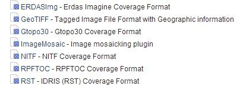
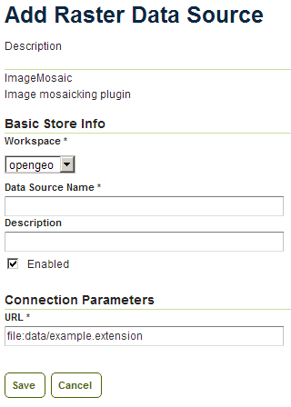
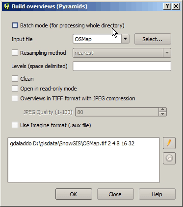

.. _raster.gdaltools:

GDAL tools
==========

There are a number of useful tools in the `GDAL <http://www.gdal.org/>`_ library for working with raster images.

File manipulation and conversion
--------------------------------

When a single file supports a raster layer, we have to make sure that the file format and its settings are correctly configured, as these are the only parameters that can be adjusted.

As we have discussed previously, the TIFF format is the best option in most cases, so we will assume that we want to create a TIFF file to store our data. To create a TIFF file we will use two tools from GDAL toolset, namely `gdal_translate <http://www.gdal.org/gdal_translate.html>`_ and `gdaladdo <http://www.gdal.org/gdaladdo.html>`_.

For the rest of the workshop, we will use the :file:`image3.tif` file. You may wish to try some of the techniques discussed in this workshop on larger images. They may require different options, specially when it comes to creating pyramids.

First, we will convert the image into a TIFF image with inner tiles using ``gdal_translate``. Secondly, we will add overviews to the image using ``gdaladdo``.

#. Open a console window and access the directory containing the image.

#. To convert the image to a TIFF file with inner tiles, execute the following command in the console:

   .. code-block:: console

      gdal_translate -of GTiff -co "TILED=YES" -co "COMPRESS=JPEG" image3.tif image.tif

   This creates a tiled GeoTIFF file named :file:`image.tif` from our source layer :file:`image3.tif`. The new layer was created using the JPEG compression (``"COMPRESS=JPEG"``) algorithm and now contains inner tiles. Further configuration is possible by adding additional commands using the ``-co`` modifier. For further information, refer to the `TIFF format description page <http://www.gdal.org/frmt_gtiff.html>`_. 

#. By default the size of the inner tiles is set to 256 x 256 pixels. To change this to 2048 x 2048, a much more efficient tile size for this example, use the following example instead:

   .. todo:: Why is 2048 x 2048 more efficient?

   .. code-block:: console

      gdal_translate -of GTiff -co "TILED=YES" -co "COMPRESS=JPEG" -co "BLOCKXSIZE=2048" -co "BLOCKYSIZE=2048" image.tif image_tiled.tif

#. We can now use the ``gdaladdo`` tool to add overviews. Execute the following:

   .. code-block:: console

      gdaladdo -r average image_tiled.tif 2 4 8 16

   In this example, we are instructing ``gdaladdo`` to use an average value resampling algorithm, and to create four levels of overviews. Notice how this tool requires us to explicitly set the size ratio of all levels we want to create. We will also see that the GDAL tool used to create an external pyramid has a different syntax for defining the levels to create.

   .. note:: The ``gdaladdo`` command does not create any new files, but adds the overviews to the input file instead.

As discussed earlier, a single file with inner tiles and overviews is the optimal structure for file sizes below 2 GB. In some cases it is worthwhile creating a single file from a previously tiled dataset, so the tiles are present in the file and also the overviews. If there are many small files, having to open and read the files when rendering the layer at smaller scales may have an adverse impact on performance.

The `gdal_merge <http://www.gdal.org/gdal_merge.html>`_ tool can be used to create a single file. 

.. code-block:: console

   gdal_merge.py -o single_file.tif -of GTiff -co "TILED=YES" *.tif

This merges all TIFF files in your current folder into a single TIFF one. The ``gdaladdo`` tool can be later used to add overviews to the output file.

The last thing we can do with ``gdal_translate`` is to remove any unwanted bands we don't intend to use. To do so, we will use the ``-b`` modifier, to specify the bands that we want to keep in the resulting image.

If we have a 7-band Landsat image and we want to render it using a natural color composite with bands 1, 2 and 3, we can reduce the size of the image by keeping just those three bands with the following command:

.. code-block:: console

   gdal_translate -b 1 -b 2 -b 3 landsat.tif landsat_reduced.tif

Once the optimized file is created, setting the corresponding layer in GeoServer is straightforward.

.. note:: For more information about working with GeoServer, please see the `Introduction to GeoServer workshop <http://workshops.opengeo.org/geoserver-intro/>`_ workshop.

Retiling an image
-----------------

If your data is too large for a single file, dividing it into tiles is the next option to consider. For this we need to use the `gdal_retile <http://www.gdal.org/gdal_retile.html>`_ tool. To tile a single image, execute the following:

.. code-block:: console

   gdal_retile.py -targetDir tiles image.tif

Here, ``image.tif`` is the input file and ``tiles`` the name of the output folder where the tile files will be created.

That will create a set of tiled TIFF files from the source data. The size of the tiles (256 x 256 by default) can be set with the ``-ps`` modifier as follows: 

.. code-block:: console

   gdal_retile.py -ps 2048 2048 -targetDir tiles image.tif

If your dataset comprises a number of layers (and assuming their individual sizes make it inappropriate to use them as single layers), you can retile all the layers with the ``-optFile`` modifier, as shown next:

.. code-block:: console

   gdal_retile.py -targetDir tiles --optfile filestotile.txt

The ``filestotile.txt`` file should contain a list of all the input image files. To create this file, go to the folder containing the files and run the following command:

Windows:

.. code-block:: console

   dir /b > filestotile.txt

Linux / OS X

.. code-block:: console

   ls > filestotile.txt

Once the tiles have been created, we need to configure GeoServer to use the tiles as a single layer. Open your GeoServer Web Administration Interface and add a new data store. Select :guilabel:`ImageMosaic` as the type of data store to create.

   *ImageMosaic option in GeoServer* 

   *ImageMosaic settings* 

Select a workspace and add a name. In the :guilabel:`URL` field, enter the folder where the recently created tiles are located. Save the changes and publish the layer. You may now preview your data using OpenLayers, or another suitable client.

You should notice that performance is good when viewing the data at high resolutions (small scale), but performance could be improved at lower resolutions (large scale). This is because overviews were not created for the images. Even if we had created the layer from the ``image4.tif`` file, which does contains overviews, the tiles do not have pyramids. The tiles don't even have internal tiling, so the performance optimization we see viewing the data at high resolution is a result of the external tiling we've set up.

Internal tiles can be created with ``gdal_retile``, just like we did when using ``gdal_translate``. As it is a GDAL tool, it accepts all parameters that are valid for the output format using the ``-co`` modifier. The following command will add internal tiles with a tile size of 512 x 512.

.. code-block:: console

   gdal_retile.py -ps 2048 2048 -co "TILED=YES" -co "BLOCKXSIZE=512" -co "BLOCKYSIZE=512" -targetDir tiles image.tif

The ``gdaladdo`` tool will create overviews but it does not support multiple files. Create a batch script to automate the process of adding a pyramid to each tile. For those who prefer a more point-and-click solution and are not familiar with batch scripting, `Quantum GIS <qgis.org>`_ (QGIS)  provides a graphical user interface for GDAL tools, and includes an option for batch processing the content of a folder. From the :guilabel:`raster` menu, click :guilabel:`Miscellaneous` and click :guilabel:`Build overviews(Pyramids)`.

   *Build overviews dialog box in QGIS* 

Select :guilabel:`Batch mode (for processing whole directory)` and complete the input text box with the path to your folder. The other options are the same as those used for the command-line version of ``gdaladdo``.

