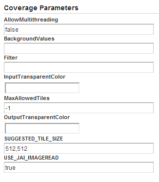
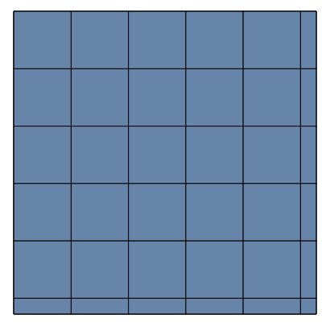
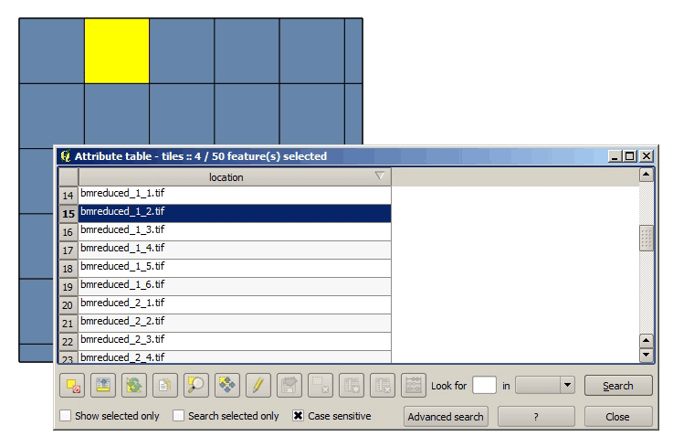

.. _raster.geoservertuning:

Tuning GeoServer 
================

The instructions above all relate to the optimum methods of storing data to achieve the best performance. Depending on the options chosen, there are a number of ways of incorporating our raster data into GeoServer. While this ensures that our data is optimally configured for GeoServer, there are some additional settings in GeoServer that we can configure to improve overall performance.

This section will explain all the settings available for each of the different data stores, and provide some recommendations for optimal performance. For single layers, there are no configuration options in GeoServer to optimize how they are accessed. 

Tuning an ImageMosaic data store 
--------------------------------

For a mosaic of tiles, access to the tiles can be configured from the layer configuration page. From the GeoServer Web Administration Interface, click :guilabel:`Layers` and select the layer you want to configure. The most relevant parameters are configured via the Coverage Parameters section.

   *Coverage Parameters settings* 

The two main parameters that affect performance are :guilabel:`AllowMultithreading` and :guilabel:`SE_JAI_IMAGEREAD`. If :guilabel:`AllowMultithreading` is set to true, GeoServer will read more than one tile at a time. If :guilabel:`USE_JAI_IMAGEREAD` is set to true, GeoServer will use the deferred loading mechanism of JAI, which allows tiles to be streamed. This is usually slower but the process consumes much less memory as tiles are not loaded in memory when creating the mosaic. When this setting is set to false, an immediate loading mechanism is used, which uses more memory but provides better performance.

Setting the :guilabel:`USE_JAI_IMAGEREAD` parameter to true may result in a “Too many files opened” error, as files are left opened for the deferred loading mechanism to be available. As a rule of thumb, set :guilabel:`USE_JAI_IMAGEREAD` to true and set :guilabel:`AllowMultithreading` to false if your system has limited memory. If there are no memory limitations, switch those values (:guilabel:`USE_JAI_IMAGE_READ` = false, :guilabel:`AllowMultithreading` = true*) for better performance.

Aside from the GeoServer configurations, we can also manually configure some other settings. Let's have a look at the folder where we stored our tiles. After adding our mosaic of image tiles as a new data store to GeoServer, a few new files have been created. The extra files are:

.. code-block:: console

   sample_image
   tiles.dbf 
   tiles.fix 
   tiles.prj 
   tiles.properties 
   tiles.qix 
   tiles.shp 
   tiles.shx

These files include the index shapefile, which helps identify which tiles will satisfy a given request, and a couple of additional files. If you preview the index shapefile in you GIS application it should look similar to the following:

   *Tile index* 

The :guilabel:`location` field in the associated attribute table points to the file that contains the actual image data for each geometry.

   *Tile index attribute table*

Configuration parameters are listed in the :file:`<name>.properties` file, which should include content similar to the following::

  #-Automagically created from GeoTools
  - #Tue Oct 16 14:03:20 CEST 2012 
  Levels=0.0166666666666664,0.0166666666666664 
  Heterogeneous=true 
  AbsolutePath=false 
  Name=tiles 
  Caching=false 
  ExpandToRGB=false 
  LocationAttribute=location 
  SuggestedSPI=it.geosolutions.imageioimpl.plugins.tiff.TIFFImageReaderSpi 
  LevelsNum=1

From a performance perspective, the two interesting parameters are ``Caching`` and ``ExpandToRGB``. If ``Caching`` is set to true, the spatial index is retained in memory,  providing much better data access performance. This option is especially significant if your raster data has just one dimension, like our sample data, so it is good idea to set this parameter to true. However, if your data has more than one dimension and the queries are not restricted to index-based queries, caching does not produce in any performance gains.

The ``ExpandToRGB`` setting can be used to optimize performance for paletted images. If all images share the same palette, setting this parameter to :guilabel:`false` will improve the data access performance. If images don't share the same palette, then it must be set to true, since non-matching palettes make it necessary to expand the color definitions to RGB.

Tuning a pyramid image data store 
---------------------------------

For pyramids we can configure the settings both for GeoServer and also the additional files that are created by GeoServer along with the tile files. As this data store depends directly on the ImageMosaic data store, the configuration values are the same. Determining how GeoServer uses multi-threading is fundamental to performance tuning.

