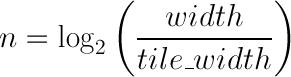
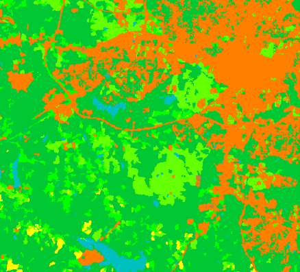
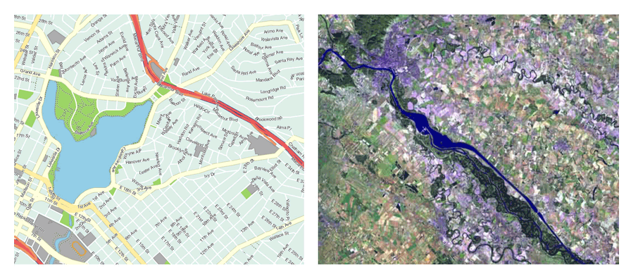

.. _raster.optimization:

Optimizing tiles and pyramids
=============================

Let's review some the ideas and concepts we have discussed before we move onto setting up our data, creating tiles and pyramids if needed, and configuring all of them in GeoServer. 

Since the pyramid case is the more complex data structure, we will review the process for creating a pyramid. You should consider several factors that may influence the data access performance and consider how best to provide access to the different sections of the source image, at all scales.

For large images, we want to create an efficient pyramid that will provide the optimal access to the data. This involves two steps—tiling the image and creating the different levels of the pyramid. The pyramid configuration parameters are discussed next. 

Tile size 
---------

Tiling optimizes the amount of data that has to be read for any given area. In our original image, at its original resolution, the whole image has to be read even if we are going to display a small area in one corner. By creating tiles and storing them in separate files, only those tiles that cover the area of interest are required.

All tiles in a pyramid (not just those tiles stored at the original resolution) are the same size, and that size is determined before creating the pyramid. A small tile size will reduce the amount of data required to satisfy a request for a given area. Too small a tile size could degrade the data access performance as many tiles must be read to satisfy the request. 

The application accessing the pyramid, for this workshop GeoServer, must maintain an index of all available tiles to know which tiles are needed for a given request. More tiles means a larger application database, and also a larger number of files (one for each tile). This could have a negative impact on performance.

On the other hand, if tiles are too big the advantage of tiling is lost. **A tile size of approximately 0.5-1GB is a reasonable solution** for optimum file management and reducing the total number of tiles required.

Creating a tiled scheme with several files does not make the inner tiles redundant. Inner tiling supports the creation of larger tile files, which eventually increase performance, so inner tiling should also be used when using a tiled scheme of files.

Pyramid levels 
--------------

The base level (highest resolution) of the pyramid will have the number of tiles defined by the tile size. Let's suppose our image has a size of 8192 x 8192 pixels. If we use a tile size of 1024 x 1024 pixels, we will have 64 (8 x 8) tiles. At the top of the pyramid we will have a single tile, covering the whole extent. In between, and considering that the number of pixels (and the number of tiles) multiplies by four at each level, we can have a level with four tiles (2 x 2) and another one with 16 (4 x 4) tiles. In total, we will have four levels starting at the maximum resolution defined by the original image, to the top of the pyramid, at the lowest resolution, with a single tile.

The number of levels depends on the tile size. The following formula will calculate the number of levels required to complete the full pyramid.

   *Formula for the number of levels required to complete the full pyramid*

We're assuming in this case the image is square, so its height and width are the same. If the image isn't square but rectangular instead, the larger value of the width or the height should be taken (which ever is the longer edge of the rectangle). 

Tiles are also assumed to be square, as this is the most common configuration.

In the example above, the result is an integer. If the result is not an integer, the value should be rounded-down.

It might not always be necessary to create all of the pyramid. We can save disk space by restricting the number of levels to just those we require. Remember that at each level the scale of the corresponding layer is divided by two, so if our original image corresponds to 1:100000 scale, the single-tile level correspond to a 1:800000 scale. However, if we don't anticipate rendering that image at that scale (we will use a different image for scales over 1:200000), the tiles corresponding to that scale would never be used. In that case, we would just need two levels in our pyramid.

File format 
-----------

Tiles can be saved in many formats, including the original format of the image the pyramid is created for. Choosing the right format can have a significant influence on system performance, since it influences both the size of files to be created and the amount of processing required to access the image data (which might be compressed).

Formats that don't support overviews—JPG and PNG—should not be used for large images as the data access performance would suffer. The TIFF format does support overviews.

ECW and MrSID formats support both tiling and overviews, but unfortunately both are not open formats and are not supported by many applications. GeoServer does support both formats if a valid license is available. The TIFF format is among the best and most popular of all the raster data formats, and will be used in this workshop.

The TIFF format is complex and can be used in a number of configurations. The different configurations influence how effective the TIFF format is for generating a raster pyramid. 

The first TIFF file parameter to consider is the **compression**. Although TIFF files can be saved with no compression, using raw, uncompressed data is generally not a good idea and will result in poor data access performance. A better option is to consider using one of the compression algorithms, either lossy or lossless, to compress the original data.

.. note:: A lossy compression algorithm compresses the data by discarding or losing some of the data with each compression. As the loss of data is permanent, lossy compression is not suitable for datasets that may be used for analysis or deriving other data products. A lossless compression algorithm on the other hand supports file compression but also allows the original data to be reconstructed from the compressed data. As there is no permanent loss of data with lossless compression, and therefore is is suitable for use in analysis. LZW and Deflate are commonly used lossless compression algorithms. JPEG is a popular lossy compression algorithm.

Choosing one compression algorithm or another depends on several factors. In general, if your are going to use your data primarily for rendering, JPG is a good choice as although it produces a lossy compression, it can be considered as visually lossless. If the data being compressed is an actual measurement (DEM, Temperature, and so on) or any other value not representing an image, lossless compression is the better option, as the original values are preserved.

LZW compression works better on data with repeated patterns, so it is of particular interest for those layers with large areas of a single values, such as no-data values or with categorical values, like the image shown below.

   *Image categories*

TIFF format files support internal tiles, which is a useful for large tile sizes. Having each tile file internally tiled can speed up data access operations.

.. todo:: think the above statement needs some clarification

For very large files, there is also the BigTIFF format, which supports the creation of files greater that 4 GB (the limit for TIFF).

Resampling algorithm 
--------------------

Creating pyramids involves completing resampling operations in advance of using the data, so the application accessing the pyramid does not need to perform the same operation on the original image. Resampling may be performed using different algorithms, some of which will produce higher quality resampled images than other algorithms. More complex algorithms can produce better quality images but it usually takes longer to create the pyramid. The resampling algorithm used, however, has no effect on the performance that may be expected once the pyramid is created.

.. note:: A "nearest neighbor interpolation" is the simplest method and it is a good option for non-image data such as elevation data and so on. It is suitable for resampling raster layers with categorical data published via a Web Coverage Service (WCS) service. However, this interpolation technique is not recommended for images.

Coordinate Reference System 
---------------------------

The Coordinate Reference System (CRS) is not strictly speaking a parameter of the pyramid itself, but it may be important when accessing the data. The main advantage of a tiling and/or pyramid data structure is that certain operations are performed in advance and do not have to be performed each time a data request is processed. As reprojecting data can be a time consuming task, choosing the most appropriate CRS for the pyramid data will improve system performance. Most appropriate in this context means choosing the CRS that will be requested most frequently. This also applies to single files and other data formats.

RGB vs paletted images 
----------------------

There are different methods for storing colors in an image. In the RGB color space, a color is expressed as a combination of three components—red, green and blue. This supports the representation of virtually every color that may appear in an image. However, if an image includes only a few colors, the full RGB model is unnecessary and a paletted image should be considered instead. Palatted images store the RGB definition of those colors in a list, and the index of the color required for each pixel is also stored in that list. This means a single value, not three values, is used to represent each color, helping to reduce file sizes and promoting faster data access.

Compare the two images below. The left image is a good candidate for a color palette, while the right image should use the RGB color model.

   *RGB versus paletted image*

Palettes are usually limited to 256 colors. As each RGB component is represented in the 0-255 range, a paletted image size corresponds to a single band representing one of those components. Although this may be less than the number of colors used in the image, we can still use a palette, choosing the colors that are closest to the colors in the palette. The trade-off is smaller file sizes versus a lower quality image.

Providing we do not degrade the image too much, this can be useful for improving performance. For some images, like the bottom image in our examples above, using a palette does not mean less color detail as the number of colors used is smaller.

RGB images can be converted into paletted images using the GDAL ``rgb2pct`` tool. 

.. note:: GDAL is part of `FWTools <http://fwtools.maptools.org>`_, and if you are running Windows, installing FWTools is the recommended way of using GDAL. We will be using other GDAL tools for most of the examples in this workshop.

For a simple conversion, just provide the input filename and the required output filename as parameters. To transform our ``image3.tif`` image into a paletted image named ``image3p.tif`` we would run the following.

.. code-block:: console

   rgb2pct image3.tif image3p.tif

The default output format is TIFF. You may provide an alternate format if required 

As a general rule, use the ``rgb2pct`` tool when working with images like lower image above. For other images, consider your particular requirements to find the right balance between image quality and performance. Color map conversion should generally be completed before the other data preparations that we cover discuss next. 

You may also notice that there is a relationship between the compression methods and the way colors are stored. Images that are suitable for using a palette tend to be good for compression algorithms like LZW which provide good compression ratios when there are clusters of contiguous pixels with the same values. This is not always true, but in most cases an image with few colors has some degree of homogeneity, with blocks of pixels with a single value.

Since the image we are using in this workshop has a large number of different colors, and assuming that we do not want to lose color detail, we will be using the original RGB image for the following examples.

Multiband imagery
-----------------

So far, we have assumed the type of raster data to optimize consists of RGB (color) or pancromatic (monochrome) images, or non-image data, such as a DEM. Images with more bands can be also used and that provides an opportunity for further optimization.

Multispectral images can have a number of bands ranging from four, usually the three corresponding to RGB and a infrared band, to several hundreds. They cover different regions of the electromagnetic spectrum and rendered using a *false-color* composition. To create this composition, three bands are selected and used as RGB components. However, the intensity represented in their pixel values does not represent the intensity in the frequencies corresponding to the RGB components. With those pixel values, the color of the pixel is computed.

If we are working with multispectral imagery, but our goal is to serve only true-color or false-color rendered images derived from that imagery through a WCS service, we can retain only those bands required for the color composition. This will result in smaller file sizes, and consequently better performance.

However, if we're working with all the bands in the multispectral image, understanding how band values are stored can help optimize the performance. In the case of a TIFF file, two schemes are supported.

* Pixel interleaved—All the values for a single *pixel* are stored together. For an RGB image the data is structured  RGBRGBRGB. 
* Band interleaved—All the values for a single *band* are stored together. For an RGB image the data is structured RRRGGGBBB.

Band interleaved generally provides better performance when querying a section of the image, especially if it involves reading values from a few bands. Band interleaved images also tend to provide better compression ratios.

Pixel interleaved images are the preferred format if we expect per-pixel queries. For images published by GeoServer, band interleaved is generally the best option.

