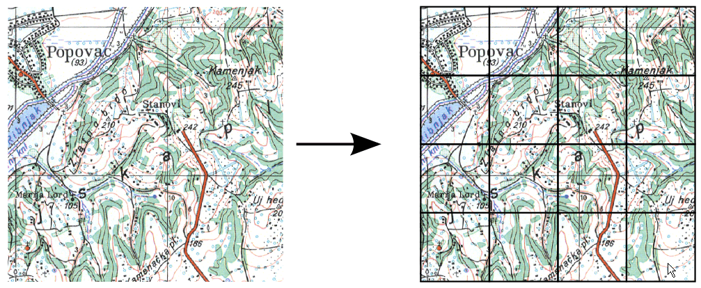
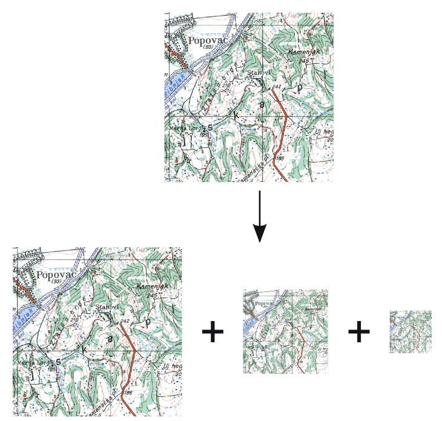
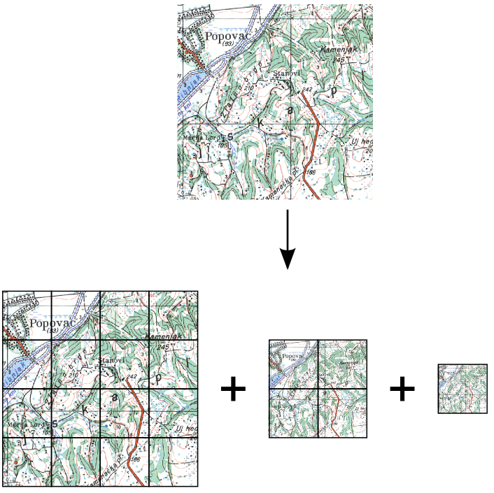

.. _tiles.pyramids:

Raster tiles and pyramids 
=========================

.. todo:: Add subheadings.

There are several optimization techniques available for working with large raster layers. Some of these techniques rely on a horizontal division, sub-dividing the layer into smaller sections, so only those sections of the data that are required are accessed. The layer can be accessed partially, depending on the request. This process is usually referred to as **tiling**.

   *Image tiling*

When the layer is tiled, the image covering a given area is comprised of a set of smaller images covering sections of the original area.

Other techniques are used when viewing the layer at a lower scale, and although the whole extent of the layer might be rendered, not all of the data in the layer needs to be accessed to render the final image.
 
For instance, consider the first zoom level when you opened the layer preview. Although the original image is 10800 × 10800 pixels, the image rendered in your screen is much smaller because your screen resolution is lower than the original image. Creating the image you see on the screen from the original image is a time consuming process, and involves reading more data than is required to create the lower resolution version.

One solution to this problem is to maintain several versions of a given image, suitable for representation at different scales, in a **pyramid** data structure illustrated next.
as illustrated next. 

  
   *Raster pyramids*

Maintaining different resolution versions of the data means the amount of resampling required is reduced, as presampling has already been performed to create those versions. When an image is requested at a given rendering scale, the version closest to that scale is used, optimizing the layer access performance.

You can see the number of image pixels in each level in the pyramid is 1/4 of the number of image pixels at the next level. Each dimension (width, height) of the image is halved, and the area previously represented by four pixels is now represented by just one. 

   *Pyramid data structures*

As pyramids provide a progressive decrease in resolution, there should always be an optimal level of resolution to respond to a given layer access request.

Tiling and pyramid data structures can be used together to improve the data access performance of GeoServer and any other application accessing the same raster data, since these optimizations are independent of the application requesting access to the date.

Some file formats support internal pyramids, also known as **overviews**, where a single file contains all the different resolution images. Other file formats, such as JPG, PNG, or GIF which do not handle large file sizes, don't support overviews. The TIFF format, on the other hand, does support overviews. JPEG2000 and other wavelet-based formats include wavelets as well.

.. todo:: First time wavelets are mentioned - why is this important

Also, some formats support internal tiling, while others do not, or they support it just for one pyramid level (in case they support internal pyramids). TIFF and JPEG2000 formats support internal tiling, but JPG and PNG formats don't.

GeoServer can take advantage of image pyramids containing several tiled versions of the same image, with those versions maintained in separate files. Such a file structure provides much better data access performance, since a request covering a section of the image, at any scale, means only the tiles overlapping the requested area are read.

In some cases, tiling and pyramid data structures are sufficient have provide good performance. However, with large datasets, it is better to manually create a pyramid as a collection of files and folders, and let GeoServer handle that structure efficiently.

In this workshop we will see how to use tiling and pyramids, both internal and external, to achieve the optimal configuration for our system and dataset.

Working with raster tiles and pyramids in GeoServer 
---------------------------------------------------

There are several possibilities for configuring our GeoServer instance for a given dataset. These include:

* A single file that may have inner tiles and/or overviews 
* A set of tiles 
* A pyramid

The choice of configuration depends largely on the size of your dataset. The following general guidelines apply:

* If your dataset is smaller than 1 or 2 GB, the best option is usually to keep your data in a single file, provided that file is optimized with tiles and overviews. If your data format that does not support tiling and overviews, you could either create a mosaic of tiles or, preferably, translate the data into a different format that does support tiling and overviews. 
* Datasets larger than 2 GB should be tiled in smaller files, using inner pyramids and tiles if possible. 
* If your dataset is really large (> 100 GB), and will be used at all scales, create an external pyramid.

