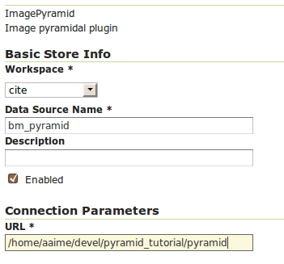

.. _raster.usingpyramids:

Using pyramids 
==============

.. todo:: "Use" pyramids?

To use pyramids in GeoServer, the first thing to do is to create a directory with pyramid files and tiles. To do so, we will use the ``gdal_retile`` tool again but this time we will create the different pyramid levels and not just tiles on the base layer. This tool create a GeoServer compatible structure with a folder containing image files and subdirectories. Open a console window, locate the image to tile, and enter the following:

.. code-block:: console

   gdal_retile.py -levels 4 -ps 2048 2048 -targetDir tiles image.tif

You will notice that the only addition is the ``-levels`` modifier which instructs ``gdal_retile`` to create four levels of overviews, the number required to complete the whole pyramid in our example. The tile size is set to 2048 x 2048. If just the lower levels of the pyramid are needed, use a value less than four.

Since the process of creating a pyramid can be time-consuming, it is usually a good idea to add the ``-v`` modifier to instruct ``gdal_retile`` to report the progress of the operation.

The interpolation method used to create the overviews can be specified with the ``-r`` modifier. To use a bilinear interpolation instead of the default nearest neighbor interpolation, use the ``-r bilinear`` option:

.. code-block:: console

   gdal_retile.py -r bilinear -levels 4 -ps 512 512 -targetDir tiles image.tif

The ``gdal_retile`` tool will create a set of files corresponding to the first level of the pyramid (these are the same files that we created when we created the mosaic without pyramids) and then a number of subdirectories corresponding to the rest of levels, each containing a set of tile files.

As you can see, only the tiles have been generated, and there are no additional index files. Although ``gdal_retile`` can create index files, it is not necessary as GeoServer will add those.

Now we need to configure what we have created as a new data source for GeoServer. To do it we need a new type data store, ImagePyramid, that is not available with GeoServer by default. To install it, just download the corresponding file from the `GeoServer website <http://geoserver.org/>`_ and save it in the ``WEB-INF/lib`` folder of your GeoServer installation. Now when you create a new data store, ImagePyramid will be listed as one of the options. Click :guilabel:`ImagePyramid` to access the configuration page:

   *ImagePyramid options* 

Complete the input boxes as required and in the :guilabel:`URL` box enter the folder where you created the pyramid. Save and publish the layer.

When we created a ImageMosaic store, GeoServer automatically added the shapefile containing the tile index. For the ImagePyramid store it also generates additional files that describe the structure of the pyramid and optimizes access to the pyramid using those files. In particular:

 * All files in the pyramid folder (those corresponding to the original resolution, first level), are moved to a folder named ``0``. 
 * An index shapefile is created for the mosaic representing each pyramid level, and stored in the corresponding folder.

If you have a large dataset, it is usually a good idea to manually move the files to the ``0`` folder after the pyramid tiles have been created, and before creating the ImagePyramid store in GeoServer. Otherwise, if it takes too much time to copy the files the store creation request may fail.

