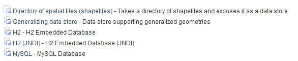
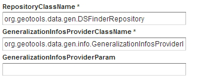
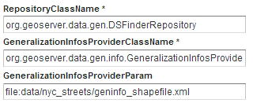

.. _vector.pregeneralized:

Data preparation with Pregeneralized Features
=============================================

GeoServer has a plug-in called Pregeneralized Features (not included in the OpenGeo Suite, so it has to be manually installed), which makes it easier to use pregeneralized vector layers. Although it can be used with shapefiles, like the ones we created using ``ogr2ogr``, it is particularly useful for databases as it can take advantage of database capabilities not found in shapefiles.

To install this plug-in, download it from here. 

.. todo:: download it from where?

Shutdown GeoServer, extract the contents of the downloaded .zip file into the GeoServer ``WEB-INF/lib`` folder, and restart GeoServer. If you now add a new data store in GeoServer, you will see a new option :guilabel:`Generalizing data store`.

   *Generalizing data store in GeoServer*

The :guilabel:`Generalizing data store` is similar to the ImagePyramid for raster layers, supporting pregeneralized versions of a single layer, and seamlessly managing which layer is used when responding to a request. The pregeneralized version can be created as we have already seen, but in this case as we are working with a shapefile, it is also possible to use a free GeoTools tool that provides a better integration. 

In your GeoServer ``WEB-INF/lib`` folder you should see a .jar file called ``gt-feature-pregeneralized-<version>.jar``. This contains the generalization tool.

In your GeoServer data folder (usually in ``<installation>/.opengeo/data_dir/data``), create a folder called ``extremadura_highway`` for our output data. In this new folder, create another folder called ``0`` and copy the base (reprojected) shapefile into it. It is 
 important for our remaining examples to use a projected layer as we will be using distances in meters to set tolerances for the generalization process. 

Now open a console window in the data folder and enter the following:

.. code-block:: console

   java -jar "[GeoServer-path]/WEB-INF/lib/gt-feature-pregeneralized-<version>.jar" generalize 0/extremadura_highway_23030.shp . 5,10,20,50

The list of numbers at the end of the command represent the generalization distances to use. This will create new shapefiles, each output to a folder named after the generalization distance.

To set up a :guilabel:`Generalizing data store` based on those files, we have to create an XML file describing the structure of the files. In the ``extremadura_highway`` folder, create a new file called ``geninfo_shapefile.xml`` and include the following content:

.. code-block:: xml

   <?xml version="1.0" encoding="UTF-8"?>
   <GeneralizationInfos version="1.0">
         <GeneralizationInfo dataSourceName="file:data/extremadura_highway/0/extremadura_highway_23030.shp"   featureName="extremadura_highway_gen" baseFeatureName="extremadura_highway" geomPropertyName="geom">
               <Generalization dataSourceName="file:data/extremadura_highway/5.0/extremadura_highway_23030.shp"  distance="5" featureName="extremadura_highway" geomPropertyName="geom"/>
               <Generalization dataSourceName="file:data/extremadura_highway/10.0/extremadura_highway_23030.shp"  distance="10" featureName="extremadura_highway" geomPropertyName="geom"/>
               <Generalization dataSourceName="file:data/extremadura_highway/20.0/extremadura_highway_23030.shp"  distance="20" featureName="extremadura_highway" geomPropertyName="geom"/>
               <Generalization dataSourceName="file:data/extremadura_highway/50.0/extremadura_highway_23030.shp"  distance="50" featureName="extremadura_highway" geomPropertyName="geom"/>
       </GeneralizationInfo>
   </GeneralizationInfos>  

Now we can set up the :guilabel:`Generalizing data store` and configure it to point to this file. The default parameter values for configuring this data store are listed below:

   *Default data store parameters*

Modify the :guilabel:`GeneralizationInfosProviderParam` parameter to point to the XML file, and change the ``geotools`` package names to ``geoserver``:

   *Modified data store parameters*

Save the changes and publish your layer. 

You should also have a data store named *extremadura_highway*—in our XMl file we defined the data store ``baseFeatureName="extremadura_highway"``, created with the base layer.
 
Open a preview of the generalized data store and you should see that it is using the  different shapefiles, depending on the rendering scale. Confirm this by checking the GeoServer logs.

.. code-block:: console

  XXXXXXXXXXXXXXXXX

.. todo:: to be added?

The :guilabel:`Generalizing data store` can work without multiple copies of the whole layer, provided that the format used supports multiple geometries associated with one feature. The shapefile format does not support this functionality as each feature can only have one geometry, resulting in redundant data. All the attributes of each feature are copied in each shapefile. The ``.dbf`` files of each shapefile are identical. However, if we are working with a database, as multiple geometries are supported, the data structure is optimized with lower disk space requirements. 

