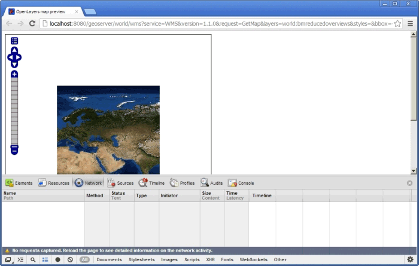

.. _vector.sample:

Sample files
============

Let's start with an example. Download `this zip file <http://link.to.file>`__ and extract the contents. The .zip file contains two files, both of which contain the same data (a road network) but in different formats—GML and shapefile. We are going to work with both formats in GeoServer and see how the differences between these file formats affect GeoServer performance. Following that, we will compare solutions and provide some recommendations for improving data access performance.

Import both vector layers into GeoServer, using the appropriate data store. Open the :guilabel:`Layers Preview` page and preview the first layer (GML format) in OpenLayers.

We will be using the Google Chrome browser in this workshop to track the response times for some data requests. If you are using another browser, just look for the corresponding plug-in to get this information. Press Ctrl+Shift+I (Command+Alt+I on a MAC) to open the Chrome Developer Tools window. Select the Network tab. You should see something similar to the following:

   *Chrome browser developer tools*

As you start making requests, you will notice the time it takes to respond to each request is reported in the *Timeline* column. Zoom and pan around the layer and keep an eye on the results recorded in this column. You should see that the performance is not very good, and it usually takes some time to render the data when you change the zoom level or pan around the layer.

Repeat the same preview operation for the shapefile layer. You should notice an improvement in the response times, especially when zooming in.

Zoom to the full extent of the layer and add this to the URL:

.. code-block:: console

   &cql_filter=TYPE='motorway'

This will filter and display only the motorways instead of all roads in the layer. Although fewer roads will be displayed, you should notice that the response time stays more or less the same. Applying a filter does not have a significant impact on performance.

Finally, if you load the GML sample data into a PostGIS database and again preview the layer, you should see that the response times are similar to those of the shapefile-based layer. However when the same filter is applied, the response times improve.

These simple tests demonstrate the influence different data structures can have on the data access performance in GeoServer. The reasons for the variation in performance include:

* GML is a text-based format. This makes the input file much larger, incurring a larger processing overhead. GML files also contain only the raw data and do not include any indexes.

* Shapefiles are binary format. This means smaller file sizes and faster data access shapefiles also include a spatial index file (``.shx``) which optimizes access to the data.

* PostGIS not only supports spatial indexing but also indexes the non-spatial fields. This  improves performance when applying non-spatial filters, as we were able to demonstrate in our earlier experiment. 

