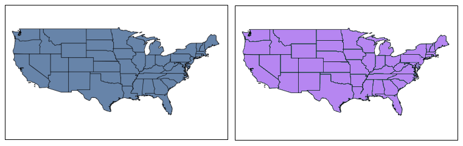
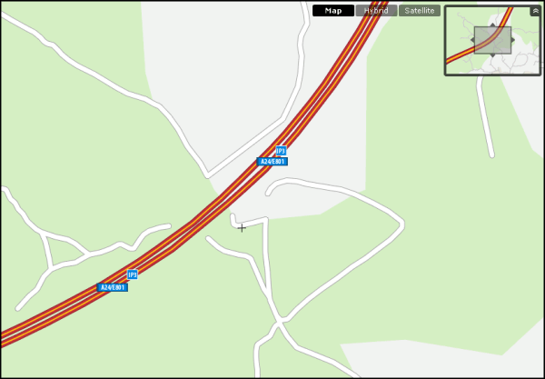

.. _vector.structure:

Preparing and structuring vector data
=====================================

For any given data format there are no guarantees that the data is optimized, with minimal processing overheads, memory requirements, and disk read activity. There are some optimization techniques available that are independent of the data format itself, and may help improve performance particularly when viewing data at varying scales.

Some of these optimizations include:

* Some elements of the non-spatial data may not be relevant for the service we are running, so they can be discarded.
* When a layer is rendered at a small scale, the amount of data returned is often superfluous for rendering purposes, and processing time is wasted. Having access to a simplified version of the data for rendering at smaller scales should improve performance.
* Not all of the data is required to support zoom and pan operations or using a filter query. To optimize these operations spatial and non-spatial indexing is required.

The first optimization technique is primarily a data cleaning exercise, to identify and eliminate the data that is not required. This is comparable to removing unused bands in multi-spectral images. By reducing the amount of data that is required to satisfy each request, file access, a potential performance bottleneck, is kept to a minimum. 

The second optimization is similar to the use of pyramids for raster layers, when several varying resolution copies of the same layer are maintained. For raster images the data is resampled, reducing processing overheads in GeoServer by eliminating the requirement to perform costly resampling on-the-fly when responding to a request.

For vector data, there is no resampling involved. GeoServer will simply render the geometry at the requested scale, rendering each point, line, or polygon individually. If the data is rendered at a small scale, this could lead to a degree of redundancy with several point features occupying the same pixel in the rendered image. The request will return more data than is required to create the image, which results in resources being wasted processing unnecessary points.

This is illustrated in the following images, representing two layers with different levels of detail. One of them has been simplified based on the other. 

.. todo:: what do you mean one is simplified based on the other?

   
   *Original vector layer (left) and simplified vector layer (right)*

Although these images may appear similar, it takes longer to render the higher resolution image on the left, which is several times the size of the image on the right. The image on the right was also simplified, with each polygon represented by fewer points. At this viewing scale, the simplification is imperceptible. However, if the same data was rendered at a larger scale, the differences between the two images become apparent. 

.. figure:: img/generalizedcloseup.png
   
   *Large scale rendering of simplified and original layers*

At this scale, it would be inappropriate to use the simplified version as the rendered image loses both detail and accuracy. With the area of interest now restricted, the number of points, and therefore the amount of data returned by each query, is less of an issue. If spatial indexing is available, GeoServer will quickly identify only those geometries that are required to satisfy the request.

At the smaller scale, however, it makes sense to use the simplified version—the same results are produced in less time.

Representing features with varying levels of detail for different viewing scales is known in cartography as `generalization <http://en.wikipedia.org/wiki/Cartographic_generalization>`_. Generalization typically involves several types of modifications, which includes simplification. If detailed data is available, generalizing it for small scale viewing may involve not only simplification and also reducing the number of features, as the following illustration demonstrates.

   
   *Large scale view of simplified and original layers*

Overlapping features are reduced to just a single feature in the overview window (top right), in a process known as *aggregation*.

Changing the type of geometry could also be considered as a type of simplification. For example, a layer representing cities as polygons may be useful for viewing the data at a large scale but less useful for viewing at a small scale. In that case, the cities would be better represented as points rather than polygons.

.. todo:: diagram here would be useful to help explain the concept of generalization

Creation of indexes is the last and probably easiest part of data preparation. Spatial indexes are automatically created for shapefile data but the shapefile format does not support indexes for the non-spatial attributes. Non-spatial indexes must be created manually when a new column is added to the attribute table. We will cover this in a later section.

The next sections will cover how to apply these optimization techniques to the sample dataset. For this we will use a couple of external tools, in particular ``ogr2ogr`` and a GeoTools module for creating generalized versions of a layer. We will also cover how to perform the same optimization in a PostGIS database.

