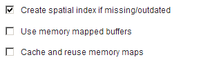
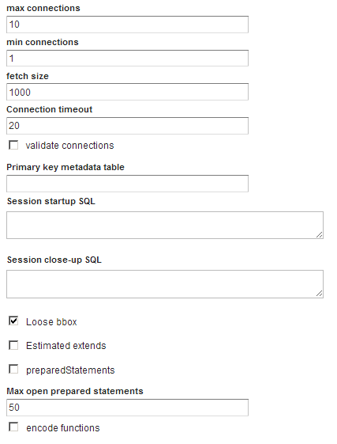

Tuning GeoServer data stores
============================

In this section we will cover the particular parameters that we can configure for each data store in GeoServer. Also, we will see how to fine tune the data store source itself, when the source is a database.

Shapefile data stores
---------------------

The shapefile data store parameters should be correctly configured for optimal performance. 

   
   *Shapefile data store parameters*

The recommended configurations are:

* Although the shapefile format includes a file with a spatial index, GeoServer can create its own index and it usually achieves better results. To remove the shapefile index, delete the shapefile ``.qix`` file and select the :guilabel:`Create spatial index if missing/outdated` check box.

* Selecting the :guilabel:`Use memory mapped buffers` and :guilabel:`Cache and reuse memory maps` parameters can improve performance on Linux platforms. However, on a Windows platform, selecting these two parameters will have the opposite effect.

PostGIS data stores
-------------------

To fine tune a PostGIS data store, adjustments should be made in PostGIS itself, optimizing how the software operates. As PostGIS is based on PostgreSQL, adjustments that improve PostgreSQL performance will result in a better performance when GeoServer is connected to a PostGIS database. 

The default values for PostgreSQL settings are rather conservative, since they are meant to work across in all configurations and machines. You should experiment with alternate settings to improve the performance for your particular configuration. You can either edit (using a text editor) the configuration file (Postgresql.conf) can be found in your data folder or use pgAdmin to access the configuration file—click :guilabel:`File` and then click :guilabel:`Open postgresql.conf...` (you will be prompted to provide the location of the configuration file). When the file will open in a separate window, change the configuration parameters as required.

The main parameters to configure improving performance include:

* :guilabel:`max connections`—Set it according to the number applications connecting to the database
* :guilabel:`work_mem`—Defines the memory available for sorting operations (the default value is rather low). This parameters is related to :guilabel:`max_connections`, since each connection requires its own memory to support its operations.
* :guilabel:`effective_cache_size`—Recommended values are between 1/2 and 3/4 of available memory

Further information on tuning PostGIS can be found at http://workshops.opengeo.org/postgis-intro/tuning.html.

In GeoServer, the parameters used to define the PostGIS data store can have a significant influence on performance.

   
   *PostGIS data store parameters*

The following parameters can be configured:

* :guilabel:`Loose BBOX`—If enabled, only the bounding box of a geometry is used. This can result in a significant performance gain, but at the expense of total accuracy. Some geometries may be considered inside a bounding box when they are technically outside it. If you are mostly connecting to this data via WMS, this flag can be set safely since a loss of some accuracy is usually acceptable. However, if you are using WFS, and especially if making use of BBOX filtering capabilities, this flag should *not* be set.
* :guilabel:`Prepared statements`—Enabling prepared statements can degrade performance. Do not set this option to true.
* :guilabel:`Estimated extends`—If enabled the extent is computed with the actual bounds, performing a full table scan and returning an accurate result. If disabled, extent is estimated from the spatial index, which is faster but less accurate.

.. todo:: should that not be 'estimated extents'? Is the GeoServer GUI text wrong?

The following three parameters related to connection pooling are available for every database backed data store, not PostGIS data stores. A connection pool keeps a certain number of connections open, so there is no need to open a new connection each time one is needed, eliminating the overhead of opening and closing a new connection.

* :guilabel:`Max connections`—Maximum number of connections the connection pool can retain. When the maximum number of connections is exceeded, additional requests that require a database connection will be suspended until a connection from the pool becomes available. The maximum number of connections limits the number of concurrent requests that can be made against the database.
* :guilabel:`Min connections`—Minimum number of connections the pool will retain. These  connections remain even when there are no active requests. When this number of connections is exceeded responding to requests, additional connections are opened until the pool reaches its maximum size (see above).
* :guilabel:`validate connections`—Indicates whether connections from the pool should be validated before they are used. A connection in the pool can become invalid for a number of reasons including network errors, database server timeout, and so on. When this option is selected an invalid connection will never be used, preventing client errors. The downside of setting this option is that a performance penalty is incurred validating connections.

