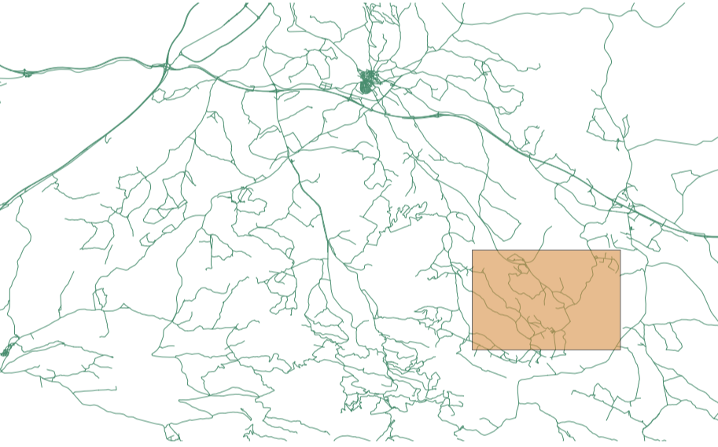
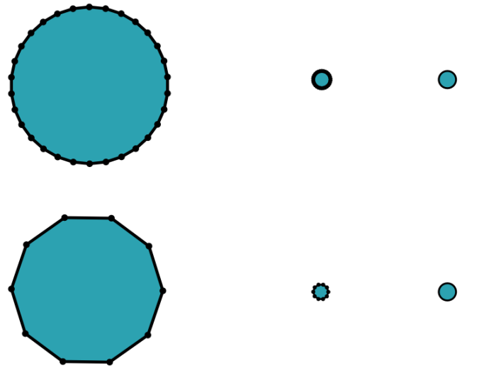
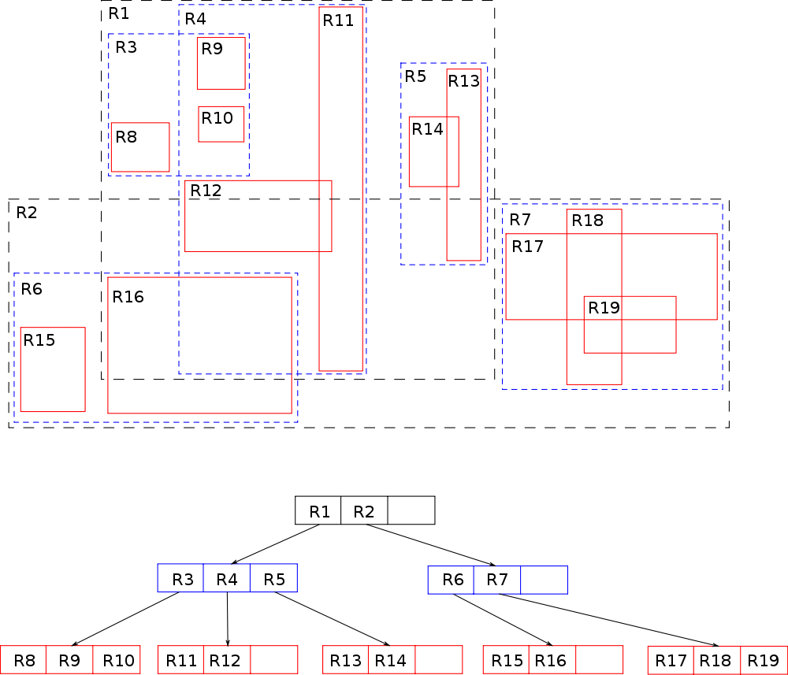

Optimizing vector data in GeoServer
===================================

---

Goal
----

Improve GeoServer performance

---

Contents
---------

- Modifying the data 

- Configuring everything from the data to GeoServer

- We will not cover further adjustments, such as styling

---

Main objectives
---------------

- Minimizing data access

- Minimizing processing

- Executing calculations in advance 

- Fine tuning GeoServer

- Fine tuning related software 

- Mainly (but not limited to) data used for rendering

---

What's covered?
---------------

- Strategies for preparing data (theory) 

- Tools and examples of preparing data (practice)

- Configuration tips - how to optimize your data
	- GeoServer 

	- Database 

---

Workshops
---------

- *Geoserver in production* workshop

- This Workshop 
	- adopts a more practical approach

	- is focused on data, not just on GeoServer 

- You are going to actually see how it is done

---

Preparing data
==============

---
Why?
----

- Ensure minimum size and fast access

- Avoid costly operations later

- Benefits are not limited to GeoServer

---

Factors affecting performance
-----------------------------

- Viewing unnecessary data 
	- rendering an area smaller than image
	- render detail lower than image resolution (> 1 point per pixel is useless)  

- Slow data access 
	- too much data
 	- too expensive to read or prepare it

- Filter overhead

---

---

---

Important factors
-----------------

- File vs Database
- File format and size
- Cleaning unnecessary data
- Managing level of detail
- Splitting data
- Indexing—Spatial and-non spatial components
- Using the optimal CRS

---

Strategies
----------

- Vector strategies similar to raster strategies
	- Indexing / tiling
	- Simplifying (generalization) / pyramids

- Pre-querying

- Non-spatial indexing

---

Rendering optimizations
-----------------------

- Vector data structures are more elaborate than raster data
	- Rendering vector data may be more costly than rendering raster data 

- Prepare data to minimize rendering computation 

- Use styling carefully to optimize data access

---

File formats
------------

- Binary vs. text-based

- Spatial indexing

- Reading vs. reading and writing

- Data preparation requires external tools

---

Shapefile format
----------------

- Only spatial indexing

- Fast when reading whole layer 

- Can be faster than PostGIS under certain circumstances

- Better when queries return many features

---

Database
--------

- More optimized than files

- Spatial indexing

- Non-spatial indexing

- Data preparation using database functions

---

Cleaning vector data
--------------------

- Remove unnecessary attributes

---

Generalization
----------------------------

---

Generalization
----------------------------

---

Simplifying (generalization)
----------------------------

- Not all points are necessary at all scales

- Geometries can be simplified for visualization

- Level of Detail

- Several geometries for each feature vs. several layers

- Changing geometry type

- Selectively removing attributes at different scales

---

Indexing 
----------

---

Indexing 
----------

- Spatial and non-spatial

- Filter and refinement

- Increases performance of queries

- Shapefiles support spatial indexing

---

``ogr2ogr``
-----------

- Cleaning

- Splitting

- Reprojecting

- Simplifying

---

``ogr2ogr``
-----------

- Modifiers
	- ``-f``: Output format
	- ``-select``: Selection attributes
	- ``-sql``: SQL query
	- ``-t_srs``: Reprojection

---
Demo
----

 
	ogr2ogr

---

GeoTools pregeneralized plug-in
-------------------------------

- Provides tools for pregeneralizing shapefiles

- Using pregeneralized geometries in GeoServer

- Can be used with databases as well

---
Demo
----

GeoTools pregeneralizing tool 

---

PostGIS
--------

- ``ST_Simplify``

- ``CREATE INDEX``

- ``VACCUM ANALYZE``

- ``CLUSTER``

- Be careful with SQL views
	- Use materialized views if required

---

``CLUSTER``
------------

- Geometry column has to be not null

- Useful when most queries are based on a single index

---

Materialized view
------------------

- Pre-computed versions of a view

- Useful for views involving complex operation

- Missing support in Postgres

- Different techniques for creating them

- Consider database characteristics

---

Demo
----

PostGIS

---

Fine tuning GeoServer and PostGIS
=================================

---

Fine tuning a shapefile datastore
---------------------------------

- Let GeoServer create and handle spatial indexing

- If running Linux (not Windows!) enable:
	- *Use memory mapped buffers*  
	- *Cache and reuse memory maps* 

---

PostGIS
--------

- Fine tuning PostgreSQL

- Default settings are conservative

- Increase sort heap (``sort_mem``)

- Increase number of connection if needed (``max_connections``)

- ``work_mem`` (related to ``max_connections``)

- ``effective_cache_size`` (1/2 - 3/4 memory)

---

Connection pooling
-------------------

- Eliminates overhead in establishing new connections

- Available for all datastores backed by a database

- Connection pool size

- Max number of connections

- Validate connection

- Adjust with database settings

