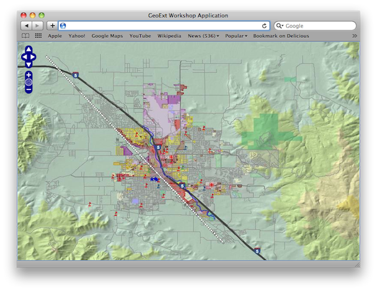

.. _geoext.basics.map:

Creating a Map Window
=====================

In GeoExt, following the conventions of the underlying Ext JS framework, a map
is wrapped into an
`Ext.Panel <http://www.extjs.com/deploy/dev/docs/?class=Ext.Panel>`_. The map is an
`OpenLayers.Map <http://dev.openlayers.org/apidocs/files/OpenLayers/Map-js.html>`_
object.

It is important to understand that Ext JS encourages a web application paradigm,
as opposed to a web page paradigm. This means that we won't create markup, so
the basic ingredients of our application will be:

 * a :ref:`minimal html document <geoext.basics.dissect.document>` to include
   JavaScript and CSS resources,
 * :ref:`JavaScript code <geoext.basics.dissect.init>` for application
   initialization,
 * :ref:`JavaScript code that builds the user interface
   <geoext.basics.dissect.ui>`,
 * "Glue" JavaScript code that makes the pieces work together. We don't have
   any in this basic example, so we will be learning about it later.

.. _geoext.basics.map.example:

Working Example
---------------

Let's take a look at a fully working example of a simple GeoExt application:

.. code-block:: html

    <html>
        <head>
            <title>GeoExt Workshop Application</title>
            <link rel="stylesheet" type="text/css" href="ext/resources/css/ext-all.css">
            
            
            
            

            
        </head>
        <body>
        </body>
    </html>

.. rubric:: Tasks

#.  Copy the text above into a new file called :file:`map.html`, and save
    it in the root of the workshop folder.

#.  Open :file:`map.html` in your web browser.

   
    A working map displaying the town of Medford.

Having successfully created our first GeoExt application, we'll continue by
looking more closely at :ref:`the parts <geoext.basics.dissect>`.

