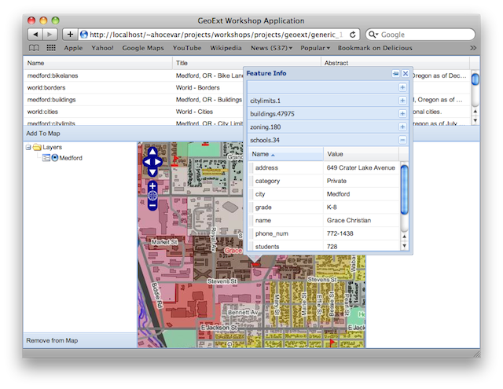

.. _geoext.stores.getfeatureinfo:

Explore Map Features with a WMS GetFeatureInfo Popup
====================================================

With GetFeatureInfo, WMS provides an easy way to query a map for feature info.
Using OpenLayers and GeoExt makes it easy to access this information from
within our application

The OpenLayers WMSGetFeatureInfo control and GeoExt Popups
----------------------------------------------------------

Let's get familiar with `OpenLayers.Control.WMSGetFeatureInfo
<http://dev.openlayers.org/releases/OpenLayers-2.10/doc/apidocs/files/OpenLayers/Control/WMSGetFeatureInfo-js.html>`_
control and
`GeoExt.Popup <http://geoext.org/lib/GeoExt/widgets/Popup.html>`_. Also, the
`Ext.grid.PropertyGrid <http://dev.sencha.com/deploy/dev/docs/?class=Ext.grid.PropertyGrid>`_
will be useful to display the feature info in a nice grid - without the need to
create another store manually.

.. rubric:: Tasks
    
#.  For the popup, we need to include a CSS file in our document's head,
    which provides the styles for the popup's anchor:

    .. code-block:: html

        <link rel="stylesheet" type="text/css" href="geoext/resources/css/popup.css">

    .. note:: GeoExt provides a CSS file which contains all styles that its
        widgets might require. So if you want to avoid having to worry about
        required CSS resources, you can include :file:`geoext-all.css` (or
        :file:`geoext-all-debug.css` for the developer version we are using
        here) instead of :file:`popup.css`.

#.  Now we can create the control. The code below should be added at the end
    of the application's script block:

    .. code-block:: javascript

        controls.push(new OpenLayers.Control.WMSGetFeatureInfo({
            autoActivate: true,
            infoFormat: "application/vnd.ogc.gml",
            maxFeatures: 3,
            eventListeners: {
                "getfeatureinfo": function(e) {
                    var items = [];
                    Ext.each(e.features, function(feature) {
                        items.push({
                            xtype: "propertygrid",
                            title: feature.fid,
                            source: feature.attributes
                        });
                    });
                    new GeoExt.Popup({
                        title: "Feature Info",
                        width: 200,
                        height: 200,
                        layout: "accordion",
                        map: app.mapPanel,
                        location: e.xy,
                        items: items
                    }).show();
                }
            }
        }));
   
    Now let's examine the code we just added a bit.
    
    Note the ``eventListeners`` config option for the WMSGetFeatureInfo control.
    We listen to the "getfeatureinfo" event, which is fired every time we get
    back feature information from the WMS. For each feature that we get back,
    we create a property grid:
    
    .. code-block:: javascript

        Ext.each(e.features, function(feature) {
            items.push({
                xtype: "propertygrid",
                title: feature.fid,
                source: feature.attributes
            });
        });
        
    The PropertyGrid is a very convenient component for a WMSGetFeatureInfo
    control configured with an ``infoFormat`` that returns something we can
    parse (i.e. not plain text or html). We do not need to configure this
    component with a store (like we did for the WMSCapabilities grid), we just
    pass it an arbitrary object (the attributes of a feature here) as
    ``source`` config option, and it will create a store internally and
    populate the grid with its data.
    
    We can easily put a popup on the map and anchor it to the position we
    clicked on the map:
    
    .. code-block:: javascript

        new GeoExt.Popup({
            title: "Feature Info",
            width: 200,
            height: 200,
            layout: "accordion",
            map: app.mapPanel,
            location: e.xy,
            items: items
        }).show();
    
    With the ``location`` config option, we anchor the popup to the position
    where the click occurred (``e.xy``). We give it an "accordion" layout, and
    the items are the property grids we created above.

    Map with a popup populated from WMS GetFeatureInfo

Conclusion
----------

You have successfully created a WMS browser application! The whole application
has about 120 lines of code. Not much when you consider how many features
we were able to pack into it. And it wasn't that hard to develop, was it?
