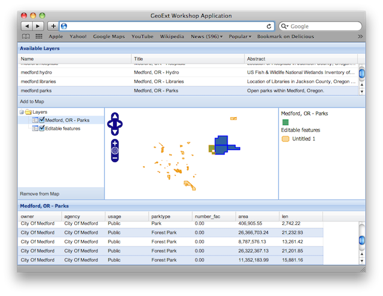

.. _geoext.wfs.grid:

Creating a Synchronized Grid and Map View of WFS Features
=========================================================

GeoExt borrows most of its WFS support from OpenLayers. What it does provide
though is the `GeoExt.data.FeatureStore
<http://geoext.org/lib/GeoExt/data/FeatureStore.html>`_, so showing feature
attributes in a grid is a very easy task. If we just want to display features
in a grid, we can use a `GeoExt.data.ProtocolProxy
<http://geoext.org/lib/GeoExt/data/ProtocolProxy.html>`_, so we don't even
need an OpenLayers layer.

Vector Features on a Map and in a Table
---------------------------------------

Let's build editing functionality into the WMS browser from the
:ref:`previous chapter <geoext.stores>`. But one piece at a time. Let's start
with an `OpenLayers.Layer.Vector
<http://dev.openlayers.org/releases/OpenLayers-2.10/doc/apidocs/files/OpenLayers/Layer/Vector-js.html>`_
for the geometries and a grid for the attributes of the WFS layer.


We'll start
with some code that reads a WFS layer, displays its features on a map, shows
the attributes in a grid, and synchronizes feature selection between map and
grid:

.. rubric:: Tasks

#.  Open the :file:`map.html` file from the previous exercise in a text editor.
    Paste the code below at the bottom of the application's script block:

    .. _geoext.wfs.grid.grid:

    .. code-block:: javascript

        items.push({
            xtype: "grid",
            ref: "featureGrid",
            title: "Feature Table",
            region: "south",
            height: 150,
            sm: new GeoExt.grid.FeatureSelectionModel(),
            store: new Ext.data.Store(),
            columns: [],
            bbar: []
        });

#.  The above does not do much. It just creates an empty grid in the "south"
    region of the application viewport, and prepares a selection model (``sm``)
    that we will use later for synchronizing map and grid selection. Now let's
    populate the grid with features from the medford:parks layer. To do so, we
    change the store and the columns in the above grid definition, and make it
    look like this:
    
    .. code-block:: javascript

        items.push({
            xtype: "grid",
            ref: "featureGrid",
            title: "Feature Table",
            region: "south",
            height: 150,
            sm: new GeoExt.grid.FeatureSelectionModel(),
            store: new GeoExt.data.FeatureStore({
                fields: [
                    {name: "owner", type: "string"},
                    {name: "agency", type: "string"},
                    {name: "name", type: "string"},
                    {name: "usage", type: "string"},
                    {name: "parktype", type: "string"},
                    {name: "number_fac", type: "int"},
                    {name: "area", type: "float"},
                    {name: "len", type: "float"}
                ],
                proxy: new GeoExt.data.ProtocolProxy({
                    protocol: new OpenLayers.Protocol.WFS({
                        url: "/geoserver/ows",
                        version: "1.1.0",
                        featureType: "parks",
                        featureNS: "http://medford.opengeo.org",
                        srsName: "EPSG:4326"
                    })
                }),
                autoLoad: true
            }),
            columns: [
                {header: "owner", dataIndex: "owner"},
                {header: "agency", dataIndex: "agency"},
                {header: "name", dataIndex: "name"},
                {header: "usage", dataIndex: "usage"},
                {header: "parktype", dataIndex: "parktype"},
                {xtype: "numbercolumn", header: "number_fac", dataIndex: "number_fac"},
                {xtype: "numbercolumn", header: "area", dataIndex: "area"},
                {xtype: "numbercolumn", header: "len", dataIndex: "len"}
            ],
            bbar: []
        });

#.  To make this complete, let's also display the geometries on the map, by
    adding a vector layer. Just append the following snippet at the bottom of
    the application code:
    
    .. code-block:: javascript

        var vectorLayer = new OpenLayers.Layer.Vector("Editable features");
        Ext.onReady(function() {
            app.mapPanel.map.addLayer(vectorLayer);
            app.featureGrid.store.bind(vectorLayer);
            app.featureGrid.getSelectionModel().bind(vectorLayer);
        });
    
#.  After saving your changes, point your browser to
    :file:`map.html`. You should see a new grid in the application,
    and geometries rendered on the map in orange. When clicking a row in the
    grid, its geometry gets highlighted on the map. And when clicking a feature
    on a map, its attributes will be highlighted in the grid.



    A synchronized map and grid view of WFS features.

Understanding the Code
``````````````````````
As we already know, we can configure a grid with a store to tell it where to
get its data from. This time we use a `GeoExt.data.FeatureStore
<http://geoext.org/lib/GeoExt/data/FeatureStore.html>`_ that we configure with
a `GeoExt.data.ProtocolProxy
<http://geoext.org/lib/GeoExt/data/ProtocolProxy.html>`_ to access an
`OpenLayers.Protocol.WFS
<http://dev.openlayers.org/releases/OpenLayers-2.10/doc/apidocs/files/OpenLayers/Protocol/WFS/v1-js.html>`_.

The synchronization of selections in the grid and on the map is provided by the
`GeoExt.grid.FeatureSelectionModel
<http://geoext.org/lib/GeoExt/widgets/grid/FeatureSelectionModel.html>`_, which
we use instead of the default selection model:

.. code-block:: javascript

    sm: new GeoExt.grid.FeatureSelectionModel(),

When we add the vector layer to the map, we also have to bind the selection
model and the store to it:

.. code-block:: javascript

    app.featureGrid.store.bind(vectorLayer);
    app.featureGrid.getSelectionModel().bind(vectorLayer);

Note that this is not necessary if the FeatureStore is configured with a
``layer``. But since we create the store before the layer here, we don't have
access to it yet, so we bind it later.

.. _geoext.wfs.grid.bonus:

.. rubric:: Bonus Task

.. Warning::

    Dragons ahead! Understanding the code from this exercise will be hard for
    readers without solid programming background. Please skip this task unless
    
    * you are really, really willing to learn and spend an hour on this,
    * not understanding code that you paste does not make you unhappy.

The need to manually configure a WFS layer with all the fields and columns
makes the application less convenient than we want it to be. Ideally, we could
select a layer in the tree, and the grid would automatically display its
feature attributes, and the features could be selected in the grid and the map.

Many WMS/WFS implementations, like GeoServer in our case, use the same layer
(feature type) names for WMS and WFS. For other WMS implementations, there is
a DescribeLayer request which returns an XML document that gives us the link
from the WMS layer to an associated WFS feature type or WCS coverage. Once we
know the WFS feature type name, we can issue a WFS DescribeFeatureType request
to get the fields and data types for the feature attributes. The disadvantage
of omitting the DescribeLayer request is that the DescribeFeatureType request
will fail for raster layers. This is not a big deal though - in our
implementation it only means that the grid and layer will be cleared when we
select a raster layer.

For this bonus exercise, we assume that the WMS layer name is the same as the
WFS FeatureType name, so we don't issue a WMS DescribeLayer request. But we do
issue a WFS DescribeFeatureType to auto-configure the feature records and the
grid.

#.  GeoExt has an `AttributeStore
    <http://geoext.org/lib/GeoExt/data/AttributeStore.html>`_ which holds the
    field metadata of the feature attributes. It uses
    `OpenLayers.Format.WFSDescribeFeatureType
    <http://dev.openlayers.org/releases/OpenLayers-2.10/doc/apidocs/files/OpenLayers/Format/WFSDescribeFeatureType-js.html>`_
    to obtain this information, but discards anything but the field data. For
    accessing the WFS layer, we also need the feature namespace, so we
    intercept the read method to obtain all of the DescribeFeatureType
    response's raw data. Let's add the following at the end of our script
    block:
    
    .. code-block:: javascript

        var rawAttributeData;
        var read = OpenLayers.Format.WFSDescribeFeatureType.prototype.read;
        OpenLayers.Format.WFSDescribeFeatureType.prototype.read = function() {
            rawAttributeData = read.apply(this, arguments);
            return rawAttributeData;
        };

#.  The FeatureStore and the grid need to be reconfigured when we select a
    different layer in the tree. Append the following function to the
    application code:
    
    .. code-block:: javascript

        function reconfigure(store, url) {
            var fields = [], columns = [], geometryName, geometryType;
            // regular expression to detect the geometry column
            var geomRegex = /gml:(Multi)?(Point|Line|Polygon|Surface|Geometry).*/;
            var types = {
                // mapping of xml schema data types to Ext JS data types
                "xsd:int": "int",
                "xsd:short": "int",
                "xsd:long": "int",
                "xsd:string": "string",
                "xsd:dateTime": "string",
                "xsd:double": "float",
                "xsd:decimal": "float",
                // mapping of geometry types
                "Line": "Path",
                "Surface": "Polygon"
            };
            store.each(function(rec) {
                var type = rec.get("type");
                var name = rec.get("name");
                var match = geomRegex.exec(type);
                if (match) {
                    // we found the geometry column
                    geometryName = name;
                } else {
                    // we have an attribute column
                    fields.push({
                        name: name,
                        type: types[type]
                    });
                    columns.push({
                        xtype: types[type] == "string" ?
                            "gridcolumn" :
                            "numbercolumn",
                        dataIndex: name,
                        header: name
                    });
                }
            });
            app.featureGrid.reconfigure(new GeoExt.data.FeatureStore({
                autoLoad: true,
                proxy: new GeoExt.data.ProtocolProxy({
                    protocol: new OpenLayers.Protocol.WFS({
                        url: url,
                        version: "1.1.0",
                        featureType: rawAttributeData.featureTypes[0].typeName,
                        featureNS: rawAttributeData.targetNamespace,
                        srsName: "EPSG:4326",
                        geometryName: geometryName,
                        maxFeatures: 250
                    })
                }),
                fields: fields
            }), new Ext.grid.ColumnModel(columns));
            app.featureGrid.store.bind(vectorLayer);
            app.featureGrid.getSelectionModel().bind(vectorLayer);
        }
    
    Note that the way we build the ``fields`` and ``columns`` arrays results in
    exactly the same configuration for the medford:parks layer that we manually
    wrote in the previous exercise.

#.  When a layer is selected in the tree by clicking on its name, we want to
    issue a DescribeFeatureType request. This is done by appending the
    following code:
    
    .. code-block:: javascript
    
        function setLayer(model, node) {
            if(!node || node.layer instanceof OpenLayers.Layer.Vector) {
                return;
            }
            vectorLayer.removeAllFeatures();
            app.featureGrid.reconfigure(
                new Ext.data.Store(),
                new Ext.grid.ColumnModel([])
            );
            var layer = node.layer;
            var url = layer.url.split("?")[0]; // the base url without params
            var schema = new GeoExt.data.AttributeStore({
                url: url,
                // request specific params
                baseParams: {
                    "SERVICE": "WFS",
                    "REQUEST": "DescribeFeatureType",
                    "VERSION": "1.1.0",
                    "TYPENAME": layer.params.LAYERS
                },
                autoLoad: true,
                listeners: {
                    "load": function(store) {
                        app.featureGrid.setTitle(layer.name);
                        reconfigure(store, url);
                    }
                }
            });
        }

        Ext.onReady(function() {
            app.tree.getSelectionModel().on(
                "selectionchange", setLayer
            );
        });
    
    Note that this code calls the ``reconfigure`` function in the store's load
    handler. So when the user selects a layer in the tree, ``setLayer`` is
    called as ``selectionchange`` handler on the tree's selection model, and
    the DescribeFeatureType request for the selected layer is issued. Once the
    response is available, ``reconfigure`` is called.

#.  After saving your changes, point your browser to
    :file:`map.html`. When you have added a layer to the map that
    is available as WFS also and select it in the tree, the grid will be
    populated with the layer's feature attributes, and the features will be
    rendered on the map.

Next Steps
----------

Just displaying vector features is somewhat boring. We want to edit them. The
:ref:`next section <geoext.wfs.editing>` explains how to do that.