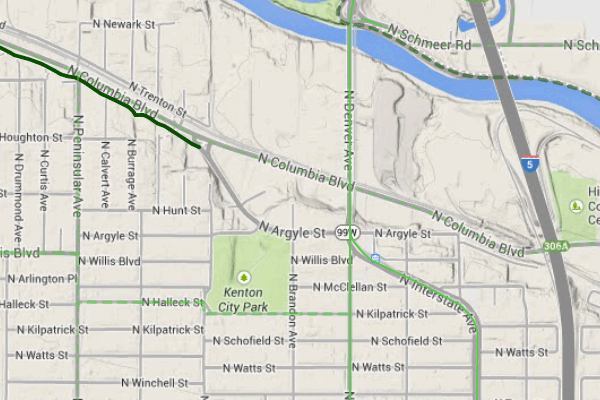

.. _cmd.rollback:

Rolling back a change
---------------------

Perhaps adding in that new route into the system was a bit premature. Let's remove it.

We could remove the feature one of two ways:

* **Remove the feature and make a new commit** showing the removal. This would preserve the history of both commits.
* **Roll back to the previous commit.** This would eliminate the commit from the timeline, as if it never happened.

We will opt for the second option here: to roll back.

.. warning:: The process of rolling back is only for removing the most recent commit(s). It is not trivial to remove a commit in between other commits that you wish to keep.

Performing the roll back
~~~~~~~~~~~~~~~~~~~~~~~~

Performing a roll back, as mentioned above, just means that we remove (delete) a commit from the timeline. In effect, the change ceases to have ever existed.

This is done via the :term:`reset` command, setting the destination to the commit prior to the current one. The current state fo the repository is represented by the phrase **HEAD**, while the commit before is represented by **HEAD~1**, the commit before that **HEAD~2**, etc.

The ``reset`` command can act with varying levels of severity after removing the commit:

* **Soft**: The changes remain in the index and working tree, so that the changes would just need to be commited in order to be restored. This is useful if you would like to change the commit in some way.
* **Mixed**: *(Default)* The changes remain only in the working tree, so that the changes would need to be **added and then commit** in order to be restored. This is also useful if you would like to change the commit in some way.
* **Hard**: The changes do not remain at all. This is useful if you would like to remove all traces of the commit, and leave the repository is a pristine state.

It is this last option that we will employ.

.. warning:: Modifying history can result in lost data, so please be careful with these commands!

#. To remove the most recent commit, run the following command:

   .. code-block:: console

      geogig reset HEAD~1 --hard

   .. note:: You can also reference the commit by ID, but make sure that this is the last ID that you wish to keep, not the one that you wish to remove! In the case above, the command would be ``geogig reset 603d4bf``.

#. There will be no output after the command. Run ``geogig status`` to see that there are no staged or unstaged changes:

   ::

      # On branch master
      nothing to commit (working directory clean)

#. Now run ``geogig log`` to see that the commit is now gone.

   ::

      Commit:  603d4bf0069203a42ac513f635f49f725c2a4f2a
      Author:  Author <author@example.com>
      Date:    (29 minutes ago) 2014-08-01 17:21:23 -0
      Subject: The Sellwood Gap has now been fixed

      Commit:  cfdbd50c415a0d71b9a876eb51f90d5752e8f23b
      Author:  Author <author@example.com>
      Date:    (39 minutes ago) 2014-08-01 17:10:30 -0
      Subject: Initial commit of complete bikepdx layer

Viewing the roll back
~~~~~~~~~~~~~~~~~~~~~

More importantly, we want to **view** the results of the rollback.

Up to this point, we had been making changes in to the data via QGIS, and then storing those changes in GeoGig. But now, with our commits altered, we need to make our data (and thus QGIS) aware of the changes.

This involves using the :term:`export` command. We will export the current state of the repository to our shapefile, and then update the view in QGIS.

.. warning:: We will modify the shapefile while it is already open in QGIS for editing. When this occurs, QGIS will prevent any future edits in order to prevent data corruption, and consequently, we will first close our QGIS project and reopen it *after* rolling back. 

#. Export the current state of the repository:

   .. code-block:: console

      geogig shp export -o bikepdx ../data/cmd/bikepdx.shp

   ::

      Exporting bikepdx...
      100%
      bikepdx exported successfully to bikepdx

#. Refresh the view in QGIS using :menuselection:`View -> Refresh`. 

   The feature has been removed by GeoGig

(Optional) Safely rolling back changes
--------------------------------------

In addition to using the ``geogig reset`` command to roll back changes, GeoGig also provides a "safe" way of rolling back that preserves all your history. The ``revert`` command will create a new commit that is the inverse of the previous commit.

For example, ``geogig revert HEAD`` will create a new commit that looks like this::

   Commit:  8914967037568bdd2cfa1b2ed85ed8bf453add25
   Author:  Author <author@example.com>
   Date:    (10 minutes ago) 2014-08-06 21:34:58 +0000
   Subject: Revert 'The Sellwood Gap has now been fixed'
   This reverts 603d4bf0069203a42ac513f635f49f725c2a4f2a 

(Optional) Exporting to alternate formats
-----------------------------------------

We exported the current state of the repository in order to sync up our QGIS view.

But there are other reasons to export a GeoGig repository: to make a copy, to make a backup, or to convert to an alternate data format. It is this last situation that we will discuss here.

GeoGig can export to a number of different formats, including:

* PostGIS
* GeoJSON
* SpatiaLite
* Oracle Spatial

For a full list of options, please see the :ref:`GeoGig documentation <moreinfo.resources>`.

.. note:: The same data sources are available for import as well.

The command to export is ``geogig <format> export <parameters>``. For GeoJSON, ``<format>`` is ``geojson``.

#. Export the current state of the repository to a GeoJSON file:

   .. code-block:: console

      geogig geojson export bikepdx bikepdx.json

   ::
 
      Exporting from bikepdx to bikepdx... 
      100%
      bikepdx exported successfully to bikepdx.json

   The first ``bikepdx`` refers to the layer inside the repository. What follows (``bikepdx.json``) is the name of the output file. As before, you may use ``-o`` to overwrite an existing file if it exists. This file will be exported to your repo directory unless another path is specified.
