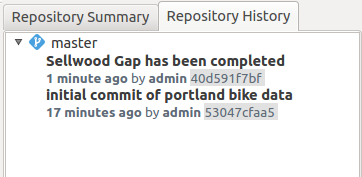

.. _gui.branch:

Working with branches
=====================

Mirroring our work on the :ref:`command line <cmd.branch>`, we will now extend our scope to include branches. Specifically, we will create a new branch, perform work on it, and then merge that work into our master branch.

Create a new branch
-------------------

By default, all work happens on the ``master`` branch. We can see that the current branch is ``master`` in the Repository Explorer, on the left side (or top, if docked).

   Repository Explorer showing master branch

#. Click the :guilabel:`Change` button, right next to the word ``master``. This will bring up a dialog where you can change where you are working. You can select a specific branch, tag, commit, or date.

   .. note:: While we haven't talked about "tags" here, you can think of them as a special type of snapshot. A tag can be created from any branch, but one does not "work on" the tag; it remains fixed. Tags are most often used to manage software releases, where an exact snapshot needs to be referred to in a human-readable way.

   .. figure:: img/branch_reference.png

      List of possible references

#. Click the drop-down for the branches. Notice that ``master`` is the only option.

   .. figure:: img/branch_onebranch.png

      Only one branch in this repository

#. There is also an option in this dialog to create a new branch. Click :guilabel:`Create branch`, and in the box below, enter ``sandbox``.

   .. figure:: img/branch_createnewbranch.png

      Creating a new branch

#. Click :guilabel:`OK` to create the new branch.

#. You will see in the Repository Explorer that the new branch is being used. Note that all of the commits from the ``master`` branch are seen on this new branch as well.

   .. figure:: img/branch_explorersandbox.png

      New sandbox branch

All commits created now will be placed on the ``sandbox`` branch, until or unless we switch to another branch.

Making a commit on a branch
---------------------------

Let's add a new feature and then make a commit on this new branch.

#. Add a new feature in QGIS. Refer to previous sections if necessary:

   .. figure:: ../cmd/img/branch_newfeature.png

      New bike lane added (diagonal)

   .. note::

      In the figure above, the following attribute values were used:

      * ``id``: ``6774``
      * ``segmentnam``: ``DURHAM AVE``
      * ``status``: ``RECOMM``
      * ``facility``: ``MTRAIL``
      * ``facilityde``: ``Multi-use Trail``

#. When you :guilabel:`Toggle Editing` to save the changes, GeoGig will notice that the repository has changed, and will ask if you want to update the repository. Click :guilabel:`Yes`.

   .. figure:: img/commit_update.png

      Dialog to update the repository

#. In the commit dialog box that follows, enter the following message: "New [name] bike lane added", where [name] is the name of the lane as given in the attribute.

   .. figure:: img/branch_newlanemessage.png

      Commit message

#. The commit will proceed, and you will now see it in the list of commits in the Repository explorer:

   .. figure:: img/branch_sandboxcommits.png

      Three total commits on the sandbox branch

#. The commit is only on the ``sandbox`` branch, though. Click :guilabel:`Change` and bring up the branch selection dialog.

#. Select the ``master`` branch and click :guilabel:`OK`.

   .. figure:: img/branch_switchtomaster.png

      Switching to the master branch

#. Notice that the most recent commit is not there.

#. Notice as well that when the branch changed, QGIS is aware of the change, and asks if you want to update the view. Check the box next to the ``bikepdx`` layer, and click :guilabel:`OK`.

   .. figure:: img/branch_updatelayers.png

      Updating the layer view in QGIS

The feature that you just created will be removed from the map view.

Merging branches
----------------

If we merge the ``sandbox`` branch with the ``master`` branch, that one commit that we made will become part of the ``master`` branch. Let's do that.

#. At the very top of the Repository Explorer, you will see four buttons. Click the :guilabel:`Merge` button.

   .. figure:: img/branch_repobuttons.png

      Four buttons in the Repository Explorer

#. This will bring up the merge dialog. As before, merges are done from the target, so because we are on the ``master`` branch, we will merge another branch onto it.

#. Select the ``sandbox`` branch in the branch selection dialog and click :guilabel:`Merge`.

   .. figure:: img/branch_mergesandbox.png

      Merge dialog

#. The merge will proceed. QGIS will once again ask you to update the layer, so check the ``bikepdx`` box again and click :guilabel:`OK`.

#. You will see that the commit from the ``sandbox`` branch is now on the ``master`` branch.

   .. figure:: img/branch_commitsonmaster.png

      A successful merge

.. todo:: How to delete the branch?

