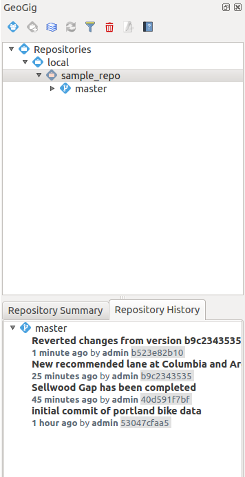

.. _gui.branch:

Working with branches
=====================

Mirroring our work on the :ref:`command line <cmd.branch>`, we will now extend our scope to include branches. Specifically, we will create a new branch, perform work on it, and then merge that work into our master branch.

Create a new branch
-------------------

By default, all work happens on the ``master`` branch. We can see that the current branch is ``master`` in the Repository Explorer on the top, and the Repository History on the bottom.

   Repository Explorer showing master branch

#. In the :guilabel:`Repository History` select the latest commit and select :menuselection:`Create new branch at this version`.

   .. figure:: img/branch_create.png

      Creating a branch from version

   .. note:: While we haven't talked about "tags" here, you can think of them as a special type of snapshot. A tag can be created from any branch, but one does not "work on" the tag; it remains fixed. Tags are most often used to manage data product releases, where an exact snapshot needs to be referred to in a human-readable way.

#.  In the dialog box that pops up, enter ``sandbox`` as the name for the new branch.

   .. figure:: img/branch_createnewbranch.png

      Creating a new branch called sandbox

#. Click :guilabel:`OK` to create the new branch. The new branch will appear in the :guilabel:`Repository Navigator`.

   .. figure:: img/branch_history.png

      Branch history

#. Now when we commit changes we can select which branch to apply our changes to in the :guilabel:`Commit Dialog`.

   .. figure:: img/branch_selection.png

      Commit dialog with multiple branches

Making a commit on a branch
---------------------------

Let's add a new feature and then make a commit on the new branch.

#. Make sure we're using the correct ``bikepdx`` version. Expand the ``sandbox`` branch in the :guilabel:`Repository Explorer` and click ``Add to QGIS``. This will refresh the map and active layer with the ``sandbox`` version.

   .. figure:: img/branch_activebranch.png

      Adding a version from the sandbox branch

#. Add a new feature in QGIS. Refer to previous sections if necessary:

   .. figure:: ../cmd/img/branch_newfeature.png

      New bike lane added (diagonal)

   .. note::

      In the figure above, the following attribute values were used:

      * ``id``: ``6774``
      * ``segmentnam``: ``DURHAM AVE``
      * ``status``: ``RECOMM``
      * ``facility``: ``MTRAIL``
      * ``facilityde``: ``Multi-use Trail``

#. After you are happy with your changes click :guilabel:`Toggle Editing` to save your changes. Now commit them to the repository by right clicking the layer and select :menuselection:`Geogig --> Sync layer with repository branch...`. In the commit dialog, select the ``sandbox`` branch and enter the following message: "New [name] bike lane added", where [name] is the name of the feature as given in the attribute.

   .. figure:: img/branch_newlanemessage.png

      Commit message

#. The commit will proceed, and in the repository history under the sandbox branch the new commit will appear.

   .. figure:: img/branch_sandboxcommits.png

      Five total commits on the sandbox branch

#. The commit is only on the ``sandbox`` branch, though.

#. We could use :guilabel:`Add to QGIS` to load the **master** branch layer into QGIS, as we did for the **sandbox** branch, but we'll try out another method to update the layer. Select the ``master`` branch, right click the most recent commit, and click :guilabel:`Change 'bikepdx' layer to this version`.

   .. figure:: img/branch_switchtomaster.png

      Switching to the master branch

#. Notice that the feature we created and committed is not there.

Merging branches
----------------

If we merge the ``sandbox`` branch with the ``master`` branch, that one commit that we made will become part of the ``master`` branch. The ``merge`` function is currently under development, we will try it out here to demonstrate it. However, we can always use the command line to merge our branches, as shown in the previous section.

#. Right-click the ``sandbox`` branch, select :guilabel:`Merge this branch into` and choose the ``master`` branch.

   .. figure:: img/branch_merge.png
   
    Merging the ``sandbox`` branch into ``master``

#. We've now successfully merged our changes into the ``master`` branch. You can check the history of the ``master`` branch to see the merged commit.

   .. figure:: img/branch_postmerge.png

      The commit made on ``sandbox`` is now on the ``master`` branch.
