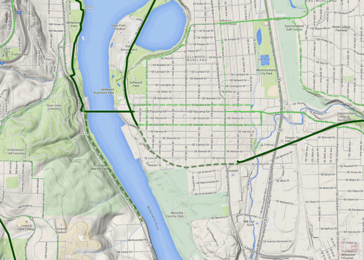

.. _gui.commits:

Working with commits
====================

We will now replay the same work as done in the :ref:`cmd` section, starting with commits.

Workflow changes
----------------

With the GeoGig command line interface, the workflow was Import, Add, Commit. With the plugin, all these steps are compacted into a single process.

When a change is made and ready to commit you can synchronize it with a repository. You will be prompted for a commit message, and a target repository to update. This is a big advantage of using the plugin over the command line interface, as it leads to fewer steps (and thus less room for error). Most importantly, there will never be a situation where there is a difference between what is displayed in QGIS and the current state of the repository. It is all handled for us.

Making an attribute change
--------------------------

Recall from the section on :ref:`cmd.commit` on the command line that the Sellwood Gap needs fixing. Let's do it in the same way, by changing the ``status`` attribute value for the feature to ``active``.

   Sellwood Gap

Editing a feature
~~~~~~~~~~~~~~~~~

#. Open the attribute table.

#. Click the pencil to :guilabel:`Toggle Editing`.

#. Find the feature (``id = 6703``) in the table. 

#. Edit the value of the ``status`` attribute to say ``ACTIVE``.

   .. figure:: ../cmd/img/commit_featureedited.png

      Editing the feature attribute

#. Click the pencil icon again to save changes.
   
   .. figure:: img/commit_save1.png
      
      Save dialog for bikepdx

#. Now to add the changes to our repository. Right click the layer and go to :menuselection:`GeoGig` and select :menuselection:`Sync layer with repository branch...`

   .. figure:: img/commit_geogigmenu.png

      Updating the repository with layer changes

#. Updating the repository will display a dialog asking for a commit message. Enter :kbd:`The Sellwood Gap has now been fixed` and click :guilabel:`OK`.

   .. figure:: img/commit_sellwoodmessage.png

      Entering the commit message

#. The commit will be added to the repository and you will see it in the list of commits in the :guilabel:`repository history`.

   .. figure:: img/commit_explorer.png

      Two commits in the Repository explorer

Notice also that the map has been updated.

Viewing the commit details
~~~~~~~~~~~~~~~~~~~~~~~~~~

Much like the ``diff`` command mentioned before, you can see details about any commit.

#. Return to the GeoGig Navigator and select the most recent (top) commit message in the repository history. Right click :menuselection:`Show detailed description of this version`.

   .. figure:: img/commit_detail.png

      Request detailed description of commit

#. This will bring up a :guilabel:`Version description`.
   
   .. figure:: img/commit_version_description.png
      
      Description of selected commit

#. Right click :menuselection:`Show changes introduced by this version`. This will bring up a the :guilabel:`Comparison view` to compare the two versions.

   .. figure:: img/commit_comparison.png

      Comparison view

#. The only layer in our repository is shown, the ``bikepdx`` layer. Click the layer to expand to show the changes. Click the ``Modified`` features to display the feature we modified, select a feature to see the changes between versions in table format.

#. If the geometry has change there will be a :guilabel:`Vew Detail` button in the :guilabel:`Change type` column. Clicking this will bring up a new dialog box showing a visual of the geometry change.

   .. figure:: img/commit_geom.png

      Geometry comparison view

#. Close the :guilabel:`Geometry comparison` and :guilabel:`Comparison view`. The ESC key can also close the :guilabel:`Comparison view` window.

Making a geometry change
------------------------

Let's see what happens when we make a geometry change. We'll now add a new bike lane. Again, you can draw it anywhere you want.

Editing a feature
~~~~~~~~~~~~~~~~~

#. Select :menuselection:`Layer --> Toggle Editing` to start the editing process.

#. Zoom into an area of the map where you would like to place the new feature.

   .. figure:: ../cmd/img/commit_addbefore.png

      A zoomed in area of the map

#. Now add a feature by selecting :menuselection:`Edit --> Add Feature`.

   .. figure:: ../cmd/img/commit_addfeature.png

      Add feature menu option

#. Click on the map to place the initial vertex of the feature. Continue clicking to create each feature vertex.

   .. figure:: ../cmd/img/commit_addduring.png

      Drawing a new feature

#. Right-click when done. An attribute table dialog will display. Fill out the form, specifically entering in the following values:

   * ``id``: ``6773``
   * ``segmentnam``: [approximate street name, if known]
   * ``status``: ``RECOMM``
   * ``facility``: ``MTRAIL``
   * ``facilityde``: ``Multi-Use Trail``

   .. note:: Note the ``geogigid`` field. Leave this field as-is.

   .. figure:: img/commit_addattributes.png

      Setting attributes for the new feature

#. Click :guilabel:`OK` when done.

#. Your feature will be displayed and styled with a dashed line (because ``status`` is not ``ACTIVE``):

   .. figure:: ../cmd/img/commit_addafter.png

      New feature added

#. Select :menuselection:`Layer --> Toggle Editing` to complete the editing process. Click :guilabel:`Save` when prompted.

#. At this point we still need to add our changes to the repo. Right click the layer again and select :menuselection:`Sync layer with repository branch...`. When asked enter a commit message and then click :guilabel:`OK`.

   .. figure:: img/commit_newlanemessage.png

      Commit message for new bike lane

#. The commit will be added, and will be shown in the Repository explorer.

   .. figure:: img/commit_explorer2.png

      Repository explorer now with three commits

Viewing the commit details
~~~~~~~~~~~~~~~~~~~~~~~~~~

#. To view details about the commit, select the commit message in the GeoGig Navigator and right-click :menuselection:`Show changes introduced by this version`. This will bring up the :guilabel:`Comparison view` again.

#. Expand the ``bikepdx`` tree, and click the ``Added`` entry to see the new feature.

#. The window will display the attributes before the change (in this case, blank) and after the change.

   .. figure:: img/commit_comparefeature.png

      New feature commit comparison

#. Close the :guilabel:`Comparison view` window.

Rolling back a change
---------------------
 
Now let's roll back that last change.

#. In the :guilabel:`Layers Panel` right-click on the ``bikepdx`` layer and select :guilabel:`Revert changes introduced by a version...`. 

   .. figure:: img/commit_revert.png

      Geogig menu with Revert changes option

#. Select the top commit (the feature we just added), and click :guilabel:`Ok`. 

   .. figure:: img/commit_revertlast.png

      Reverting the repository to before adding the new feature.

#. This will update the ``bikepdx`` layer to the state it was in before the selected commit (no new feature). The map window will update, and the feature added in the previous section will be removed. But we still need to commit this change to the repository. Right click the ``bikepdx`` layer and select :menuselection:`Sync layer with repository branch...`, notice that a commit message has already been added for us. Click :guilabel:`Ok` to accept the commit.

   ..figure:: img/commit_revertmsg.png

      Default revert commit message

#. The :guilabel:`Repository History` now shows our commit reverting the new feautre.
  
   .. figure:: img/commit_revert2.png

      History after revert
   
   
