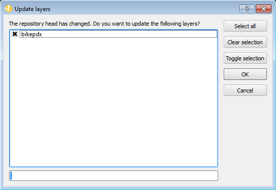
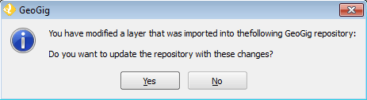

.. _gui.export:

Exporting data
==============

In the command-line version of GeoGig, we needed to export the current state of the repository to the data source (overwriting what was there) every time we wanted update our view. 

In QGIS, this step is not necessary, as the GeoGig plugin automatically keeps the data source in sync with what is shown in QGIS:

   Dialog for updating the QGIS view when the repository has changed 

   Dialog for updating the repository when the QGIS layer has changed

That said, the export command allows for exporting data to forms other than the native data source, and this is also an option in the QGIS plugin. We will now export the current state of the repository to a shapefile.

#. One of the four buttons at the top of the Repository Explorer is the :guilabel:`Export` button. Click it. This will bring up the Export dialog. In this dialog, you can create shapefiles, SpatiaLite databases, and PostGIS exports. You can create these using the current state of the repository, or even any reference point such as another branch of tag.

   .. figure:: img/branch_repobuttons.png

      Buttons at the top of the repository Explorer

#. We are interested in exporting the current state of the repository. Click the :guilabel:`bikepdx` option in the layer list to select that layer. In the area marked :guilabel:`Export to:`, click the :guilabel:`Shapefile` tab if it isn't already clicked. Finally, enter the path and name of file to export to.

   .. figure:: img/export_dialog.png

      Export dialog

   .. note:: If you're curious to see the exported shapefile, you can check :guilabel:`Open in QGIS after exporting` or, alternately, add the shapefile to the project manually after export.

#. Click :guilabel:`Export`.

   .. figure:: img/export_exporting.png

      Exporting

#. QGIS will prepare the data for export. When finished, you will see a confirmation dialog.

   .. figure:: img/export_success.png

      Export success

#. Verify that the shapefile has been created at the path specified.

   .. note:: Use :menuselection:`Layer --> Add Vector Layer` to add the shapefile to QGIS if desired.

