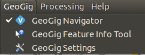
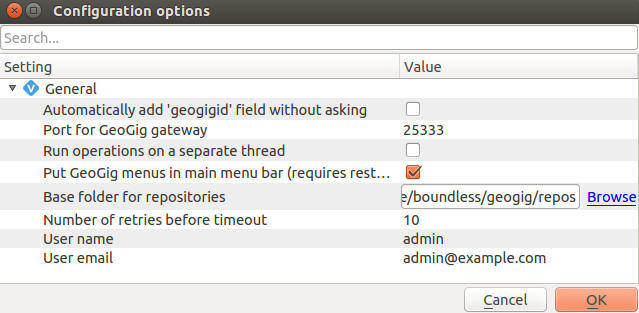
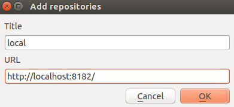

.. _gui.setup:

Setting up a new project
========================

We have now seen the GeoGig command line interface, and have performed basic management of a geospatial repository with it.

There is also a GeoGig plugin for QGIS, that accomplishes most of the same things, but in a graphical form.

Our goal now is show the exact same workflows we saw in the :ref:`cmd` section, but using the GeoGig plugin for QGIS. As a data administrator, you will then have a choice to use whichever tool makes the most sense for your team.

.. todo:: How do people get this plugin?

.. todo:: Has the plugin already been installed? Or installed an not activated? Need to figure this out.

.. warning:: This plugin is considered **beta software** and should not be used in production systems at the moment.  

.. note:: Since this workshop was written the QGIS GeoGig plugin has been further streamlined taking care of setting new repositories and running a GeoGig gateway as required.
   
   The GeoGig gateway is a server designed to listen to changes that affect GeoGig repositories, much like how PostgreSQL has a running process listening for action performed on its databases.
   The ``geogig-gateway`` is often left running in a terminal window or as background process, allowing applications to make changes.
   
   The qgis-geogig-plugin will take care of running ``geogig-gateway`` as required to communicate with your repository.

Starting the GeoGig server
--------------------------

The GeoGig QGIS plugin requires a running GeoGig server to connect to. For this workshop we will serve local repositories from within our VM. 

#. Open a new terminal and navigate to the :file:`geogig/repos` directory, creating the :file:`repos` directory if it doesn't exist. This directory will house all the repositories for this workshop. 

   .. code-block:: console

      cd geogig/repos

#. From within the :file:`repos` directory start the GeoGig server. Once the server is running we can connect to it from QGIS.

   .. code-block:: console

      cd ..
      geogig serve -m 

#. Our data manager will need a separate repository directory from the GIS analysts. We'll create this directory now and come back to it later. Open second terminal if you don't have one already and type:

   .. code-block:: console

      cd ~/geogig
      mkdir qa_repos

Preparing Data
--------------

Currently the GeoGig plugin requires that all data must be in ``geopackage`` format. Before continuing we will convert the :file:`bikepdx.shp` into a ``geopackage``.

#. We'll use a fresh copy our shapefile, located at ``~/data/gui/`` for this section. Add the :file:`bikepdx.shp` as a :guilabel:`New Vector Layer` if it's not already in the layers panel.

#. Right click the ``bikepdx`` layer and select :menuselection:`Save As`. This will open a new dialog box  with a variety of save options. We are only concerned with the :guilabel:`Format`. Select ``GeoPackage`` from the list of formats.

   .. figure:: img/gui_saveas.png

      Saving a shapefile as a GeoPackage

#. Use the :guilabel:`Browse` button and save this in a convenient location. Such as the ``~data/gui`` folder. 

#. Click :guilabel:`Ok`, the new file will be added as to the :guilabel:`Layers Panel`. We no longer need the shapefile layer and can remove it from the panel.

.. note:: You can hover over each layer to identify the source of the layer.

#. Now we can apply the style to the layer and add the ``OpenLayers`` plugin as we did before. 

Installing the plugin 
---------------------

You may need to add the GeoGig plugin to QGIS, this is done through the QGIS Plugin Manager. To install the plugin go to :menuselection:`Plugins -> Manage and Install Plugins`, then search for GeoGig plugin and select it, click :menuselection:`Install plugin`. The plugin is now installed and should open the Navigator window.

Exploring the plugin
--------------------

The plugin is first accessed through the ``GeoGig`` menu, which contains three options:

* :guilabel:`GeoGig Navigator`: Repository manager
* :guilabel:`GeoGig Settings`: Configures GeoGig
* :guilabel:`GeoGig Feature Info Tool`: Feature info tool specific to GeoGig.

.. todo:: More about the featureinfo tool?

   GeoGig menu

Setting the repo directory
--------------------------

The :guilabel:`GeoGig Settings` allows us to change some general settings for working in QGIS. The only setting we need to concern ourselves with is the :menuselection:`Base folder for repositories`. Click the browse button and select the */home/boundless/geogig/repos* folder and click :guilabel:`Open`. 

   GeoGig Settings menu

.. note:: If we haven't set our global user name and email yet, or need to change them, we can do so here. 

Connecting to a GeoGig server
-----------------------------

Before we can work with GeoGig in QGIS we must connect to a GeoGig server. We'll connect the the local server we just started.

#. Click the :guilabel:`Add GeoGig Server` button.

#. A new dialog box will open. Enter ``local`` as the :guilabel:`Title` and ``http://localhost:8182`` as the :guilabel:`URL`. 

   Add a new GeoGig server connection

Creating a new repo
-------------------

In order to show the full lifecycle of working with repos with the plugin, we will not be using the repository stored in the ``repos`` directory, but will instead create a new one.

#. Open the :guilabel:`GeoGig Navigator`, if it is not already.

#. Click :guilabel:`Create new repository` button

   .. figure:: img/setup_repolistblank.png

      GeoGig repository list

#. In the section titled :guilabel:`Enter the new repository name` use ``repo_gui`` as the repository name.

   .. figure:: img/setup_newrepo.png

      Name of new repository
      
#. Click :guilabel:`OK`.

#. Select the ``bikepdx`` layer and :menuselection:`GeoGig --> Add layer to Repository`.

   .. figure:: img/setup_add_to_repo.png
      
      Add bikepdx to repository

#. You will then be asked which repository and for an initial commit message. Only click the :guilabel:`Add layer`` button once, it takes a couple seconds to process the import.
      
   .. figure:: img/setup_firstcommit.png

      First commit in the repository

#. The repo will be created, and the data imported.

   .. figure:: img/setup_importing.png

      Importing

#. The repo will then be listed in the ``GeoGig Navigator``. Notice that the GeoGig Navigator provides both a repository summary and history in the bottom half of the panel.

   .. figure:: img/setup_repolist.png

      Repository list showing new repository and commit in history

   It is in this dialog that we will be performing many of the operations on the GeoGig repository, taking the place of the command line tool.

.. note:: When you close this dialog and want to get it back again, navigate to :menuselection:`GeoGig --> GeoGig Navigator`.
