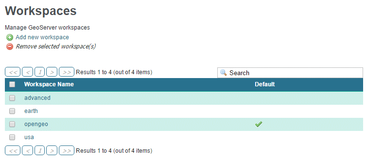

.. _gsadv.catalog.rest:

REST configuration
==================

GeoServer includes a RESTful API for interacting with the catalog without the need to go through the web-based interface.

In this section we'll work with some data that has been loaded into OpenGeo Suite using the REST interface.

What is REST?
-------------

REST stands for **REpresentational State Transfer**. You can take this to mean the transfer (to and from a server) of representations of an object's state. Or, more simply, an interface for changing settings in GeoServer GeoServer has a RESTful API to and from which you can send and receive (respectively) state representations of GeoServers resource types.

The capabilities of the REST API consist of **actions** (verbs) we can use to make HTTP requests **combined with the configurable resources** in GeoServer.

So, for each of the resources in GeoServer (workspaces, stores, layers, styles, layer groups, etc.) we can perform the following operations:

* **GET** to read an existing resource
* **POST** to *add* a new resource
* **PUT** to *update* an existing resource
* **DELETE** to remove a resource

.. figure:: img/rest_theory.png

   Diagram of the RESTful interface

.. note:: The full capacity of GeoServer's REST capabilities are described at http://docs.geoserver.org/stable/en/user/rest/api/

REST endpoints
--------------

The top of the REST hierarchy starts here::

  http://localhost:8080/geoserver/rest/

.. note:: Throughout this workshop, we'll assume that GeoServer is responding at ``http://localhost:8080/geoserver/``, but all examples should work with substitution for the location of your instance.

.. figure:: img/rest_roothtml.png

   REST root endpoint in browser (HTML)

#. Navigate to the above URL. If you haven't logged in through the web admin interface prior to this, you'll be asked for administrator credentials. Enter ``admin`` / ``geoserver`` and click :guilabel:`OK`.

#. When viewing this endpoint through your browser, you will see a number of links that match GeoServer's resource hierarchy. Click the following links to traverse the hierarchy:

   #. :guilabel:`workspaces` (leads to ``/rest/workspaces``)
   #. :guilabel:`earth` (leads to ``/rest/workspaces/earth.html``)
   #. :guilabel:`earth` (leads to ``/rest/workspaces/earth/datastores/earth.html``)
   #. :guilabel:`cities` (leads to ``/rest/workspaces/earth/datastores/earth/featuretypes/cities.html``)

   .. figure:: img/rest_ftypehtml.png

      Cities featuretype endpoint in browser (HTML)

   Every time we click one of these links, we are making a GET request. Notice the format for the content we are receiving is HTML. Unless otherwise specified this is the default format for GET requests.

#. GET requests are intended for navigation and discovery. However, when looking at the HTML output, few details are shown. More details can be retrieved by requesting information in a format other than HTML, such as JSON or XML. These can be specified by setting the appropriate extension to the request. Adjust the URL endpoint to show JSON by changing ``.html`` to ``.json``::

     /rest/workspaces/earth/datastores/earth/featuretypes/cities.json

#. Adjust the URL endpoint to show XML by changing ``.json`` to ``.xml``::

     /rest/workspaces/earth/datastores/earth/featuretypes/cities.xml

   .. figure:: img/rest_ftypexml.png

      Cities featuretype endpoint in browser (XML)

   Both JSON and XML output show more detailed information about the given resource, such as attribute names and values. XML will be used in the upcoming examples.

These GET requests are "read-only", so to leverage the bi-directional nature of REST, we can use other actions. Specifically, we can transfer new state representations (changes) to a collection using POST, update existing state representations to an object using PUT, or remove resources using DELETE.

.. note:: 

   Remember: 

   * For new objects, use POST.
   * For updating existing objects, use PUT.

Examples
--------

We will be using the `cURL <http://curl.haxx.se>`_ utility in this section for POST/PUT/DELETE requests, though other utilities will work just as well.

Create a new workspace
~~~~~~~~~~~~~~~~~~~~~~

First, let's create a new workspace called "advanced". This will be used for the data that was loaded into a PostGIS database of the same name. We want to POST the following resource information to the ``/rest/workspaces`` endpoint:

.. code-block:: xml

   <workspace>
     <name>advanced</name>
   </workspace>

This is accomplished by the following cURL command:

.. note:: Commands in this section are wrapped over multiple lines for legibility.

::

  curl -u admin:geoserver -v -X POST -H "Content-Type:text/xml"
    -d "<workspace><name>advanced</name></workspace>"
    http://localhost:8080/geoserver/rest/workspaces

Execute this command.

While a deep discussion of cURL is beyond the scope of this workshop, some of the details of this request will be helpful. The command line flags are as follows::

  -u/--user[:password] (credentials)
  -v/--verbose (show more output)
  -X/--request (the action/verb to use)
  -H/--header (header)

Likewise, the output is verbose and most of it doesn't concern us here. The most important information to glean is whether the request was successful of not. You should see the following in the response::

  < HTTP/1.1 201 Created

.. figure:: img/rest_addworkspace.png

   Add workspace console output

If you see an error such as::

  < HTTP/1.1 500 Internal Server Error

Please check your syntax to make sure it matches the above example exactly.

You can also verify that the workspace was created through the GeoServer UI. Click :guilabel:`Workspaces` and you should see :guilabel:`advanced` in the list.

   New workspace added to the catalog

Add a new store
~~~~~~~~~~~~~~~

Now that we've created a workspace, let's add a store. This will be a connection to a local PostGIS database. We'll do it in the same way as before: with a POST request through cURL. This time, though, we're going to embed the XML payload in a file, as opposed to having it be part of the cURL command itself. Here is the content:

.. code-block:: xml

   <dataStore>
     <name>advanced</name>
     <connectionParameters>
       <host>localhost</host>
       <port>5432</port>
       <database>advanced</database>
       <user>postgres</user>
       <password>postgres</password>
       <dbtype>postgis</dbtype>
     </connectionParameters>
   </dataStore>

#. Save the above content as the file :file:`datastore.advanced.xml`.

#. Now execute the following command::

      curl -v -u admin:geoserver -X POST 
        -H "content-type:text/xml" 
        -T datastore.advanced.xml 
        http://localhost:8080/geoserver/rest/workspaces/advanced/datastores

   Note the use of ``-T`` here, which specifies that the content will be contained inside a file. This was used instead of the ``-d`` flag from the previous example, which specifies that content will be contained in the command itself. Having the content in a separate file can be useful for large requests or for reusable content.

   .. note:: It is also possible to use ``-d`` with ``@file.xml`` to accomplish much the same thing.

#. Verify the request was successful by looking at the GeoServer UI.  Click :guilabel:`Stores` and you should see :guilabel:`advanced` in the list.

   .. figure:: img/rest_addstore.png

      Add store console output

   .. figure:: img/rest_addstoreui.png

      New store added to the catalog

Add layers
~~~~~~~~~~

Now that a store has been created, the next logical step is to add a layer.

To find out what tables (layers) live in the store (if you didn't already know), you can execute the following command using psql, the command-line PostgreSQL utility::

  psql -Upostgres --tuples-only -c "select f_table_name from geometry_columns" advanced

The output should look like::

  parks
  rails
  roads
  urban

.. todo:: The dem layer isn't used, but may be at a later date.

Let's add these layers. The payload for this request is:

.. code-block:: xml

   <featureType>
     <name>NAME_OF_LAYER</name>
   </featureType>

with ``NAME_OF_LAYER`` substituted for the name of the layer (without the workspace name) such as:

.. code-block:: xml

   <featureType>
     <name>roads</name>
   </featureType>

So one of the cURL requests would look like::

  curl -v -u admin:geoserver -X POST -H "Content-type: text/xml"
    -d "<featureType><name>roads</name></featureType>" 
    http://localhost:8080/geoserver/rest/workspaces/advanced/datastores/advanced/featuretypes

#. Perform this process for the above layer name. Again, look for the ``201`` in the response.

#. Repeat for each layer name.

Now, for verification purposes, not only can we view the catalog information about the layer, we should now be able to preview the layer itself. You can use the Layer Preview for this, or the WMS Reflector for simplicity::

  http://localhost:8080/geoserver/wms/reflect?layers=advanced:roads

.. note:: For more information on the WMS reflector, please see the `GeoServer documentation <http://docs.geoserver.org/stable/en/user/tutorials/wmsreflector.html>`_.

.. figure:: img/rest_addlayerpreview.png

   Previewing the newly published layer

Upload styles
~~~~~~~~~~~~~

The layers have been published, but they are all being served using GeoServer's default styles. The next step is load styles to be used for for each layer.

.. note:: We will load styles in this step, but not yet associate them with any layers. This will be accomplished in a later step.

The directory that contains the styles we want to load is :file:`styles/advanced`. The command for uploading a style with filename of :file:`stylefile.sld` is::

  curl -v -u admin:geoserver -X POST -H "Content-type: application/vnd.ogc.sld+xml"
    -d @stylefile.sld http://localhost:8080/geoserver/rest/styles

We could repeat this for each style (just like we did when we loaded the layers), but the big advantage to the REST interface lies in its ability to script operations, so one could also use a script. Here is a bash script for use on OS X or any UNIX-style system:

.. code-block:: bash

   for f in *sld; do

   curl -v -u admin:geoserver -X POST -H "Content-Type:application/vnd.ogc.sld+xml"
     -d @$f
     http://localhost:8080/geoserver/rest/styles;

   echo "OK?"; read;

   done

.. todo:: Include this script in the workshop materials

.. todo:: Include a batch example too

.. note:: The ``echo`` and ``read`` commands are just there to pause and poll our response status.

#. Upload all styles to GeoServer.

#. Verify by navigating either to the appropriate REST endpoint::

     http://localhost:8080/geoserver/rest/styles

   .. figure:: img/rest_addstyles.png

      Styles endpoint in the browser

   or the UI:

   .. figure:: img/rest_addstylesui.png

      New styles added to the catalog

.. note:: Since we didn't associate the styles with the layers (yet), Layer Preview will not show anything different.

Add layers to a layer group
~~~~~~~~~~~~~~~~~~~~~~~~~~~

Now let's put our layers together in a layer group. More accurately, we want to alter (think PUT instead of POST) an existing layer group called "earth". The payload is:

.. code-block:: xml

   <layerGroup>
     <name>earthmap</name>
     <layers>
       <!-- existing -->
       <layer>shadedrelief</layer>
       <layer>ocean</layer>
       <layer>countries</layer>
       <layer>coastline</layer>
       <layer>rivers</layer>
       <layer>cities</layer>
       <!-- new -->
       <layer>urban</layer>
       <layer>parks</layer>
       <layer>rails</layer>
       <layer>roads</layer>
     </layers>
     <styles>
       <!-- existing -->
       
       
       
       
       
       
       <!-- new -->
       
       
       
       
     </styles>
   </layerGroup>

#. Save the above as :file:`layergroup.earth.xml`.

#. Execute the following command::

     curl -v -u admin:geoserver -X PUT -H "Content-type: text/xml"
       -d @layergroup.earth.xml
       http://localhost:8080/geoserver/rest/layergroups/earth

.. todo:: Is this supposed to be a layer group with 11 layers, or is this supposed to be replacing one set of layers for another? There are issues with this as it is written right now.

Deleting a resource
~~~~~~~~~~~~~~~~~~~

We've created new resources and updated existing resources, so now let's DELETE a resource.

#. Create a nonsensical workspace object::

     curl -v -u admin:geoserver -X POST -H "content-type:text/xml"
       -d "<workspace><name>whoop</name></workspace>"
       http://localhost:8080/geoserver/rest/workspaces

#. Verify that the workspace was created successfully.

#. Delete the workspace with a DELETE action directly to the resource's endpoint::

      curl -v -u admin:geoserver -X DELETE
        http://localhost:8080/geoserver/rest/workspaces/whoop.xml

   .. figure:: img/rest_delete.png

      Resource deleted

#. Verify that the workspace was deleted successfully.

.. warning:: There is **no confirmation dialog** in this process. The resource is deleted immediately.

