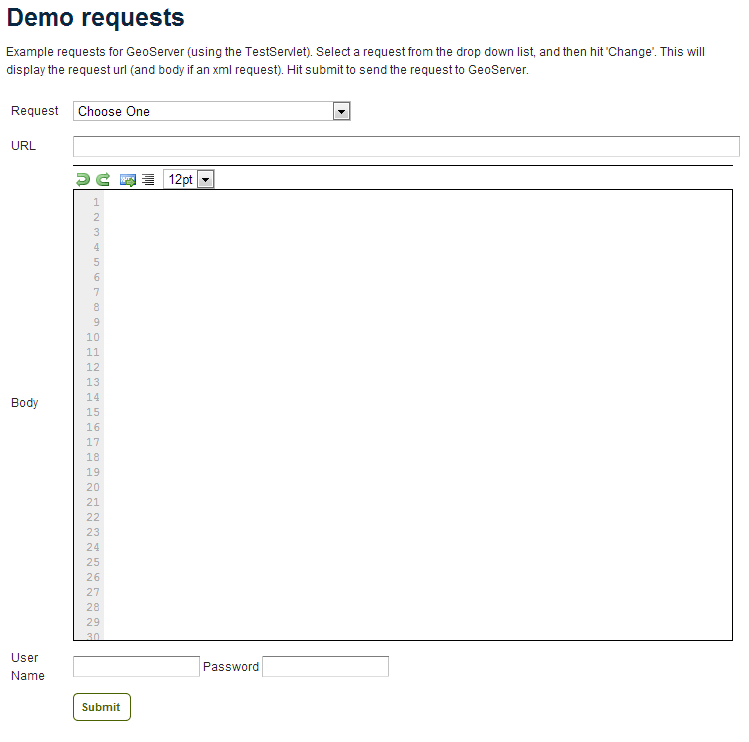
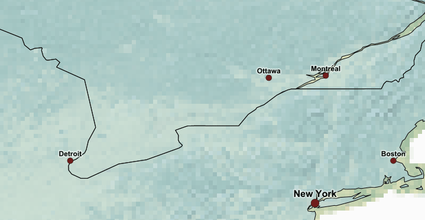

.. _gsadv.catalog.wfs:

Transactional WFS
=================

This section will discuss Transactional WFS, a service that allows for two way communication and editing of geospatial data through the web.

What is Transactional WFS?
---------------------------

As a refresher, the Web Feature Service (WFS) provides an interface allowing requests for geographical features across the web. You can think of WFS as providing the "source code" to the map, as opposed to Web Map Service (WMS) which returns map images.

With WMS, it is possible only to retrieve information (GET requests). And with basic WFS, this is true as well. But WFS can have the ability to be "transactional," meaning that it is possible to POST information back to the server for editing.

This is a very powerful feature, in that it allows for format-agnostic editing of geospatial features. One doesn't need to know anything about the underlying data format (which database was used) in order to make edits.

GeoServer has full support for Transactional WFS. All major versions of WFS (1.0.0, 1.1.0, 2.0.0) are supported.

Demo request builder
--------------------

In order to see WFS-T in action, we'll need to create some demo requests and then POST them to the server.

While we could use cURL for this, GeoServer has a built-in "Demo Request Builder" that has some templates that we can use. We'll be using this interface.

To access the Demo Request Builder, click on :guilabel:`Demos` in the GeoServer web interface, and then select :guilabel:`Demo requests`.

   Demo requests page

Select any one of the items in the :guilabel:`Request`  box to see the type of POST requests that are available. (Any of the requests whose title ends in ``.xml`` is a POST request. If the ending is ``.url``, it is a GET request, which doesn't concern us here.)

.. figure:: img/wfst_demoexample.png

   Example demo request

Simple query
~~~~~~~~~~~~

Before we test a WFS-T example, let's do a few simple POST requests. This request is a GetFeature request for a single feature in the ``earth:cities`` layer (with an id of ``3``).

Paste the following into the :guilabel:`Body` field:

.. code-block:: xml

   <wfs:GetFeature service="WFS" version="1.1.0"
    xmlns:earth="http://earth.opengeo.org"
    xmlns:wfs="http://www.opengis.net/wfs"
    xmlns:ogc="http://www.opengis.net/ogc"
    xmlns:xsi="http://www.w3.org/2001/XMLSchema-instance"
    xsi:schemaLocation="http://www.opengis.net/wfs
                        http://schemas.opengis.net/wfs/1.1.0/wfs.xsd">
     <wfs:Query typeName="earth:cities">
       <ogc:Filter>
         <ogc:FeatureId fid="cities.3"/>
       </ogc:Filter>
     </wfs:Query>
   </wfs:GetFeature>

Make sure the :guilabel:`URL` field contains ``http://localhost:8080/geoserver/wfs`` and that the :guilabel:`User Name` and :guilabel:`Password` fields are properly filled out. Then click :guilabel:`Submit`.

.. figure:: img/wfst_demosimplequery.png

   Simple  query

And the response:

.. figure:: img/wfst_demosimplequeryresponse.png

   Simple query response

Bounding box query
~~~~~~~~~~~~~~~~~~

This example will filter the ``earth:cities`` layer on a given bounding box. Paste this example into the :guilabel:`Body` field and leave all other fields the same. Then click :guilabel:`Submit`.

.. code-block:: xml 

   <wfs:GetFeature service="WFS" version="1.1.0"
    xmlns:earth="http://earth.opengeo.org"
    xmlns:wfs="http://www.opengis.net/wfs"
    xmlns:ogc="http://www.opengis.net/ogc"
    xmlns:gml="http://www.opengis.net/gml"
    xmlns:xsi="http://www.w3.org/2001/XMLSchema-instance"
    xsi:schemaLocation="http://www.opengis.net/wfs
                        http://schemas.opengis.net/wfs/1.1.0/wfs.xsd">
     <wfs:Query typeName="earth:cities">
       <wfs:PropertyName>earth:name</wfs:PropertyName>
       <wfs:PropertyName>earth:pop_max</wfs:PropertyName>
       <ogc:Filter>
         <ogc:BBOX>
           <ogc:PropertyName>geom</ogc:PropertyName>
           <gml:Envelope srsName="http://www.opengis.net/gml/srs/epsg.xml#4326">
             <gml:lowerCorner>-45 -45</gml:lowerCorner>
             <gml:upperCorner>45 45</gml:upperCorner>
           </gml:Envelope>
         </ogc:BBOX>
       </ogc:Filter>
     </wfs:Query>
   </wfs:GetFeature>

.. figure:: img/wfst_demobboxresponse.png

   Bounding box query response

Attribute filter query
~~~~~~~~~~~~~~~~~~~~~~

Finally, this example queries the ``earth:cities`` layer for geometries where the "name" attribute is Toronto.

.. code-block:: xml 

   <wfs:GetFeature service="WFS" version="1.0.0"
    xmlns:earth="http://earth.opengeo.org"
    xmlns:wfs="http://www.opengis.net/wfs"
    xmlns:ogc="http://www.opengis.net/ogc"
    xmlns:xsi="http://www.w3.org/2001/XMLSchema-instance"
    xsi:schemaLocation="http://www.opengis.net/wfs
                        http://schemas.opengis.net/wfs/1.0.0/WFS-basic.xsd">
     <wfs:Query typeName="earth:cities">
       <ogc:Filter>
         <ogc:PropertyIsEqualTo>
           <ogc:PropertyName>name</ogc:PropertyName>
           <ogc:Literal>Toronto</ogc:Literal>
         </ogc:PropertyIsEqualTo>
       </ogc:Filter>
     </wfs:Query>
   </wfs:GetFeature>

.. figure:: img/wfst_demofilterresponse.png

   Filter query response

WFS-T examples
--------------

The format of a WFS-T request is as follows:

.. code-block:: xml

   <wfs:Transaction>
     <wfs:ACTION>
       ...
     </wfs:ACTION>
   </wfs:Transaction>

where ``ACTION`` can be one of ``Delete``, ``Update``, or ``Insert``.

Delete
~~~~~~

Let's delete the entry for Toronto. Paste this code into the :guilabel:`Body` field:

.. code-block:: xml

   <wfs:Transaction service="WFS" version="1.0.0"
    xmlns:ogc="http://www.opengis.net/ogc"
    xmlns:wfs="http://www.opengis.net/wfs"
    xmlns:earth="http://earth.opengeo.org">
     <wfs:Delete typeName="earth:cities">
       <ogc:Filter>
         <ogc:PropertyIsEqualTo>
           <ogc:PropertyName>earth:name</ogc:PropertyName>
           <ogc:Literal>Toronto</ogc:Literal>
         </ogc:PropertyIsEqualTo>
       </ogc:Filter>
     </wfs:Delete>
   </wfs:Transaction>

For this and all other examples, use ``http://localhost:8080/geoserver/wfs`` for the :guilabel:`URL` and make sure to enter the admin user name and password. Then click :guilabel:`Submit`.

The result you should see will look like this:

.. figure:: img/wfst_deleteresponse.png

   Delete response

You can view the result here::

  http://localhost:8080/geoserver/wms/reflect?layers=earth:cities&format=application/openlayers

   Preview of layer with feature removed

Update
~~~~~~

Another option is to Update, which alters an existing resource (in this case, Luxembourg). Paste this code into the :guilabel:`Body` field:

.. code-block:: xml

   <wfs:Transaction service="WFS" version="1.0.0"
    xmlns:earth="http://earth.opengeo.org"
    xmlns:ogc="http://www.opengis.net/ogc"
    xmlns:wfs="http://www.opengis.net/wfs">
     <wfs:Update typeName="earth:cities">
       <wfs:Property>
         <wfs:Name>name</wfs:Name>
         <wfs:Value>Deluxembourg!!!</wfs:Value>
       </wfs:Property>
       <ogc:Filter>
         <ogc:FeatureId fid="cities.3"/>
       </ogc:Filter>
     </wfs:Update>
   </wfs:Transaction>

The result you should see should look identical to the above response.

Preview the change here::

  http://localhost:8080/geoserver/wms/reflect?layers=earth:cities&format=application/openlayers

.. figure:: img/wfst_updatepreview.png

   Preview of layer with feature updated

Insert
~~~~~~

We can insert new features into layers via WFS-T. Let's add a new river to our rivers layer. Paste this code into the :guilabel:`Body` field:

.. code-block:: xml

   <wfs:Transaction service="WFS" version="1.0.0"
    xmlns:wfs="http://www.opengis.net/wfs"
    xmlns:earth="http://earth.opengeo.org"
    xmlns:gml="http://www.opengis.net/gml"
    xmlns:xsi="http://www.w3.org/2001/XMLSchema-instance"
    xsi:schemaLocation="http://www.opengis.net/wfs
                        http://schemas.opengis.net/wfs/1.0.0/WFS-transaction.xsd
                        http://earth.opengeo.org 
                        http://localhost:8080/geoserver/wfs/DescribeFeatureType?typename=earth:rivers">
     <wfs:Insert>
       <earth:rivers>
         <earth:geom>
           <gml:MultiLineString srsName="http://www.opengis.net/gml/srs/epsg.xml#4326">
             <gml:lineStringMember>
               <gml:LineString>
                 <gml:coordinates decimal="." cs="," ts=" ">
                   -20,0 -10,10 10,-10 20,0
                 </gml:coordinates>
               </gml:LineString>
             </gml:lineStringMember>
           </gml:MultiLineString>
         </earth:geom>
         <earth:name>Sammy</earth:name>
       </earth:rivers>
     </wfs:Insert>
   </wfs:Transaction>

.. todo:: This request did not work. Demo request got stuck in an endless loop.

View a preview of this unlikely river here::

  http://localhost:8080/geoserver/wms/reflect?layers=earth:rivers&format=application/openlayers

Multiple transactions
~~~~~~~~~~~~~~~~~~~~~

We can execute multiple transactions in a single transaction request. So let's undo everything that was done in the previous three examples.

.. code-block:: xml

   <wfs:Transaction service="WFS" version="1.0.0"
    xmlns:wfs="http://www.opengis.net/wfs"
    xmlns:earth="http://earth.opengeo.org"
    xmlns:ogc="http://www.opengis.net/ogc"
    xmlns:gml="http://www.opengis.net/gml"
    xmlns:xsi="http://www.w3.org/2001/XMLSchema-instance"
    xsi:schemaLocation="http://www.opengis.net/wfs
                        http://schemas.opengis.net/wfs/1.0.0/WFS-transaction.xsd">
 
     <!-- BRING TORONTO BACK -->
     <wfs:Insert>
       <earth:cities>
       <earth:geom>
         <gml:Point srsName="http://www.opengis.net/gml/srs/epsg.xml#4326">
           <gml:coordinates xmlns:gml="http://www.opengis.net/gml" decimal="." cs="," ts=" ">
             -79.496,43.676
           </gml:coordinates>        
         </gml:Point>
       </earth:geom>
       <earth:name>T'rana</earth:name>
       </earth:cities>
     </wfs:Insert>

     <!-- LUXEMBOURG IS JUST OKAY -->
     <wfs:Update typeName="earth:cities">
       <wfs:Property>
         <wfs:Name>name</wfs:Name>
         <wfs:Value>Luxembourg</wfs:Value>
       </wfs:Property>
       <ogc:Filter>
         <ogc:FeatureId fid="cities.3"/>
       </ogc:Filter>
     </wfs:Update>
   
     <!-- AU REVOIR SAMMY -->
     <wfs:Delete typeName="earth:rivers">
       <ogc:Filter>
         <ogc:PropertyIsEqualTo>
           <ogc:PropertyName>earth:name</ogc:PropertyName>
           <ogc:Literal>Sammy</ogc:Literal>
         </ogc:PropertyIsEqualTo>
       </ogc:Filter>
     </wfs:Delete>

   </wfs:Transaction>

Preview everything here::

  http://localhost:8080/geoserver/wms/reflect?layers=earth:cities&format=application/openlayers
