Beyond GeoServer Basics
=======================

.fx: titleslide

Presenter notes
---------------

This is where you can write notes to yourself and only you will be able to see them.

--------------------------------------------------

Outline
=======

#. Background / review
#. Catalog and data operations
#. Coordinate reference system management
#. Data filtering
#. Data processing and analysis

Presenter notes
---------------

The following material will be covered in this workshop:

* Background - Basic refresher of GeoServer interaction
* Catalog and data operations - Learn about catalog operations such as the REST interface and Transactional WFS (WFS-T)
* Coordinate reference system management - Learn how to manage coordinate reference systems (projections).
* Data filtering - Create useful subsets of data using CQL/OGC filters and SQL views.
* Data processing and analysis - Perform spatial analysis with GeoServer using the Web Processing Service (WPS) and rendering transformations. 

--------------------------------------------------

Section 1: Background
=====================

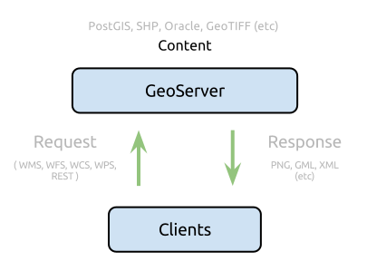

Presenter notes
---------------

Before we get started with topics, let’s review what we know about GeoServer.

A web mapping server is a specific subset of a web-server designed to transfer mapping data (or spatial, or geographic, or geometric data).

GeoServer is a web mapping server. As such, it operates as middleware between geospatial data formats and web services.

GeoServer can read many different data formats, both vector and raster, proprietary and open, file and database sources.

What’s perhaps most important is that GeoServer acts as a format-agnostic gateway to spatial information. It standardizes its responses to the conventions of the OGC service specifications. While there are many services, the most frequently accessed are the Web Map Service (for map images) and Web Feature Service (for map data).

A client need only read OGC services to be able to communicate with GeoServer. GeoServer handles the requests and responses from the client, and reads the data from the sources as necessary. The client does not need to know anything about the underlying data format.

--------------------------------------------------

Section 2: Catalog and data operations
======================================

* REST configuration
* WFS transactions (WFS-T)

Presenter notes
---------------

This section will discuss various methods for interacting GeoServer catalog, including the powerful REST interface as well as WFS Transactions.

--------------------------------------------------

What is REST?
=============

**REpresentational State Transfer**

Presenter notes
---------------

REST stands for REpresentational State Transfer. You can take this to mean the transfer (to and from a server) of representations of an object’s state. Or, more simply, an interface for changing settings in GeoServer GeoServer has a RESTful API to and from which you can send and receive (respectively) state representations of GeoServers resource types.

The capabilities of the REST API consist of actions (verbs) we can use to make HTTP requests combined with the configurable resources in GeoServer.

--------------------------------------------------

REST actions
============

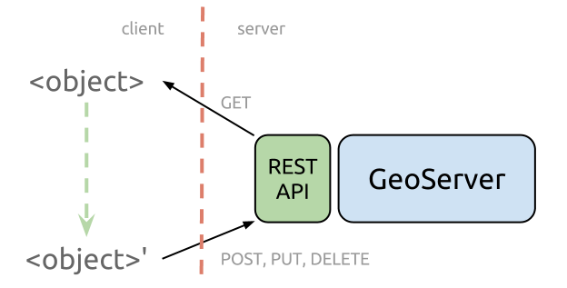

Presenter notes
---------------

So, for each of the resources in GeoServer (workspaces, stores, layers, styles, layer groups, etc.) we can perform the following operations:

* GET to read an existing resource
* POST to add a new resource
* PUT to update an existing resource
* DELETE to remove a resource

--------------------------------------------------

REST endpoints
==============

::

  http://localhost:8080/geoserver/rest/

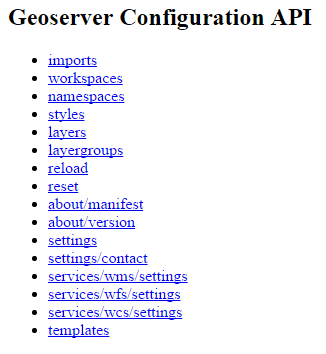

Presenter notes
---------------

The top of the REST hierarchy starts here:

http://localhost:8080/geoserver/rest/

Throughout this workshop, we’ll assume that GeoServer is responding at http://localhost:8080/geoserver/, but all examples should work with substitution for the location of your instance.

Navigate to the above URL. If you haven’t logged in through the web admin interface prior to this, you’ll be asked for administrator credentials. Enter admin / geoserver and click OK.

--------------------------------------------------

REST endpoints
==============

* workspaces --> ``/rest/workspaces``
* earth --> ``.../earth.html``
* earth --> ``.../earth/datastores/earth.html``
* cities --> ``.../earth/datastores/earth/`` ``featuretypes/cities.html``

Presenter notes
---------------

Click the following links to traverse the hierarchy.

--------------------------------------------------

REST GET requests
=================

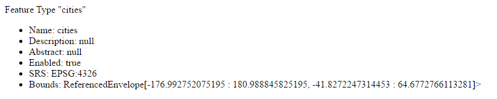

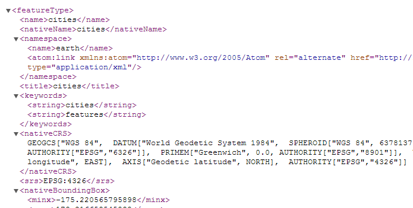

Presenter notes
---------------

Every time we click one of these links, we are making a GET request. Notice the format for the content we are receiving is HTML. Unless otherwise specified this is the default format for GET requests.

GET requests are intended for navigation and discovery. However, when looking at the HTML output, few details are shown. More details can be retrieved by requesting information in a format other than HTML, such as JSON or XML. These can be specified by setting the appropriate extension to the request.

These GET requests are “read-only”, so to leverage the bi-directional nature of REST, we can use other actions. Specifically, we can transfer new state representations (changes) to a collection using POST, update existing state representations to an object using PUT, or remove resources using DELETE.

--------------------------------------------------

REST examples
=============

Create a new workspace

::

  curl -u admin:geoserver -v -X POST
    -H "Content-Type:text/xml"
    -d "<workspace><name>advanced</name></workspace>"
    http://localhost:8080/geoserver/rest/workspaces

Presenter notes
---------------

First, let’s create a new workspace called “advanced”. This will be used for the data that was loaded into a PostGIS database of the same name. We want to POST the following resource information to the /rest/workspaces endpoint:

<workspace>
  <name>advanced</name>
</workspace>

This is accomplished by the following cURL command:

Note: Commands in this section are wrapped over multiple lines for legibility.

Execute this command.

--------------------------------------------------

REST examples
=============

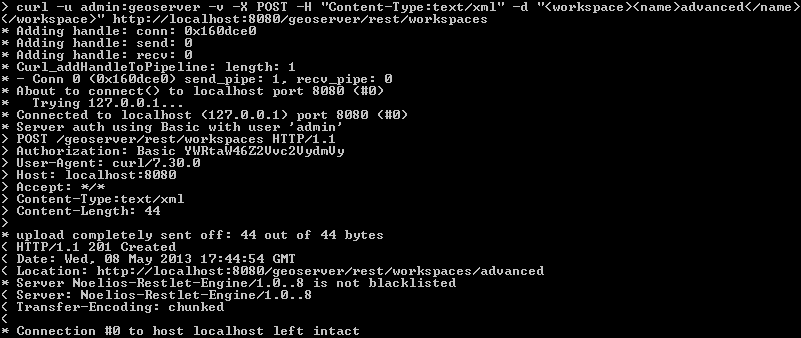

::

  < HTTP/1.1 201 Created

Presenter notes
---------------

While a deep discussion of cURL is beyond the scope of this workshop, some of the details of this request will be helpful. The command line flags are as follows:

-u/--user[:password] (credentials)
-v/--verbose (show more output)
-X/--request (the action/verb to use)
-H/--header (header)

Likewise, the output is verbose and most of it doesn’t concern us here. The most important information to glean is whether the request was successful of not. You should see the following in the response:

< HTTP/1.1 201 Created

You can also verify that the workspace was created through the GeoServer UI. Click Workspaces and you should see advanced in the list.

--------------------------------------------------

REST examples
=============

Add a new store

File: datastore.advanced.xml

::

  <dataStore>
    <name>advanced</name>
    <connectionParameters>
      <host>localhost</host>
      <port>54321</port>
      <database>advanced</database>
      <user>postgres</user>
      <password>postgres</password>
      <dbtype>postgis</dbtype>
    </connectionParameters>
  </dataStore>

Presenter notes
---------------

Now that we’ve created a workspace, let’s add a store. This will be a connection to a local PostGIS database. We’ll do it in the same way as before: with a POST request through cURL. This time, though, we’re going to embed the XML payload in a file, as opposed to having it be part of the cURL command itself. Here is the content:

--------------------------------------------------

REST examples
=============

Add a new store

::

  curl -v -u admin:geoserver -X POST
    -H "content-type:text/xml" 
    -T datastore.advanced.xml
    http://localhost:8080/geoserver/rest/workspaces/
      advanced/datastores

Presenter notes
---------------

Note the use of -T here, which specifies that the content will be contained inside a file. This was used instead of the -d flag from the previous example, which specifies that content will be contained in the command itself. Having the content in a separate file can be useful for large requests or for reusable content.

Note: It is also possible to use -d with @file.xml to accomplish much the same thing.

Verify the request was successful by looking at the GeoServer UI. Click Stores and you should see advanced in the list.

--------------------------------------------------

REST examples
=============

Add layers

::

  psql -Upostgres --tuples-only
    -c "select f_table_name from geometry_columns"
    advanced

Presenter notes
---------------

To find out what tables (layers) live in the store (if you didn’t already know), you can execute the following command using psql, the command-line PostgreSQL utility:

The output should look like: parks, rails, roads, urban

REST examples
=============

Add layers

::

  curl -v -u admin:geoserver -X
    POST -H "Content-type: text/xml"
    -d "<featureType><name>roads</name></featureType>"
    http://localhost:8080/geoserver/rest/workspaces/
      advanced/datastores/advanced/featuretypes

Presenter notes
---------------

Now that a store has been created, the next logical step is to add a layer.

Repeat this process for each layer name. Again, look for the 201 in the response.

--------------------------------------------------

REST examples
=============

::

  http://localhost:8080/geoserver/wms/reflect?
    layers=advanced:roads

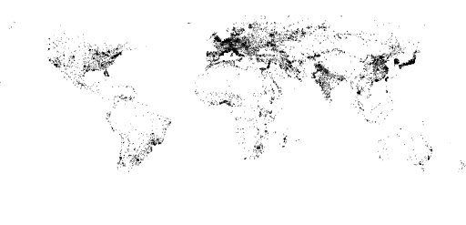

Presenter notes
---------------

Now, for verification purposes, not only can we view the catalog information about the layer, we should now be able to preview the layer itself. You can use the Layer Preview for this, or the WMS Reflector for simplicity:

Note: For more information on the WMS reflector, please see the GeoServer documentation.

--------------------------------------------------

REST examples
=============

Upload styles

::

  curl -v -u admin:geoserver -X POST
    -H "Content-type: application/vnd.ogc.sld+xml"
    -d @stylefile.sld
    http://localhost:8080/geoserver/rest/styles

::

  for f in *sld; do
  curl -v -u admin:geoserver -X POST
    -H "Content-Type:application/vnd.ogc.sld+xml"
    -d @$f
    http://localhost:8080/geoserver/rest/styles;
  done
  
Presenter notes
---------------

The layers have been published, but they are all being served using GeoServer’s default styles. The next step is load styles to be used for for each layer.

Note: We will load styles in this step, but not yet associate them with any layers. This will be accomplished in a later step.

The directory that contains the styles we want to load is styles/advanced. The command for uploading a style with filename of stylefile.sld is:

We could repeat this for each style (just like we did when we loaded the layers), but the big advantage to the REST interface lies in its ability to script operations, so one could also use a script. Here is a bash script for use on OS X or any UNIX-style system:

--------------------------------------------------

REST examples
=============

Upload styles

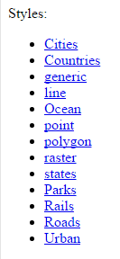

Presenter notes
---------------

Upload all styles to GeoServer.

Verify by navigating either to the appropriate REST endpoint or the UI.

Note: Since we didn’t associate the styles with the layers (yet), Layer Preview will not show anything different.

--------------------------------------------------

REST examples
=============

Add layers to a layer group

::

  curl -v -u admin:geoserver -X PUT
    -H "Content-type: text/xml"
    -d @layergroup.earth.xml
    http://localhost:8080/geoserver/rest/layergroups/earth

Presenter notes
---------------

Now let's put our layers together in a layer group. More accurately, we want to alter (think PUT instead of POST) an existing layer group called "earth". The payload is:

TODO: Include

Save this as the file layergroup.earth.xml. Now execute the following command:

--------------------------------------------------

REST examples
=============

Deleting a resource

::

  curl -v -u admin:geoserver -X POST
    -H "content-type:text/xml"
    -d "<workspace><name>whoop</name></workspace>"
    http://localhost:8080/geoserver/rest/workspaces

::

  curl -v -u admin:geoserver -X DELETE
    http://localhost:8080/geoserver/rest/
    workspaces/whoop.xml

Presenter notes
---------------

We've created new resources and updated existing resources, so now let's DELETE a resource. Let's create a nonsensical workspace object:

We can delete it with a DELETE action directly to the resource's endpoint:

Warning: there was no confirmation dialog in this process. The resource was immediately deleted.

--------------------------------------------------

Transactional WFS
=================

* WFS = read-only
* WFS-T = read/write (two way) communication

Through-the-web editing!

Presenter notes
---------------

As a refresher, the Web Feature Service (WFS) provides an interface allowing requests for geographical features across the web. You can think of WFS as providing the “source code” to the map, as opposed to Web Map Service (WMS) which returns map images.

With WMS, it is possible only to retrieve information (GET requests). And with basic WFS, this is true as well. But WFS can have the ability to be “transactional,” meaning that it is possible to POST information back to the server for editing.

This is a very powerful feature, in that it allows for format-agnostic editing of geospatial features. One doesn’t need to know anything about the underlying data format (which database was used) in order to make edits.

GeoServer has full support for Transactional WFS.

--------------------------------------------------

Demo request builder
====================

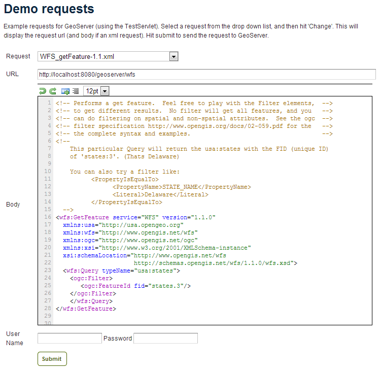

Presenter notes
---------------

In order to see WFS-T in action, we’ll need to create some demo requests and then POST them to the server.

While we could use cURL for this, GeoServer has a built-in “Demo Request Builder” that has some templates that we can use. We’ll be using this interface.

Access the Demo Request Builder by clicking Demos in the GeoServer web interface, and then selecting Demo requests.

Select any one of the items in the Request box to see the type of POST requests that are available. (Any of the requests whose title ends in .xml is a POST request. If the ending is .url, it is a GET request, which doesn’t concern us here.)

--------------------------------------------------

Simple query
============

:: 

  <wfs:GetFeature service="WFS" version="1.1.0"
   xmlns:earth="http://earth"
   xmlns:wfs="http://www.opengis.net/wfs"
   xmlns:ogc="http://www.opengis.net/ogc"
   xmlns:xsi="http://www.w3.org/2001/XMLSchema-instance"
   xsi:schemaLocation="http://www.opengis.net/wfs
                       http://schemas.opengis.net/wfs/1.1.0/wfs.xsd">
    <wfs:Query typeName="earth:cities">
      <ogc:Filter>
        <ogc:FeatureId fid="cities.3"/>
      </ogc:Filter>
    </wfs:Query>
  </wfs:GetFeature>

Presenter notes
---------------

Before we test a WFS-T example, let’s do a few simple POST requests. This request is a GetFeature request for a single feature in the earth:cities layer (with an id of 3).

Paste the following into the Body field:

Make sure the URL field contains http://localhost:8080/geoserver/wfs and that the User Name and Password fields are properly filled out. Then click Submit.

--------------------------------------------------

Simple query
============

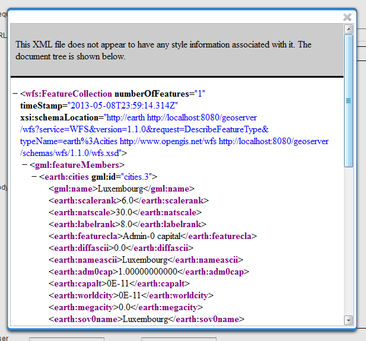

Presenter notes
---------------

And the response:

--------------------------------------------------

Bounding box query
==================

::

  <wfs:Query typeName="earth:cities">
    <wfs:PropertyName>earth:name</wfs:PropertyName>
    <wfs:PropertyName>earth:pop_max</wfs:PropertyName>
    <ogc:Filter>
      <ogc:BBOX>
        <ogc:PropertyName>geom</ogc:PropertyName>
        <gml:Envelope srsName="http://www.opengis.net/gml/srs/epsg.xml#4326">
          <gml:lowerCorner>-45 -45</gml:lowerCorner>
          <gml:upperCorner>45 45</gml:upperCorner>
        </gml:Envelope>
      </ogc:BBOX>
    </ogc:Filter>
  </wfs:Query>

Presenter notes
---------------

This next example will filter the earth:cities layer on a given bounding box. Paste this example into the Body field and leave all other fields the same. Then click Submit.

--------------------------------------------------

Bounding box query
==================

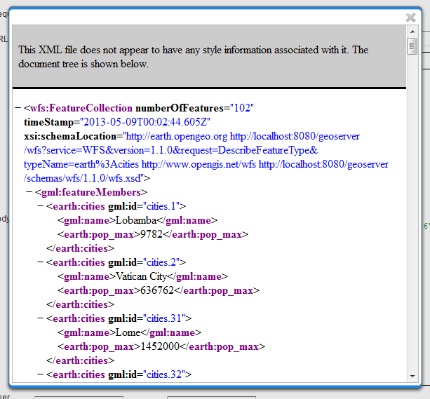

Presenter notes
---------------

And the response:

--------------------------------------------------

Attribute filter query
======================

::

    <wfs:Query typeName="earth:cities">
      <ogc:Filter>
        <ogc:PropertyIsEqualTo>
          <ogc:PropertyName>name</ogc:PropertyName>
          <ogc:Literal>Toronto</ogc:Literal>
        </ogc:PropertyIsEqualTo>
      </ogc:Filter>
    </wfs:Query>

Presenter notes
---------------

Finally, this example queries the earth:cities layer for geometries where the "name" attribute is Toronto.

--------------------------------------------------

Attribute filter query
======================

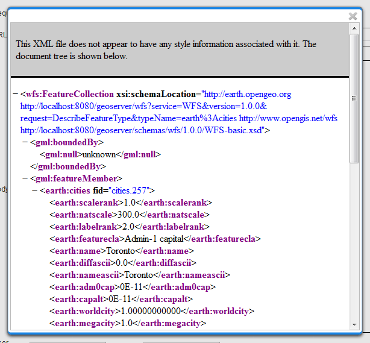

Presenter notes
---------------

And the response:

--------------------------------------------------

DELETE example
==============

::

    <wfs:Delete typeName="earth:cities">
      <ogc:Filter>
        <ogc:PropertyIsEqualTo>
          <ogc:PropertyName>earth:name</ogc:PropertyName>
          <ogc:Literal>Toronto</ogc:Literal>
        </ogc:PropertyIsEqualTo>
      </ogc:Filter>
    </wfs:Delete>

Presenter notes
---------------

Let's delete the entry for Toronto. Paste this code into the Body field:

For this and all other examples, use http://localhost:8080/geoserver/wfs for the URL and make sure to enter the admin user name and password. Then click Submit.

--------------------------------------------------

DELETE example
==============

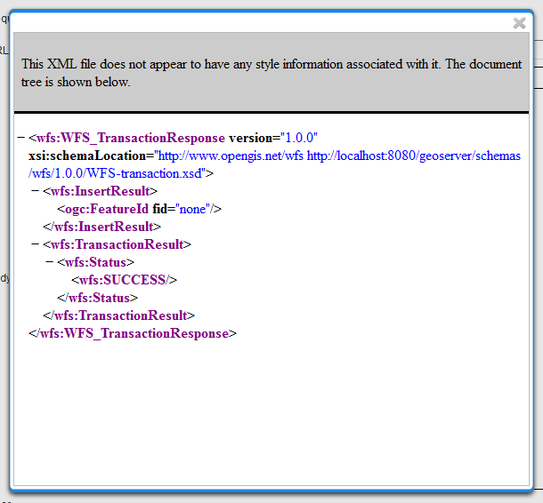

::

  http://localhost:8080/geoserver/wms/reflect?layers=earth:shadedrelief,earth:countries,earth:cities&format=application/openlayers

Presenter notes
---------------

The result you should see will look like this:

Zoom in to the Toronto area (recall that Toronto is northwest of New York, halfway between Detroit and Ottawa).

--------------------------------------------------

UPDATE example
==============

::

    <wfs:Update typeName="earth:cities">
      <wfs:Property>
        <wfs:Name>name</wfs:Name>
        <wfs:Value>Deluxembourg</wfs:Value>
      </wfs:Property>
      <ogc:Filter>
        <ogc:FeatureId fid="cities.3"/>
      </ogc:Filter>
    </wfs:Update>

Presenter notes
---------------

Another option is to Update, which alters an existing resource (in this case, Luxembourg). Paste this code into the Body field:

--------------------------------------------------

UPDATE example
==============

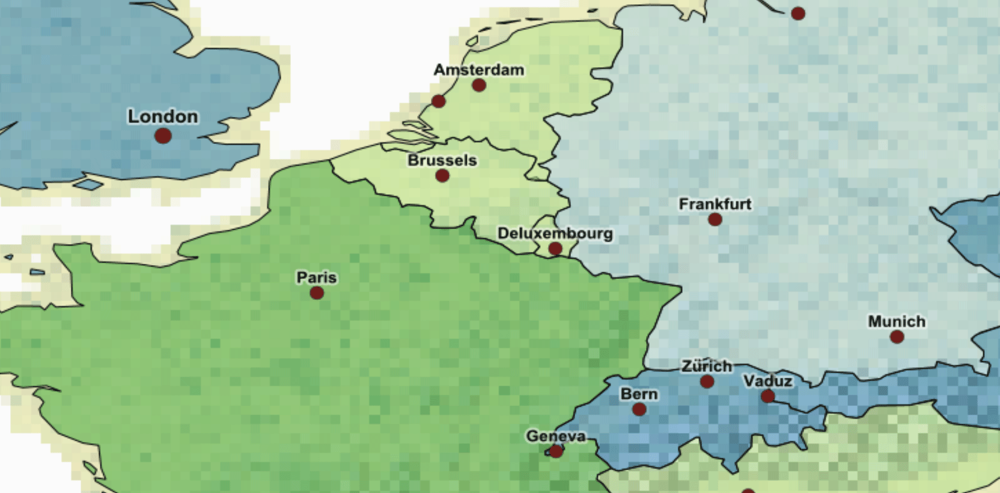

::

  http://localhost:8080/geoserver/wms/reflect?
    layers=earth:cities&
    format=application/openlayers

Presenter notes
---------------

You should see the same SUCCESS response as above.

You can view the result here:

Zoom in to the Luxembourg area (recall that Luxembourg is in Western Europe, between Brussels and Frankfurt):

--------------------------------------------------

INSERT example
==============

::

  <wfs:Insert>
    <earth:cities>
      <earth:geom>
        <gml:Point
         srsName="http://www.opengis.net/gml/srs/epsg.xml#4326">
          <gml:coordinates decimal="." cs="," ts=" ">
           0,0
          </gml:coordinates>
        </gml:Point>
      </earth:geom>
      <earth:name>Null</earth:name>
      <earth:pop_min>10000000</earth:pop_min>
    </earth:cities>
  </wfs:Insert>

Presenter notes
---------------

We can Insert new features into layers via WFS-T. Let’s add a new city to our earth:cities layer.

--------------------------------------------------

INSERT example
==============

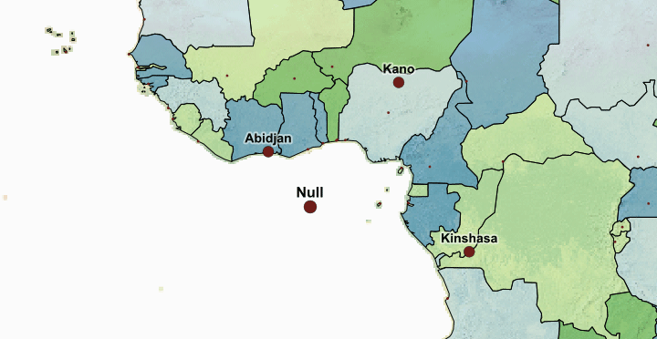

::

  http://localhost:8080/geoserver/wms/reflect?
    layers=earth:shadedrelief,earth:countries,earth:cities&
    format=application/openlayers

Presenter notes
---------------

You can view the result here (recall that 0,0 in latitude/longitude is off the coast of West Africa):

--------------------------------------------------

Multiple transactions
=====================

::

  <!-- BRING TORONTO BACK -->
  <wfs:Insert>
    <earth:cities>
    <earth:geom>
      <gml:Point srsName="http://www.opengis.net/gml/srs/epsg.xml#4326">
        <gml:coordinates xmlns:gml="http://www.opengis.net/gml" decimal="." cs="," ts=" ">
          -79.496,43.676
        </gml:coordinates>
      </gml:Point>
    </earth:geom>
    <earth:name>Toronto</earth:name>
    </earth:cities>
  </wfs:Insert>

Presenter notes
---------------

We can execute multiple transactions in a single transaction request. So let's undo everything that was done in the previous three examples.

--------------------------------------------------

Multiple transactions
=====================

::

  <!-- LUXEMBOURG IS NO LONGER DELUXE -->
  <wfs:Update typeName="earth:cities">
    <wfs:Property>
      <wfs:Name>name</wfs:Name>
      <wfs:Value>Luxembourg</wfs:Value>
    </wfs:Property>
    <ogc:Filter>
      <ogc:FeatureId fid="cities.3"/>
    </ogc:Filter>
  </wfs:Update>

Presenter notes
---------------

We can execute multiple transactions in a single transaction request. So let's undo everything that was done in the previous three examples.

--------------------------------------------------

Multiple transactions
=====================

::

  <!-- BEGONE NULL ISLAND  -->
  <wfs:Delete typeName="earth:cities">
    <ogc:Filter>
      <ogc:PropertyIsEqualTo>
        <ogc:PropertyName>earth:name</ogc:PropertyName>
        <ogc:Literal>Null</ogc:Literal>
      </ogc:PropertyIsEqualTo>
    </ogc:Filter>
  </wfs:Delete>

Presenter notes
---------------

We can execute multiple transactions in a single transaction request. So let's undo everything that was done in the previous three examples.

--------------------------------------------------

Multiple transactions
=====================

::

  http://localhost:8080/geoserver/wms/reflect?
    layers=earth:shadedrelief,earth:countries,earth:cities&
    format=application/openlayers

Presenter notes
---------------

Preview the results here:

--------------------------------------------------

Section 3: Coordinate reference system management
=================================================

* Map projections
* Adding a custom projection
* Limiting advertised CRS

Presenter notes
---------------

This section will discuss projections and coordinate reference systems, and how they are handled in GeoServer.

--------------------------------------------------

What is a projection?
=====================

.. image:: ../doc/source/crs/img/proj_cartesianpoints.png

Presenter notes
---------------

When talking about geospatial data, one must first define the numbers and units that will be used to notate that data.

On a flat (Cartesian) plane, it is straightforward to talk about "where" something is. Each point or vertex can be denoted by two ordinates (often referred to as x and y). The distance between two points can be easily calculated and understood.

Things get more complicated when we start dealing with the Earth (or any non-flat surface), and that is what we are concerned with when dealing with geospatial data.

--------------------------------------------------

What is a projection?
=====================

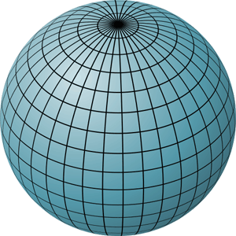

Presenter notes
---------------

Most everyone is familiar with latitude and longitude, the two ordinates that make up the location of a point on the globe. Latitude and longitude have units of degrees. Like x/y coordinates of the Cartesian plane, each coordinate describes a unique location. Unlike the Cartesian plane though, the unit of degrees does not describe a fixed distance. This can be most easily seen in the following graphic, where the "rectangles" of all different sizes each represent one square degree.

All this is mentioned to bring up the point that it is not trivial to translate round surfaces to the flat plane, but that is exactly what is needed when working in mapping, as the flat plane is the computer screen or printed page. The process of moving from round surface to flat plane is called "projection". More formally:

--------------------------------------------------

What is a map projection?
=========================

A map projection is a systematic transformation of the latitudes and longitudes of locations on the surface of a sphere or an ellipsoid into locations on a plane.

Presenter notes
---------------

--------------------------------------------------

Projection examples
===================

Some map projections

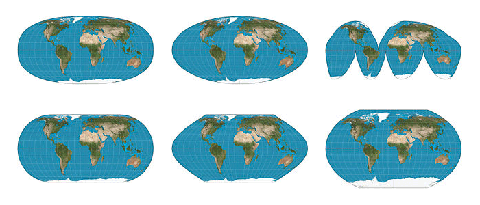

Presenter notes
---------------

There are many different ways to project a round surface on to the plane. Here are some examples:

Some map projections (these images and others on this page courtesy of Wikipedia)

Each projection has different considerations, mainly involving distortion. There will be some kind of distortion in every projection; the only question is what is distorted and to what extent. For example, certain projections, such as Albers or Sinusoidal, preserve the area of shapes, while projections such as Mercator or stereographic (called "conformal" projections, preserve angles locally. Other projections, such as the Buckminster Fuller Dymaxion map, are "compromise projections" that preserve some proportion of area, angle, shape, or scale.

Some projections are valid for only a certain area, and not for the entire globe. For example, a rectilinear (gnomonic) projection can only show half the globe.

--------------------------------------------------

Projection examples
===================

Mercator

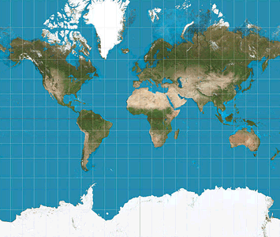

Presenter notes
---------------

The Mercator projection may be the best known projection outside of professional circles, though it is as well known for its distortions and inaccuracies as much as for its utility (the common complaint being that Greenland is seen to be as big as Africa, despite being 1/14 the size).

--------------------------------------------------

Datums
======

* The earth is not a sphere, it's an oblate spheroid
* It's not quite even that
* Datums account for the irregularities

Presenter notes
---------------

There is much more to the discussion than just porjecting a sphere onto a plane.

The Earth's is not even a regular oblate spheroid at all. It has deviations (pits and hills) that need to be taken into account when calculating how to project the surface on to the flat plane.

While necessarily an approximation, this is the role of the datum. A datum is the definition of how to model the deviations of the ideal surface.

For example, one common datum in use is WGS84 used in GPS systems, while two others are NAD27/NAD83. The numbers refer to the year in which the standard was published. All datums are approximations that are more accurate for different purposes.

All CRSs are associated with a datum.

--------------------------------------------------

GeoServer and projections
=========================

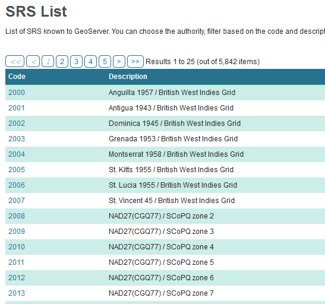

Presenter notes
---------------

GeoServer has support for a large number of projections (around 5,000). In GeoServer, they are referred to as "spatial reference systems" (SRS) or "coordinate reference systems" (CRS). The use of SRS versus CRS is inconsistent, but they are both referring to the same thing.

Typically, CRSs are noted in the form of "EPSG:####", where "####" is a numerical code. The "EPSG" prefix refers to the European Petroleum Survey Group, a now-defunct entity that was instrumental in cataloging different CRSs.

To see what CRSs GeoServer supports, there is a demo in the web interface that displays a list of all the CRSs as well as their definitions.

Click the Demos link just as we did before for the Demo Request Builder. In the list that follows, click SRS List.

The full list of projections will be displayed.

--------------------------------------------------

GeoServer and projections
=========================

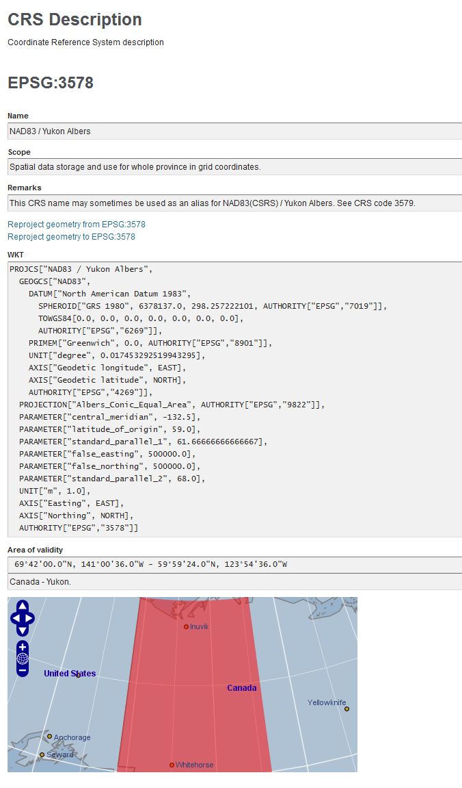

Presenter notes
---------------

You can Click any entry, or use the search box to filter the list by keyword or number. Enter "yukon" in the search box and press Enter. The list will be filtered down to two options: 3578 and 3579.

Click 3578. You will see details about this CRS, including its Well Known Text (WKT) definition. This is the formal definition of the CRS, and includes all information necessary to process geospatial data to and from this CRS. You will also see a map of the area of validity for that CRS.

Notice that it references the NAD83 datum.

--------------------------------------------------

Reprojection
============

::

  http://localhost:8080/geoserver/wms/reflect?
    layers=usa:states

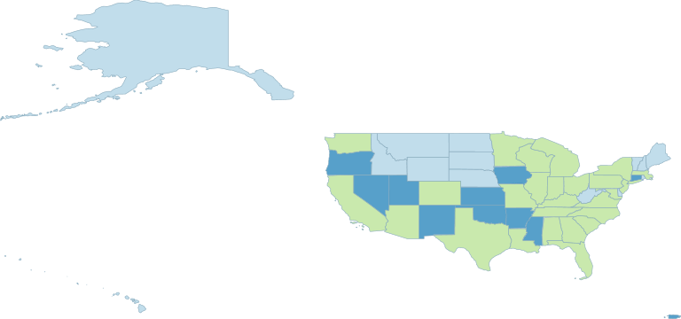

Presenter notes
---------------

Data is stored in a particular CRS. However, GeoServer is able to leverage its database of CRSs and reproject data dynamically. So while a particular layer may be stored in one CRS, it is possible to make a request for data in any CRS.

For example, let's request some data to be reprojected. For simplicity, we'll use the WMS Reflector, as it provides the simplest way to craft WMS requests.

Execute this request: This will return an image of the usa:states layer over its full extent with all default options. The default CRS is EPSG:4326.

--------------------------------------------------

Reprojection
============

::

  http://localhost:8080/geoserver/wms/reflect?
    layers=usa:states&srs=EPSG:3700

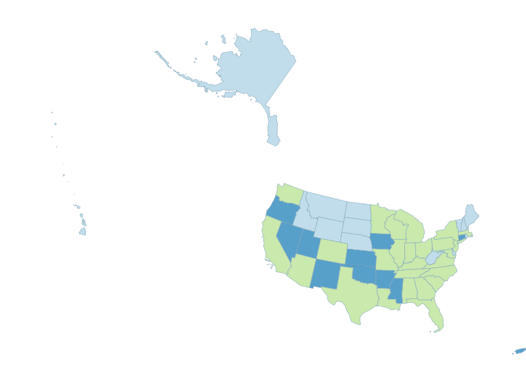

Presenter notes
---------------

Now try the following request: This returns the same data but in EPSG:3700, or "Wisconsin South (ftUS)".

GeoServer has dynamically reprojected the data during the request execution. No data was or is ever stored in EPSG:3700. Note that the farther away from the target area, the more "warped" the display becomes. This is a visual representation of the trade-off between accuracy and large-scale. This would certianly not be a good CRS to use when looking at Asia!

Try other EPSG codes to see how the output changes. Should you get a blank image, it just means that the CRS is not valid for that area.

--------------------------------------------------

GeoServer and reprojection
==========================

* Dynamic reprojection is possible, but inefficient
* Store data how it will most likely be accessed

Presenter notes
---------------

Dynamic reprojection allows for a great deal of flexibility, as the same data need not be stored in multiple CRSs. However, there is a cost involved in reprojection, in that it requires extra processing time. With small data sets this is negligible, but for larger, more complex situations, the processing time can be prohibitive.

For this reason, we recommended that you store your data in the CRS in which it will be accessed most frequently. If you need to transform your data to this CRS, use a spatial database function such as ST_Transform in PostGIS.

Note: Utilizing tile caching is one option that shifts the processing time away from when the tiles are requested, but the actual rendering of tiles will still be slower than in the native CRS.

--------------------------------------------------

Adding a custom projection
==========================

Data directory: ``user_projections/epsg.properties``

::

  34003=PROJCS["Danish System 34 Jylland-Fyn",GEOGCS["ED5
  0",DATUM["European_Datum_1950",SPHEROID["International 
  - 1924",6378388,297.0000000000601,AUTHORITY["EPSG","702
  2"]],AUTHORITY["EPSG","6230"]],PRIMEM["Greenwich",0],UN
  IT["degree",0.0174532925199433],AUTHORITY["EPSG","4230"
  ]],PROJECTION["Transverse_Mercator"],PARAMETER["latitud
  e_of_origin",0],PARAMETER["central_meridian",9],PARAMET
  ER["scale_factor",0.9996],PARAMETER["false_easting",500
  000],PARAMETER["false_northing",9.999999999999999e-099]
  ,UNIT["METER",1]]

Presenter notes
---------------

While there are a great many projections natively served by GeoServer, there will be occasions where you will encounter data that is in a CRS that is not in the EPSG database. In this case, you will need to add a custom projection to GeoServer.

Let's add EPSG:34003, a Danish CRS. It has the following definition in WKT:

To add this CRS to be available in GeoServer, we'll need to edit a file in the GeoServer catalog. This file is called epsg.properties and it is found in user_projections/ in the GeoServer data directory.

Open the epsg.properties file in a text editor.

Paste the following code at the very end of the file:

Save and close the file.

Restart GeoServer.

--------------------------------------------------

Adding a custom projection
==========================

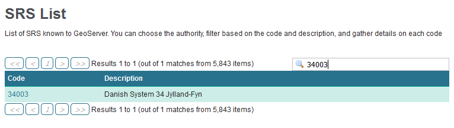

Presenter notes
---------------

Now go back to the SRS List (Demos - SRS List) and search for the number 34003. You should see it in the list.

This CRS, though user-supplied, is now on equal footing with any of the other CRSs in GeoServer, and is available for dynamic reprojecting and auto-detection.

--------------------------------------------------

Limiting advertised CRS
=======================

Thousands of CRSs = a big capabilities document

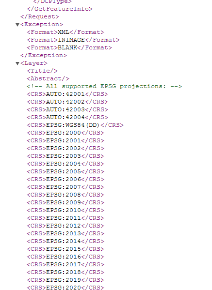

Presenter notes
---------------

The WMS capabilities document publishes a list of all supported CRSs. This list is quite long, and can make the capabilities document quite large.

However, a GeoServer instance typically only uses a small fraction of that list. So it is sometimes a good idea to limit the number of advertised CRSs that appear in the capabilities documents.

View your local WMS 1.3.0 capabilities document. Note all of the <CRS> tags. They comprised the vast majority of the document.

--------------------------------------------------

Limiting advertised CRS
=======================

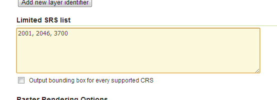

Presenter notes
---------------

Limiting the CRS list is done through the web admin interface.

Log in to the GeoServer admin account.

Click WMS under Services.

Find the section titled Limited SRS list. Enter a list of comma-separated values, such as the following: 2001, 2046, 3700

Scroll to the bottom of the page and click Submit.

--------------------------------------------------

Limiting advertised CRS
=======================

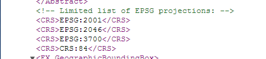

Presenter notes
---------------

Now view the capabilities document again and note the changed list of CRSs.

If you want to output the bounding box for each CRS on every layer, make sure to check the Output bounding box for every supported CRS box. This is useful for certain clients, that require the bounding box when determining whether the CRS is relevant to a given area.

--------------------------------------------------

Limiting advertised CRS
=======================

CRSs may not be *advertised*, but they can still be used.

Presenter notes
---------------

Limiting advertised CRSs doesn’t turn on or off any functionality. Rather, it highlights the “suggested” CRSs for the server, and cuts down on bandwidth for a frequently accessed file. Even if you limit advertised CRSs, other CRSs will still be available to be manually requested, as in the following WMS reflector requests:

--------------------------------------------------

Section 4: Data filtering
=========================

* CQL and OGC filtering
* SQL views

Presenter notes
---------------

--------------------------------------------------

Data filtering
==============

Filter by:

* Relevancy to the map or data context
* User-expressed interest
* Scale
* Cartographic design

Presenter notes
---------------

Filtering is used to limit data from a data source. These limits can be based on criteria like:

* Relevancy to the map or data context. For example, displaying only certain results from a layer.
* User-expressed interest. For example, in a given layer, a user only wants to display features with a certain criteria.
* Scale. For example, to only show certain features at certain zoom levels.
* Cartographic design. For example, filters in SLD are what drive cartographic classifications.

The advantages of filtering are that it both allows you to separate data into multiple representations from a given source, as well as reduce the management headache of preparing data and maintaining more content than necessary.

In short, filtering allows you to separate data into multiple representations from the source, not at the source.

GeoServer supports two main filtering languages:

* OGC Filter encoding
* CQL/ECQL filter expressions

While not specifically filters, there are other ways to separate data from source with GeoServer:

* SQL Views
* Time/Elevation dimensions on WMS requests

--------------------------------------------------

OGC filters
===========

XML-based method for defining filters:

* WMS GetMap requests, using the ``filter=`` parameter
* WFS GetFeature requests, using the ``filter=`` parameter
* SLD Rules, using the ``<ogc:Filter>`` element

Presenter notes
---------------

--------------------------------------------------

CQL filters
===========

Plain-text language originally created for the OGC CS-W specification:

* WMS GetMap requests, using the ``cql_filter=`` parameter
* WFS GetFeature requests, using the ``cql_filter=`` parameter
* SLD rules, using dynamic symbolizers

Presenter notes
---------------

CQL = Contextual query language

While we tend to say CQL, the filters are actually implemented as Extended CQL (ECQL), which allows the expression the full range of filters that OGC Filter 1.1 can encode.

--------------------------------------------------

CQL versus OGC
==============

* CQL is simpler
* OGC is a standard

Presenter notes
---------------

As will be shown in this section, both OGC filters and CQL filters do much of the same thing. There are a few reasons to choose one over the other:

* CQL is simpler. The CQL filters do not require any complex formatting and are much more succinct than OGC filters.
* OGC is a standard. The OGC filters conform to the OGC Filter specification. CQL does not correspond to any spec.

Note: Both filter= and cql_filter are vendor parameters. This means that they are implementations specific to GeoServer, and are not part of any specification.

--------------------------------------------------

CQL filter example
==================

Preview ``usa:states`` and click to see feature info:

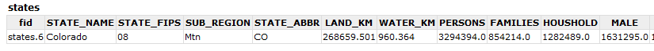

Presenter notes
---------------

Let's start out with a CQL example. We'll use the usa:states layer and perform an information query on it, singling out a state.

First, launch the Layer Preview for this layer.

Click any one of the states to see the attribute information (done through a GetFeatureInfo query). Note that the attribute for the name of the state is called STATE_NAME.

--------------------------------------------------

CQL filter example
==================

::

  &cql_filter=STATE_NAME='California'

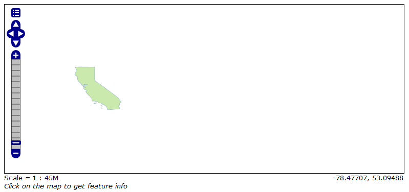

Presenter notes
---------------

Now add the following parameter to the end of the URL:

Submit the request. All the states aside from California should disappear.

--------------------------------------------------

CQL filter operations
=====================

* Comparators (=, <>, >, <, >=, <=):
* BETWEEN, AND, LIKE (% as wildcard), IN (a list)
* Multiple attributes

::

  PERSONS > 15000000
  PERSONS BETWEEN 1000000 AND 3000000
  STATE_NAME LIKE '%C%'
  STATE_NAME IN ('New York', 'California', 'Montana', 'Texas')
  STATE_NAME LIKE 'C%' AND PERSONS > 15000000
 
Presenter notes
---------------

CQL filters let us invoke core evaluations with key/value pairs, such as the above statement. There exist all the standard comparators:

Some less common operators:

And combinations of the above using AND, OR, and NOT.

Try some of these examples. Any of these will work with the usa:states layer:

Note: While browsers can be very forgiving, some characters must be URL encoded. For example, the % must be typed as %25.

--------------------------------------------------

Geometric filters in CQL
========================

Disjoint, Equals, DWithin, Intersects, Touches, Crosses, Within, BBOX...

::

  &cql_filter=BBOX(the_geom,-90,40,-60,45)

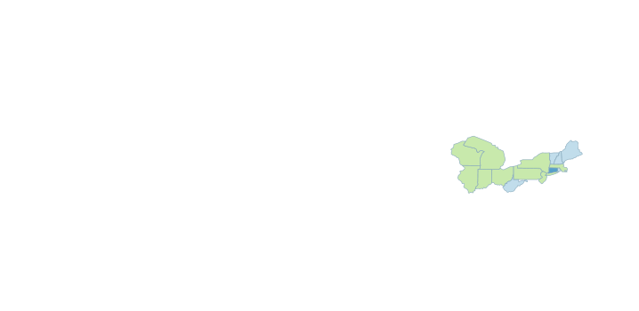

Presenter notes
---------------

CQL also provides a set of geometric filter capabilities. The available operators are:

For example, to display only the states that intersect a given area (a bounding box), the following expression is valid:

&cql_filter=BBOX(the_geom,-90,40,-60,45)

--------------------------------------------------

Geometric filters in CQL
========================

::

  &cql_filter=DISJOINT(the_geom, POLYGON((-90 40, -90 45, -60 45, -60 40, -90 40)))

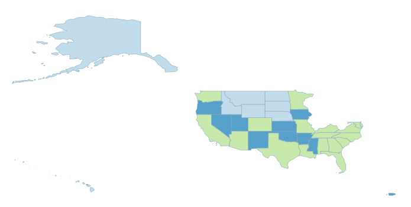

Presenter notes
---------------

The reverse is also valid, filtering the states that do not intersect with a given area (this time using a polygon instead of a bounding box):

--------------------------------------------------

OGC filter functions in CQL filters
===================================

::

  STATE_NAME LIKE '%k%' OR STATE_NAME LIKE '%K%'

becomes

::

  strToLowerCase(STATE_NAME) like '%k%'

Presenter notes
---------------

Warning: This is not to be confused with OGC filters. This is a discussion of OGC filter functions, that can be used in CQL filters. The similarity in naming is unfortunate.

The OGC Filter Encoding specification provides a generic concept of a filter function. A filter function is a named function with any number of arguments, which can be used in a filter expression to perform specific calculations.

This greatly increases the power of CQL expressions. For example, suppose we want to find all states whose name contains an "k", regardless of letter case.

With straight CQL filters, we could create the following expression:

STATE_NAME LIKE '%k%' OR STATE_NAME LIKE '%K%'

Or we could use the strToLowerCase() filter function to convert all values to lowercase first, and then use a single like comparison:

strToLowerCase(STATE_NAME) like '%k%'

Both expressions generate the exact same output.

--------------------------------------------------

OGC filter examples
===================

::

  <PropertyIsEqualTo>
    <PropertyName>STATE_NAME</PropertyName>
    <Literal>California</Literal>
  </PropertyIsEqualTo>

::

  <PropertyIsBetween>
    <PropertyName>persons</PropertyName>
    <Literal>1000000</Literal>
    <Literal>3000000</Literal>
  </PropertyIsBetween>

Presenter notes
---------------

Now let's move on to OGC filters. There are the same kinds of OGC filter encodings as there were with CQL, such as comparators, operators and other logic:

--------------------------------------------------

OGC filter examples
===================

::

  <Intersects>
    <PropertyName>the_geom</PropertyName>
    <gml:Point
     srsName="http://www.opengis.net/gml/srs/epsg.xml#4326">
      <gml:coordinates>
       -74.817265,40.5296504
      </gml:coordinates>
    </gml:Point>
  </Intersects>

Presenter notes
---------------

There are also the full complement of geometric filters with OGC encoding:

--------------------------------------------------

WFS filtering using OGC
=======================

Demo Request Builder: ``WFS_getFeatureIntersects.url``

::

  http://localhost:8080/geoserver/wfs?request=GetFeature&
   version=1.0.0&typeName=advanced:states&
   outputFormat=GML2&FILTER=%3CFilter%20xmlns=%22http://w
   ww.opengis.net/ogc%22%20xmlns:gml=%22http://www.opengi
   s.net/gml%22%3E%3CIntersects%3E%3CPropertyName%3Egeom%
   3C/PropertyName%3E%3Cgml:Point%20srsName=%22EPSG:4326%
   22%3E%3Cgml:coordinates%3E-74.817265,40.5296504%3C/gml
   :coordinates%3E%3C/gml:Point%3E%3C/Intersects%3E%3C/Fi
   lter%3E

Presenter notes
---------------

The previous examples have been WMS GetMap requests, but recall that we can apply both CQL and OGC filters to WFS requests as well.

Once again, for simplicity we'll use the Demo Request Builder for this. There are demo requests that contain OGC filters, which we can examine and run.

Load the Demo Request Builder. In the Request box, select WFS_getFeatureIntersects.url. This is a GET request, so the filter will be URL-encoded:

--------------------------------------------------

WFS filtering using OGC
=======================

::

  <Filter xmlns="http://www.opengis.net/ogc"
   xmlns:gml="http://www.opengis.net/gml">
    <Intersects>
      <PropertyName>geom</PropertyName>
      <gml:Point srsName="EPSG:4326">
        <gml:coordinates>
         -74.817265,40.5296504
        </gml:coordinates>
      </gml:Point>
    </Intersects>
  </Filter>

Presenter notes
---------------

While this is hard to read, it is an OGC Intersects filter on the states layer on a given point (-74.817265,40.5296504)

--------------------------------------------------

WFS filtering using OGC
=======================

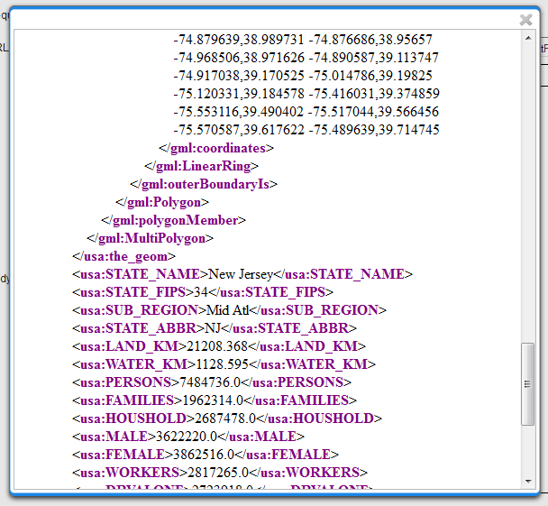

Presenter notes
---------------

That would be New Jersey.

--------------------------------------------------

WFS filtering using OGC
=======================

Demo Request Builder: ``WFS_getFeatureIntersects-1.1.xml``

::

   <wfs:Query typeName="usa:states">
     <Filter>
       <Intersects>
         <PropertyName>the_geom</PropertyName>
         <gml:Point
          srsName="http://www.opengis.net/gml/srs/epsg.xml#4326">
           <gml:coordinates>
            -74.817265,40.5296504
           </gml:coordinates>
         </gml:Point>
       </Intersects>
     </Filter>
   </wfs:Query>

Presenter notes
---------------

The exact same filter can be employed using a POST request.

This version is much easier to read, though the output is exactly the same as above.

--------------------------------------------------

WFS filtering using OGC
=======================

``WFS_getFeatureBetween-1.1.xml``

::

  <wfs:Query typeName="usa:states">
    <wfs:PropertyName>usa:STATE_NAME</wfs:PropertyName>
    <wfs:PropertyName>usa:AREA_LAND</wfs:PropertyName>
    <wfs:PropertyName>usa:the_geom</wfs:PropertyName>
    <ogc:Filter>
      <ogc:PropertyIsBetween>
        <ogc:PropertyName>usa:AREA_LAND/ogc:PropertyName>
        <ogc:LowerBoundary>
          <ogc:Literal>1E11</ogc:Literal>
        </ogc:LowerBoundary>
        <ogc:UpperBoundary>
          <ogc:Literal>1.2E11</ogc:Literal>
        </ogc:UpperBoundary>
      </ogc:PropertyIsBetween>
    </ogc:Filter>
  </wfs:Query>

Presenter notes
---------------

The same set of comparators are available in WFS queries. For example, to filter for values between a certain range, see the WFS_getFeatureBetween-1.1.xml template:

This returns a number of medium-sized states, among them: Pennsylvania, Kentucky, and Virginia.

--------------------------------------------------

WFS filtering using OGC
=======================

``WFS_mathGetFeature.xml``

::

  <wfs:Query typeName="usa:states">
    <ogc:Filter>
      <ogc:PropertyIsGreaterThan>
        <ogc:Div>
            <ogc:PropertyName>MALE</ogc:PropertyName>
            <ogc:PropertyName>PERSONS</ogc:PropertyName>
        </ogc:Div>
         <ogc:Literal>0.5</ogc:Literal>
    </ogc:PropertyIsGreaterThan>
    </ogc:Filter>
    </wfs:Query>

Presenter notes
---------------

There are also operators and functions, for example in the WFS_mathGetFeature.xml request:

This returns all features that satisfy this criteria:

MALE / PERSONS > 0.5

The full set of filtering capabilities is actually part of the WFS spec. This is shown in the WFS capabilities document in the tag named <ogc:Filter_Capabilities>. WMS borrows these capabilities, implementing them as vendor parameters.

--------------------------------------------------

Filtering in SLD rules
======================

Filtering for cartographic classification: SLD

::

  <Rule>
    <ogc:Filter>
      <ogc:PropertyIsLessThan>
        <ogc:PropertyName>PERSONS</ogc:PropertyName>
        <ogc:Literal>2000000</ogc:Literal>
      </ogc:PropertyIsLessThan>
    </ogc:Filter>
    <PolygonSymbolizer>
      <Fill>
        <CssParameter name="fill">#A6CEE3</CssParameter>
        <CssParameter name="fill-opacity">0.7</CssParameter>
      </Fill>
    </PolygonSymbolizer>
  </Rule>

Presenter notes
---------------

Sometimes, instead of filtering data for the sake of excluding records from the whole set, we would want to filter certain features for the sake of cartographic classification. You've likely encountered this before with SLD.

Given the following familiar image:

Here is its SLD, or rather, one rule excerpted for brevity.

This rule, and the others like it, has a filter (to drive the classification) and a symbolizer (to render the data in the class in a specific way).

--------------------------------------------------

Filtering in SLD rules
======================

Presenter notes
---------------

--------------------------------------------------

CQL in SLD dynamic symbolizers
==============================

Expressions evaluated inline in SLD

::

  <PointSymbolizer>
    <Graphic>
      <ExternalGraphic>
        <OnlineResource xlink:type="simple"
         xlink:href="http://www.usautoparts.net/bmw/
                     images/states/
                     tn_${strToLowerCase(STATE_ABBR)}.jpg"/>
        <Format>image/gif</Format>
      </ExternalGraphic>
    </Graphic>
  </PointSymbolizer>

Presenter notes
---------------

CQL filters coupled with OGC filter functions also have a place in SLD, but not (strangely) for filtering. They can be evaluated as an expression in-line in order to return values.

Take a look at the following SLD:

It contains a single rule, but with no explicit filter. The CQL is placed inside the ${ }. What is returned is the value of the attribute STATE_ABBR in lower case using the filter function strToLowerCase().

--------------------------------------------------

CQL in SLD dynamic symbolizers
==============================

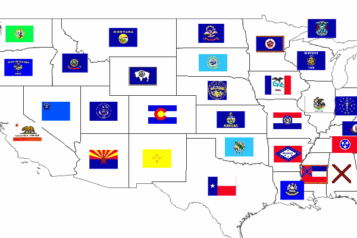

Presenter notes
---------------

The resulting map image looks like this:

--------------------------------------------------

SQL views
=========

SQL views allow custom SQL queries to be saved as layers in GeoServer

* Layers defined by SQL
* Data need not be static
* Can apply to multiple layers
* Execution done at database level
* Can be parametrized
* Powerful!

Presenter notes
---------------

This next section discusses SQL views. Not to be confused with CQL filters, SQL views allow custom SQL queries to be saved as layers in GeoServer.

A traditional way to access database data is to configure layers against either tables or database views. There may be some data preparation into tables, and database views will often include joins across tables and functions to change a data’s state, but as far as GeoServer is concerned these results as somewhat static.

SQL views change this. In GeoServer, layers can be defined by SQL code. This allows for execution of custom SQL queries each time GeoServer requests the layer, so data access need not be static at all.

This is similar to CQL/OGC filters, they comprise only the WHERE portion of a SQL expression, can only apply to one layer at a time, and are somewhat limited in their set of functions / predicates. SQL views don’t suffer from any of these limitations.

One other benefit to SQL views is that execution of the query is always done natively at the database level, and never in memory. This contrasts with CQL/OGC filters, which may or may not be executed at the database level dependent on whether the specific function is found. If such a function is not found, the request is executed in memory, which is a much less efficient process.

Perhaps most usefully, as well as being arbitrary SQL executed in the database using native database functions, SQL views can be parameterized via string substitution.

In short, SQL views have tremendous power and flexibility. They are executed in the database so performance is optimized. You also have access to all database functions, stored procedures, and even joins across tables.

Note: In the past, SQL views were only allowed against databases. Recently, this functionality has been extended to include any data sources.

--------------------------------------------------

SQL view examples
=================

::

  SELECT * FROM cities

::

  SELECT * FROM cities WHERE name='%param_name%'

::

  SELECT geom, name, %param_valfield% 
    AS values FROM cities
    WHERE country='%param_country%'

Presenter notes
---------------

Here are some examples of SQL views. Each one of these can be used to generate a GeoServer layer.

Regarding the use of parameters in SQL views:

* Parameter values can be supplied in both WMS and WFS requests
* Default values can be supplied for parameters
* Input values can be validated by regular expressions to eliminate the risk of SQL injection attacks

Note: SQL Views are read-only, and so cannot be updated by WFS transactions.

--------------------------------------------------

Creating a SQL view as a new layer
==================================

.. image:: ../doc/source/filtering/img/sqlviews_newviewlink.png

Presenter notes
---------------

We will start by setting up a basic SQL view. At first, we will create one with no parameters in the SQL statement, so it will behave like a standard layer at first. We will then create other views with parameters to make the queries more expressive.

SQL views are built against a database, so our first task is to set up a SQL view layer against our "earth" database.

To create a SQL view:

* From the web admin interface, click Layers then click Add a new resource
* Select earth:earth from the box.

--------------------------------------------------

Creating a SQL view as a new layer
==================================

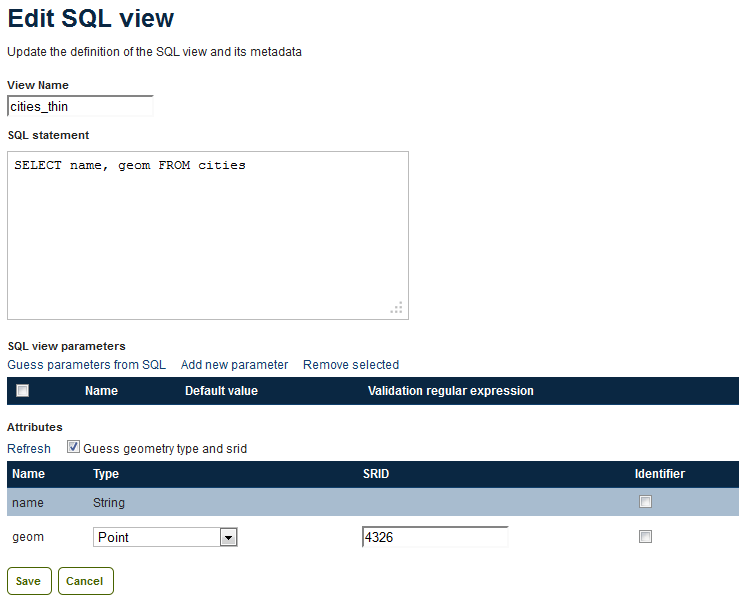

Presenter notes
---------------

A list of the published and unpublished layers in the database will be displayed. In addition, a few new options will be shown above the table. Click the link that says Configure new SQL view....

In the View Name field, enter cities_thin.

For the SQL statement, enter SELECT name, geom FROM cities.

Note: There is no semi-colon after the end of the SQL expression.

Check the box for Guess geometry type and srid and click the Refresh link.

--------------------------------------------------

Creating a SQL view as a new layer
==================================

::

  http://localhost:8080/geoserver/wms/reflect?
    layers=earth:cities_thin&
    format=application/openlayers

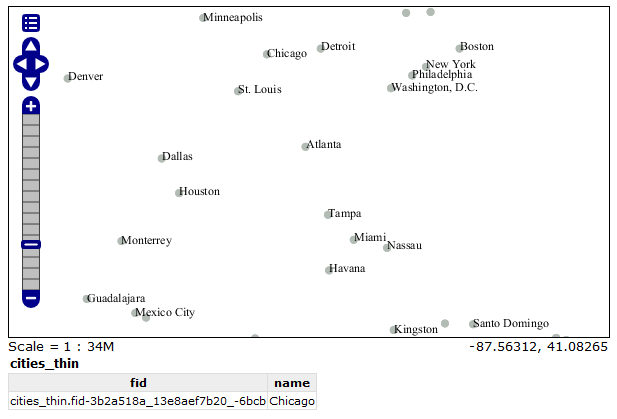

Presenter notes
---------------

Click Save to continue.

You will be taken to the standard layer configuration page. Set the bounding box and CRS (if necessary).

Click the Publishing tab and select the cities style in Default style in order to associate that style with this layer.

Click Save.

Preview the layer. Click a point to see the attribute table. Notice that the only fields available are the name and the feature id:

--------------------------------------------------

Parameterized SQL view
======================

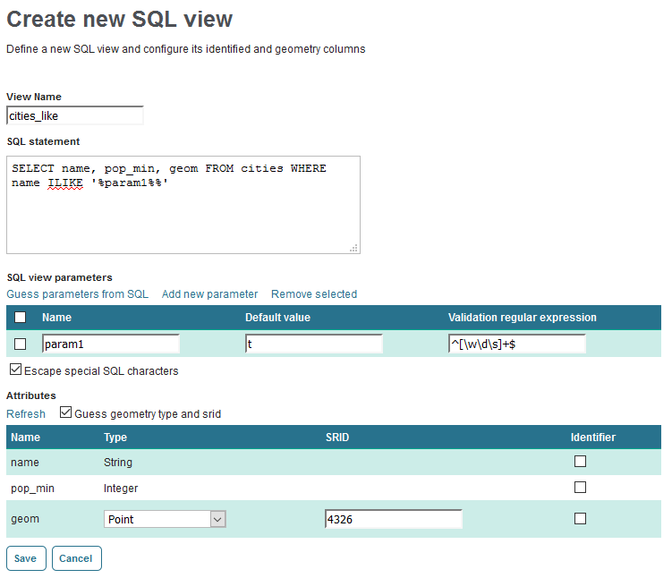

Presenter notes
---------------

Now we'll create a SQL view that takes a variable string parameter and applies it to an attribute comparator. Specifically, we'll query the first letter of the city.

Create a new SQL view layer as above.

In the View Name field, enter cities_like.

For the SQL statement, enter SELECT geom, name FROM cities WHERE name ILIKE '%param1%%'.

Click Guess parameters from SQL. A field titled "param1" should appear. In the Default value box, enter just the letter t.

Check the box for Guess geometry type and srid and click the Refresh link.

--------------------------------------------------

Parameterized SQL view
======================

::

  http://localhost:8080/geoserver/wms/reflect?
    layers=earth:cities_like&
    format=application/openlayers

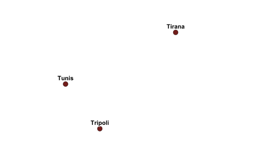

Presenter notes
---------------

Click Save to continue.

You will be taken to the standard layer configuration page. Set the bounding box and CRS (if necessary).

Click the Publishing tab and select the cities style in Default style in order to associate that style with this layer.

Click Save.

Preview this layer. Note that the only cities that display start with the letter T:

--------------------------------------------------

Parameterized SQL view
======================

::

  http://localhost:8080/geoserver/wms/reflect?
    layers=cities_like&
    format=application/openlayers&
    viewparams=param1:s

::

  http://localhost:8080/geoserver/wms/reflect?
    layers=cities_like&
    format=application/openlayers&
    viewparams=param1:san

Presenter notes
---------------

Now specify the parameter value by appending the request with &viewparams=param1:s. This will display only those cities that begin with S:

Now try &viewparams=param1:san to narrow down the list of cities even further:

--------------------------------------------------

Spatial function SQL view
=========================

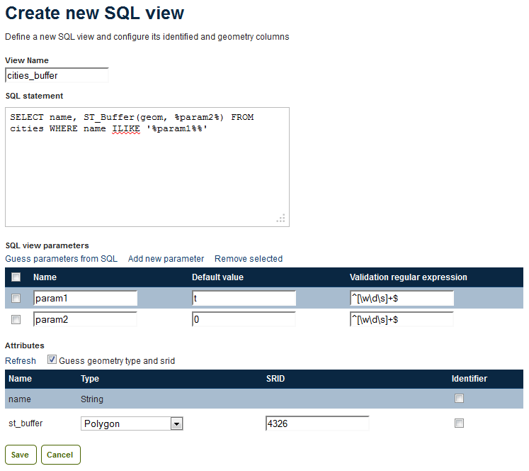

Presenter notes
---------------

In this example, we'll create a SQL view that incorporates spatial functions.

Create a new SQL view layer as above.

In the View Name field, enter cities_buffer.

For the SQL statement, enter SELECT name, ST_Buffer(geom, %param2%) FROM cities WHERE name ILIKE '%param1%%'.

Click Guess parameters from SQL. Two fields, param1 and param2 should appear. In the Default value box, enter the letter t and the number 1, respectively.

Check the box for Guess geometry type and srid and click the Refresh link.

--------------------------------------------------

Spatial function SQL view
=========================

::

  http://localhost:8080/geoserver/wms/reflect?
    layers=cities_buffer&
    format=application/openlayers

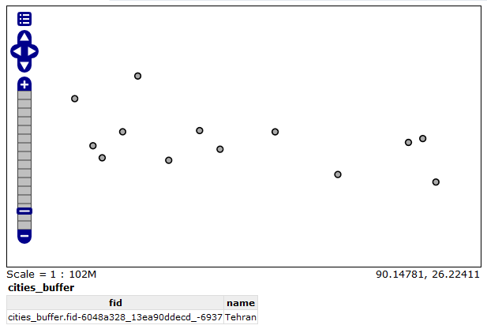

Presenter notes
---------------

Click Save to continue.

You will be taken to the standard layer configuration page. Set the bounding box and CRS (if necessary) and click Save. (Don't worry about associating the cities layer since this view will generate polygons not points.)

Preview the layer:

--------------------------------------------------

Spatial function SQL view
=========================

::

  http://localhost:8080/geoserver/wms/reflect?
    layers=cities_buffer&
    format=application/openlayers&
    viewparams=param1:s

::

  http://localhost:8080/geoserver/wms/reflect?
    layers=cities_buffer&
    format=application/openlayers&
    viewparams=param1:s;param2:4

::

  http://localhost:8080/geoserver/wms/reflect?
    layers=cities_buffer&
    format=application/openlayers&
    viewparams=param1:s;param2:8

Presenter notes
---------------

Now add some parameter values. param1 refers to the first string to match to the first characters of the city name. param2 refers to the buffer size. Here are some other requests:

--------------------------------------------------

Cross layer SQL view
====================

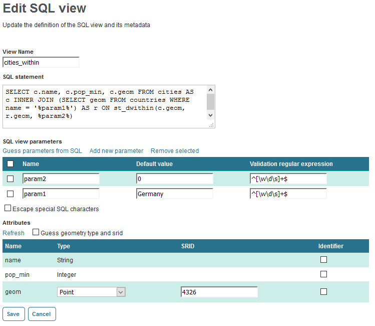

Presenter notes
---------------

This next example uses spatial joins. Because we can do cross-table joins in the database, we can do cross-layer analyses with SQL views.

Create a new SQL view layer as above.

In the View Name field, enter cities_within.

For the SQL statement, enter SELECT c.name, c.geom FROM cities AS c INNER JOIN (SELECT geom FROM rivers WHERE name = '%param1%') AS r ON st_dwithin(c.geom, r.geom, %param2%).

Click Guess parameters from SQL. Two fields, param1 and param2 should appear. In the Default value box, enter Seine and 1, respectively.

Check the box for Guess geometry type and srid and click the Refresh link.

--------------------------------------------------

Cross layer SQL view
====================

::

  http://localhost:8080/geoserver/wms/reflect?
    format=application/openlayers&
    layers=shadedrelief,earth:rivers,earth:cities_within

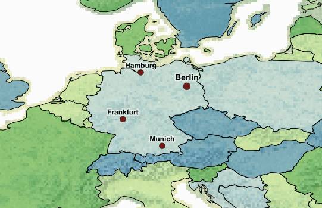

Presenter notes
---------------

Click Save to continue.

You will be taken to the standard layer configuration page. Set the bounding box and CRS (if necessary).

Click the Publishing tab and select the cities style in Default style in order to associate that style with this layer.

Click Save.

Preview the layer. Note the only city that is returned:

--------------------------------------------------

Cross layer SQL view
====================

::

  http://localhost:8080/geoserver/wms/reflect?
    format=application/openlayers&
    layers=shadedrelief,earth:rivers,earth:cities_within&
    viewparams=param1:Thames

::

  http://localhost:8080/geoserver/wms/reflect?
    format=application/openlayers&
    layers=shadedrelief,earth:rivers,earth:cities_within&
    viewparams=param1:Danube

::

  http://localhost:8080/geoserver/wms/reflect?
    format=application/openlayers&
    layers=shadedrelief,earth:rivers,earth:cities_within&
    viewparams=param1:Danube;param2:5

Presenter notes
---------------

Now try some other parameter values. param1 refers to the name of the city, while param2 refers to the distance to check for cities (in units of the source layer, in this case degrees):

--------------------------------------------------

WMS dimensions
==============

* Specially-handled WMS parameters
* **Time** and **elevation**

Presenter notes
---------------

This section discusses WMS dimensions. WMS dimensions are specially-handled parameters taken from attributes in a data set and utilized in WMS requests. The two dimensions handled are time and elevation.

Version 1.1.0 of the WMS spec introduced the notion of time and elevation dimensions to WMS. Spatial data had always had time/date fields and attributes that represented feature elevations, but WMS lacked a decent mechanism for realizing that information.

Time is a perfect candidate for special handling, as the strings themselves can be quite complex, and there are so many different representations of time to manage. The filters that would need to be created to manage these different representations would be quite cumbersome.

--------------------------------------------------

WMS dimensions
==============

::

  1974-05-01T10:06:21.000Z
  1974-05-01
  1974-05
  1974

Presenter notes
---------------

For example, the following are both equally valid time representations:

Times are expressed in compliance with the ISO 8601 standard.

Elevation, while less complicated to work with than time, is nevertheless a fundamental concept in geographical work, and one that complements the often 2D nature of data.

--------------------------------------------------

Enabling WMS dimensions on a layer
==================================

* Edit layer
* Dimensions tab
* Check boxes for time/elevation

Presenter notes
---------------

Need images for this!

GeoServer lets us access this feature of the WMS specification by allowing us to enable time and elevation dimensions on a given layer that has suitable attribute types. For example, to enable time on a layer, one attribute must be of type timestamp, while to enable elevation, an attribute need only to be a numeric field.

This enabling of dimensions is done on a per-layer basis. Enabling either time, elevation, or both is allowed.

Note

As the requirements for elevation are so lenient, it is possible to utilize the benefits of the elevation parameter on an attribute that has nothing to do with elevation. However, the parameter's name cannot be changed from elevation=.

Let's enable the time dimension on one of our layers. We'll use the advanced:globe layer for this.

In the Layer list (not Layer Preview) select the advanced:globe layer for configuration editing.
There are four tabs across the top of the screen. Click the tab that says Dimensions.
Because our data has a timestamp field we have the option to enable the Time dimension. Likewise we need a numeric field to enable the elevation dimension. (If we didn't have a field with a date/time format, this option would have been disabled. Most but not all tables will have a numeric field, so elevation is typically enabled, but not always.)
Check the box to enable the Time dimension.
Select the measured_at field as the Attribute that contains our timestamps.
Leave the End Attribute blank.
Set the Presentation Type to List.
Click Save.

--------------------------------------------------

Query string formats
====================

::

  &time=2010-12-30T08:00:00.000Z

::

  &time=2010-12-25T00:00:00Z/2010-12-28T00:00:00Z

::

  &time=2010-12-30T08:00:00Z,2010-12-25T08:00:00Z

::

  &time=2010-12-30T08:00:00Z,2010-12-25T08:00:00Z/2010-12-28T08:00:00Z

Presenter notes
---------------

Now that the layer has a properly enabled Time dimension, it is possible to make queries against that value.

At single point in time:

Between a range of times:

Discrete time periods:

Or multiple time periods:

To test this, open a layer preview on the time-enabled globe layer

--------------------------------------------------

Precision of values
===================

Fully precise shows exact values:

::

  &time=1945-05-07T02:42:00.000Z

Imprecise shows all values that match:

::

  &time=1980-12-08

Presenter notes
---------------

A parameter that is fully precise:

will return features that contain a timestamp at this exact value only.

A parameter that is imprecise:

will return all of the features whose timestamp match that date, regardless of time.

Both values, and many others of varying precision, are all ISO 8601 compliant and are thus valid for use in requests.

--------------------------------------------------

Validity checking
=================

Values must be ISO 8601 compliant, or will cause errors:

::

  http://localhost:8080/geoserver/wms/reflect?
    layers=shadedrelief,globe&
    format=application/openlayers&
    time=2010-12-30T

::

  http://localhost:8080/geoserver/wms/reflect?
    layers=shadedrelief,globe&
    format=application/openlayers&
    time=sammy

Presenter notes
---------------

Values that are not ISO 8601 compliant when used in requests, will cause errors.

For example, try these two requests:

--------------------------------------------------

Section 5: Data processing and analysis
=======================================

* Web Processing Service (WPS)
* Rendering transformations

Presenter notes
---------------

Working with geospatial data goes beyond data management, viewing, and editing. Analysis and processing of data is also a vital task. Traditionally the domain of desktop software, processing is now an integral part of web-based geospatial techniologyies.

In this section, we will discuss the Web Processing Service, a service for running geospatial processes over the web, and rendering transformations, a method of doing similar analysis visually and dynamically.

--------------------------------------------------

Web Processing Service
======================

  WPS defines a standardized interface that facilitates the publishing of geospatial processes, and the discovery of and binding to those processes by clients. "Processes" include any algorithm, calculation or model that operates on spatially referenced data. "Publishing" means making available machine-readable binding information as well as human-readable metadata that allows service discovery and use.

Presenter notes
---------------

Here is the official definition of WPS from the specification:

--------------------------------------------------

Web Processing Service
======================

* Analytical processes over the web
* Run on server, not on desktop
* Decentralized processing

Presenter notes
---------------

As its name suggests, a Web Processing Service is a service that allows you to perform analytical processes over the web. The processes/analyses are run on the server, but the calls to the processes (and sometimes the inputs) are made over the web.

Processes are run on data, and since we're talking about GeoServer. we're typically (but not always) talking about spatial data.

Geoprocessing and spatial analysis aren't new topics, but what WPS is doing differently is taking these processes off of desktops using potentially unmanaged versions of data and putting them onto centralized servers with canonical copies of data.

This approach of centralizing data on a web server enables anyone to perform analysis on the same source at any time. A given user need not have specific access to the data, and yet can manipulate it through processing.

--------------------------------------------------

Web Processing Service
======================

How does it work?

* Just like WFS/WMS

  * Capabilities document
  * DescribeProcess (like DescribeFeatureType)
  * ExecuteProcess (like GetMap/GetFeature)

* Data can be on server or POSTed

Presenter notes
---------------

WPS works just like other OGC services like WMS and WFS. The only difference is the extra notion of a "process." A process is just some sort of function, or chain of functions. These definitions are usually defined on the server and accessed as part of a request. It can take inputs from a client (or from the server itself)

The definition of the process exists on a server, and it can take inputs from a client, which is then operated on by the server, and then output in some way.

Like WMS and WFS, there is the same idea of the capabilities document (through a GetCapabilities request), which lists all of the processes known to the server. Like WFS DescribeFeatureType, the DescribeProcess operation will detail the inputs and outputs of a given process. And just like GetMap or GetFeature, ExecuteProcess will perform the operation.

The data to be operated on can be POST'ed as part of the request, but that can be unwieldy if the data is large or the bandwidth small. It makes much more sense to store the data on the server, and then operate on it there. The exception to this is smaller data, such as a bounding box or simple shape, that is used to operate on larger datasets stored on the server (say with a clipping operation).

--------------------------------------------------

GeoServer and WPS
=================

* Full support for WPS
* Custom implementation (processes)
* Includes GUI request builder

Presenter notes
---------------

GeoServer has full support for WPS. It is currently available as an extension in the community version. In the OpenGeo Suite version of GeoServer, though, it is integrated into the core without any additional work required. The functionality of both implementations are identical.

It should be noted that there is a difference between WPS as a standard and WPS as it is implemented. WPS as a standard is very generic, and doesn't specify any more than a framework for what is possible. It is in the implementation of WPS (and especially what processes are available) that determine how useful and powerful it can be. So while the discussion here will be on GeoServer's implementation of WPS, other products such as 52-North or Deegree may have very different implementations.

WPS, like other OGC services, uses XML for its inputs and outputs. With multiple inputs and outputs (and especially when chained processes are invoked) this can get extremely unwieldy. Thankfully, GeoServer includes a WPS Request Builder to perform basic tasks, and to learn/prototype syntax. As a bonus, when building a process or task through the interface, it also generates the actual XML instructions, allowing you to hold on to the process for later use.

--------------------------------------------------

WPS example
===========

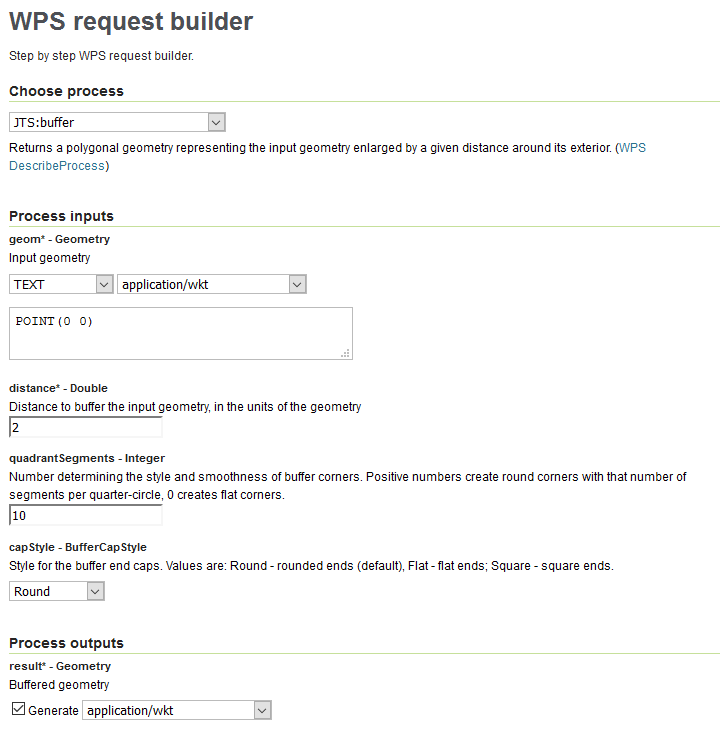

Presenter notes
---------------

The buffer process is the simplest, most common process, and so it makes sense to start with it here. We're going to buffer a point centered on the origin to a radius of 2. (The units are only important if specified, which we won't do here.)

Load the WPS request builder. This is accessed by clicking on Demos and then selecting WPS request builder.

Select the JTS:buffer process in the Choose process field.

--------------------------------------------------

WPS example
===========

::

  <ows:Identifier>JTS:buffer</ows:Identifier>
    <wps:DataInputs>
      <wps:Input>
        <ows:Identifier>distance</ows:Identifier>
        <wps:Data>
          <wps:LiteralData>2</wps:LiteralData>
        </wps:Data>
      </wps:Input>
      <wps:Input>
        <ows:Identifier>quadrantSegments</ows:Identifier>
        <wps:Data>
          <wps:LiteralData>10</wps:LiteralData>
        </wps:Data>
      </wps:Input>
      <wps:Input>
        <ows:Identifier>capStyle</ows:Identifier>
        <wps:Data>
          <wps:LiteralData>Round</wps:LiteralData>
        </wps:Data>
      </wps:Input>
    </wps:DataInputs>
    <wps:ResponseForm>
      <wps:RawDataOutput mimeType="application/wkt">
        <ows:Identifier>result</ows:Identifier>
      </wps:RawDataOutput>
    </wps:ResponseForm>

Presenter notes
---------------

If you click Generate XML from process inputs/outputs, you'll see the XML that is POSTed to the server in order to execute the process. It is reproduced below:

--------------------------------------------------

WPS example
===========

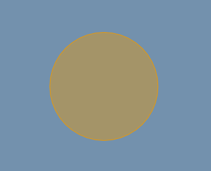

::

  POLYGON ((2 0, 1.9753766811902755 -0.3128689300804617, ...

Presenter notes
---------------

Take a look at this request, and see how all of the input parameters (including the input geometry) have been encoded into the XML request.

Click Execute request. Here is the result:

--------------------------------------------------

Chaining processes
==================

* Output of one process becomes input of another
* The real power of WPS

Presenter notes
---------------

WPS has the ability to chain multiple process together, so that the output of one becomes the input to another. This is where the power of WPS really shows.

Here are some examples of some applications of chaining:

    Chaining a viewshed with a simplification and then a smoothing process on the resulting polygon.
    Overlaying a land use polygon coverage against a county coverage, then unioning all the resultant polygons of a certain type.
    Taking cell towers, buffering them by a radius depending on their signal strength and elevation, then unioning all the buffer polygons to determine a total area of coverage.

--------------------------------------------------

Types of processes
==================

* JTS Topology Suite (geometry operations)
* GeoTools (feature operations)

Presenter notes
---------------

There are two categories of processes in GeoServer's implementation of WPS:

    JTS Topology Suite (primarily geometry operations such as buffer, centroid, contains, and touches)
    Internal GeoTools/GeoServer processes (primarily feature operations such as bounds, clip, reproject, and import)

The benefit to the GeoServer-specific processes is that the data can already be on the server. In this way things can be set up such that the large data sets are stored on the server, and only the inputs and output are passed to and from the client. In fact, the output (which can itself be quite large) doesn't even need to be passed back to the client, as the output of a process can be stored on the server as a new layer (via the gs:Import process). So in most cases, large bandwidth is not required for large-scale processing.

--------------------------------------------------

Build your own process
======================

Option 1: Be a Java developer

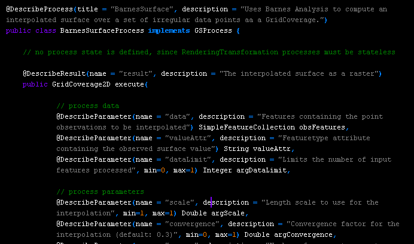

Presenter notes
---------------

There is also the ability to define your own processes. The types of processes that are possible are virtually unlimited. The WPS spec only discusses the need for a process to have inputs and outputs, but doesn't specify what they are or how many of them (or what type) they are.

There are a few options through which you can build your own processes. If you're a Java developer, you're in luck, as you can build your classes right into GeoServer.

--------------------------------------------------

Build your own process
======================

Option 2: Use GeoScript

.. image:: ../doc/source/processing/img/wps_geoscript.png

Presenter notes
---------------

If not, you can use something like GeoScript. GeoScript allows you to interact with GeoTools and all of its rich Java goodness within the context of your preferred scripting language, such as Python or JavaScript.

You can think of GeoScript as an interpretation layer to GeoServer.

GeoScript is beyond the scope of this workshop, but note that if you're comfortable in Python, JavaScript, you should be able to use GeoScript comfortably.

--------------------------------------------------

Rendering transformations
=========================

* Processes executed during WMS rendering pipeline
* Think "WPS in SLD"

Presenter notes
---------------

A rendering transformation allows processing to be carried out on data within the GeoServer rendering pipeline. This means that the process gets applied dynamically, between when it is accessed by GeoServer and it gets rendered as an image and shipped to your browser.

A rendering transformation isn't any different from a process or chain of processes. The difference is that a process (through WPS) is executed at a given time and returns any number of outputs. A rendering transformation is a process that is executed in the process of rendering a WMS image.

Theoretically, any WPS process can be executed as a rendering transformation.

--------------------------------------------------

Types of rendering transformations
==================================

* Raster-to-Vector
* Vector-to-Raster
* Vector-to-Vector

Presenter notes
---------------

The types of rendering transforms available in GeoServer include:

Examples:

* Contour returns contour vectors from a DEM raster
* Heatmap computes a raster from weighted data points.
* PointStacker aggregates dense point data into point clusters.

--------------------------------------------------

Invoking rendering transformations
==================================

* ``<Transformation>``
* Inside an SLD

Presenter notes
---------------

Rendering transformations are invoked on a layer within an SLD. Parameters may be supplied to the transformation to control the appearance of the output. Once transformed, the rendered output for the layer is produced by applying the styling rules and symbolizers in the SLD to the result of transformation.

This is similar to the use of filters in SLD, except that the filter is a stored process.

--------------------------------------------------

Rendering transformations without WPS
=====================================

* Rendering transformations are not WPS
* Turn off WPS if you don't need it

Presenter notes
---------------

Because Rendering transformations are invoked as WPS processes, you will need to have the WPS extension installed to run them.

While the WPS service needs to be installed to use rendering transformations, it does not need to be enabled. To avoid unwanted consumption of server resources, it may even be desirable to disable the WPS service if it is not being used directly. To disable WPS, navigate to the WPS configuration (WPS under Services) and deselect Enable WPS.

--------------------------------------------------

Usage
=====

::

  <StyledLayerDescriptor ...>
    ...
      <FeatureTypeStyle>
        <Transformation>
          <ogc:Function name="gs:ProcessName">
            <ogc:Function name="parameter">
              <ogc:Literal>paramName</ogc:Literal>
              <ogc:Literal>paramValue</ogc:Literal>
            </ogc:Function name="parameter">
            ... (other parameters) ...
        </Transformation>
            ... ( rest of SLD) ...
      </FeatureTypeStyle>
    ...
  </StyledLayerDescriptor>

Presenter notes
---------------

The following is a snippet of SLD that contains the fictitious process called "gs:ProcessName".

Rendering Transformations are invoked by adding the <Transformation> element to a <FeatureTypeStyle> element in an SLD document. The <Transformation> element syntax leverages the OGC Filter function syntax. The content of the element is a <ogc:Function> with the name of the rendering transformation process. This element specifies the name of the transformation process, along with the parameter values controlling the operation of the transformation. Parameters are supplied as name/value pairs.

The first argument to this function is an <ogc:Literal> containing the name of the parameter. The optional following arguments provide the value for the parameter (if any).

--------------------------------------------------

Usage
=====

Parameters can be:

* Literal value
* Computed expression
* SLD environment variable (which allows obtaining values for the current request such as output image width and height)

Presenter notes
---------------

Some parameters accept only a single value, while others may accept a list of values. Values may be supplied in several ways:

    As a literal value
    As a computed expression
    As an SLD environment variable (which allows obtaining values for the current request such as output image width and height)

The order of the supplied parameters does not matter.

Most rendering transformations take the dataset to be transformed as an input. This is supplied via a special parameter (named data) which does not need to have a value specified. The name of the parameter is determined by the particular transformation being used.

When the transformation is executed, the input dataset is passed to it via this parameter.

--------------------------------------------------

Usage
=====

Symbolizer is tied to the output geometry, not the input type!

Presenter notes
---------------

The rest of the content inside the FeatureTypeStyle is the symbolizer. As this SLD is styling the result of the rendering transformation, the symbolizer should match the geometry of the output, not the input. Thus, for a vector-to-raster transformation, the symbolizer should be a <RasterSymbolizer>. For a raster-to-vector transformation, the symbolizer can be any of <PointSymbolizer>, <LineSymbolizer>, <PolygonSymbolizer>, and <TextSymbolizer>.

--------------------------------------------------

Example
=======

Heatmap

::

  http://localhost:8080/geoserver/wms/reflect?
    layers=world:urbanareas1_1&
    format=application/openlayers

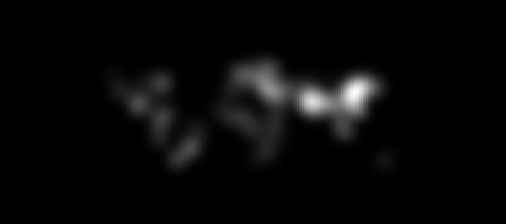

Presenter notes
---------------

This layer is a heatmap. It shows a colored raster based on intensity of a given attribute.

--------------------------------------------------

Example
=======

::

  <Transformation>
    <ogc:Function name="gs:Heatmap">
      <ogc:Function name="parameter">
        <ogc:Literal>data</ogc:Literal>
      </ogc:Function>
      <ogc:Function name="parameter">
        <ogc:Literal>weightAttr</ogc:Literal>
        <ogc:Literal>pop2000</ogc:Literal>
      </ogc:Function>
      <ogc:Function name="parameter">
        <ogc:Literal>radiusPixels</ogc:Literal>
        <ogc:Function name="env">
          <ogc:Literal>radius</ogc:Literal>
          <ogc:Literal>100</ogc:Literal>
        </ogc:Function>
      </ogc:Function>
      <ogc:Function name="parameter">
        <ogc:Literal>pixelsPerCell</ogc:Literal>
        <ogc:Literal>10</ogc:Literal>
      </ogc:Function>
      <ogc:Function name="parameter">
        <ogc:Literal>outputBBOX</ogc:Literal>
        <ogc:Function name="env">
          <ogc:Literal>wms_bbox</ogc:Literal>
        </ogc:Function>
      </ogc:Function>
      <ogc:Function name="parameter">
        <ogc:Literal>outputWidth</ogc:Literal>
        <ogc:Function name="env">
          <ogc:Literal>wms_width</ogc:Literal>
        </ogc:Function>
      </ogc:Function>
      <ogc:Function name="parameter">
        <ogc:Literal>outputHeight</ogc:Literal>
        <ogc:Function name="env">
          <ogc:Literal>wms_height</ogc:Literal>
        </ogc:Function>
      </ogc:Function>
    </ogc:Function>
  </Transformation>

Presenter notes
---------------

Now let's investigate how this layer was created. Open the heatmap SLD in a text editor:

As this SLD is quite long, it's best to break it up into sections. Lines 14-53 define the rendering transformation.

--------------------------------------------------

Example
=======

::

  <Rule>
    <RasterSymbolizer>
    <!-- specify geometry attribute of input to pass validation -->
      <Geometry><ogc:PropertyName>the_geom</ogc:PropertyName></Geometry>
      <Opacity>0.6</Opacity>
      <ColorMap type="ramp" >
        <ColorMapEntry color="#FFFFFF" quantity="0" label="nodata" opacity="0"/>
        <ColorMapEntry color="#FFFFFF" quantity="0.02" label="nodata" opacity="0"/>
        <ColorMapEntry color="#4444FF" quantity=".1" label="nodata"/>
        <ColorMapEntry color="#FF0000" quantity=".5" label="values" />
        <ColorMapEntry color="#FFFF00" quantity="1.0" label="values" />
      </ColorMap>
    </RasterSymbolizer>
  </Rule>

Presenter notes
---------------

Lines 54-67 control the actual output symbolization:

Remember that even though the input layer itself is a vector layer (verify this by appending &styles=point to the above preview request), the output of the heatmap rendering transformation is a raster layer, so that it what needs to be styled here. What we see is a color ramp for values from 0 to 1, with 0 and 0.02 being styled as nodata (transparent).

--------------------------------------------------

Other example
=============

``gs:PointCluster`` in ``world:volcanoes``

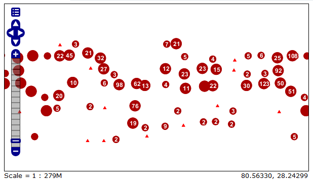

Presenter notes
---------------

Another layer that contains rendering transformations is world:volcanoes, which uses the gs:PointCluster process to "stack" points on top of each other to minimize the number of features rendered.

For more information
====================

.. image:: ../doc/source/opengeo.png

http://opengeo.org
------------------

Presenter notes
---------------

OpenGeo helps to develop GeoServer and funds development through its OpenGeo Suite. Learn more at http://opengeo.org.

--------------------------------------------------

Any questions?
==============

Presenter notes
---------------

--------------------------------------------------

