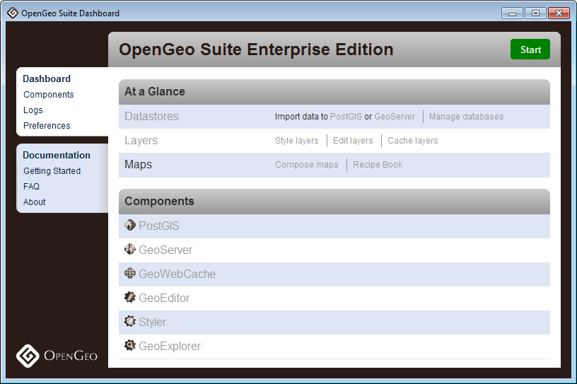
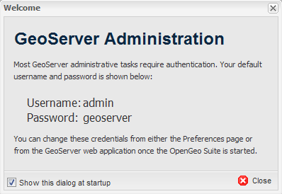
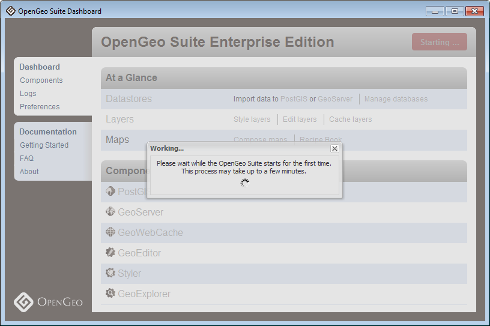
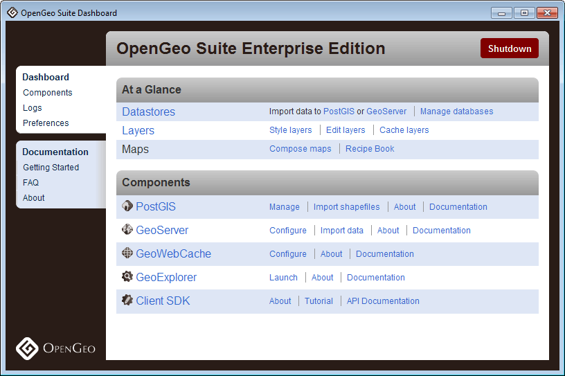
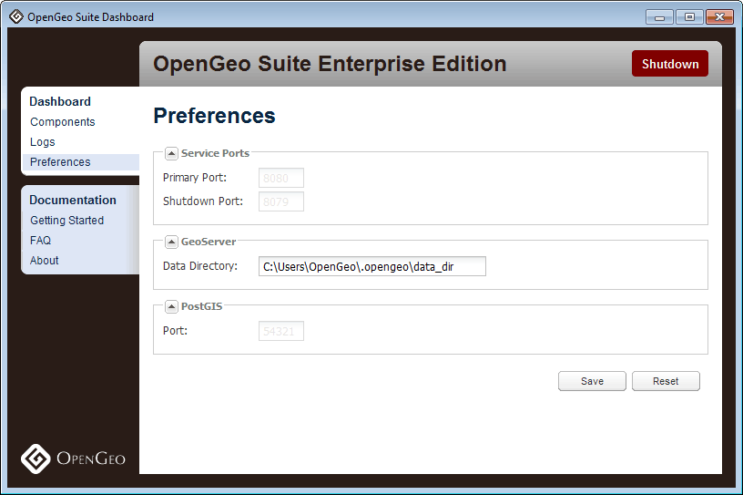

.. _geoserver.install.dashboard:

Dashboard
=========

The OpenGeo Suite comes with a Dashboard, a single interface that allows you to access all components of the OpenGeo Suite, including links to common tasks, configuration, management, and application logs.  It runs on the host machine as both a standalone application, and in a browser.

   *OpenGeo Suite Dashboard*

.. note:: When you first launch the OpenGeo Suite Dashboard, you will be presented with the GeoServer username and password.  These credentials are used to administer GeoServer.  Remember these credentials.

   *Dashboard first launch*

Starting and Stopping
---------------------

The standalone Dashboard can start and stop the OpenGeo Suite.  Simply click on the Start or Shutdown button at the top right of the Dashboard.  Many links in the Dashboard will only be enabled when the OpenGeo Suite is running.

.. note:: The first time the OpenGeo Suite is started might take a few minutes to initialize the software.  Subsequent starting times will be greatly reduced.

   *OpenGeo Suite starting*

   *OpenGeo Suite started*

You can also start and stop the OpenGeo Suite from the command prompt.   First, navigate to the root of your installation directory.  To start::

   > opengeo-suite start  

To stop::

   > opengeo-suite stop

Preferences
-----------

You can configure the OpenGeo Suite through the Preferences page.

.. warning:: You must stop and start the OpenGeo Suite for any changes to take effect.

   *Preferences*

Service Ports
~~~~~~~~~~~~~

The OpenGeo Suite runs a web server on your host machine that responds on a specific port (the default is **8080**).  You can change this by  changing the :guilabel:`Port` value.  Click :guilabel:`Save` when done.  Restart the OpenGeo Suite for the change to take effect.  

GeoServer Data Directory
~~~~~~~~~~~~~~~~~~~~~~~~

GeoServer data and configuration is stored in what is known as the data directory.  You can point the OpenGeo Suite to a different GeoServer data directory if you'd like by changing the value of :guilabel:`Data Directory`.  Click :guilabel:`Save` when done.  Restart the OpenGeo Suite for the change to take effect.

GeoServer Administration
~~~~~~~~~~~~~~~~~~~~~~~~

Most GeoServer administrative tasks require authentication.  The default username and password for the GeoServer that is contained in the OpenGeo Suite is ``admin`` / ``geoserver``.  To change these credentials, enter new values in the :guilabel:`Username` and :guilabel:`Password` fields.  You will need to type the password again in the :guilabel:`Confirm` field.  Click :guilabel:`Save` when done.  Restart the OpenGeo Suite for the change to take effect.