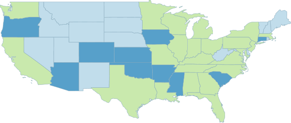

.. _geoserver.overview.wms:

Web Map Service (WMS)
=====================

A fundamental component of the web map (and probably the simplest to understand) is the map image. **The Web Map Service (WMS)** is a standard protocol for serving georeferenced map images generated by a map server. In short, WMS is a way for a client to request map tiles from a server. The client sends a request to a map server, then the map server generates an image based on parameters passed to the server in the request and finally returns an image.

It is important to note that the source material from which the image is generated need not be an image. The WMS generates an image from whatever source material is requested, which could be vector data, raster data, or a combination of the two.

.. figure:: img/wms.png

   *A diagram showing how a WMS turns data into a map image*

Sample WMS request
------------------

The following is a sample WMS request to a hosted GeoServer instance:

http://suite.opengeo.org/geoserver/wms?SERVICE=WMS&VERSION=1.3.0&REQUEST=GetMap&LAYERS=usa:states&SRS=EPSG:4326&BBOX=24.956,-124.731,49.372,-66.97&FORMAT=image/png&WIDTH=600&HEIGHT=255

Here is the same request with line breaks added for clarity::

   http://suite.opengeo.org/geoserver/wms?
     SERVICE=WMS&
     VERSION=1.3.0&
     REQUEST=GetMap&
     LAYERS=usa:states&
     SRS=EPSG:4326&
     BBOX=24.956,-124.731,49.372,-66.97&
     FORMAT=image/png&
     WIDTH=600&
     HEIGHT=255

While the full details of the WMS protocol are beyond the scope of this course, a quick scan of this request shows that the following information is being requested:

   * Server details (a WMS 1.3.0 request)
   * Request type (a WMS GetMap request)
   * Layer name (``usa:states``)
   * Projection (EPSG:4326)
   * Bounding box (in this case, latitude/longitude coordinates)
   * Image properties (600x255 PNG)

If you paste the full request into a browser, the result would be:

   *An image generated by a WMS request*

Other WMS requests
------------------

A WMS request can ask for more than just a map image (the "GetMap" operation). An example of another such request is a request for information about the WMS server itself. The request is called **GetCapabilities**, and the response is known as the **capabilities document**. The capabilities document is an XML response that details the supported image formats, projections, and map layers being served by that WMS.

The following is a WMS GetCapabilities request given to the same WMS used above

http://suite.opengeo.org/geoserver/wms?SERVICE=WMS&VERSION=1.3.0&REQUEST=GetCapabilities

And the same request with line breaks for clarity::

   http://suite.opengeo.org/geoserver/wms?
      SERVICE=WMS&
      VERSION=1.3.0&
      REQUEST=GetCapabilities

You can paste this request into a browser to see the result.

More Information
----------------

For more information, please see the `GeoServer documentation on WMS <http://docs.geoserver.org/latest/en/user/services/wms/>`_ or the `OGC page on the Web Map Service protocol <http://www.opengeospatial.org/standards/wms>`_.