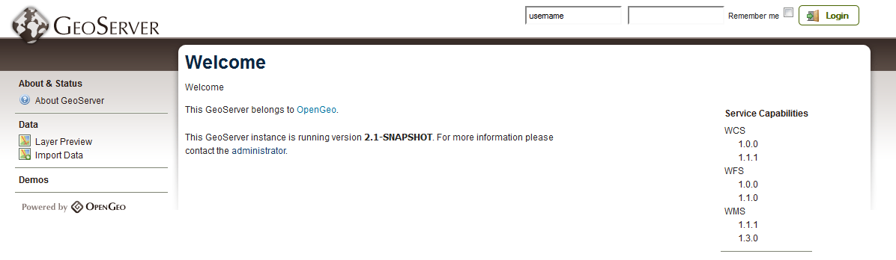

.. _geoserver.webadmin:

GeoServer Web Administration
============================

GeoServer includes a web-based administration interface.  Most GeoServer configuration can be done through this interface, without the need to edit configuration files by hand.

This section will give a brief overview to the web interface.  Subsequent sections will use the web interface in greater detail.

Viewing
-------

The default location of the GeoServer admin interface is `<http://localhost:8080/geoserver>`_ .  The initial page is called the Welcome page.

   *GeoServer Welcome page*

Authentication
--------------

For security reasons, most GeoServer configuration tasks require you to be logged in first.  By default, the GeoServer administration credentials are ``admin`` and ``geoserver``, although this can be changed.

#. Log in using the default credentials.

   .. figure:: img/login.png
      :align: center

      *Logging in with default credentials*

After logging in, many more options will be displayed.

.. figure:: img/loggedin.png
   :align: center

   *GeoServer Welcome page with administrative options*

Navigation
----------

Use the links on the left side column to manage GeoServer, its services, data, security settings, and much more.  Also on the main page are direct links to the capabilities documents for each service (WFS, WMS, WCS).  We will be using the links on the left under :guilabel:`Data` (:guilabel:`Workspaces`, :guilabel:`Stores`, :guilabel:`Layers`, etc.) very often in this workshop, so it is good to familiarize yourself with their location.

.. _geoserver.webadmin.layerpreview:

Layer Preview
-------------

You can use the :guilabel:`Layer Preview` link to easily view layers currently being served by GeoServer.  The Layer Preview pages includes quick links to viewing layers via OpenLayers, along with other services.

#. Click on the :guilabel:`Layer Preview` link, located on the left side under :guilabel:`Data`.

   .. figure:: img/layerpreviewlink.png
      :align: center

      *Navigating to the Layer Preview page*

#. Preview a few layers by clicking on the :guilabel:`OpenLayers` link next to each layer.

   .. figure:: img/layerpreviewpage.png
      :align: center

      *The Layer Preview page*

   .. figure:: img/usastates.png
      :align: center

      *Viewing the usa:states layer*

.. note:: Take a look at the contents of the URL bar when viewing an OpenLayers map.  It is similar in construction to the sample WMS requests made in the :ref:`geoserver.overview.wms` section.  The salient difference is the use of ``format=application/openlayers`` as the output format.

Logs
----

GeoServer displays the contents of the logs without the need to drop to a command line.  Reading the logs is helpful when troubleshooting.  To view the logs, click on :guilabel:`GeoServer Logs` on the left under :guilabel:`About & Status`.

   .. figure:: img/logs.png
      :align: center

      *View the GeoServer application logs*

More settings
-------------

Spend some time exploring this interface and its features by clicking through the links on the left.  The :guilabel:`Demos` link in particular contains some helpful utilities for learning about the inner-workings of GeoServer functionality.