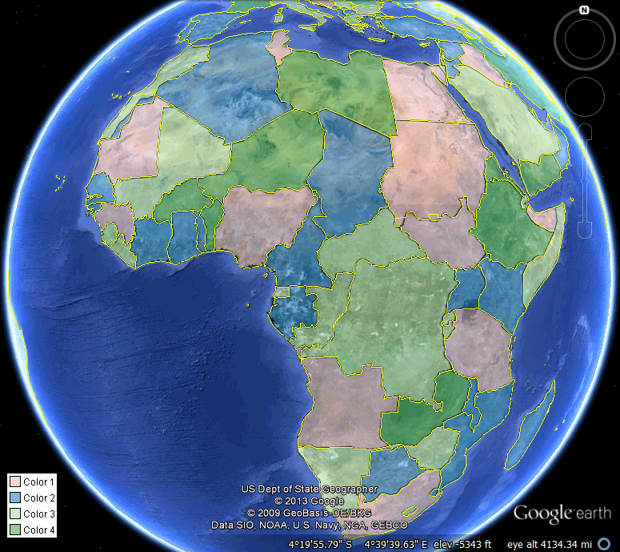

Raster and vector display
=========================

Google Earth's rendering of GeoServer features can take one of two forms: raster or vector output.

Raster output is like a WMS response wrapped over top of the globe. It requires much less throughput to generate the display, but provide much less interactivity. On the other hand, vector output is like a WFS response rendered over the globe. You get the entire feature's geometry, which requires much more bandwidth, but allows for more interactivity.

The determination to display raster or vector data is made by Google Earth depending on the number of features displayed on screen at any given time. You can see this by zooming out very far, waiting a few seconds for the display to update, and then zooming in very close. You will notice subtle differences in the way that the features are rendered.

   When too many features display Google Earth switches to raster features

.. figure:: img/score_zoominvector.png

   When few features display Google Earth switches to vector features
   
The raster-versus-vector determination is called **scoring**. The score itself is known as the **kmscore**. The kmscore is a value between 0 and 100, where 0 means "force raster" and 100 means "force vector". The values in between use a abstruse formula, and in general it is perhaps best to try out a few values to see how performant your display is. The default is 50.

Since we have a small number of features here, we want to force vector display. To do this, we are going to set a kmscore of 100.

#. Edit the Network Link as in the previous sections.

#. Remove the ``cql_filter`` parameter and append ``&kmscore=100`` to the end of the request. Click :guilabel:`OK` when done.

   .. note::

      The full Network Link should be::

        http://localhost:8080/geoserver/wms/kml?layers=earth%3Acountries&legend=true&kmscore=100

#. Now zoom out very far. Notice that the features remain in vector form. The way to test this is to click on a feature. If the placemark displays, then the feature was drawn as a vector.

   .. figure:: img/score_zoomoutvector.png

      Features drawn as vectors even when zoomed out

