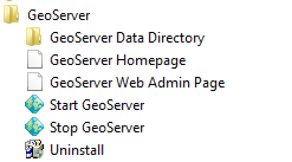

.. install.geoserver:

OSGeo Community GeoServer Distribution
======================================

The GeoServer project is part of the Open Source Geospatial Foundation. Two community releases are available at any one time:

* stable: The latest production ready GeoServer along with optional extensions. New features and fixes are added to the stable release for the first six months.
* maintenance: Fixes are added to maintenance releases for the next six months.

GeoServer Comunity distributions include windows and mac installers along with standalone bin download. For those that already use Tomcat a web archive is alos available.

OSGeo provides a vendor neutral software foundation for Boundless, GeoSolutions and other collaborators to work on the project together. Our original company, OpenPlans, donated the GeoServer and GeoWebCache codebases to OSGeo in 2014. The OpenLayers and PostGIS projects are also hosted by OSGeo.

Installation Requirements
-------------------------

In this section we will install GeoServer on your desktop computer.

GeoServer, being a Java Web application, requires the following in order to function:

* A Java Runtime Environment (JRE) - you may already have Java installed on your machine.
* An an application server - our distribution includes the Jetty application server, so separate installation is not needed here.

Prerequisites:

* Please disable any programs on your system that use either 8080. (If this is not possible, please ask for alternative connection options.)
* We strongly recommend you use a recent version of `Firefox <http://www.mozilla.org/en-US/firefox/new/>`_ as the browser on your host system. Using `Chrome <https://www.google.com/intl/en/chrome/browser/>`_ is acceptable, though an XML viewer extension such as `XV <https://chrome.google.com/webstore/detail/xv-%E2%80%94-xml-viewer/eeocglpgjdpaefaedpblffpeebgmgddk?hl=en>`_ will be required for some sections. Other browsers have not been tested and are not recommended.
* Make sure you have administrative rights (Windows) or super-user privileges (Linux and OS X) on your system.

.. install.geoserver.java:

Installing Java
---------------

.. _Java Runtime Environment: https://java.com/en/download/manual.jsp

#. Install Java on your system (for example, by downloading a `Java Runtime Environment`_ ).
  
   * We recommend Oracle Java Runtime Environment for Windows, Mac and Linux.
   * On Linux OpenJDK is also supported. Check the :file:`software` folder Oracle JRE installers.
   * We recommend running the version of Java that matches your operating system. On windows you may wish to use Java i566 (even if you use Windows 64) to allow GeoServer to run as a background service.
#. GeoServer only requires a Java Runtime Environment (JRE). Java Development Kit (JDK) also works, including extra tools such as a compiler for development.

   .. figure:: img/install_java.png
      
      Oracle Java Runtime Environment Installation

.. install.geoserver.installer:

Windows Installer
-----------------

The GeoServer installer is located in the workshop package in the :file:`software` folder.

.. note:: During this installation, please keep all of the default settings.

#. **Double-click** the file :file:`GeoServer-<version>.exe` to begin the installation.

   .. note:: On some systems, you might see a Windows Security warning. OSGeo now signs the installer and executable (so it should not happen anymore).

#. At the *Welcome* screen, click :guilabel:`Next`.

   .. figure:: img/install_geoserver.png
      :width: 75%

      GeoServer installation Welcome screen

#. Read the *License Agreement*, then click :guilabel:`I Agree`.

   .. figure:: img/install_license.png
      :width: 75%
      
      License Agreement

#. Select the *Destination Folder* where you would like to install, and click :guilabel:`Next`.

   .. figure:: img/install_directory.png
      :width: 75%
      
      Destination folder for the installation

#. Select the name and location of the *Start Menu Folder* that will be created for the Suite components, and click :guilabel:`Next`.

   .. figure:: img/install_startmenu.png
      :width: 75%
      
      Start Menu Folder to be created for the installation

#. Choose the location of your Java Runtime Environment.

   .. figure:: img/install_jre.png
      :width: 75%
      
      Java Runtime path selection

#. Use the default data directory included with the application.

   .. figure:: img/install_data_directory.png
      :width: 75%
      
      GeoServer data directory
      
#. Use the default :kbd:`admin` / :kbd:`geoserver` credentials.

   .. figure:: img/install_admin_password.png
      :width: 75%
      
      GeoServer administrator credentials
      
#. Port :kbd:`8080`:
    
   .. figure:: img/install_port.png
      :width: 75%
      
      Web server port
      
#. Install GeoServer as a windows service.
   
   .. figure:: img/install_service.png
      :width: 75%
      
      Install as service
      
#. When you are ready, click :guilabel:`Install` to start the installation.

   .. figure:: img/install_ready.png
      :width: 75%
      
      Ready to install

#. After installation, click :guilabel:`Finish`.

   .. figure:: img/install_finish.png
      :width: 75%
      
      GeoServer has been installed

#. Confirm GeoServer is working by visiting `http://localhost:8080/geoserver`__ in your browser.
   
   .. figure:: img/install_test.png
      :width: 100%
      
      GeoServer Web Administration page

Starting and stopping services
------------------------------

GeoServer has been installed as a windows service and is now running by default.  You can start and stop this services through the Start Menu.

   
   Start Menu entries for starting and stopping GeoServer

You can also stop and start these services from the standard Windows Services dialog.

Installing GeoServer Extensions
-------------------------------

The GeoServer installer provides the base GeoServer application. Optional functionality, known as extensions, are also available for download.

This workshop requires the installation of several extensions:

#. Download, or locate in the :file:`software` folder, the following extensions:

   * :file:`geoserver-<version>-importer-plugin.zip`
   * :file:`geoserver-<version>-wps-plugin.zip`
   * :file:`geoserver-<version>-ysld-plugin.zip`

#. Navigate to the GeoServer installation folder:
   
   * :file:`C:\Program Files (x86)\GeoServer`

#. The GeoServer application is made up of :file:`jar` files located here:
   
   * :file:`C:\Program Files (x86)\GeoServer\webapps\geoserver\WEB-INF\lib`
   
#. Unzip each extension, placing additional :file:`jar` files into the :file:`lib` folder above.

   * Choose :guilabel:`copy and replace` if there are any duplicated files.
   
#. Use :menuselection:`Start -> GeoServer -> Stop GeoServer` to stop the service.

#. Use :menuselection:`Start -> GeoServer -> Start GeoServer` to start the service.

#. Return to `http://localhost:8080/geoserver`__ to confirm the extensions are now available.
   
   * An additional service, ``WPS`` is now listed under :guilabel:`Service Capabilities`.
   
   .. figure:: img/install_extensions.png
      :width: 100%
      
      GeoServer WPS extension

.. note:: You may also hear of "community modules", community modules are experiments that require you to download the source code and compile. Some community modules are supported commercially (the mapbox style community module is included for download in Boundless Suite as a preview for our customers - but is not yet ready for wider release).
