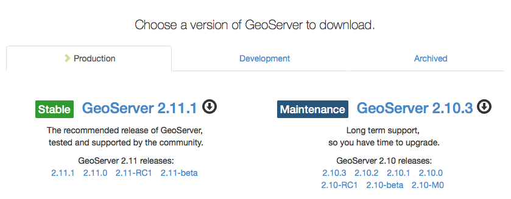

.. _install.geoserver:

GeoServer community downloads
=============================

The GeoServer project is part of the Open Source Geospatial Foundation. A new GeoServer release is made every six months and lasts for a year. This means there are always two releases (one stable and one maintenance) available for download:

   
   GeoServer Stable and Maintenance Releases

Over the course a year a release goes through four phases:

#. Initial release: This is the start of a new release.
   
   An example of an initial release is GeoServer 2.11.0.

* Stable releases: The latest production ready GeoServer along with optional extensions. The stable series is recommended for new GeoServer installations. New features and fixes are added to the stable release for the initial six months.
   
   An example of an stable release is GeoServer 2.11.1.
   
* Maintenance releases: The maintenance release is recommended for existing GeoServer installations, providing important fixes and security updates. Fixes are added to maintenance releases for the final six months.

  An example of a maintenance release is GeoServer 2.10.3.
  
* End-of-life: The final maintenance release is an important signal that it is time to upgrade, no subsequent releases are scheduled by the GeoServer community.
  
  An example of a final release is GeoServer 2.9.4.

GeoServer community downloads include Windows and macOS installers along with a platform independent binaryw. For those that already use Tomcat a web archive is also available.

.. note::
   
   OSGeo provides a vendor neutral software foundation for Boundless, GeoSolutions and other collaborators to work on the project together. Our original company, OpenPlans, donated the GeoServer and GeoWebCache codebases to OSGeo in 2014. The OpenLayers and PostGIS projects are also hosted by OSGeo.

Installation Requirements
-------------------------

In this section we will install GeoServer on your desktop computer.

GeoServer, being a Java Web application, requires the following in order to function:

* A Java Runtime Environment (JRE): You may already have Java installed on your machine. GeoServer is tested with java runtimes from both Oracle and OpenJDK.
* An an application server: The Windows, macOS and platform independent binary bundles include the Jetty application server. The Tomcat application server is a popular choice for those working with the web archive download.

Prerequisites:

* Please disable any programs on your system that use port 8080. (If this is not possible, please ask for alternative connection options.)
* We strongly recommend you use a recent version of `Firefox <http://www.mozilla.org/en-US/firefox/new/>`__ as the browser on your host system. Using `Chrome <https://www.google.com/intl/en/chrome/browser/>`__ is acceptable, though an XML viewer extension such as `XV <https://chrome.google.com/webstore/detail/xv-%E2%80%94-xml-viewer/eeocglpgjdpaefaedpblffpeebgmgddk?hl=en>`__ will be required for some sections. Other browsers have not been tested and are not recommended.
* Make sure you have administrative rights (Windows) or super-user privileges (Linux and macOS) on your system.

.. _install.geoserver.java:

Installing Java
---------------

#. Install Java on your system (for example, by downloading a `Java Runtime Environment <https://java.com/en/download/manual.jsp>`__ ).
  
   * Oracle Java Runtime Environment is recommended for Windows, macOS and Linux.
   
     .. note:: When taking this workshop in a classroom setting check the :file:`software` folder, rather than downloading a Oracle JRE installer.
   * OpenJDK is supported on Linux systems.
   
     .. note:: Check your package manager for installation instructions.
     
   * Java is available as both 32-bit and 64-bit downloads.
     
     If you are running a 32-bit operating system we recommend a 32-bit "i586" download.
     
     If you are running a 64-bit operating system we recommend a 64-bit "x64" download.
     
     .. note:: If installing GeoServer on Windows to run in the background as a windows service you will need to use the 32-bit "i586" download, even if your operating system is 64-bit.
   
#. GeoServer only requires a Java Runtime Environment (JRE). Java Development Kit (JDK) also works, including extra tools such as a compiler for development.

   .. figure:: img/install_java.png
      
      Oracle Java Runtime Environment Installation

.. _install.geoserver.installer:

Windows Installer
-----------------

The GeoServer installer is located in the workshop package in the :file:`software` folder.

#. Visit the `geoserver.org <http://geoserver.org/>`__ website, and click on the latest stable release.

    .. figure:: img/download_website.png
       
       GeoServer website

#.  From the `stable <http://geoserver.org/release/stable/>`__ release download the package appropriate to your platform.
    
    .. figure:: img/download_geoserver.png
       
       Latest GeoServer download

#. **Double-click** the file :file:`GeoServer-<version>.exe` to begin the installation.

   .. note:: On some systems, you might see a Windows Security warning. OSGeo now signs the installer and executable (so it should not happen anymore).

#. At the *Welcome* screen, click :guilabel:`Next`.

   .. figure:: img/install_geoserver.png

      GeoServer installation Welcome screen

#. Read the *License Agreement*, then click :guilabel:`I Agree`.

   .. figure:: img/install_license.png
      
      License Agreement

#. Select the *Destination Folder* where you would like to install, and click :guilabel:`Next`.

   .. figure:: img/install_directory.png
      
      Destination folder for the installation

#. Select the name and location of the *Start Menu Folder* that will be created for the Suite components, and click :guilabel:`Next`.

   .. figure:: img/install_startmenu.png
      
      Start Menu Folder to be created for the installation

#. Choose the location of your Java Runtime Environment.

   .. figure:: img/install_jre.png
      
      Java Runtime path selection

#. Use the default data directory included with the application.

   .. figure:: img/install_data_directory.png
      
      GeoServer data directory
      
#. Use the default :kbd:`admin` / :kbd:`geoserver` credentials.

   .. figure:: img/install_admin_password.png
      
      GeoServer administrator credentials
      
#. Port :kbd:`8080`:
    
   .. figure:: img/install_port.png
      
      Web server port
      
#. Install GeoServer as a windows service.
   
   .. figure:: img/install_service.png
      
      Install as service
      
#. When you are ready, click :guilabel:`Install` to start the installation.

   .. figure:: img/install_ready.png
      
      Ready to install

#. After installation, click :guilabel:`Finish`.

   .. figure:: img/install_finish.png
      
      GeoServer has been installed

#. Confirm GeoServer is working by visiting http://localhost:8080/geoserver in your browser.
   
   .. figure:: img/install_test.png
      
      GeoServer Web Administration page

Starting and stopping services
------------------------------

GeoServer has been installed as a Windows Service and is now running by default.  You can start and stop this services through the Start Menu.

.. figure:: img/install_startstop.png
   
   Start Menu entries for starting and stopping GeoServer

You can also stop and start these services from the standard Windows Services dialog.

Installing GeoServer Extensions
-------------------------------

The GeoServer installer provides the base GeoServer application. Optional functionality, known as extensions, are also available for download.

This workshop requires the installation of several extensions:

#. Navigate to the download page, or locate in the :file:`software` folder, the following extensions:

   * :file:`geoserver-<version>-importer-plugin.zip`
   * :file:`geoserver-<version>-wps-plugin.zip`
   * :file:`geoserver-<version>-ysld-plugin.zip`

   .. figure:: img/download_extensions.png
   
      Download extensions
      
#. Navigate to the GeoServer installation folder:
   
   * :file:`C:\\Program Files (x86)\\GeoServer`

#. The GeoServer application is made up of :file:`jar` files located here:
   
   * :file:`C:\\Program Files (x86)\\GeoServer\\webapps\\geoserver\\WEB-INF\\lib`
   
#. Unzip each extension, placing additional :file:`jar` files into the :file:`lib` folder above.

   * Choose :guilabel:`copy and replace` if there are any duplicated files.
   
#. Use :menuselection:`Start -> GeoServer -> Stop GeoServer` to stop the service.

#. Use :menuselection:`Start -> GeoServer -> Start GeoServer` to start the service.

#. Return to http://localhost:8080/geoserver to confirm the extensions are now available.
   
   * An additional service, ``WPS`` is now listed under :guilabel:`Service Capabilities`.
   
   .. figure:: img/install_extensions.png
      
      GeoServer WPS extension

.. note:: You may also have heard of 'community modules'. These are experimental extensions that require you to download the source code and compile. Some community modules are supported commercially; for example, the MBstyle community module is included for download in Boundless Suite, but is not yet available for wider release to the community.
