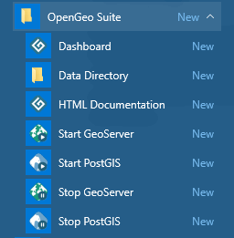

.. _geoserver.install.installing:

Installing OpenGeo Suite
========================

In this section we will install OpenGeo Suite on your workshop machine.

GeoServer, being a Java servlet, typically requires a Java Runtime Environment (JRE) as well as a servlet container in order to function. Both a JRE and a servlet container are included with the OpenGeo Suite, so separate installation is not needed here.

Installation
------------

The OpenGeo Suite executable file is located in the workshop package in the :file:`software` folder.

.. note:: During this installation, please keep all of the default settings.

#. **Double-click** the file :file:`OpenGeoSuite-<version>.exe` to begin the installation.

   .. note:: On some systems, you might see a Windows Security warning. We promise the software is safe, so click :guilabel:`Run` to launch the installer.

#. At the ``Welcome`` screen, click :guilabel:`Next`.

   .. figure:: img/installation_welcome.png

      OpenGeo Suite installation Welcome screen

#. Read the *License Agreement*, then click :guilabel:`I Agree`.

   .. figure:: img/installation_license.png

      License Agreement

#. Select the *Destination Folder* where you would like to install OpenGeo Suite, and click :guilabel:`Next`.

   .. figure:: img/installation_directory.png

      Destination folder for the installation

#. Select the name and location of the *Start Menu Folder* that will be created for the Suite components, and click :guilabel:`Next`.

   .. figure:: img/installation_startmenu.png

      Start Menu Folder to be created for the installation

#. Choose the components you wish to install.

   .. figure:: img/installation_components.png

      Component selection

#. When you are ready, click :guilabel:`Install` to start the installation.

   .. figure:: img/installation_ready.png

      Ready to install

#. Please wait while the installation proceeds.

   .. figure:: img/installation_install.png

      Installation progress

#. After installation, click :guilabel:`Finish`.

   .. figure:: img/installation_finish.png

      OpenGeo Suite has been installed

Starting and stopping services
------------------------------

OpenGeo Suite has been installed and is now running by default. There are two system services related to OpenGeo Suite:

* **OpenGeo Jetty** - Controls GeoServer and other web applications
* **OpenGeo Postgres** - Controls PostgreSQL/PostGIS database

You can start and stop these services from the Start Menu by going to :menuselection:`OpenGeo Suite --> GeoServer/PostGIS --> Start/Stop`

   Start Menu entries for starting and stopping OpenGeo Suite services

You can also start and stop these services through the standard Windows Services dialog.

