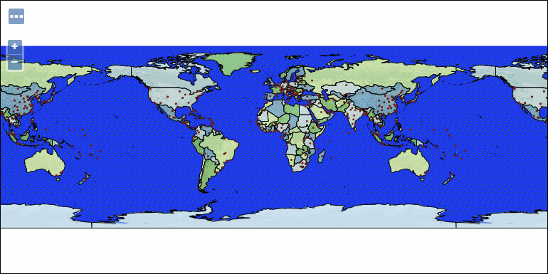

.. _geoserver.styling.styles:

Styles in GeoServer
===================

Every layer published in GeoServer must have at least one style associated with it. When manually loading layers as done in the :ref:`geoserver.data.shapefile` and :ref:`geoserver.data.geotiff` sections, GeoServer looks at the geometry of the data and assign a generic existing style based on that data type. When using the :ref:`Layer Importer <geoserver.data.import>`, GeoServer will generate a unique style for each layer, but still based on the geometry. We will now look at how GeoServer handles styles.

Viewing an existing style
-------------------------

#. Navigate to the :guilabel:`Layers` list. Select the ``earth:countries`` layer from the list of published layers.

   .. note:: Make sure to select ``earth:countries`` and not the other ``countries`` layer. Check the workspace to make sure.

#. Preview the layer to see its visualization by navigating to the :guilabel:`Layer Preview`, then clicking the :guilabel:`OpenLayers` link next to that layer.

   .. figure:: ../data/img/shp_openlayers.png

      Previewing the "countries" layer

#. Leave this preview window open and open up a new browser tab. In the new tab, navigate back to the main :ref:`geoserver.webadmin` page.

#. In order to view the style for this layer, we need to find out which style is associated with this layer. To do this, click :guilabel:`Layers` under :guilabel:`Data` on the left side of the page.

   .. figure:: img/styles_layerslink.png

      Click to go to the Layers page

#. Click the :guilabel:`Layer Name` link of :guilabel:`countries`.

   .. figure:: img/styles_layerspage.png

      The earth:countries layer in the layer list

#. You are now back at the layer configuration page. Notice there are four tabs on this page:

   * :guilabel:`Data` (default)
   * :guilabel:`Publishing`
   * :guilabel:`Dimensions`
   * :guilabel:`Tile Caching`

   Click the :guilabel:`Publishing` tab, then scroll down to the entry that says :guilabel:`Default Styles`. Make a note of the name of the style. (In the case of ``earth:countries``, the name of the style is called ``polygon``.)

   .. figure:: img/styles_publishingtab.png

      Layer configuration page: Publishing tab

#. Now that we know the name of the style, we can view the style's code. Click the :guilabel:`Styles` link, under :guilabel:`Data` on the left side of the page.

   .. figure:: img/sld_styleslink.png

      Click to go to the Styles page

#. Click the style name as determined above.

#. A text editor will open up, displaying the code for this style.

   .. figure:: img/styles_view.png

      Viewing the code for this style

Editing an existing style
-------------------------

It is helpful when learning about styles to edit existing ones rather than creating new ones. We will now do this with the style that was just opened.

#. Make a change to an RGB color value in a ``<CssParameter>`` value. For example, find the line that starts with ``<CssParameter name="fill">`` and change the RGB code to ``#0000FF`` (blue).

   .. figure:: img/styles_edit.png

      Editing the style code

#. When done, click :guilabel:`Validate` to make sure that the changes you have made are valid. If you receive an error, go back and check your work.

   .. figure:: img/styles_validated.png

      Style code with no validation errors

#. Click :guilabel:`Apply` to commit the style change.

#. Now change to the :guilabel:`Layer Preview` tab, this contains an OpenLayers preview map. Each time you click :guilabel:`Apply` you can see the change reflected here.

   .. figure:: img/styles_edited.png

      Style with layer preview

#. Change to the :guilabel:`Publishing` tab. This table shows the published layers (with checkboxes allowing layers to be quickly assigned to use this style).

   .. figure:: img/styles_published.png

      Style with published layers

#. The :guilabel:`Layer Attributes` allows you to inspect available attributes for use in the creation of a dynamic theme where each feature is drawn according to its attributes.

   .. figure:: img/styling_attributes.png

      Layer attribute reference

Loading new styles
------------------

If you have a style file saved as a text file, it is easy to load it into GeoServer. We will now load the YSLD styles saved in the workshop :file:`styles` folder.

.. note:: The procedure for loading SLD files is exactly the same.

#. Navigate back to the Styles page by clicking :guilabel:`Styles` under :guilabel:`Data` on the left side of the page.

#. Click :guilabel:`Add a new style`.

   .. figure:: img/styles_page.png

      Styles page

#. A blank text editor will open.

   .. figure:: img/styles_new.png

      A blank text editor for making a new style

#. At the very bottom of the page, below the text editor, there is an area where you can populate a style based on an existing text file. click :guilabel:`Choose File...` to navigate to and select a style file.

   .. figure:: img/styles_uploadstyle.png

      Click to upload the style file

#. Select the :file:`cities.ysld` file. Recall that the style files are in the :file:`styles` directory of your workshop bundle.

#. Back in GeoServer, click the :guilabel:`Upload...` link to load this style file into GeoServer.

   .. figure:: img/styles_uploadlink.png

      This link will upload the file to GeoServer.

#. The code will display in the text editor. The name of the style will be automatically generated.

   .. figure:: img/styles_displaystyle.png

      Style file is uploaded

#. Change the title to :guilabel:`Cities`.

   .. note:: The capital letter will help distinguish the uploaded styles from other similar-looking style names. The specific name isn't important though. 

#. Make sure the :guilabel:`Format` is set to :guilabel:`YSLD`.

   .. figure:: img/styles_nameandformat.png

      Name and format for new style

#. Click :guilabel:`Validate` to ensure that the style is valid.

#. Click :guilabel:`Submit` to save the new style.

#. Repeat the above steps with the two other YSLD files in the the :file:`styles` directory:

   * ``countries.ysld``
   * ``ocean.ysld``

   .. note:: We will not upload a new style for the ``shadedrelief`` layer.

Associating styles with layers
------------------------------

Once the styles are loaded, they are merely stored in GeoServer, but not associated with any layers. The next step is to link the styles with their appropriate layer.

.. warning:: If a style file has references that are specific to a certain layer (for example, attribute names or geometries), associating that style with another layer may cause errors or unexpected behavior.

#. Navigate to the :guilabel:`Styles` page and open the :guilabel:`Cities` style.

#. Click the :guilabel:`Publishing` tab.

   .. figure:: img/styles_publishing.png

      Associating a style with different layers

#. Fint the :guilabel:`earth:cities` layer in the table, click the :guilabel:`Default` checkbox for this row.

    .. figure:: img/styles_publishing_default.png
       
       Assigning a default style
   
   .. note:: If you you edit the :guilabel:`earth:cities` layer, and look on the :guilabel:`publishing` tab you can confirm this change under WMS Settings.

   .. figure:: img/styles_selectingnewstyle.png

      Associating the layer with a different style

#. Click :guilabel:`Apply` to commit the change.

#. Verify the change by going to the layer's :guilabel:`Layer Preview` tab. Zoom in the see the behavior change based on zoom level.

   .. figure:: img/styles_viewingnewstyle.png

      The cities layer with a different style
 
#. Repeat the above steps for the ``earth:countries`` and ``earth:ocean`` layers, associating each with the appropriate uploaded style (``Countries`` and ``Ocean`` respectively). View each result in the Layer Preview.

Bonus
~~~~~

At this point, the ``earth:ocean`` layer won't display properly. Look at the style file; can you figure out why not? The next section will explain.

.. _geoserver.styling.styles.extgraphics:

External graphics and the data directory
----------------------------------------

Style files have the ability, in addition to drawing circles, squares, and other standard shapes, to link to graphics files. The ``earth:ocean`` style utilizes an ocean-themed graphic that will be tiled throughout the layer. While it is possible to link to a full URL that references an online resource, in practice that is less efficient than storing the file locally and linking to it there.

Below is the entire :file:`ocean.ysld` file. Notice that on **lines 11-13**, you will see that an image is referenced, but with no path information.

.. code-block:: yaml
   :linenos:
   :emphasize-lines: 11-13

   name: 'Ocean'
   title: 'Ocean: Graphic fill'
   feature-styles:
   - rules:
     - scale: [min, max]
       symbolizers:
       - polygon:
           fill-graphic:
             size: 16
             symbols:
             - external:
                 url: oceantile.png
                 format: image/png

This means that GeoServer will expect the graphic to be in the same directory as the file itself. So in order for the layer to display properly, we will need to copy that file manually.

#. The :file:`styles` directory of the workshop materials contains a file, :file:`oceantile.png`. We want to copy this file to the GeoServer styles repository, contained in the GeoServer data directory. 
   
   * When running with the windows installer, the easiest way to get to the GeoServer data directory is from the Start Menu and navigate to :menuselection:`GeoServer --> Data Directory`.

     Once located, navigate to the GeoServer Data directory.

     Navigate into the :file:`styles` folder. 

     Copy the :file:`oceantile.png` file from the workshop materials into the :file:`styles` directory.

   * On all platforms you can also find the full path to the data directory by clicking :guilabel:`Server Status` on the left side of any GeoServer page.

     .. figure:: img/styles_serverstatus.png

        Server Status page showing location of GeoServer Data Directory
   
   * When running in a Virtual Machine we need to use the command line to copy the file from our shared folder to the GeoServer data directory (and ensure the Tomcat8 user has permission to use it).
     
     From the virtual machine command line type:
     
     :kbd:`cd /var/opt/boundless/suite/geoserver/data/styles`
     
     :kbd:`cp /meda/sf_Desktop/styles/oceantile.png .`
     
     :kbd:`chown tomcat8:tomcat8 oceantile.png`
     
     To check your work:
     
     :kbd:`ls -l *.png`
     
     Shows the following:
     
     ``-rwwr-x--- 1 tomcat8 tomcat 8 3624 May 23 10:30 oceantile.png``
     
     
     
     

#. Now back in GeoServer, navigate to the :ref:`geoserver.webadmin.layerpreview` for the ``earth:ocean`` layer. If you copied the file correctly, you should see a ocean-like graphic tiled in the appropriate places now.

   .. figure:: img/styles_tiledgraphic.png

      The ocean layer with a tiled graphic

Revisiting the layer group
--------------------------

When all of your styles are associated with your layers, view the ``earthmap`` layer group once more by going to :guilabel:`Layer Preview`. It should look quite different now.

   Layer group with improved styling

.. figure:: img/styles_layergrouppreviewzoom.png

   Detail of layer group

.. note:: If for some reason, the layer group fails to update with the new styles, go back the Layer Group page and verify that the :guilabel:`Default Style` box is checked for every layer.

