Intro to GeoServer
==================

.fx: titleslide

.. image:: ../doc/source/geoserver.png

Boundless
---------

Presenter notes
---------------

This is where you can write notes to yourself and only you will be able to see them.

--------------------------------------------------

Outline
=======

#. Installing GeoServer
#. GeoServer web interface
#. Overview
#. Working with data
#. Styling
#. Web map output

Presenter notes
---------------

* Installing GeoServer—Installation of GeoServer and all other related software
* GeoServer web interface—A tour of the GeoServer Web Administration Interface and how to publish data
* Overview—Overview of what GeoServer is, including a brief discussion of OGC services
* Working with data—Load and manage data in GeoServer
* Styling—Style layers using Styled Layer Descriptor (SLD) and YSLD, and learn the GeoServer stlye editing workflow.
* Web map output—See how to embed a GeoServer web map in a web page.

--------------------------------------------------

What is GeoServer?
==================

.. image:: ../doc/source/geoserver.png

GeoServer is an open source software server written in Java that allows users to share and edit geospatial data
---------------------------------------------------------------------------------------------------------------

Presenter notes
---------------

GeoServer is an open source software server written in Java that allows users to share and edit geospatial data. Designed for interoperability, it publishes data from any major spatial data source using open standards.

Being a community-driven project, GeoServer is developed, tested, and supported by a diverse group of individuals and organizations from around the world.

--------------------------------------------------

Section 1: Installing
=====================

GeoServer is a core component of **OpenGeo Suite**.

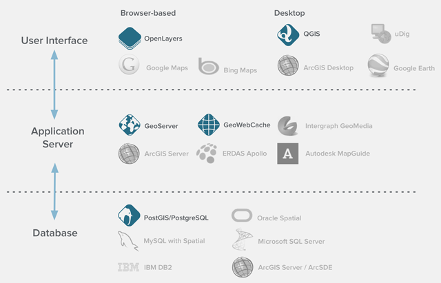

Presenter notes
---------------

In this section, we will install GeoServer. For the purposes of this workshop, we will be using the OpenGeo Suite—of which GeoServer is a primary component—in order to facilitate setup and configuration.

The OpenGeo Suite is free and open source, and is available for download from Boundless.

OpenGeo Suite is a complete web-based geospatial software stack. In this package, the applications contained are:

PostGIS - A spatially enabled object-relational database.
GeoServer - A software server for loading and sharing geospatial data.
GeoWebCache - A tile cache server that accelerates the serving of maps (built into GeoServer).
OpenLayers - A browser-based mapping framework

--------------------------------------------------

Installation
============

.. image:: ../doc/source/install/img/installation_welcome.png

Presenter notes
---------------

In this section you will install the OpenGeo Suite on your system. This will provide everything necessary to get started with GeoServer (and more!).

GeoServer, being a Java application, typically requires a Java Runtime Environment (JRE) as well as an application server in order to function. Both of these are included with OpenGeo Suite, so separate installation is not needed here.

--------------------------------------------------

Installation
============

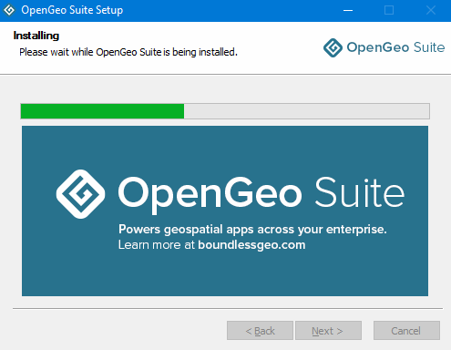

Presenter notes
---------------

The OpenGeo Suite installation packages are available for Windows, OS X, Ubuntu, CentOS, and Red Hat. We're using the Windows installers here, but the premise across the board is pretty much the same, and pretty simple: Run the installer, choose options, done.

--------------------------------------------------

Dashboard
=========

Central location for launching applications and resources.

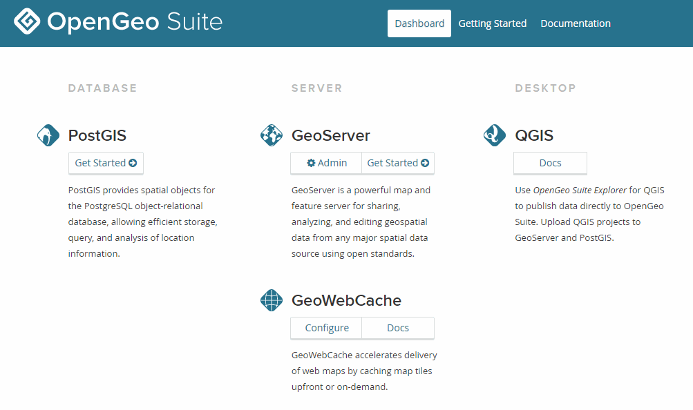

Presenter notes
---------------

OpenGeo Suite comes with a Dashboard application that provides links to the most common applications and documentation.

The Dashboard can be opened from the Start menu at OpenGeo Suite ‣ Dashboard. The Dashboard is also available in the browser by navigating to http://localhost:8080/.

The main Dashboard page show links to configuration pages and documentation.

The top toolbar contains links to two other pages:

* The Getting Started page includes a sample workflow to use for publishing data and maps using OpenGeo Suite. A similar workflow will be followed as part of this workshop.
* The Documentation page links to the OpenGeo Suite User Manual, which contains the full user manual for GeoServer.

--------------------------------------------------

Section 2: GeoServer web interface
==================================

Manage GeoServer graphically.

Presenter notes
---------------

GeoServer includes a web-based administration interface. Most GeoServer configuration can be done through this interface, without the need to edit configuration files by hand or use an API.

This section will give a brief overview to the web interface, including loading data to be published. Subsequent sections will use the web interface in greater detail.

Note: Interested and/or experienced users who wish to learn about the REST API can read about it in the GeoServer documentation. This workshop will only discuss the web interface.

--------------------------------------------------

Tour of the interface
=====================

``http://localhost:8080/geoserver/``

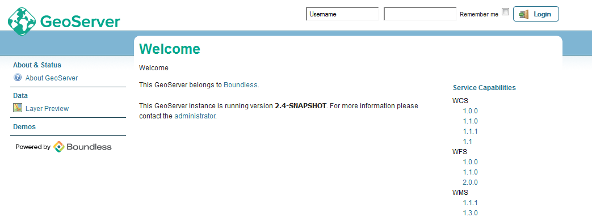

Presenter notes
---------------

The default location of the GeoServer admin interface is http://localhost:8080/geoserver. The initial page is called the Welcome page.

To return to the Welcome page from anywhere, just click the GeoServer logo in the top left corner of the page.

--------------------------------------------------

Authentication
==============

Default credentials: ``admin`` / ``geoserver``

* Robust security system
* Ability to create custom user accounts and roles

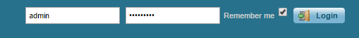

Presenter notes
---------------

For security reasons, most GeoServer configuration tasks require you to be logged in first. By default, the GeoServer administration credentials are ``admin`` and ``geoserver``, although this can (and should) be changed.

Note: GeoServer has a powerful and robust security system. Access to resources such as layers and configuration can be granularly applied to users and groups as desired. Security is beyond the scope of this workshop, so we will just be using the built-in admin account. Interested users can read about security in the GeoServer documentation.

--------------------------------------------------

Authentication
==============

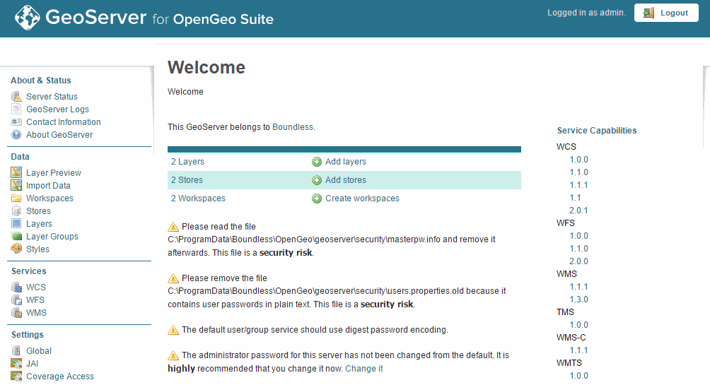

Presenter notes
---------------

After logging in, many more options will be displayed.

Use the links on the left side column to manage the GeoServer application, its services, data, security settings, and more. Also on the main page are direct links to the capabilities documents for each service, such as the Web Map Service (WMS) and Web Feature Service (WFS).

We will be using the links on the left under Data—among them Layer Preview, Workspaces, Stores, Layers, Layer Groups, and Styles—very often in this workshop, so it is good to familiarize yourself with their location.

--------------------------------------------------

Layer Preview
=============

View published layers with minimal clicks

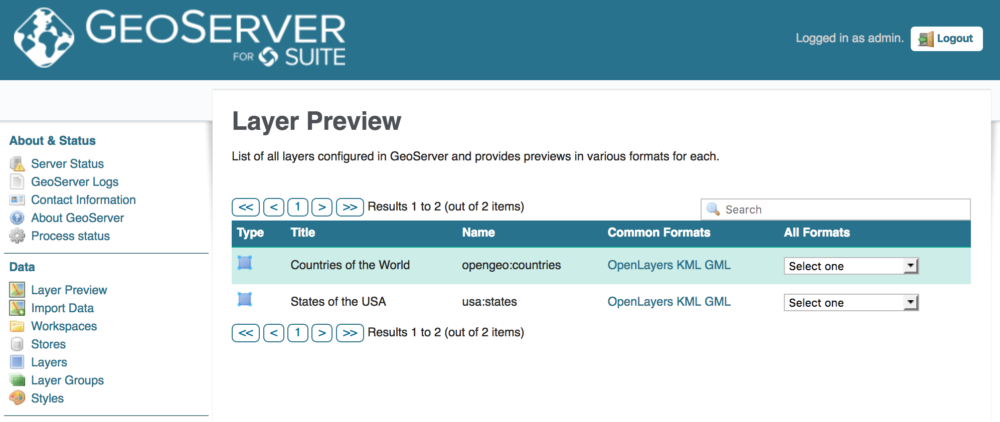

Presenter notes
---------------

You can use the Layer Preview link to easily view layers currently being published by GeoServer. The Layer Preview pages includes quick links to viewing layers via OpenLayers along with other services.

    Click the Layer Preview link, located on the left side under Data.

    Preview a few layers by clicking the OpenLayers link next to each layer.

--------------------------------------------------

Layer Preview
=============

View published layers with minimal clicks

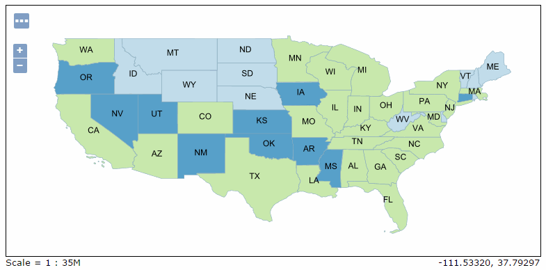

Presenter notes
---------------

Take a look at the contents of the URL bar when viewing an OpenLayers map. We will discuss this request and its parameters further in the Web Map Service (WMS) section.

--------------------------------------------------

Logs
====

View application logs inside the application itself

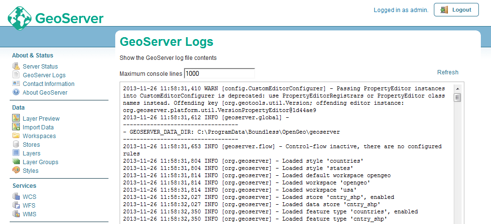

Presenter notes
---------------

GeoServer displays the contents of the application logs directly through the web interface. Reading the logs can be very helpful when troubleshooting. To view the logs, click GeoServer Logs under About & Status.

--------------------------------------------------

Bonus exercises
===============

* What is the filesystem path to the GeoServer data directory?
* What version of Java is GeoServer using?

Presenter notes
---------------

The following information can all be gleaned through the GeoServer web admin interface.

--------------------------------------------------

Loading your first data set
===========================

.. image:: ../doc/source/webadmin/img/quickload_importerpage.png

Presenter notes
---------------

There are many ways to load data, and even more configuration options once this data is loaded. Often, though, all that you want to do is to load a simple shapefile and display it. In this section we will go from data to map in the fewest possible steps.

GeoServer with the Layer Importer extension allows for uploading of ZIP files that contain geospatial information. The extension will perform all the necessary configuration for publishing the data, including generating a unique style for the layer.

--------------------------------------------------

Loading your first data set
===========================

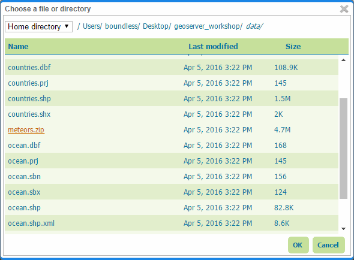

Presenter notes
---------------

In the data directory of the workshop bundle, you will see a file called meteors.zip. It is a shapefile contained inside an archive (ZIP file). If you open the archive, you'll see that it contains the following files: meteors.shp, meteors.shx, meteors.dbf, meteors.prj.

Navigate to the Layer Importer. This is accessible in the GeoServer web interface by clicking on the Import Data link on the left side of the page.

In the box titled Configure the data source, click Browse... and navigate to the location of the archive.

Click the meteors.zip file to select it.

Leave all other fields as they are for now and click Next.

--------------------------------------------------

Loading your first data set
===========================

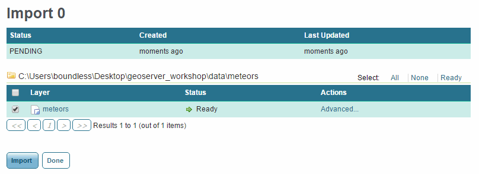

Presenter notes
---------------

On the next page, click the checkbox next the meteors layer and then click Import.

--------------------------------------------------

Loading your first data set
===========================

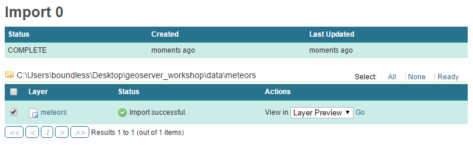

Presenter notes
---------------

The import process will proceed. After some processing, you should see a note that says Import successful. Click Go, next to the box that says Layer Preview.

--------------------------------------------------

Loading your first data set
===========================

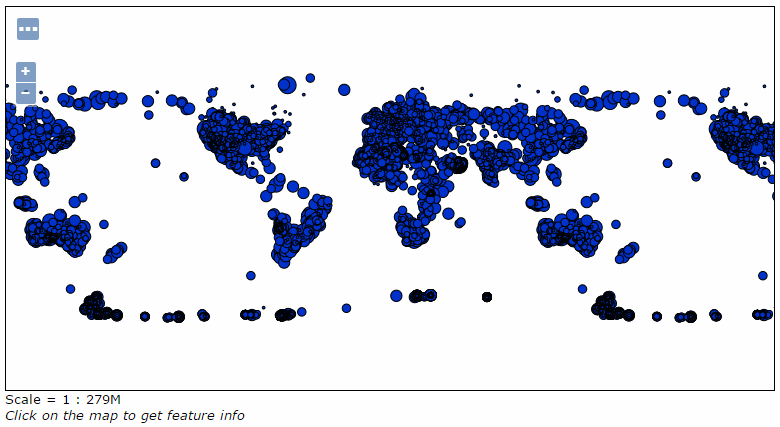

Presenter notes
---------------

View the resulting layer. Use the pan and zoom tools to study the layer further. Click map features to get attribute information.

--------------------------------------------------

Loading your first data set
===========================

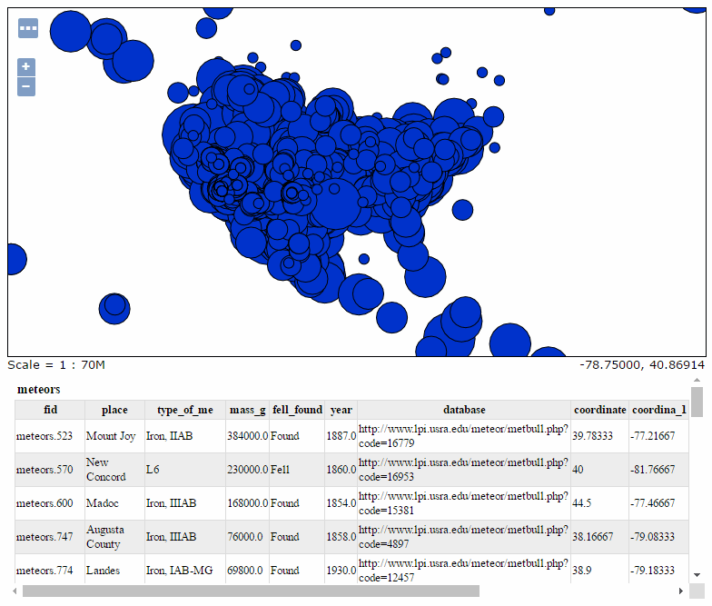

Presenter notes
---------------

[Talk about meteors here]

[Talk about what you've done in terms of making your data available to web clients]

--------------------------------------------------

Section 3: Overview
===================

Basic concepts related to GeoServer and web mapping, including OGC protocols and useful terminology.

Presenter notes
---------------

Now that we've briefly experimented with GeoServer, let's take a step back to learn more about how it works.

--------------------------------------------------

Web servers
===========

``http://example.com/some/path/page.html``
``http://example.com/some/path/image.jpg``
``http://example.com/some/path/archive.zip``
``http://example.com/some/path/data.xml``

Presenter notes
---------------

A web server is a program that serves content (web pages, images, files, data, etc.) using HTTP (Hypertext Transfer Protocol). When you use your browser to connect to a website, you contact a web server. The web server takes the request, interprets it, and returns a response, which the browser renders on the screen.

For example, when you request a web page, your request takes the form of a URL:

http://example.com/some/path/page.html

The web server looks to its file system, and if that request points to a valid file (if page.html exists in some/path), the contents of that file will be returned via HTTP. Usually these calls come from a browser, in which case the result is rendered in the browser.

It is possible to request many different kind of files through HTTP, not just HTML pages:

http://example.com/some/path/image.jpg
http://example.com/some/path/archive.zip
http://example.com/some/path/data.xml

If your browser is configured to display the type of file, it will be displayed, otherwise you will usually be asked to download the file to your host system.

The server need not return a static file. Any valid request on the server will return some kind of response. Many times a client will access an endpoint that will return dynamic content.

The most popular web servers used today are Apache HTTP Server and Internet Information Services (IIS).

--------------------------------------------------

Web mapping servers
===================

Like a web server, but designed specifically for conveying geospatial content.

Presenter notes
---------------

A web mapping server is a specialized subset of web server. Like a web server, requests are sent to the server which are interpreted and responded. But the requests and responses are designed specifically toward the transfer of geographic information.

A web mapping server may use HTTP, but employ specialized protocols, such as Web Map Service (WMS) and Web Feature Service (WFS). These protocols are designed for the transferring geographic information to and from the server, whether it be raw feature data, geographic attributes, or map images.

Some popular web mapping servers: GeoServer, MapServer, Mapnik, ArcGIS Server

Other web-based map services such as Google Maps have their own server technology and specialized protocols as well.

--------------------------------------------------

Data sources
============

Lots of options

* Files (Shapefile, GeoTIFF, MrSID, ArcGrid, JPEG2000, GDAL formats)
* Databases (PostGIS, ArcSDE, Oracle Spatial, DB2, SQL Server)

Presenter notes
---------------

GeoServer can read from many different data sources, from files on the local disk to external databases. Through the medium of web protocols, GeoServer acts as an abstraction layer, allowing a standard method of serving geospatial data regardless of the source data type.

The following is a list of the most common data formats supported by GeoServer. This list is by no means exhaustive.

--------------------------------------------------

OGC protocols
=============

.. image:: ../doc/source/overview/img/ogclogo.png

* Web Map Service (WMS)
* Web Feature Service (WFS)
* Web Coverage Service (WCS)
* Web Processing Service (WPS)
* ...and more

Presenter notes
---------------

GeoServer implements standard open web protocols established by the Open Geospatial Consortium (OGC), a standards organization. It is through these protocols that GeoServer can serve data and maps in an efficient and powerful way. GeoServer implements the most common of the OGC protocols.

--------------------------------------------------

Web Map Service
===============

Also known as the "map image"

.. image:: ../doc/source/overview/img/wms.png

Presenter notes
---------------

A fundamental component of the web map (and probably the simplest to understand) is the map image. The Web Map Service (WMS) is a standard protocol for serving georeferenced map images generated by a map server. In short, WMS is a way for a client to request map tiles from a server. The client sends a request to a map server, then the map server generates an image based on parameters passed to the server in the request and finally returns an image.

It is important to note that the source material from which the image is generated need not be an image. The WMS generates an image from whatever source material is requested, which could be vector data, raster data, or a combination of the two.

--------------------------------------------------

Web Map Service
===============

Example GetMap request::

  http://demo.boundlessgeo.com/geoserver/wms?
    service=wms&
    version=1.3.0&
    request=GetMap&
    layers=osm:osm&
    styles=&
    srs=EPSG:900913&
    bbox=-13744070,6170985,-13720028,6191021&
    format=image/png&
    width=600&
    height=500

Presenter notes
---------------

The following is a sample WMS request to a hosted GeoServer instance:

While the full details of the WMS protocol are beyond the scope of this course, a quick scan of this request shows that the following information is being requested:

* Server details (a WMS 1.3.0 request)
* Request type (WMS GetMap)
* Layer name (osm:osm)
* Projection (EPSG:900913)
* Bounding box (coordinates)
* Image properties (600x500 PNG)

--------------------------------------------------

Web Map Service
===============

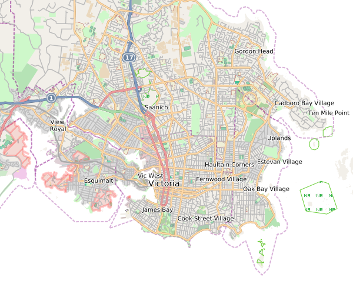

Presenter notes
---------------

If you paste the full request into a browser, the result would be:

--------------------------------------------------

Web Map Service
===============

Example GetCapabilities request::

  http://demo.boundlessgeo.com/geoserver/wms?
    service=WMS&
    version=1.3.0&
    request=GetCapabilities

Presenter notes
---------------

A WMS request can ask for more than just a map image (the "GetMap" operation). An example of another such request is a request for information about the WMS server itself. The request is called GetCapabilities, and the response is known as the capabilities document. The capabilities document is an XML response that details the supported image formats, projections, and map layers being served by that WMS.

The following is a WMS GetCapabilities request given to the same WMS used above. You can paste this request into a browser to see the result.

--------------------------------------------------

Web Feature Service
===================

Also known as the "map source code"

.. image:: ../doc/source/overview/img/wfs.png

Presenter notes
---------------

A web mapping server can also (when allowed) return the actual geographic data that comprise the map images. One can think of the geographic data as the "source code" of the map. This allows users to create their own maps and applications from the data, convert data between certain formats, and be able to do raw geographic analysis of data. The protocol used to return geographic feature data is called Web Feature Service (WFS).

--------------------------------------------------

Web Feature Service
===================

Example GetFeature request::

  http://demo.boundlessgeo.com/geoserver/wfs?
    service=wfs&
    version=1.1.0&
    request=GetFeature&
    typename=topp:states&
    featureid=states.39

Presenter notes
---------------

The following is a sample WFS request, rendered as a HTTP GET request to a hosted GeoServer instance:

While the details of the WFS protocol are beyond the scope of this course, a quick scan of this request shows that the following information is being requested:

* Server details (WFS 1.1.0 request)
* Request type (GetFeature)
* Layer name (topp:states)
* Feature ID (states.39)

This particular request polls the WFS for a single feature in a layer.

--------------------------------------------------

Web Feature Service
===================

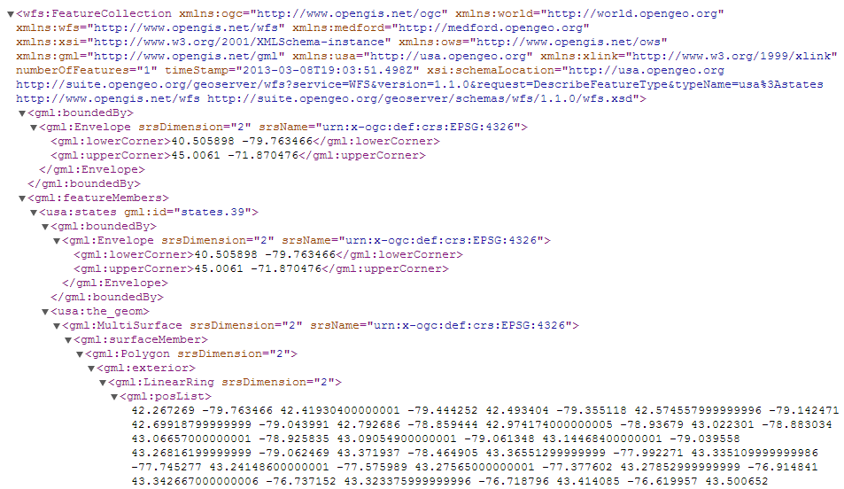

Presenter notes
---------------

Paste the request into a browser to see the result. The response contains the coordinates for each vertex in the feature in question, along with the attributes associated with this feature. Scroll down to the bottom to see the feature attributes.

While XML is difficult to read, it is easy for computers to parse, which makes WFS responses ideal for use in software. GeoServer offers other output formats as well, such as JSON, CSV, and even a zipped shapefile.

--------------------------------------------------

Web Feature Service
===================

Example GetCapabilities request::

  http://demo.boundlessgeo.com/geoserver/wfs?
    service=WFS&
    version=2.0.0&
    request=GetCapabilities

Presenter notes
---------------

A WFS request can ask for much more than just feature data. An example of another such request is to request information about the WFS server. The request is called GetCapabilities, and the response is known as the capabilities document. The capabilities document is an XML response that details the supported data layers, projections, bounding boxes, and functions available on the server.

You can paste this request into a browser to see the result.

--------------------------------------------------

Other OGC protocols
===================

* Web Coverage Service

  * Like Web Feature Service (WFS)
* Web Processing Service

  * Analysis!

Presenter notes
---------------

While beyond the scope of this workshop, it is worth noting that GeoServer offers support for other protocols in addition to Web Map Service (WMS) and Web Feature Service (WFS).

The Web Coverage Service is a service that enables access to the underlying raster (or "coverage") data. In a sense, WCS is the raster analog to WFS, where you can access the actual raster data stored on a server, such as band information and values.

The Web Processing Service (WPS) is a service for the publishing of geospatial processes, algorithms, and calculations. WPS extends the web mapping server to provide geospatial analysis. WPS in GeoServer allows for direct integration with other GeoServer services and the data catalog. This means that it is possible to create processes based on data served in GeoServer, including the results of a process to be stored as a new layer. In this way, WPS acts as a full browser-based geospatial analysis tool, capable of reading and writing data from and to GeoServer.

WPS is currently available as an extension only in GeoServer, but is a core component of the OpenGeo Suite.

--------------------------------------------------

GeoServer concepts: Workspace
=============================

Notional container for grouping similar data together

.. image:: ../doc/source/overview/img/concepts_workspace.png
   :width: 50%

Presenter notes
---------------

A workspace (sometimes referred to as a namespace) is the name for a notional container for grouping similar data together. It is designed to be a separate, isolated space relating to a certain project. Using workspaces, it is possible to use layers with identical names without conflicts.

Workspaces are usually denoted by a prefix to a layer name or store name. For example, a layer called streets with a workspace prefix called nyc would be referred to by nyc:streets. This would not conflict with another layer called streets in another workspace called dc (dc:streets)

Stores and layers must all have an associated workspace. Styles may optionally be associated with a workspace, but can also be global.

Technically, the name of a workspace is a URI, not the short prefix. A URI is a Uniform Resource Identifier, which is similar to a URL, but does not need to resolve to a web site. In the above example, the full workspace could have been http://nyc in which case the full layer name would be http://nyc:streets. GeoServer intelligently replaces the workspace prefix with the full workspace URI, but it can be useful to know the difference.

--------------------------------------------------

GeoServer concepts: Store
=========================

A container of geographic data (a file/database)

.. image:: ../doc/source/overview/img/concepts_store.png
   :width: 50%

Presenter notes
---------------

A store is the name for a container of geographic data. A store refers to a specific data source, be it a shapefile, database, or any other data source that GeoServer supports.

A store can contain many layers, such as the case of a database that contains many tables. A store can also have a single layer, such as in the case of a shapefile or GeoTIFF. A store must contain at least one layer.

GeoServer saves the connection parameters to each store (the path to the shapefile, credentials to connect to the database). Each store must also be associated with one (and only one) workspace.

A store is sometimes referred to as a "datastore" in the context of vector data, or "coveragestore" in the context of raster (coverage) data.

--------------------------------------------------

GeoServer concepts: Layer
=========================

A collection of geospatial features or a coverage

.. image:: ../doc/source/overview/img/concepts_layer.png
   :width: 50%

Presenter notes
---------------

A layer (sometimes known as a featuretype) is a collection of geospatial features or a coverage. Typically a layer contains one type of data (points, lines, polygons, raster) and has a single identifiable subject (streets, houses, country boundaries, etc.). A layer corresponds to a table or view from a database, or an individual file.

GeoServer stores information associated with a layer, such as projection information, bounding box, and associated styles. Each layer must be associated with one (and only one) workspace.

--------------------------------------------------

GeoServer concepts: Layer group
===============================

A collection of layers (WMS only)

.. image:: ../doc/source/overview/img/concepts_layergroup.png
   :width: 50%

Presenter notes
---------------

A layer group, as its name suggests, is a collection of layers. A layer group makes it possible to request multiple layers with a single WMS request. A layer group contains information about the layers that comprise the layer group, the order in which they are rendered, the projection, associated styles, and more. This information can be different from the defaults for each individual layer.

Layer groups do not respect the concept of workspace, and are relevant only to WMS requests.

--------------------------------------------------

GeoServer concepts
==================

.. image:: ../doc/source/overview/img/concepts.png

Presenter notes
---------------

The following graphic shows the various relationships between workspaces, stores, layers, and layer groups.

--------------------------------------------------

GeoServer concepts: Style
=========================

Visualization directive for rendering geographic data

Presenter notes
---------------

A style is a visualization directive for rendering geographic data. A style can contain rules for color, shape, and size, along with logic for styling certain features or points in certain ways based on attributes or scale level.

Every layer must be associated with at least one style. GeoServer natively recognizes styles in Styled Layer Descriptor (SLD) format, but can also be extended to read styles in other formats as well. The Styling section will go into this topic in greater detail.

--------------------------------------------------

Section 4: Working with Data
============================

Load and manage data in GeoServer

Presenter notes
---------------

Loading and publishing data is at the core of GeoServer. This section will detail how to set up a new project in GeoServer, as well as load data from multiple sources in different ways. After the data is loaded, a layer group will be created. All data will be published.

--------------------------------------------------

Adding a workspace
==================

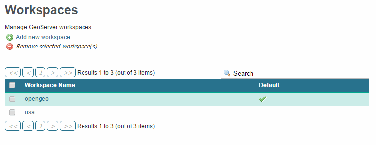

Presenter notes
---------------

The first step in data loading is usually to create a workspace. This creates a virtual container for your project. Multiple layers from multiple sources can all be contained inside a workspace, with the primary constraint being that each layer name be unique.

    Navigate to the GeoServer Welcome page.
    Click the Workspaces link on the left column, under Data.
    Click the Add new workspace link at the top center of the page.

--------------------------------------------------

Adding a workspace
==================

.. image:: ../doc/source/data/img/workspace_new.png

Presenter notes
---------------

A workspace is comprised of a Name (also sometimes known as a "namespace prefix"), represented by a few characters, and a Namespace URI. These two fields must uniquely identify the workspace. Fill in the following information:

Name: earth
Namespace URI: http://earth
Default workspace: Checked

When done, click Submit.

--------------------------------------------------

Adding a workspace
==================

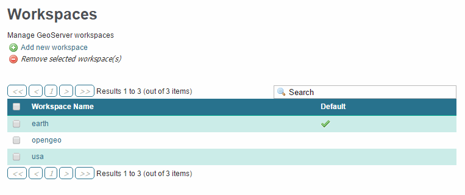

Presenter notes
---------------

With our new workspace created and ready to be used, we can now start loading our data.

--------------------------------------------------

Publishing a shapefile
======================

.. image:: ../doc/source/data/img/shp_storespage.png

Presenter notes
---------------

Adding a single shapefile to GeoServer is one of the simplest data loading tasks. We encountered this task in the Loading your first data set section, but here we will slow down and work through the process manually. To start our discussion of data loading, we will load a shapefile showing the locations and borders of all the world's countries.

All data for this workshop was provided by http://naturalearthdata.com. See the readme file in the data directory of the workshop bundle for details.

First, we need to load a shapefile store. In GeoServer terminology, a shapefile is a store that contains a single layer. (Refer to the GeoServer concepts section if necessary.) We must first add the store to GeoServer before we can publish the layer that the store contains.

    Click the Stores link on the left side, under Data.
    Click Add new store.

--------------------------------------------------

Publishing a shapefile
======================

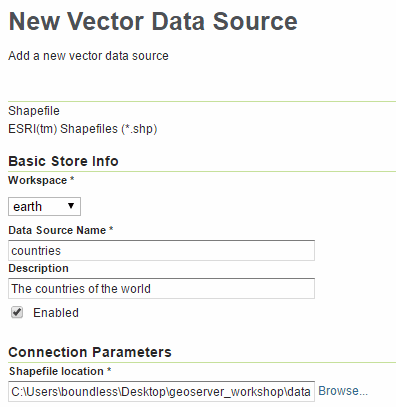

Presenter notes
---------------

Click Shapefile under Vector Data Sources.

A form will display. Fill out the form with the following information:

Workspace: earth
  Should be already the default

Data Source Name: countries
  Can be anything, but a good idea to match this with the name of the shapefile

Enabled: Checked
  Ensures the layer is published. Unchecking will save configuration information only.

Description: "The countries of the world"
  Layer metadata is recommended but not required

In the box marked URL, type in the full path to the shapefile if known, or click the Browse... button to navigate to the file. The file path may be something like:

C:\Users\<username>\Desktop\geoserver_workshop\data\countries.shp

Be sure to replace <username> with your current user name.

Leave all other fields as their default values.

When finished, click Save.

--------------------------------------------------

Publishing a shapefile
======================

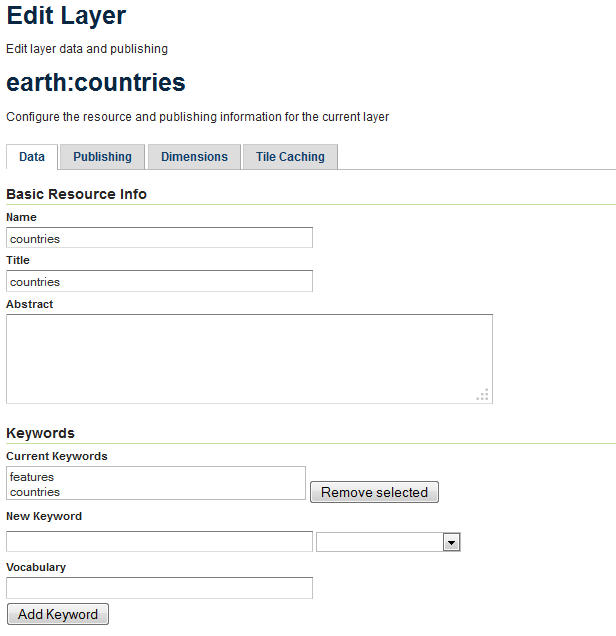

Presenter notes
---------------

We have loaded the shapefile store, but our layer has yet to be published. We'll do that now.

    On the next screen, a list of layers in the store is displayed. Since we are working with a shapefile, there is only a single layer. Click the Publish link to configure the layer.

    This is the layer configuration page. There are many settings on this page, most of which we don't need to work with now. We will return to some of these settings later. 

--------------------------------------------------

Publishing a shapefile
======================

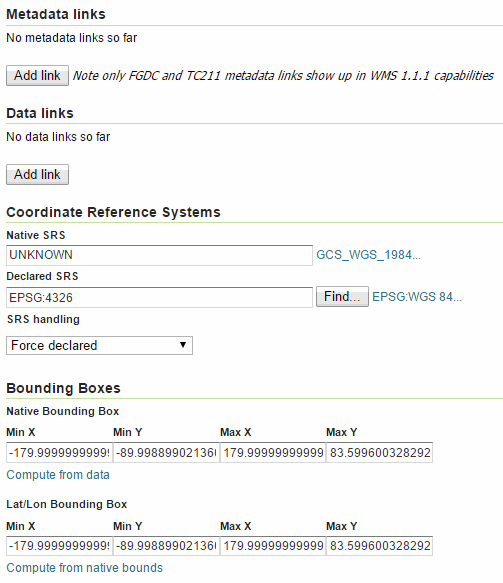

Presenter notes
---------------

Fill out the form with the following info:

    In the Coordinate Reference System section, set the Declared SRS to EPSG:4326 and set the SRS handling to Force declared. This will ensure that the layer is known to be in latitude/longitude coordinates.
    In the Bounding Boxes section, click the Compute from data and Compute from native bounds links to set the bounding box of the layer.
    When finished, click Save.

--------------------------------------------------

Publishing a shapefile
======================

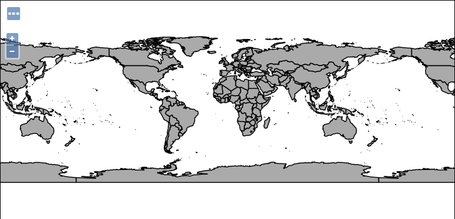

Presenter notes
---------------

Your shapefile is now published. You can now view the layer using the Layer Preview. Click the Layer Preview link.

A list of published layers is displayed. Find the layer in the list, and click the OpenLayers libk next to the layer.

While not specifically relevant here, lists in GeoServer are paged at 25 items at a time. If you ever can't find the layer, you can either page the list, or use the search box to narrow down the results.

A new tab in your browser will open up, showing your layer inside an OpenLayers application. You can use your mouse to zoom and pan, and can also click the features in the window to display attribute information.

If you're wondering where the style/color of the layer is coming from, this will be discussed in the upcoming Styling section.

--------------------------------------------------

Publishing a GeoTIFF
====================

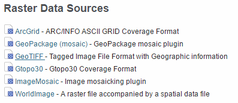

Presenter notes
---------------

GeoServer can also publish raster imagery. This could include georeferenced images (such as Blue Marble imagery), single or multi-band DEM (digital elevation model) data, or many other options. In this section, we will load a simple GeoTIFF containing a shaded relief of land area. The layer contains three bands of data corresponding to red, green, and blue.

The procedure for adding a store for a GeoTIFF is very similar to that of a shapefile. A GeoTIFF, like a shapefile, is a store that contains a single layer.

    From the GeoServer web interface page, click the Stores link on the left side, under Data.
    Click Add new store.
    Select GeoTIFF under Raster Data Sources.

--------------------------------------------------

Publishing a GeoTIFF
====================

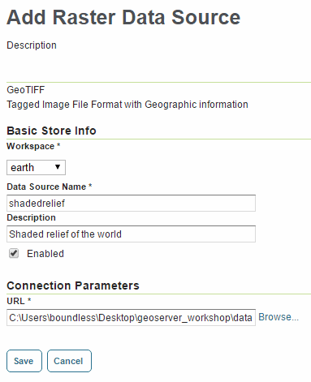

Presenter notes
---------------

Fill out the following form:

Workspace: earth
  Should be already the default
Data Source Name: shadedrelief
  Can be anything, but a good idea to match this with the name of the shapefile
Enabled: Checked
  Ensures the layer is published. Unchecking will save configuration information only.
Description: "Shaded relief of the world"
  Layer metadata is recommended but not required

In the box marked URL, type in the full path to the shapefile if known, or click the Browse... button to navigate to the file. The file path may be something like:

C:\Users\<username>\Desktop\geoserver_workshop\data\shadedrelief.tif

Be sure to replace <username> with your user name.

When finished, click Save.

--------------------------------------------------

Publishing a GeoTIFF
====================

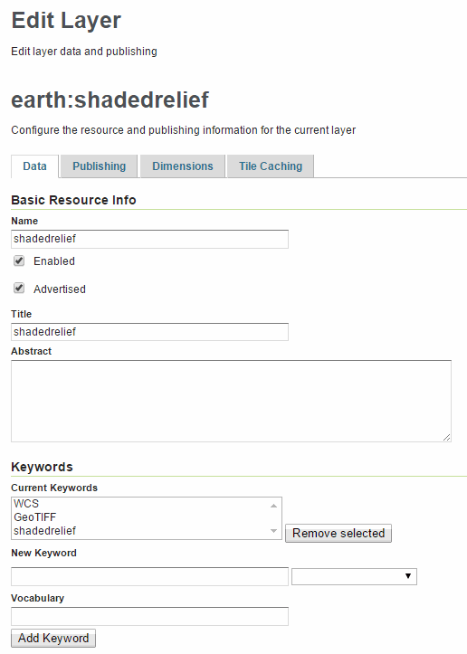

Presenter notes
---------------

As with the shapefile, now that store is loaded, we now need to configure and publish the layer itself.

    On the next screen, a list of layers in the store is displayed. Since we are working with a GeoTIFF, there is only a single layer. Click the Publish link to configure the layer.

    This is the layer configuration page. There are many settings on this page, most of which we don't need to work with just now. We will return to some of these settings later.

--------------------------------------------------

Publishing a GeoTIFF
====================

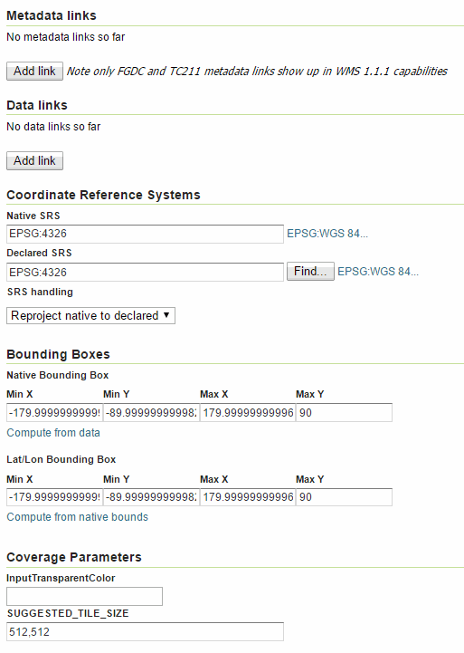

Presenter notes
---------------

Fill out the form with the following info:

    In the Coordinate Reference System section, set the Declared SRS to EPSG:4326 and set the SRS handling to Force declared. This will ensure that the layer is known to be in latitude/longitude coordinates.
    In the Bounding Boxes section, click the Compute from data and Compute from native bounds links to set the bounding box of the layer.
    When finished, click Save.

--------------------------------------------------

Publishing a GeoTIFF
====================

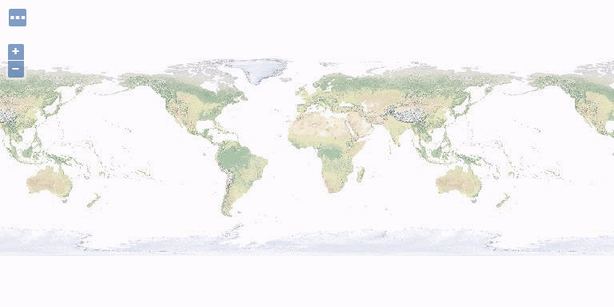

Presenter notes
---------------

Your GeoTIFF is now published in GeoServer. You can now view the layer using the Layer Preview as in previous sections. Clicking the map will display the RGB values for that particular point.

--------------------------------------------------

Loading multiple layers
=======================

Using the Layer Importer

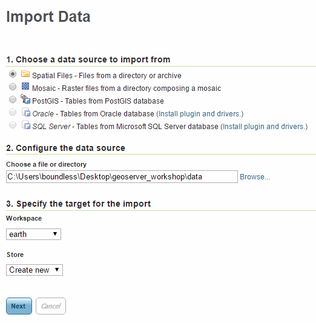

Presenter notes
---------------

So far we have seen a few different ways to load data into GeoServer. In the Loading your first data set section, we used the Layer Importer to load an archive of a shapefile. The Layer Importer can also be used to load multiple layers as well, saving time and configuration.

In this section, we will load the rest of our workshop data by using the Layer Importer to load and configure all shapefiles in our workshop data directory.

  Navigate to the Layer Importer. This is accessible in the GeoServer web interface by clicking on the Import Data link on the left side of the page.

  On the next page, in the section titled Choose a data source to import from, select Shapefiles if it isn't already selected.

  In the section titled Configure the data source, type in the full path to the data, or click the Browse... button to navigate to the directory. The path may look something like:

    C:\Users\<username>\Desktop\geoserver_workshop\data\

  Be sure to replace <username> with your user name.

  In the section titled Specify the target for the import, select earth for the Workspace (if it isn't already selected), and select Create new for the Store.

  Click Next to continue.

--------------------------------------------------

Loading multiple layers
=======================

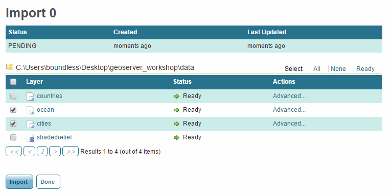

Presenter notes
---------------

You will see a list of shapefiles contained in that directory. Check only the cities and ocean layers.

Warning: Checking all of the layers will cause some of them to be loaded twice. While this won't cause an error, it may cause confusion later on in the workshop.

All layers should say Ready for import. Click Import Data to create/configure a store with each of these shapefiles as layers.

Note: If there are any issues with the shapefiles such as a lack of projection information, they will be displayed here.

The importer will load and publish each table as a layer. All layers should say Import successful.

--------------------------------------------------

Loading multiple layers
=======================

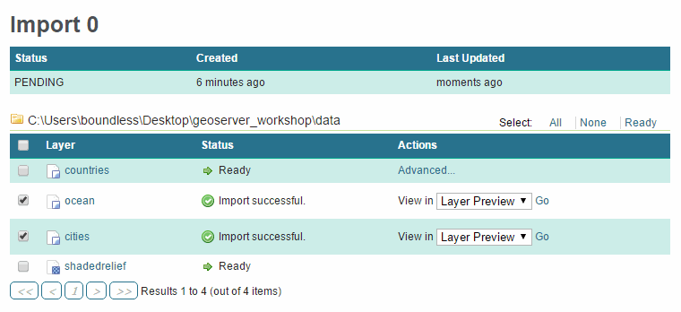

Presenter notes
---------------

To preview these layers, select OpenLayers in the select box next to a layer and click Go. Alternately, you can use the standard Layer Preview. As you view the layers, you'll see that the Layer Importer has generated unique styles for each layer, instead of reusing default GeoServer styles.

All of our layers are now loaded into GeoServer.

--------------------------------------------------

Bonus: PostGIS and Layer Importer
=================================

Load in PostGIS and then publish in GeoServer, all in one step!

Presenter notes
---------------

The Layer Importer also has the ability to take source data, import it into a PostGIS database, and then publish the layers that way, as opposed to publishing the data directly from its source files.

To see this in action. Create a new PostGIS database, add it as a store in GeoServer, and then use the Layer Importer, selecting that store as the target.

--------------------------------------------------

Other ways of loading data
==========================

* Directory of shapefiles
* REST API 

Presenter notes
---------------

There are other ways to load data into GeoServer.

Directory of shapefiles - In the list of possible data sources (the Add new store page), there is an option for Directory of spatial files (shapefiles). This allows you to load a directory of shapefiles as a single store, with each individual file inside the directory being a publishable layer. Using a single store has its advantages, but each layer still needs to be configured manually, so it can still be inefficient for many layers.

REST API - GeoServer also has a full REST API for loading and configuring GeoServer. With this interface, one can create scripts (via bash, PHP, etc) to batch load and configure any number of files, or just manually load content. The REST interface is beyond the scope of an introductory workshop, but those interested can read the REST section of the GeoServer documentation at http://docs.geoserver.org/stable/en/user/rest/.

--------------------------------------------------

Creating a layer group
======================

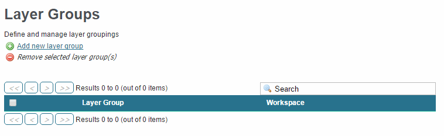

Presenter notes
---------------

A layer group, as its name suggests, is a group of layers that acts as a single layer. This is useful when creating a "base map", or other situations when more than one separate layer needs to be requested simultaneously or frequently. Since layers typically contain only a single type of geometry, using a layer group also allows you to combine data types in one single WMS request.

Take care not to get confused between a workspace, which is a notional grouping of layers (think "container"), and a layer group, which is a group of layers for WMS requests (think "image group"). Refer to the GeoServer concepts section for more information.

In the previous sections, we loaded and published a few layers. Now we'll use a layer group to combine them.

--------------------------------------------------

Creating a layer group
======================

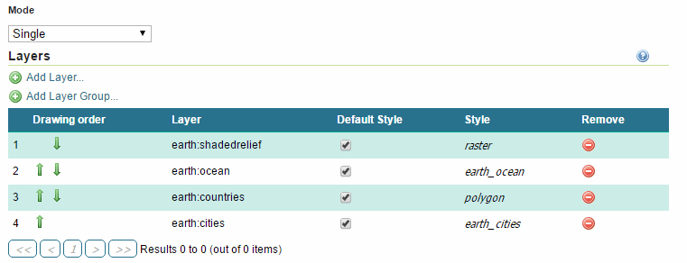

Presenter notes
---------------

Click the Layer Groups link, under Data on the left side of the page.

Click Add new layer group at the top of the page.

We will fill out the following form. In the Name field, enter earthmap.

In the Workspace field, enter earth.

Skip the Bounds and Coordinate Reference System sections for now.

Now we will add layers to our layer group. Click the Add Layer... link.

Select each of the following layers so that they appear in this order:

  earth:shadedrelief
  earth:ocean
  earth:countries
  earth:cities

Warning: There are two layers named countries, but only one is in the earth workspace. Make sure you pick the correct one!

Layer order is important. The top layer in the list will be drawn first. Make sure to match the order of the above list. Reorder the layers if necessary by clicking the Position arrows for each layer. Use the search box to narrow down the list if necessary.

This order is the opposite of the way that mapping applications respect drawing order. In most mapping applications, the top layer is drawn last so that it is "on top".

Check the Default style box for every layer.

--------------------------------------------------

Creating a layer group
======================

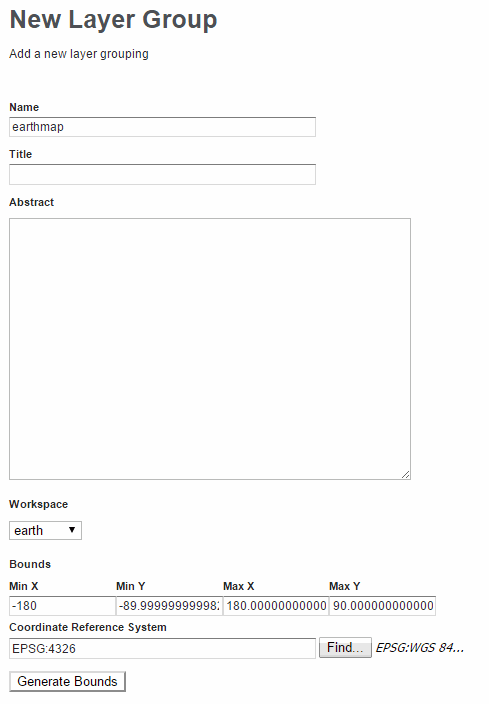

Presenter notes
---------------

Now go back to the Bounds section and click the Generate Bounds button. This will determine the bounding box for the entire layer group. This is why we waited to do this until all layers were added to the layer group.

Leave all other areas as their defaults for now. The form should look like this:

--------------------------------------------------

Creating a layer group
======================

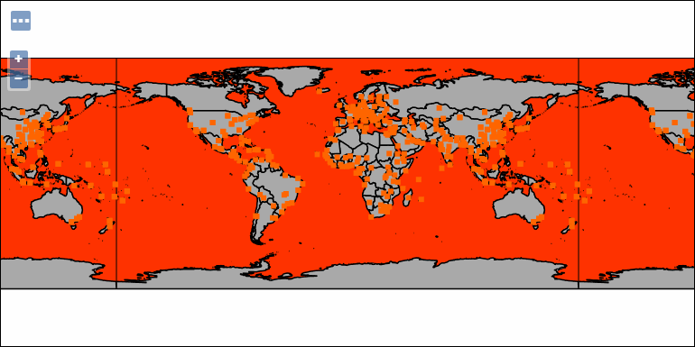

Presenter notes
---------------

Scroll down to the bottom of the page and click Save.

Preview the layer by going to the Layer Preview.

Even though the Layer Importer generated unique styles for each layer, this layer group doesn't look very nice. The following section will discuss the next important step of making maps: styling.

--------------------------------------------------

Section 5: Styling
==================

GeoServer can render geospatial data as images and return them for viewing in a browser. However, additional information, in the form of a style, needs to be applied to data in order to visualize it.

Presenter notes
---------------

GeoServer can render geospatial data as images and return them for viewing in a browser. This is the heart of WMS. However, geospatial data has no inherent visualization. Therefore additional information, in the form of a style, needs to be applied to data in order to visualize it.

We have already seen automatic/generic styles in action with the layers loaded in previous sections. In this section we will discuss how those styles are generated.

GeoServer uses the Styled Layer Descriptor (SLD) markup language to describe geospatial data. We will first explain basic SLD syntax. Next we will show a new alternate markup language called YSLD, and its improvements over SLD. Finally, we will show how to create and edit styles manually in GeoServer.

--------------------------------------------------

Viewing an SLD
==============

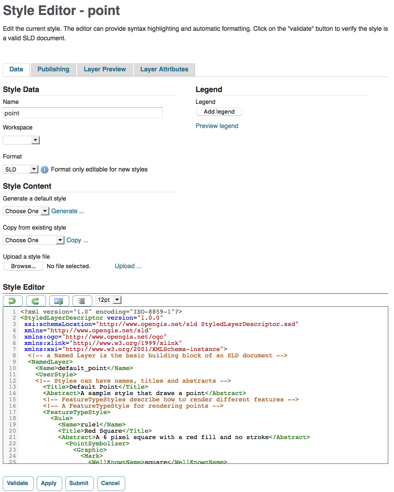

Presenter notes
---------------

GeoServer saves SLD information as plain text files in its data directory. You can edit them in place, but styles can be retrieved and managed more easily through the GeoServer web admin interface.

    Click the Styles link under Data on the left side of the page.

    Click the entry in the list called point.

    This brings up the Style Editor for this particular style. While we won't be editing this style, but take a look at it and refer back to it through the next few sections.

--------------------------------------------------

SLD structure
=============

* Header

  * FeatureTypeStyles

    * Rules

      * Symbolizers

Presenter notes
---------------

The header of the SLD contains metadata about XML namespaces, and is usually identical among different SLDs. The details of the header are beyond the scope of this workshop.

A FeatureTypeStyle is a group of styling rules. (Recall that a featuretype is another word for a layer.) Grouping by FeatureTypeStyle affects rendering order; the first FeatureTypeStyle will be rendered first, followed by the second, etc, allowing for precise control of drawing order.

A Rule is a single styling directive. It can apply globally to a layer, or it can have logic associated with it so that the rule is conditionally applied. These conditions can be based on the attributes of the data or based on the scale (zoom) level of the data being rendered.

A Symbolizer is the actual style instruction. There are five types of symbolizers: PointSymbolizer, LineSymbolizer, PolygonSymbolizer, RasterSymbolizer, TextSymbolizer

There can be one or more FeatureTypeStyles per SLD, one or more Rules per FeatureTypeStyles, and one or more Symbolizers per Rule.

--------------------------------------------------

Simple SLD
==========

::

    ...
      <FeatureTypeStyle>
        <Rule>
          <PointSymbolizer>
            <Graphic>
              <Mark>
                <WellKnownName>circle</WellKnownName>
                <Fill>
                  <CssParameter name="fill">#FF0000</CssParameter>
                </Fill>
              </Mark>
              <Size>6</Size>
            </Graphic>
          </PointSymbolizer>
        </Rule>
      </FeatureTypeStyle>
    ...

Presenter notes
---------------

The first lines are the header, which contain XML namespace information, as well as the Name and Title of the SLD. 

The actual styling happens inside the <FeatureTypeStyle> tag , of which there is only one in this example.

The tag contains one <Rule> and the rule contains one symbolizer, a <PointSymbolizer>.

The symbolizer directive creates a graphic mark of a "well known name", in this case a circle.

This shape has a <Fill> parameter of #FF0000, which is an RGB color code for 100% red.

The shape also has a <Size> of 6, which is the diameter of the circle in pixels.

--------------------------------------------------

Simple SLD
==========

.. image:: ../doc/source/styling/img/sld_simplestyle.png
   :width: 150%

Presenter notes
---------------

When applied to a hypothetical layer, the result would look like this:

--------------------------------------------------

Another SLD example
===================

::

        <Rule>
          <Name>SmallPop</Name>
          <Title>1 to 50000</Title>
          <ogc:Filter>
            <ogc:PropertyIsLessThan>
              <ogc:PropertyName>pop</ogc:PropertyName>
              <ogc:Literal>50000</ogc:Literal>
            </ogc:PropertyIsLessThan>
          </ogc:Filter>
          <PointSymbolizer>
            <Graphic>
              <Mark>
                <WellKnownName>circle</WellKnownName>
                <Fill>
                  <CssParameter name="fill">#0033CC</CssParameter>
                </Fill>
              </Mark>
              <Size>8</Size>
            </Graphic>
          </PointSymbolizer>
        </Rule>

Presenter notes
---------------

Here is an example of an SLD style that includes attribute-based styling. The SLD contains three rules. Each rule has an attribute-based condition, with the outcome determining the size of the shape being rendered. The attribute in question is called "pop", and the three rules are "**less than 50000**", "**50000 to 100000**", and "**greater than 100000**". The result is a blue circle with a size of 8, 12, of 16 pixels, depending on the rule.

[First rule only showed]

Looking at the first rule, there is a filter tag (<ogc:Filter>). This filter specifies that if the attribute value of pop for a given feature is less than 50000, then the condition is true and the feature is displayed.

--------------------------------------------------

Another SLD
===========

.. image:: ../doc/source/styling/img/sld_intermediatestyle.png
   :width: 150%

Presenter notes
---------------

When applied to a hypothetical layer, the result would look like this:

--------------------------------------------------

Functions in SLD
================

Use functions to simplify output.

::

              <Size>
                <ogc:Function name="Categorize">
                  <ogc:PropertyName>pop</ogc:PropertyName>
                  <ogc:Literal>8</ogc:Literal>
                  <ogc:Literal>50000</ogc:Literal>
                  <ogc:Literal>16</ogc:Literal>
                  <ogc:Literal>100000</ogc:Literal>
                  <ogc:Literal>20</ogc:Literal>
                </ogc:Function>
              </Size>

Presenter notes
---------------

That was a lot of code for not a lot of styling directive. And indeed, there are functions available in SLD that allow you to simplify code in areas where there is repetition. In the previous example, the only things that change from rule to rule are the name, property, and the size of the resulting point. This can therefore be reduced to the following.

This example uses the "Categorize" function, which transforms a continuous-valued attribute into a set of discrete values. Specifically, we want to transform the population value (which can vary) to a set of possible size values for the point.

There is a single rule that encompasses all the directives of the three rules in the previous example.
The interesting part of this style is contained in the Size tag. Instead of a constant value, there is a Categorize function which dynamically selects a value based on criteria.
The first value in the Categorize function determines what attribute to test. In this case, it is the pop attribute.
The next values are connected in "size" / "attribute value" pairs. As in: the size will be set to 8 when the pop attribute is less than 50,000, and the size will be set to 16 when the pop attribute is between 50,000 and 100,000.
The final value in the Categorize function is the size when the pop attribute is greater than all the others, so greater than 100,000.

--------------------------------------------------

Functions in SLD
================

.. image:: ../doc/source/styling/img/sld_intermediatestyle.png
   :width: 150%

Presenter notes
---------------

The result of this SLD yields the exact same output as above, but with less than half the number of lines.

--------------------------------------------------

YSLD
====

* Improving on SLD
* Based on YAML syntax
* Native rendering

Presenter notes
---------------

SLD has been the standard method of styling in GeoServer since its inception. However, it is not difficult to see that there are some disadvantages to SLD that can make it a challenging development environment.

There have been a few advances designed to mitigate these challenges. One of these is the development of YSLD, a re-imagining of the SLD syntax with YAML syntax.

--------------------------------------------------

Benefits of YSLD
================

**Easier to read**

SLD::

  <CssParameter name="fill">#FF0000</CssParameter>

YSLD::

  fill-color: '#FF0000'

Presenter notes
---------------

Compare the following style directives, both of which specify the fill color of a feature to be red.

In SLD, the XML-based nature of the content obscures the important aspects of the directive in the middle of the line. With YSLD, the attribute and the value are clearly marked and associated with no extraneous information, making comprehension easier.

--------------------------------------------------

Benefits of YSLD
================

**More compact**

::

  <Rule>
    <PointSymbolizer>
      <Graphic>
        <Mark>
          <WellKnownName>circle</WellKnownName>
          <Fill>
            <CssParameter name="fill">#FF0000</CssParameter>
          </Fill>
          <Stroke>
            <CssParameter name="stroke">#000000</CssParameter>
            <CssParameter name="stroke-width">2</CssParameter>
          </Stroke>
        </Mark>
        <Size>8</Size>
      </Graphic>
    </PointSymbolizer>
  </Rule>

Presenter notes
---------------

Individual style files of a sufficient complexity can easily grow to dozens of rules. Therefore the length of each individual rule can drastically affect the length of the entire style.

Compare the following style rules, which both specify the a point layer to be styled as a red circle with 8-pixel diameter and a 2-pixel black stroke:

--------------------------------------------------

Benefits of YSLD
================

**More compact**

  rules:
  - symbolizers:
    - point:
        size: 8
        symbols:
        - mark:
            shape: circle
            fill-color: '#FF0000'
            stroke-color: '#000000'
            stroke-width: 2

Presenter notes
---------------

While the SLD comes in at 300 characters, the YSLD equivalent comes in at about half that. Also, by not using an XML-based markup language, the removal of open and close tags make the document look much simpler and be much more compact.            

--------------------------------------------------

Benefits of YSLD
================

**More flexible syntax**

Valid::

  <Fill>...</Fill>
  <Stroke>...</Stroke>

Invalid::

  <Stroke>...</Stroke>
  <Fill>...</Fill>

Presenter notes
---------------

SLD, being an XML-based markup language, has a schema to which any style file needs to adhere. This means that not only are certain tags required, but the order of those tags are significant. This can cause confusion when the correct directives happen to be in the wrong order.

For example, take the following fill and stroke directives for a symbolizer. In SLD, the top is valid, while the bottom is invalid.

--------------------------------------------------

Benefits of YSLD
================

**More flexible syntax**

Both valid::

  fill-color: '#FF0000'
  stroke-color: '#000000'

::

  stroke-color: '#000000'
  fill-color: '#FF0000'

Presenter notes
---------------

YSLD, by contrast, does not require any of the directives to be ordered, so long as they are contained in the proper block.

For example, the following are both equally valid.

--------------------------------------------------

Benefits of YSLD
================

**Contains variables for reusable code**

::

  define: &variable
    shape: circle
    fill-color: '#FF0000'
    stroke-color: '#000000'
  rules:
  - name: rule1
    scale: [35000,max]
    symbolizers:
    - point:
        size: 6
        symbols:
        - mark:
            <<: *variable
            stroke-width: 2

Presenter notes
---------------

In SLD, if you have content that needs to be reused from rule to rule, you must manually generate the directives for each rule over and over. YSLD eliminates the need for redundant directives by introducing the ability to create variables that can take the place of the same content.

For example, all the directives that occur multiple times can be replaced with a variable.

--------------------------------------------------

Benefits of YSLD
================

**Direct match with SLD**

SLD ↔ YSLD ↔ SLD

Presenter notes
---------------

In addition to all of these advantages, YSLD directly aligns with SLD concepts. This allows existing SLD files to be converted into YSLD representation and back again.

Note: While YSLD and SLD share the core concepts, several YSLD features are modified during use.

  Comments are removed
  Zoom parameters are converted to scale parameters
  Variables are evaluated

Some may be familiar with a CSS extension for GeoServer, which attempts to mimic CSS-style syntax.

While CSS syntax is familiar to many, there are some disadvantages when used with GeoServer. The CSS code needs to be converted to SLD internally, and the painter's model for CSS differs significantly from SLD, making it challenging to mimic the desired effects exactly. Also, CSS styles can be converted to SLD, but the reverse is not true, due to inherent differences in the way the styles are drawn.

YSLD does not suffer from any of these limitations.

--------------------------------------------------

Simple YSLD
===========

::

  title: Simple Point
  feature-styles:
  - rules:
    - scale: [min, max]
      symbolizers:
      - point:
          size: 6
          symbols:
          - mark:
              shape: circle
              fill-color: '#FF0000'

Presenter notes
---------------

The following are the equivalent styles from the previous section on Styled Layer Descriptor, but converted to YSLD. Please refer back to that section for comparisons if necessary.

The following example draws a simple 6-pixel red circle for each feature in a given layer.

  There is one feature-style (akin to <FeatureTypeStyle>) which starts on line 2.
  There is one rule which starts on line 3.
  The symbolizer section (line 5) contains a single point symbolizer, starting at line 6.
  The size of the point is given on line 7.
  The symbol (mark) is set to be a red circle on lines 8-11.

--------------------------------------------------

Simple YSLD
===========

.. image:: ../doc/source/styling/img/sld_simplestyle.png
   :width: 150%

Presenter notes
---------------

When applied to a hypothetical layer, the result would look like this:

--------------------------------------------------

Another YSLD
============

::

  title: Attribute-based point
  feature-styles:
  - rules:
    - name: SmallPop
      title: 1 to 50000
      filter: ${pop < '50000'}
      scale: [min, max]
      symbolizers:
      - point:
          size: 8
          symbols:
          - mark:
              shape: circle
              fill-color: '#0033CC' 

Presenter notes
---------------

Here is an example of a YSLD file that includes attribute-based styling. This is identical to the SLD example.

  The first rule is contained on lines 4-14.
  The first rule contains a filter for the pop attribute on line 6.
  The point symbolizer for the first rule is on line 9-14, containing the point size, shape, and color information.

--------------------------------------------------

Another YSLD
============

.. image:: ../doc/source/styling/img/sld_intermediatestyle.png
   :width: 150%

Presenter notes
---------------

When applied to a hypothetical layer, the result would look like this:

--------------------------------------------------

Functions in YSLD
=================

::

  title: Attribute-based point
  feature-styles:
  - name: name
    rules:
    - name: Population
      title: Population with three categories
      scale: [min, max]
      symbolizers:
      - point:
          size: ${Categorize(pop,'8','50000','16','100000','20')}
          symbols:
          - mark:
              shape: circle
              fill-color: '#0033CC'

Presenter notes
---------------

And just like SLD has the ability to simplify based on functions, so does YSLD, making the resulting style even more compact.

 There is a single rule on lines 5-14.
 The Categorize function is contained on line 10.

--------------------------------------------------

Viewing an existing style
=========================

Presenter notes
---------------

Every layer published in GeoServer must have at least one style associated with it. When manually loading layers as done in the Publishing a shapefile and Publishing a GeoTIFF sections, GeoServer looks at the geometry of the data and assign a generic existing style based on that data type. When using the Layer Importer, GeoServer will generate a unique style for each layer, but still based on the geometry. We will now look at how GeoServer handles styles.

  Navigate to the Layers list. Select the earth:countries layer from the list of published layers.

  Preview the layer to see its visualization by navigating to the Layer Preview, then clicking the OpenLayers link next to that layer.

--------------------------------------------------

Viewing an existing style
=========================

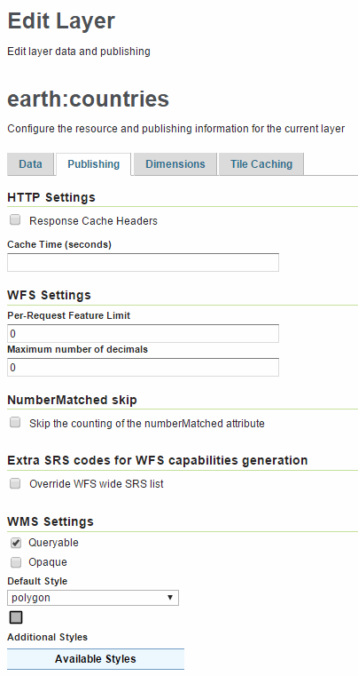

Presenter notes
---------------

Leave this preview window open and open up a new browser tab. In the new tab, navigate back to the main GeoServer web interface page.

In order to view the style for this layer, we need to find out which style is associated with this layer. To do this, click Layers under Data on the left side of the page.

Click the Layer Name link of countries.

You are now back at the layer configuration page. Notice there are four tabs on this page: Data (default), Publishing, Dimensions, Tile Caching.

Click the Publishing tab, then scroll down to the entry that says Default Styles. Make a note of the name of the style. (In the case of earth:countries, the name of the style is called polygon.)

--------------------------------------------------

Viewing an existing style
=========================

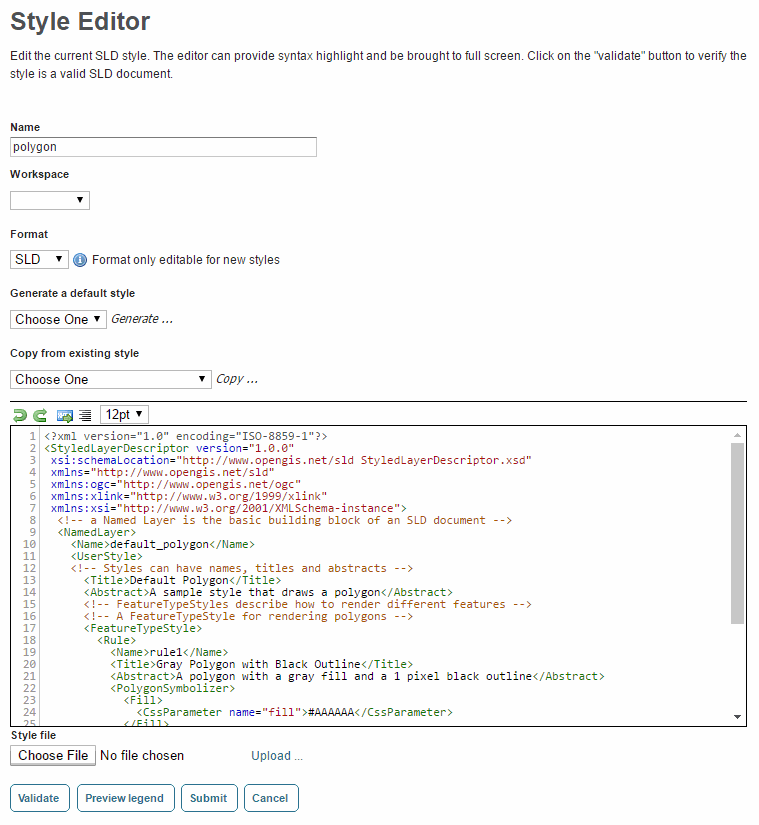

Presenter notes
---------------

Now that we know the name of the style, we can view the style's code. Click the Styles link, under Data on the left side of the page.

Click the style name determined in the previous step.

A text editor will open up, displaying the code for this style.

--------------------------------------------------

Editing an existing style
=========================

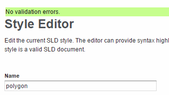

Presenter notes
---------------

It is helpful when learning about styles to edit existing ones rather than creating new ones. We will now do this with the style that was just opened.

  Make a change to an RGB color value in a <CssParameter> value. For example, find the line that starts with <CssParameter name="fill"> and change the RGB code to #0000FF (blue).

  When done, click Validate to make sure that the changes you have made are valid. If you receive an error, go back and check your work.

  Click Submit to commit the style change.

--------------------------------------------------

Editing an existing style
=========================

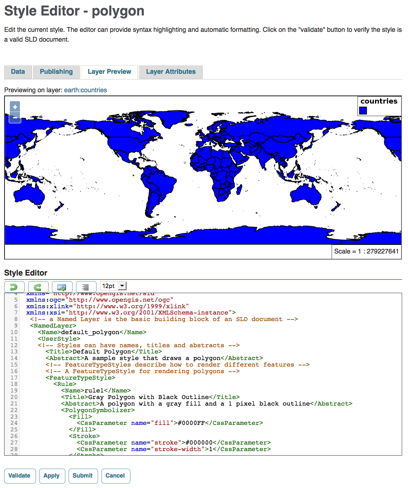

Presenter notes
---------------

Now go back to the browser tab that contains the OpenLayers preview map. Refresh the page, and you should see the color change to blue.

Note: GeoServer and your browser can both cache images. If you don't see a change immediately, zoom or pan the map to display a new area.

--------------------------------------------------

Loading new styles
==================

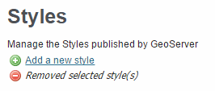

Presenter notes
---------------

If you have a style file saved as a text file, it is easy to load it into GeoServer. We will now load the YSLD styles saved in the workshop styles folder.

Note: The procedure for loading SLD files is exactly the same.

Navigate back to the Styles page by clicking Styles under Data on the left side of the page.

Click Add a new style.

--------------------------------------------------

Loading new styles
==================

.. image:: ../doc/source/styling/img/styles_new.png

Presenter notes
---------------

A blank text editor will open.

At the very bottom of the page, below the text editor, there is an area where you can populate a style based on an existing text file. click Choose File... to navigate to and select a style file.

Select the cities.ysld file. Recall that the style files are in the styles directory of your workshop bundle.

Back in GeoServer, click the Upload... link to load this style file into GeoServer.

--------------------------------------------------

Loading new styles
==================

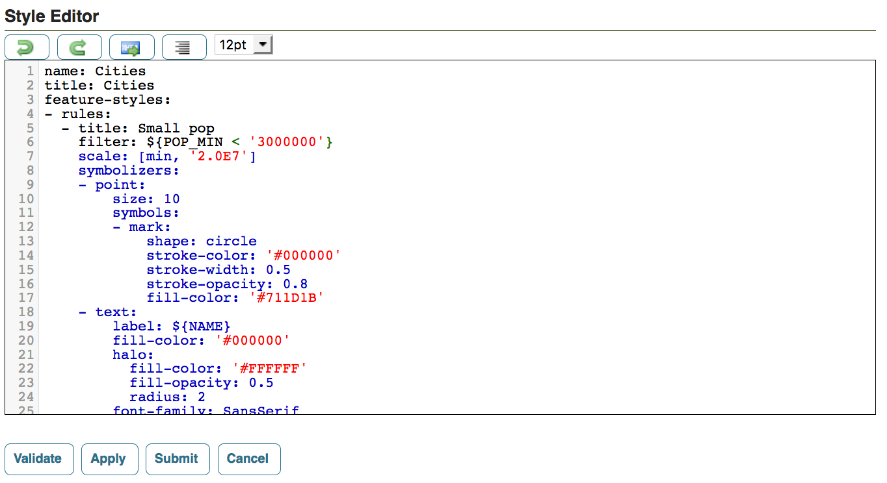

Presenter notes
---------------

The code will display in the text editor. The name of the style will be automatically generated.

Click Validate to ensure that the style is valid.

Change the title to Cities. The capital letter will help distinguish the uploaded styles from other similar-looking style names. The specific name isn't important though.

Make sure the Format is set to YSLD.

Click Submit to save the new style.

Repeat the above steps with the two other YSLD files in the the styles directory:

  countries.ysld
  ocean.ysld

We will not upload a new style for the shadedrelief layer.

--------------------------------------------------

Associating styles with layers
==============================

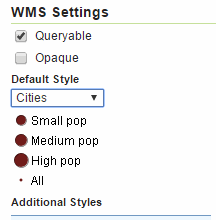

Presenter notes
---------------

Once the styles are loaded, they are merely stored in GeoServer, but not associated with any layers. The next step is to link the styles with their appropriate layer.

  Navigate to the Layers page.

  Click the earth:cities layer to edit its configuration.

  Click the Publishing tab.

  Scroll down to the Default style drop down list. Change the entry to display the Cities style. You will see that the legend changes.

--------------------------------------------------

Associating styles with layers
==============================

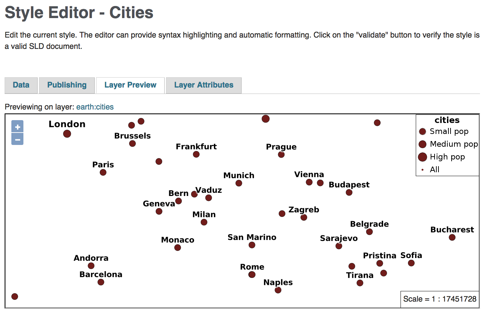

Presenter notes
---------------

Click Save to commit the change.

Verify the change by going to the layer's Layer Preview page. Zoom in the see the behavior change based on zoom level.

Repeat the above steps for the earth:countries and earth:ocean layers, associating each with the appropriate uploaded style (Countries and Ocean respectively). View each result in the Layer Preview.

--------------------------------------------------

Error in the ocean
==================

Why doesn't the ocean layer display?

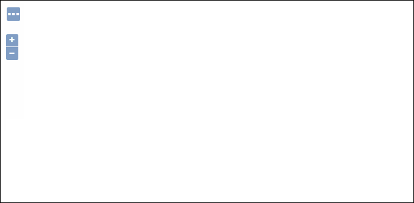

Presenter notes
---------------

At this point, the earth:ocean layer won't display properly. Look at the style file; can you figure out why not? The next section will explain.

--------------------------------------------------

External graphics
=================

Note the graphic in the style:

::

   name: 'Ocean'
   title: 'Ocean: Graphic fill'
   feature-styles:
   - rules:
     - scale: [min, max]
       symbolizers:
       - polygon:
           fill-graphic:
             size: 16
             symbols:
             - external:
                 url: oceantile.png
                 format: image/png

Presenter notes
---------------

Style files have the ability, in addition to drawing circles, squares, and other standard shapes, to link to graphics files. The earth:ocean style utilizes an ocean-themed graphic that will be tiled throughout the layer. While it is possible to link to a full URL that references an online resource, in practice that is less efficient than storing the file locally and linking to it there.

This means that GeoServer will expect the graphic to be in the same directory as the file itself. So in order for the layer to display properly, we will need to copy that file manually.

--------------------------------------------------

External graphics
=================

Images can be placed in the data directory

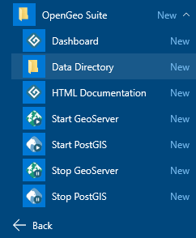

Presenter notes
---------------

The styles directory of the workshop materials contains a file, oceantile.png. We want to copy this file to the GeoServer styles repository, contained in the GeoServer data directory. In OpenGeo Suite for Windows, the easiest way to get to the GeoServer data directory is go to the Start Menu and navigate to OpenGeo Suite ‣ Data Directory.

You can also find the full path to the data directory by clicking Server Status on the left side of any GeoServer page.

Once located, navigate to the GeoServer Data directory.

Navigate into the styles folder.

Copy the oceantile.png file from the workshop materials into the styles directory.

--------------------------------------------------

External graphics
=================

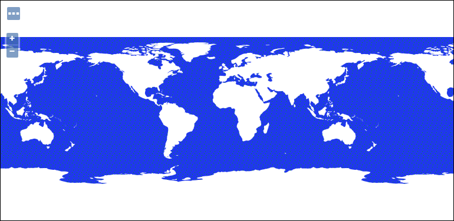

Presenter notes
---------------

Now back in GeoServer, navigate to the Layer Preview for the earth:ocean layer. If you copied the file correctly, you should see a ocean-like graphic tiled in the appropriate places now.

--------------------------------------------------

Revisiting the layer group
==========================

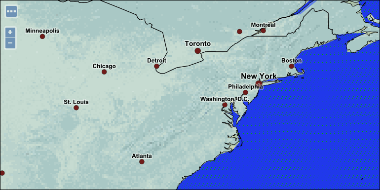

Presenter notes
---------------

When all of your styles are associated with your layers, view the earthmap layer group once more by going to Layer Preview. It should look quite different now.

If for some reason, the layer group fails to update with the new styles, go back the Layer Group page and verify that the Default Style box is checked for every layer.

--------------------------------------------------

Graphical styling: QGIS
=======================

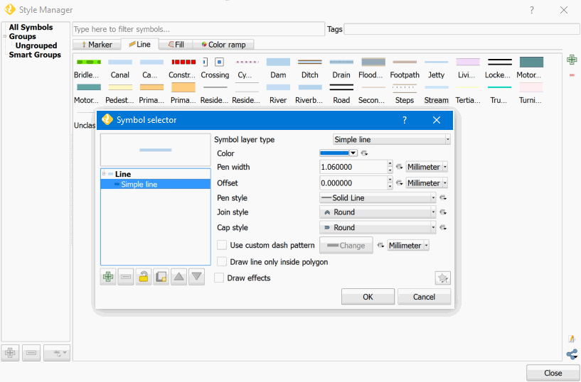

Presenter notes
---------------

Creating style files by hand, regardless of the type of markup you use, can be a difficult and time-consuming process. Fortunately, there are some graphical tools that exist to help make the generating of styles in GeoServer easier.

While beyond the scope of this workshop, attendees are encouraged to download these programs and try them out

QGIS is a free and open source GIS. It is typically used on the desktop, but is available in server / browser form as well.

QGIS has robust and varied styling options. While SLD isn't used natively (and therefore some styling options can be used that don't fit the standard), all styles can be exported to SLD.

--------------------------------------------------

Graphical styling: uDig
=======================

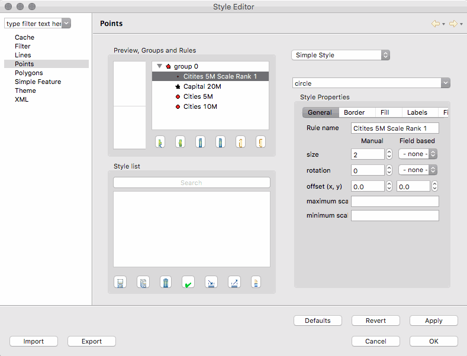

Presenter notes
---------------

uDig is another desktop GIS application. It is built from some of the exact same tools as GeoServer and so shares the same rendering engine. It can style directly from the SLD standard, so no conversion is necessary.

--------------------------------------------------

Section 6: Web map
==================

Open ``html/map.html`` in a browser

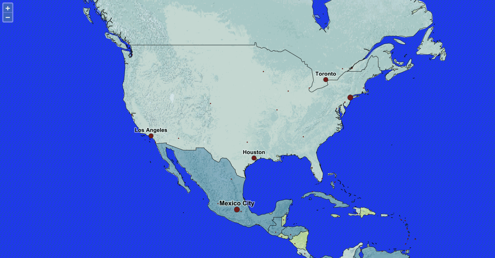

Presenter notes
---------------

Publishing data and maps in GeoServer is just one part of the finished product. You may also want to create a web map application, one that consumes that content and possibly allows for interactivity.

For our final exercise, we will show embedding web maps in a web page.

In the workshop html directory, open map.html in a browser.

There isn't much interactivity possible here, but this HTML page is standalone, meaning that all it requires is that it be placed on a web server, with an open connection to the GeoServer WMS.

--------------------------------------------------

Web map output
==============

.. image:: ../doc/source/webmap/img/devtools.png

Presenter notes
---------------

Open the developer tools of your browser (often accessed by pressing F12) and click the Network tab. Reload the page and note how the network requests are all WMS requests to GeoServer.

Note: The ows endpoint is a generic name for all the OGC web services. It stands for "Open Web Service".

--------------------------------------------------

Web map output
==============

Embed a map in web page

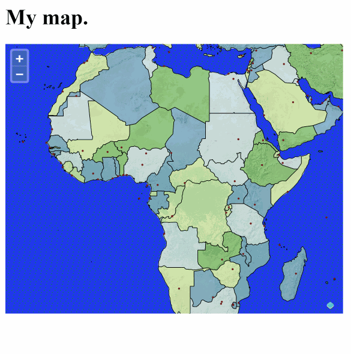

Presenter notes
---------------

This map can be embedded in any web page. To see an overly simple example, In the workshop html directory, open app.html in a browser.

--------------------------------------------------

For more information
====================

Web
  http://geoserver.org

Docs
  http://docs.geoserver.org

Mailing lists
  https://lists.sourceforge.net/lists/listinfo/geoserver-users
  https://lists.sourceforge.net/lists/listinfo/geoserver-devel

Bug tracker
  https://osgeo-org.atlassian.net/projects/GEOS/

Presenter notes
---------------

The following is a list of external sites related to GeoServer.

Visit the GeoServer home page at http://geoserver.org.

Full documentation for GeoServer is available at http://docs.geoserver.org.

GeoServer has an active users mailing list, which you can subscribe to at https://lists.sourceforge.net/lists/listinfo/geoserver-users. If you're a developer, you can subscribe to the developer list at https://lists.sourceforge.net/lists/listinfo/geoserver-devel.

JIRA, the GeoServer bug tracker, is hosted on http://atlassian.net at https://osgeo-org.atlassian.net/projects/GEOS/.

--------------------------------------------------

For more information
====================

.. image:: ../doc/source/moreinfo/img/boundless.png
   :width: 50%

http://boundlessgeo.com
-----------------------

Presenter notes
---------------

Boundless helps to develop GeoServer and funds development through its OpenGeo Suite. Learn more at http://boundlessgeo.com.

--------------------------------------------------

Questions? / Thanks!
====================

.fx: titleslide

.. image:: ../doc/source/geoserver.png

Presenter notes
---------------

--------------------------------------------------
