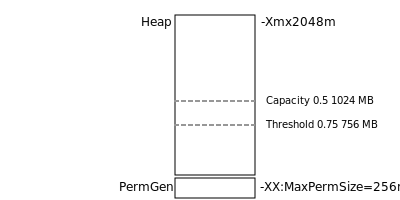

.. format:

******
Format
******

Up until now we have been focusing on half the work GeoServer WMS does. If we go back to our rendering chain after drawing an image the result needs to encoded in an image format and sent back to the client.

Unsurprisingly this can be a lot of work:

* Image formats like JPEG perform compression taking the entire image into account, often iterating again and again over detailed sections.

* Even formats like PNG that are easier to read can take some time to encode. When working with PNG8 the entire image is examined in order to determine the "best" color palette.

Although we are going to focus on performance, keep in mind the balance between how expensive it is to encode a file (more CPU time can produce a small file) and how expensive it is to transmit and store a file (in networks cost).

Java Advanced Imaging
---------------------

GeoServer makes use of two Java Extensions for working with imagery:

* Java Advanced Imaging (JAI) extension used for image processing (so raster scaling, slicing, re-projection).

* Java Image IO (ImageIO) used for image access and encoding common output formats.

There are two very important GeoServer configuration options that control how much memory is available to JAI for working with imagery.

   
   JAI Memory Use
   
*Memory capacity* describes how much of the heap should be used as a *tile cache* storing imagery for processing.

*Memory threshold* is used to to determine how much of the *tile cache* should be clear ... and available to quickly work on new imagery.

Keep in mind this is only a cache, and the memory can be quickly reclaimed if it is needed for other use.

Native JAI and ImageIO
''''''''''''''''''''''

Java extensions are available as "pure java" class files (like a normal application) and also as optional native (compiled C++ code) bundles for installation into your Java Virtual Machine :file:`ext` folder.

Native versions of JAI and ImageIO are available for a couple different platforms (win32, linux 32, linux 64) and has traditionally and was an easy 10-15% performance improvements when working with Java 5.

.. figure:: img/jai_comparison.png
   
   Image Processing Performance

The above figure compares the performance Oracle (Sun) JDK and OpenJDK, with and without JAI native code enabled. The test (performed using the TIGER road data) show Oracle JDK with the JAI native code implementation providing a significant gain.

Keep in mind:

* Modern Java Virtual Machines (Java 6 and Java 7) are doing such a good job compiling at compiling the "pure java" code that this performance gain has largely been erased.

* There are two alternatives for image encoding ( :manual:`libjpeg <extensions/libjpeg-turbo/index.html>` turbo and one based on PNGJ) that `perform better <http://osgeo-org.1560.x6.nabble.com/Faster-PNG-encoder-some-WMS-tests-td5083309.html>`__ .

.. admonition:: Explore
      
   If you are working on a supported platform you may wish download and install these native extensions and benchmark the result in JMeter.
   
   The windows install of OpenGeo Suite already has the native JAI and ImageIO extensions installed.

.. admonition:: Exercise
     
   #. Login to GeoServer Admin and navigate to :menuselection:`Server Status`.
   
   #. Scroll down to the current JAI settings.
      
      .. figure:: img/memory-jai-use.png
         
         JAI Memory Use
      
      You can review if native JAI is available, and view the memory dedicated to image  processing.
   
   #. To adjust these settings navigate to :menuselection:`Settings --> JAI`.
      
      .. figure:: img/jai-settings.png
         
         JAI Settings
   
   #. You can also check which encoders are used.
      
      .. figure:: img/jai-settings2.png
         
         JAI Encoders
      
      The PNGJ based encoder out performs both the default Java implementation, and the ImageIO native implementation.

PNG8
----

PNG8 is a great format for low bandwidth use (as the files are quite small when generated). Unfortunately it can be very expensive to review all the pixels in an image and determine the "best-fit" palette of 256 colors.

Reference:

* :manual:`tutorials/palettedimage/palettedimage.html`

.. admonition:: Exercise

   #. Collect a baseline using using ``image/png8``.
      
      .. figure:: img/png8-baseline.png
         
         PNG8 Benchmark
   
   #. Add the an extra parameter ``palette=safe`` to the Raster Parameters and rerun your benchmark.

      .. figure:: img/png8-safe.png
         
         PNG8 with Predefined Palette
         
      The palette consists of 216 colors that could reliability be reproduced on the computers used for the early web.
      
   #. Enable *View Result Tree* and have a look at the loss of image quality compared to normal PNG8 (where an optimized palette is generated for each image).
   
.. admonition:: Exercise
   
   Define your own palette:
   
   #. Use layer preview, to quickly make an image that uses colors common to the ne:hyp layer.
   #. Right click and **Save As** - choosing the filename :file:`hyp.png`
   #. Use a paint program to save the file as a GIF (this will reduce the palette to 256 colors).   
   #. Copy the :file:`hype.gif` to data directory :file:`palettes/hyp.gif` 
   #. Change the ``palette=hyp`` and rerun the benchmark
      
      .. figure:: img/png8-custom.png
         
         PNG8 Custom
   
   Use a predefined palette to avoid:

JPEG
----

The **libjpeg-turbo** community module is highly recommended.

References:

* http://sourceforge.net/projects/libjpeg-turbo/files/
* :manual:`libjpeg-turbo Map Encoder Extension <extensions/libjpeg-turbo/index.html>`
