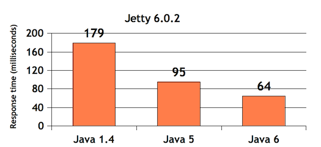
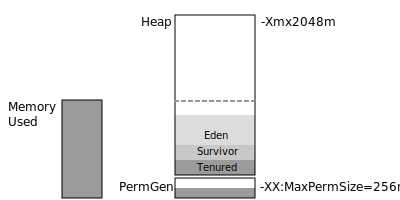
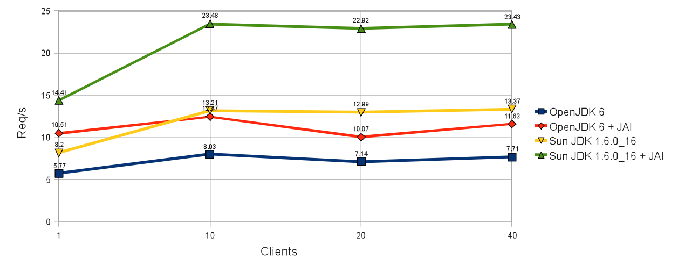

.. jvm:

***********************
Java Performance Tuning
***********************

Execution Environment
---------------------

Technically GeoServer is a Java Enterprise Edition "Web Application". An application server (such as Tomcat or Jetty) is run as a Java application. The application server is responsible for deploying web applications, handling HTTP requests and routing them to the appropriate application as required.
  
With this in mind much of our JVM configuration will take place by modifying Jetty or Tomcat configuration files.

Hardware Consideration
''''''''''''''''''''''
   
The focus of this workbook is on what you can do as the implementer and so focuses more on software, but hardware is always a major factor of performance, so we will identify hardware considerations for making maps fast.

* Memory: One of the cheapest hardware upgrades you can make is to expand the memory available to your WMS services. Your server should have more memory than your applications can consume. Once the server has to swap memory the system will slow down considerably. Chances are your WMS services will be accessing large amounts of data to generate the imagery as well – more memory means less time spent reloading data from disk. Be aware that modern Linux distributions will swap out applications and use the RAM for disk blocks caching, without indicating a problem.

* CPU Cores: More cores means more capacity to handle requests in parallel, though systems with a large number of cores are often constrained by the speed of the shared memory or similar factors. WMS servers are computationally intensive and benefit from most advancements in microprocessor technology.

* Bandwidth: The capacity of the connection between the client and server can be a big factor in the client's experience. Improve this by expanding the bandwidth capacity of the server, as well as implementing bandwidth saving strategies such as image format, compression and proxies. All of these are discussed later in this workbook.

* Storage Seek time and Read speeds: The time required to locate information and start reading can be slower on mechanical devices such as a hard disk drive. SSD drives often provide faster, consistent seek times (at greater cost for the device). Once the data is located the read speed provides a limit on how fast the information can be transfered to memory.
  
  Raster file performance is entirely dependent on these two measurements. On machines with faster disks it may be worth while to prep additional overviews, rather than spend CPU cycles processing on the fly. Machines with slow disk access may find it worth while to highly compress the raster data trading CPU cycles (required for decompression) for reading less content from disk.

Operating System
''''''''''''''''

We are always asked about windows vs linux. Anecdotally Linux has much better performance - in the `2011 WMS Shootout <http://www.slideshare.net/gatewaygeomatics.com/wms-performance-shootout-2011>`_ it was about a `30% difference <http://www.dixis.com/?p=713>`__ between the two operatins system.

Given the amount of data access GeoServer is responsible for, the difference between operating system often comes down to file system performance.

.. admonition:: Explore
      
   Compare benchmark results with another member of the class - are they significantly faster or slower than yourself? How does the hardware and operating system differ.

.. note:: The WMS Shootout mentioned above was conducted in 2011 you should certainly conduct your own testing when choosing an operating system. Even within an operating system a system administrator has a chance to install different schedulers and file systems to best take advantage of the available hardware.

Application Server
''''''''''''''''''

Choice of application server is usually dictated by ease of use, or company policy (for security integration) rather than for performance reasons.

* The Jetty application server (used for standalone GeoServer) is intended to be simple and small for use in larger applications.

* The Tomcat application server has a much stronger focus on speed, and can help a bit depending on your load. We generally recommend Tomcat for production use as it is a more popular application, and thus easier to get help for on the internet.

Java Virtual Machine
--------------------

When working with C/C++ applications you are often given a chance to fill in configuration information when compiling the application. This allows system administrators (or a vendor) to fine tune application to specific hardware.

By contrast Java applications are run by a Java Virtual Machine (JVM). A JVM sets up an an imaginary stack computer `defined <https://docs.oracle.com/javase/specs/jvms/se7/html/index.html>`__ by a specification. The initial advantage was one of application portability - allowing your choice of computing hardware for running GeoServer. The secondary advantage is the amount of control we gain by configuring Java for specific applications, or even specific workloads.

   
   JVM Performance Differences
   
The selection of an appropriate Java instance is one of the easiest methods to increase performance. One of the major findings of early GeoServer performance benchmarking was the effect improvements in Java have as shown in the graph above.

.. note:: Explore
   
   We recommend use of the latest version of Java ... that GeoServer has been tested with.
   
   GeoServer releases are subjected to extensive automated testing during release. If you decide to use a newer version of Java, be aware of the possible consequence to stability.
   
   #. Check the *Server Status* page to determine the version of Java you are running.
   
   #. Boundless has tested GeoServer with Java 8, but has not yet updated the build boxes used for continuous testing.
      
      If you get a chance (at the end of this workbook) try out a newer version of Java:
      
      * Windows: The :file:`C:\\Program Files (x86)\\Boundless\\OpenGeo\\jetty\jre` folder is the used when running GeoServer. Make a back up of this this folder (ie rename to :file:`jre2`) and copy the system java you installed for use with JMetre.
      
      * Linux: Try running running a newer Oracle JDK 7 (if you currently use OpenJDK 7).
      
      * OSX: Mac users will have a slightly tricker time changing the version of Java embeded in the GeoServer application. Right click on :file:`GeoServer.app` and :menuselection:`Show package contents`. Navigate into :file:`Contents/Resources/jre`.

.. admonition:: Explore
   
   One internal component of a JVM that acts as a bottleneck for GeoServer is the Java Rasterizers used for drawing:
      
   * Ductus: Included in Oracle Java, closed source, really quick for desktop use - but has poor scalability. This really is a bug (only one thread is allowed to draw a shape at a time).
   
   * Pisces: included in OpenJDK, open source, no scalability issues, but a fair bit slower that Ductus for single threaded use.
   
   * Marlin: Custom rasterizer, no scalability issue, decent performance.
     
     How much faster?
     
     * 10-144% speed up over Oracle JDK Ductus
     * 21-136% speed up over OpenJDK Pisces
     
     Marlin can be added into Java using the following command line options::
        
        -Xbootclasspath/p:"marlin-0.7.0.jar"
        -Dsun.java2d.renderer=org.marlin.pisces.PiscesRenderingEngine

     More more information iss this `blog post <http://www.geo-solutions.it/blog/developerss-corner-achieving-extreme-geoserver-scalability-with-the-new-marlin-vector-rasterizer/>`__ or visit the project `download page <https://github.com/bourgesl/marlin-renderer/releases>`__ .
   
   What this means in production is that providing GeoServer with more cores does not necessarily help WMS performance on Oracle JDK. For the longest time (after say 8 cores) the best advice was two run two Tomcat's on the same machine and load balance between the processes. The resulting solution is needlessly complicated, and it is great to have an alternative in the form of Marlin.
   
   .. only:: instructor
      
      The GeoServer team is trying to reach out to the Oracle team through the Eclipse Foundation to get this issue addressed.

JVM Settings
------------
   
The first set of optimisations we will work on is fine tuning the Java Virtual Machine. 

JVM settings are provided to the java application as command line parameters, locating the the Java application is being run can be a bit of a trick.

Reference:

* Oracle Java 7: `Java HotSpot VM Options <http://www.oracle.com/technetwork/articles/java/vmoptions-jsp-140102.html>`__
* Oracle Java 8: `windows <http://docs.oracle.com/javase/8/docs/technotes/tools/windows/java.html>`__ | `linux <http://docs.oracle.com/javase/8/docs/technotes/tools/unix/java.html>`__ | `osx <http://docs.oracle.com/javase/8/docs/technotes/tools/unix/java.html>`__
* Open JDK - consult man page

.. admonition:: Exercise
   
   On mac the JVM settings are located in the Jetty configuration file :file:`start.ini`:
   
   #. Navigate to:
      
      * OpenGeo: :file:`~/Library/Containers/com.boundlessgeo.geoserver/Data/Library/Application\ Support/GeoServer/jetty/start.ini`
      
      * Right click on :file:`GeoServer.app` and select :menuselection:`Show Package Contents`, then navigate to :file:`Contents/Resources/jetty/start.ini` .
      
   #. The lines of interest are::
        
         # jvm options
         --exec 
         -Xms128m
         -Xmx768m
         -XX:MaxPermSize=256m

.. admonition:: Exercise
   
   On windows the JVM settings are located in the jetty configuration :file:`start.ini`:
   
   #. Navigate to :file:`Program Files (x86)\\Boundless\\OpenGeo\\jetty\\start.ini` .
   #. The lines of interest are::
        
         # jvm options
         --exec 
         -Xms128m
         -Xmx768m
         -XX:MaxPermSize=256m

.. admonition:: Exercise

   On unbuntu JVM options are located in the Tomcat service configuration file :file:`tomcat7`:
   
   #. Open :file:`/etc/default/tomcat7` in a text editor.
   
   #. The lines of interest are::
   
         JAVA_OPTS="-Djava.awt.headless=true -Xmx128m -XX:+UseConcMarkSweepGC"
         
      And at the bottom of the file::
      
         # If you wish to further customize your tomcat environment,
         # put your own definitions here
         # (i.e. LD_LIBRARY_PATH for some jdbc drivers)
         OPENGEO_OPTS="-Djava.awt.headless=true -Xms256m -Xmx768m -Xrs -XX:PerfDataSamplingInterval=500 -XX:MaxPermSize=256m -Dorg.geotools.referencing.forceXY=true -DGEOEXPLORER_DATA=/var/lib/opengeo/geoexplorer"
         JAVA_OPTS="$JAVA_OPTS $OPENGEO_OPTS"

.. admonition:: Exercise
   
   On CentOS and RHEL JVM options are located in the Tomcat service configuration file :`tomcat`:
   
   #. Open :file:`/etc/sysconfig/tomcat` in a text editor
   #. The lines of interest are::
   
         JAVA_OPTS="-Djava.awt.headless=true -Xmx128m -XX:+UseConcMarkSweepGC"
         
      And at the bottom of the file::

         # If you wish to further customize your tomcat environment,
         # put your own definitions here
         # (i.e. LD_LIBRARY_PATH for some jdbc drivers)
         OPENGEO_OPTS="-Djava.awt.headless=true -Xms256m -Xmx768m -Xrs -XX:PerfDataSamplingInterval=500 -XX:MaxPermSize=256m -Dorg.geotools.referencing.forceXY=true -DGEOEXPLORER_DATA=/var/lib/opengeo/geoexplorer"
         JAVA_OPTS="$JAVA_OPTS $OPENGEO_OPTS"
   
Compile
'''''''

Java applications are compiled on the fly (using a just in time compiler) - we can control these settings providing amazingly deep control over how GeoServer operates.

* Hotspot - the "Hotspot Compiler" is now the default, in Java 6 the ``-client`` and ``-server`` command line options could control the use of the hotspot compiler.
  
  To determine which compiler is in use::
     
     $ java -version
     java version "1.7.0_67"
     Java(TM) SE Runtime Environment (build 1.7.0_67-b01)
     Java HotSpot(TM) 64-Bit Server VM (build 24.65-b04, mixed mode)
  
  You may need to be in the JRE :file:`bin` folder used by GeoServer.

* As java classes are loaded they are compiled in to ``PermGen`` space. As GeoServer is a large application the amount of ``PermGen`` space required is increased from Java defaults. Make more memory available for permanent objects such as classes.
  
  Increase this number if you run multiple servlets in the same container or receive messages about running out of "PermGen space"::

    -XX:MaxPermSize=256m

  .. note:: Unloading and loading the GeoServer application in Tomcat can result in more ``PermGen`` space being used, necessitating a restart of the application server.

* To reduce the use of operating system singnals::

    -Xrs 
   
.. note:: Warm up JIT compiler!
   
   The first time you run an operation in GeoServer the JVM will need to compile the java classes used to do the work.  With this in mind you may wish to "throw out" your first couple of measurements with JMeter as they will not be representative of the normal state of affairs.

.. only:: instructors
   
   Reference:
   
   * `JVM performance optimization, Part 2: Compilers <http://www.javaworld.com/article/2078635/enterprise-middleware/jvm-performance-optimization-part-2-compilers.html>`__
   
Heap Memory
'''''''''''

GeoServer consumes huge quantities of data during its operation but does ever "load" data into memory. Instead data is streamed (from disk or database) as needed, acted upon, and recycled.

This is contrast with many Java web applications which focus on many requests each one of which uses a small amount of memory. By fine tuning the JVM's memory management to match this unusual workload we can get better performance.

The working area of memory (used for application data) is called the *Heap*. As ane example images being rendered by GeoServer are recorded here, before being encoded into an image format and sent to the client.

Java applications do not directly manage memory, instead this is a function of the JVM, and one we will pay careful attention to due to its performance implications.

   
   Java 7 Memory Use

In Java 7 heap space is broken up into several regions:

* Eden: staging area for new data
* Survivor: data that is getting reused
* Tenured: objects such as coordinate reference system and layer definitions that are shared between requests.
* Permanent: used to store classes (i.e. "bytecode") and common strings.
* Code Cache used for compiled classes (i.e "native code").

Heap size can be set be controlled with::
   
   -Xmx2048m -Xms48m
   
The above allocates 2 GB memory to the heap, with a minimum of 48 MB. This setting is suitable for a production server (where you may wish to allocate several gigabytes to GeoServer).

Stack Memory
''''''''''''

Stack memory is used by running threads to keep track of calculations::

  -Xss512k
  
The default value depends on your platform, and is fine for GeoServer.

Each GeoServer request gets its own thread, but we generally work with a low number of requests each one of which consumes a lot of heap memory (loading data) rather than stack memory (performing calculations). It is almost unheard of for GeoServer to run out of stack memory - but you may be able to arrange it when defining your own WPS process.

This workload means that GeoServer needs to be tuned differently than most Java Enterprise Edition applications. If you are considering (or your company policy dictates) using a single Tomcat instance for both GeoServer and other applications you may wish to reconsider.

Garbage Collection
''''''''''''''''''

The JVM is responsible for a process called *Garbage Collection*, moving data between the above regions, and recycling memory that is not in use. 

1. Ideally GeoServer will complete its outstand GetMap requests, and then the garbage collector will reclaim memory when there is a break in traffic. This prevents GeoServer and the Garbage collector both trying to work at once, allowing GeoServer to respond to clients faster.

2. When operating under sustained load the Garbage collector will need to kick in, and operate at the same time as GeoServer, reclaiming memory in conjunction with incoming requests.

3. When operating at the limit of memory some requests will run into trouble, they will ask for more memory and have to wait while the garbage collector shuffles data around and frees up enough resources for the request to complete.  This is the first time response time will be significantly impacted.

4. When the garbage collector is unable to free up memory for a request, it will return with a service exception. The GeoServer logs will show "out of memory" or "heap space" errors to record the failure.

.. note:: For an service like GeoServer that runs for a long period of time it is important not to "leak" any memory (holding on to data that is no longer required will eventually cause the application to fail).

.. admonition:: Exercise
     
   #. Login to GeoServer Admin and navigate to :menuselection:`Server Status`.
      
      .. figure:: img/memory-gc.png
         
         Memory Usage and Garbage Collection
   
   #. Click the :guilabel:`Free memory` button to manually run the garbage collector.

GeoServer does its best to keep objects such as EPSG code (for spatial reference system) in memory for a long period of time. To make this work we need to tweak the amount of time "soft references" are kept memory (before the garbage collector is allowed to clean them up)::

   -XX:SoftRefLRUPolicyMSPerMB=36000

We can also get the garbage collector to relax a bit taking more time between sampling memory::

   -XX:PerfDataSamplingInterval=500

We recommend running GeoServer with a parallel garbage collector. This is recommended for multi processor machines and provides a focus on throughput. The garbage collector will be a steady predictable overhead)::

   -XX:+UseParallelGC

If you do not mind the occasional Map request taking loner you may wish to consider one of the parallel garbage collectors focused on response time. Most responses wil be quicker - but when the garbage collector runs it will get in the way::

   -XX:+UseConcMarkSweepGC   

Or::

   -XX:+UseG1GC 

This can be ideal if your GeoServer is supporting a small team resulting in bursts of traffic (as users pan and zoom). When they stop to look at a Map the garbage collector wil have a chance to clean things up.
   
We do not recommend using a serial garbage collector, although if you are on a single core machine it may workout for you::
   
   -XX:+UseSerialGC

.. note::
   
   We do not have enough experience working with Java 8 to offer solid performance tuning guidelines.
   
   The key change is a unified "Metaspace" memory model, which does away with "PermGen" space - making use of native operating system memory instead.
   
   Reference:

   * `Memory Management: What You Need to Know When Moving to Java 8 <http://www.slideshare.net/appdynamics/sb-java-java8memory>`__

.. admonition:: Exercise

   Lets adjust the amount of memory made available to GeoServer, and configure the JVM with the settings discussed above:
   
   #. Locate you jvm options for your application server.
   
   #. For jetty fill in the following settings::
   
         # jvm options
         --exec 
         -Xms256m
         -Xmx2048m
         -XX:MaxPermSize=256m
         -XX:+UseConcMarkSweepGC
         -XX:PerfDataSamplingInterval=500
         -XX:SoftRefLRUPolicyMSPerMB=36000
         -Xrs

   #. Fill in the following settings::
   
         JAVA_OPTS="-Djava.awt.headless=true -Xmx128m -XX:+UseConcMarkSweepGC"
      
      And at the bottom of the file::
      
         # If you wish to further customize your tomcat environment,
         # put your own definitions here
         # (i.e. LD_LIBRARY_PATH for some jdbc drivers)
         OPENGEO_OPTS="-Djava.awt.headless=true -Xms256m -Xmx2048m -Xrs -XX:PerfDataSamplingInterval=500 -XX:MaxPermSize=256m -Dorg.geotools.referencing.forceXY=true -DGEOEXPLORER_DATA=/var/lib/opengeo/geoexplorer"
         JAVA_OPTS="$JAVA_OPTS $OPENGEO_OPTS"
         
   #. Restart your application server.
      
      * Windows: Use the shortcuts provided in the start menu, or open up the *Services* control panel and restart the appropriate Jetty service.
        
        .. figure:: img/windows-restart.png
           
           Services Control Panel
           
      * Ubuntu::
         
         sudo service tomcat7 restart

      * Centos or RHEL::
          
          service tomcat start|stop|restart
    
    #. Perform one "dry" run of your benchmark (to allow the hotspot compiler to load and compile the application).
    
    #. Navigate to the GeoServer :guilabel:`Server Status` page:
       
       * Check the amount of memory available
       * Manually run the garbage collector
       
       You are now *set* for a good clean test!
    
    #. Perform a second run of your benchmark to record the (hopefully improved performance).
       
       .. figure:: img/jvm-benchmark.png
          
          JVM Benchmark

.. admonition:: Explore
    
   *  Try out the difference between ``UseConcMarkSweepGC`` and ``UseParallelGC``. Can you see a difference in performance?
      
      Tip: Remember to restart your application server when changing JVM options!
      
      Hint: You may need to increase the number of requests in your test plan.
   
   * How does GeoServer fail when out of memory? 
     
     You will need to lower heap memory and restart your server to try this out.

.. admonition:: Explore
   
   Operating System memory use only shows the amount of memory taken by the JVM, it cannot peak inside the JVM to see how much memory is actual in use. 
   
   Use your system memory monitor (:command:`top` on linux, ``Task Manager`` on windows) to watch how java behaves under load.
   
   From the operating system perspective you will see Java gradually increase is memory use, and then stay there.
   
   Hint: From the GeoServer :guilabel:`Server Status` page you can see the amount of memory used, and click garbage collection.
   
   Tip: if your servers primary responsibility is running GeoServer be sure to configure heap size to take full advantage of the available memory!

Java Advanced Imaging
---------------------

GeoServer makes use of two Java Extensions for working with imagery:

* Java Advanced Imaging (JAI) extension used for image processing (so raster scaling, slicing, re-projection).

* Java Image IO (ImageIO) used for image access and encoding common output formats.

There are two very important GeoServer configuration options that control how much memory is available to JAI for working with imagery.

.. figure:: img/memory-jai.svg
   
   JAI Memory Use
   
*Memory capacity* describes how much of the heap should be used as a *tile cache* storing imagery for processing.

*Memory threshold* is used to to determine how much of the *tile cache* should be clear ... and available to quickly work on new imagery.

Keep in mind this is only a cache, and the memory can be quickly reclaimed if it is needed for other use.

Native JAI and ImageIO
''''''''''''''''''''''

Java extensions are available as "pure java" class files (like a normal application) and also as optional native (compiled C++ code) bundles for installation into your Java Virtual Machine :file:`ext` folder.

Native versions of JAI and ImageIO are available for a couple different platforms (win32, linux 32, linux 64) and has traditionally and was an easy 10-15% performance improvements when working with Java 5.

   
   Image Processing Performance

The above figure compares the performance Oracle (Sun) JDK and OpenJDK, with and without JAI native code enabled. The test (performed using the TIGER road data) show Oracle JDK with the JAI native code implementation providing a significant gain.

Keep in mind:

* Modern Java Virtual Machines (Java 6 and Java 7) are doing such a good job compiling at compiling the "pure java" code that this performance gain has largely been erased.

* There are two alternatives for image encoding ( :manual:`libjpeg <extensions/libjpeg-turbo/index.html>` turbo and one based on PNGJ) that `perform better <http://osgeo-org.1560.x6.nabble.com/Faster-PNG-encoder-some-WMS-tests-td5083309.html>`__ .

.. admonition:: Explore
      
   If you are working on a supported platform you may wish download and install these native extensions and benchmark the result in JMeter.
   
   The windows install of OpenGeo Suite already has the native JAI and ImageIO extensions installed.

.. admonition:: Exercise
     
   #. Login to GeoServer Admin and navigate to :menuselection:`Server Status`.
   
   #. Scroll down to the current JAI settings.
      
      .. figure:: img/memory-jai-use.png
         
         JAI Memory Use
      
      You can review if native JAI is available, and view the memory dedicated to image  processing.
   
   #. To adjust these settings navigate to :menuselection:`Settings --> JAI`.
      
      .. figure:: img/jai-settings.png
         
         JAI Settings
   
   #. You can also check which encoders are used.
      
      .. figure:: img/jai-settings2.png
         
         JAI Encoders
      
      The PNGJ based encoder out performs both the default Java implementation, and the ImageIO native implementation.
