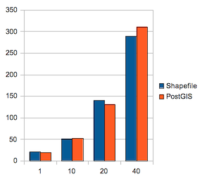

.. vector:

*******
Vector
*******

Working with WMS styling to control how much data is drawn can only get us so far (and indeed starts to involve visual tradeoffs). The other approach is to look at how your data is being used, and identify areas that can act as a bottleneck.

1. Data access
2. Transformation (between spatial reference systems)
3. Draw each individual geometry as a shape into an internal buffer.
4. Compose the internal buffers into a final image
5. Encoding - encode the final image in the format requested

Data Format
===========

The first thing we can look at for data access is the format used, some formats (such as XML) are great for interchange between systems (as they are very verbose) but are terrible for performance critical tasks (as they are very verbose or lack an index).

Usually in a production environment we focus on getting the data into a spatial database such as PostGIS; in general it is the right tool for the job and will let us quickly perform some of the more advanced data generalization steps later.

   
   Shapefile and PostGIS Performance
   
However the actual performance difference between a spatial database like PostGIS and raw shapefile performance is not very much. You may wish to bench mark for any difference yourself. The chart compares response time in milliseconds with number of concurrent requests, up to 40 concurrent requests.

Transform
=========

One of the more expensive things you can ask a WMS to do when drawing is to reproject the data first. Web Map Servers are able to draw maps in a range of projections; and this ability comes at a cost; each coordinate must be reprojected from the original data Coordinate Reference System; to the map Coordinate Reference System.

In extreme cases you may wish to duplicate your table several times for commonly used projections. This is a case of trading disk use for performance.

.. admonition:: Exercise
   
   Assuming you need to render your map in your national projection (or state plane) you can process your WGS84 lat/lon data into this projection once; rather than each time it is rendered.
   
   #. From :command:`PgAdmin` try out using ST_Transform to convert from 4326 to 3084 ( EPSG:3084 being a Texas conic projection )::
        
        SELECT ST_AsText(
          ST_Transform(geom,3084)
         )
         FROM roads
         WHERE state='Texas'
         LIMIT 1;
         
    #. Select out a new roads_texas table::
    
         SELECT
              gid, prefix, number, class, type, divided, country,
              state, note, scalerank, uident, length, rank, continent,
              ST_Transform(geom,3084) AS geom
         INTO texas
         FROM roads WHERE state='Texas';
    
    #. Add a primary key to the table::
       
         ALTER TABLE texas ADD PRIMARY KEY (gid);
         
    #. And fix things up::
        
        SELECT UpdateGeometrySRID('texas','geom',3084);

    #. Add a spatial index::
    
         CREATE INDEX texas_idx
              ON texas
              USING GIST (geom);

    #. Publish the ne:texas layer in GeoServer - remember to generate the native and Lat/Lon bounds.
    
       .. figure:: img/transform-bounds.png
          
          Texas Bounds
       
       Hint. You can reload (from the server status page) or "disable/enable" the training store to have it pick up the new table.
        
    #. The resulting layer will now display very quickly in EPSG:3084 - you have performed the transform once in PostGIS (rather than every single time a GetMap request is drawn).
       
       .. figure:: img/transform-texas.png
          
          Texas Roads
   
5.2 Draw Less using Style Filter

Geometry Simplification
=======================

Take a moment to draw the ``ne:roads_na`` layer in the browser and record the time to draw the entire map. Although "zoomed out" is not the most common case - it is one that is often seen by new users (when they are having a look at the data for the first time).

There are two ways to approach this problem:

* draw less stuff - as we did using styles, rules can be used to cut down on the total number of features rendered.
* draw less stuff - simplify each geometry (so each line has less points). While the total number of features will stay the same, each individual geometry will be easier to transfer between PostGIS and GeoServer (and transformations will be applied to less points).

.. admonition:: Explore

   #. Return to your PostGIS Store definition and check ``Support on the fly geometry simplification``.
      
      This setting wraps each call to the database with an ST_SimplifyPreserveTopology cutting down on the about of information that is sent to GeoSever.
   
   #. Can you notice any visual difference with this setting? Is there a performance difference.
   
   #. Turn the setting off before proceeding to the next section.

.. admonition:: Exercise
   
   #. Using PgAdmin add a ``simple`` column to the roads table.
   
   #. The ST_SimplifyPreserveTopology function produces simplified geometry::
   
         SELECT
           ST_AsText(geom) as geom,
           ST_AsText(ST_SimplifyPreserveTopology(geom, 0.05)) as simple 
         FROM roads
         LIMIT 1;

   #. Use this function add add a new column::
         
         ALTER TABLE roads ADD COLUMN simple geometry(Geometry,4326);
         
   #. Fill in the simplified geometry values::
   
           UPDATE roads
             SET simple=ST_SetSRID(
                     ST_SimplifyPreserveTopology(geom, 0.05),
                     4326)

   #. Add an appropriate spatial index::
   
            CREATE INDEX roads_geom_idx2
              ON roads
              USING gist
              (simple);
   
   #. Reload the FeatureType in GeoServer (to notice the new column).
   
   #. You can now choose between geometry and simple based on zoom level in your SLD file.
   
      .. literalinclude:: /files/roads_simplify.sld
         :language: xml

.. admonition:: Explore

   If you wish to create multiple independent tables you can still use this approach:
   
   #. Create a LayerGroup containing roads at two different zoom-levels. Each layer is backed by a different table.
   
   #. Then use styling to turn the appropriate layer on or off depending on scale.

.. admonition:: Explore
   
   Maintaining the same style information, repeated at different zoom levels quickly starts to feel like work.
   
   There is an alternative, a *Pregeneralized* data store is available as a community module. 
   
   Since we have already prepared generalized data already; we can configure this datastore to automatically swap between different columns (or different tables) as appropriate for the current zoom level::
   
      <?xml version="1.0" encoding="UTF-8"?>
      <GeneralizationInfos version="1.0">
        <GeneralizationInfo dataSourceName="traning" featureName="roads_dynamic" baseFeatureName="roads" geomPropertyName="geom">
          <Generalization dataSourceName="roads"
              distance="5"
              featureName="roads" geomPropertyName="simple"/>
        </GeneralizationInfo>
      </GeneralizationInfos>
   
   Reference:
   
   * `Pregeneralized DataStore <http://docs.geotools.org/latest/userguide/library/data/pregeneralized.html>`__
   
