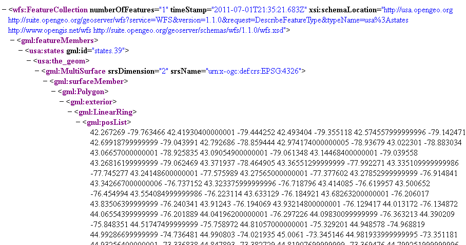
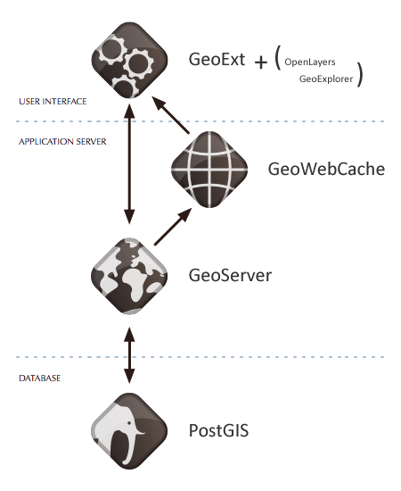
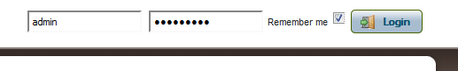
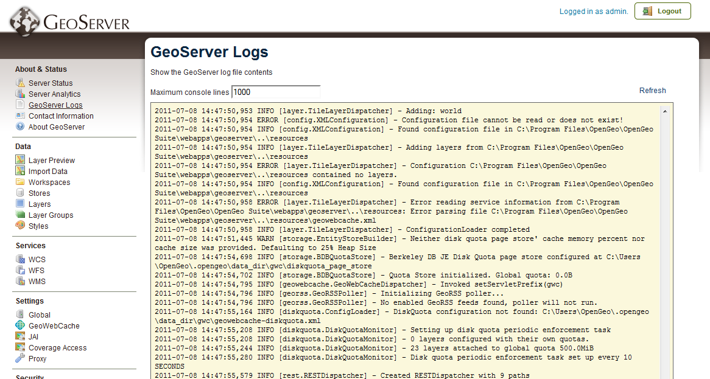

Intro to GeoServer
==================

.fx: titleslide

.. image:: ../doc/source/GeoServer_500.png

OpenGeo
-------

.. date:: date

April 2, 2013

Presenter notes
---------------

This is where you can write notes to yourself and only you will be able to see them.

--------------------------------------------------

Housekeeping
============

* We're recording this

* Please mute yourself

* Ask questions in the chat

* Workshop materials available at:
  http://workshops.opengeo.org

Presenter notes
---------------

Link not clickable

--------------------------------------------------

Welcome
=======

Sam Smith + graphic

Presenter notes
---------------

Blah blah name they gave me when I testified

--------------------------------------------------

Welcome
=======

Mike Pumphrey + graphic

Presenter notes
---------------

Blah blah put a bird on it

--------------------------------------------------

Outline
=======

#. Overview
#. Installing GeoServer
#. GeoServer Web Administration
#. Working With Data
#. Styling
#. Google Earth
#. For More Information

Presenter notes
---------------

* Overview—Basic overview of what GeoServer is, including a brief discussion of OGC services.
* Installing GeoServer—Installation of GeoServer and all other related software.
* GeoServer Web Administration—A tour of the GeoServer Web Administration Interface.
* Working With Data—Load and manage data in GeoServer.
* Styling—Introduction to Styled Layer Descriptor (SLD) and a tour of GeoExplorer, a map browser with graphical style editing capabilities.
* Google Earth—Integrating GeoServer with Google Earth using the GeoServer built-in KML output.
* For More Information—

--------------------------------------------------

Section 1: Overview
===================

Basic concepts related to GeoServer and web mapping, including OGC protocols and useful terminology.

Presenter notes
---------------

--------------------------------------------------

What is GeoServer?
==================

GeoServer is an open source software server written in Java that allows users to share and edit geospatial data. Designed for interoperability, it publishes data from any major spatial data source using open standards.

Presenter notes
---------------

WHAT DOES THIS MEAN? EXPLAIN.

--------------------------------------------------

Web servers
===========

http://example.com/some/path/page.html
http://example.com/some/path/image.jpg
http://example.com/some/path/archive.zip
http://example.com/some/path/data.xml

SHOW IMAGE HERE

Presenter notes
---------------

A web server is a program that serves content (web pages, images, files, data, etc.) using HTTP (Hypertext Transfer Protocol). When you use your browser to connect to a website, you contact a web server. The web server takes the request, interprets it, and returns a response, which the browser renders on the screen.

For example, when you request a web page, your request takes the form of a URL:

http://example.com/some/path/page.html

The web server looks to its file system, and if that request points to a valid file (if page.html exists in some/path), the contents of that file will be returned via HTTP. Usually these calls come from a browser, in which case the result is rendered in the browser.

If is possible to request many different kind of files through HTTP, not just HTML pages:

http://example.com/some/path/image.jpg
http://example.com/some/path/archive.zip
http://example.com/some/path/data.xml

If your browser is configured to display the type of file, it will be displayed, otherwise you will usually be asked to download the file to your host system.

The server need not return a static file. Any valid request on the server will return some kind of response. Many times a client will access an endpoint that will return dynamic content.

The most popular web servers used today are Apache HTTP Server and Internet Information Services (IIS).

--------------------------------------------------

Web mapping servers
===================

Subset of web servers.

IMAGE NEEDED

Presenter notes
---------------

A web mapping server is a specialized subset of web server. Like a web server, requests are sent to the server which are interpreted and responded. But the requests and responses are designed specifically toward the transfer of geographic information.

A web mapping server may use HTTP, but employ specialized protocols, such as Web Map Service (WMS), Web Feature Service (WFS). These protocols are designed for the transferring geographic information to and from the server, whether it be raw feature data, geographic attributes, or map images.

Some popular web mapping servers: GeoServer, MapServer, Mapnik, ArcGIS Server

Other web-based map services such as Google Maps have their own server technology and specialized protocols as well.

--------------------------------------------------

Data sources
============

* Files (Shapefile, GeoTIFF, MrSID, ArcGrid, JPEG2000, GDAL formats...)
* Databases (PostGIS, ArcSDE, Oracle Spatial, DB2, SQL Server

Lots of options.

Presenter notes
---------------

GeoServer can read from many different data sources, from files on the local disk to external databases. Through the medium of web protocols, GeoServer acts as an abstraction layer, allowing a standard method of serving geospatial data regardless of the source data type.

The following is a list of the most common data formats supported by GeoServer. This list is by no means exhaustive.

--------------------------------------------------

OGC protocols
=============

* Web Feature Service (WFS)
* Web Map Service (WMS)
* Web Coverage Service (WCS)
* Web Processing Service (WPS)
* ...and much more

Presenter notes
---------------

GeoServer implements standard open web protocols established by the Open Geospatial Consortium (OGC), a standards organization. GeoServer is the reference implementation of the OGC Web Feature Service (WFS) and Web Coverage Service (WCS) standards, and contains as well a high performance certified compliant Web Map Service (WMS). It is through these protocols that GeoServer can serve data and maps in an efficient and powerful way.

--------------------------------------------------

Web Map Service
===============

Also known as the "map image"

.. image:: ../doc/source/overview/img/wms.png

Presenter notes
---------------

A fundamental component of the web map (and probably the simplest to understand) is the map image. The Web Map Service (WMS) is a standard protocol for serving georeferenced map images generated by a map server. In short, WMS is a way for a client to request map tiles from a server. The client sends a request to a map server, then the map server generates an image based on parameters passed to the server in the request and finally returns an image.

It is important to note that the source material from which the image is generated need not be an image. The WMS generates an image from whatever source material is requested, which could be vector data, raster data, or a combination of the two.

--------------------------------------------------

Web Map Service
===============

Example GetMap request::

  http://suite.opengeo.org/geoserver/wms?
    SERVICE=WMS&
    VERSION=1.3.0&
    REQUEST=GetMap&
    LAYERS=usa:states&
    SRS=EPSG:4326&
    BBOX=24.956,-124.731,49.372,-66.97&
    FORMAT=image/png&
    WIDTH=600&
    HEIGHT=255

Presenter notes
---------------

The following is a sample WMS request to a hosted GeoServer instance:

While the full details of the WMS protocol are beyond the scope of this course, a quick scan of this request shows that the following information is being requested:

    Server details (a WMS 1.3.0 request)
    Request type (a WMS GetMap request)
    Layer name (usa:states)
    Projection (EPSG:4326)
    Bounding box (in this case, latitude/longitude coordinates)
    Image properties (600x255 PNG)

--------------------------------------------------

Web Map Service
===============

.. image:: ../doc/source/overview/img/wms-response.png

Presenter notes
---------------

If you paste the full request into a browser, the result would be:

--------------------------------------------------

Web Map Service
===============

Example GetCapabilities request::

  http://suite.opengeo.org/geoserver/wms?
    SERVICE=WMS&
    VERSION=1.3.0&
    REQUEST=GetCapabilities

Presenter notes
---------------

A WMS request can ask for more than just a map image (the “GetMap” operation). An example of another such request is a request for information about the WMS server itself. The request is called GetCapabilities, and the response is known as the capabilities document. The capabilities document is an XML response that details the supported image formats, projections, and map layers being served by that WMS.

The following is a WMS GetCapabilities request given to the same WMS used above. You can paste this request into a browser to see the result. SHOW THIS?

--------------------------------------------------

Web Feature Service
===================

Also known as the "map source code"

.. image:: ../doc/source/overview/img/wfs.png

Presenter notes
---------------

A web mapping server can also (when allowed) return the actual geographic data that comprise the map images. One can think of the geographic data as the “source code” of the map. This allows users to create their own maps and applications from the data, convert data between certain formats, and be able to do raw geographic analysis of data. The protocol used to return geographic feature data is called Web Feature Service (WFS).

--------------------------------------------------

Web Feature Service
===================

Example GetFeature request::

  http://suite.opengeo.org/geoserver/wfs?
    SERVICE=wfs&
    VERSION=1.1.0&
    REQUEST=GetFeature&
    TYPENAME=usa:states&
    FEATUREID=states.39

Presenter notes
---------------

The following is a sample WFS request, rendered as a HTTP GET request to a hosted GeoServer instance:

While the details of the WFS protocol are beyond the scope of this course, a quick scan of this request shows that the following information is being requested:

        Server details (WFS 1.1.0 request)
        Request type (GetFeature)
        Layer name (usa:states)
        Feature ID (states.39)

This particular request polls the WFS for a single feature in a layer.

--------------------------------------------------

Web Feature Service
===================

Presenter notes
---------------

Paste the request into a browser to see the result. The response contains the coordinates for each vertex in the feature in question, along with the attributes associated with this feature. Scroll down to the bottom to see the feature attributes.

While XML is difficult to read, it is easy for computers to parse, which makes WFS responses ideal for use in software. GeoServer offers other output formats as well, such as JSON, CSV, and even a zipped shapefile.

--------------------------------------------------

Web Feature Service
===================

Example GetCapabilities request::

  http://suite.opengeo.org/geoserver/wfs?
    SERVICE=WFS&
    VERSION=1.1.0&
    REQUEST=GetCapabilities

Presenter notes
---------------

A WFS request can ask for much more than just feature data. An example of another such request is to request information about the WFS server. The request is called GetCapabilities, and the response is known as the capabilities document. The capabilities document is an XML response that details the supported data layers, projections, bounding boxes, and functions available on the server.

You can paste this request into a browser to see the result.

--------------------------------------------------

Other OGC protocols
===================

* Web Coverage Service (like Web Feature Service, but for rasters)
* Web Processing Service (analysis!)

Presenter notes
---------------

While beyond the scope of this workshop, it is worth noting that GeoServer offers support for other protocols in addition to Web Map Service (WMS) and Web Feature Service (WFS).

The Web Coverage Service is a service that enables access to the underlying raster (or “coverage”) data. In a sense, WCS is the raster analog to WFS, where you can access the actual raster data stored on a server.

The Web Processing Service (WPS) is a service for the publishing of geospatial processes, algorithms, and calculations. WPS extends the web mapping server to provide geospatial analysis. WPS in GeoServer allows for direct integration with other GeoServer services and the data catalog. This means that it is possible to create processes based on data served in GeoServer, including the results of a process to be stored as a new layer. In this way, WPS acts as a full browser-based geospatial analysis tool, capable of reading and writing data from and to GeoServer.

WPS is currently available as an extension only in GeoServer, but is a core component of the OpenGeo Suite.

--------------------------------------------------

GeoServer concept: Workspace
============================

Notional container for grouping similar data together.

IMAGE NEEDED

Presenter notes
---------------

A workspace (sometimes referred to as a namespace) is the name for a notional container for grouping similar data together. It is designed to be a separate, isolated space relating to a certain project. Using workspaces, it is possible to use layers with identical names without conflicts.

Workspaces are usually denoted by a prefix to a layer name or store name. For example, a layer called streets with a workspace prefix called nyc would be referred to by nyc:streets. This would not conflict with another layer called streets in another workspace called dc (dc:streets)

Stores and layers must all have an associated workspace. Styles may optionally be associated with a workspace, but can also be global.

Technically, the name of a workspace is a URI, not the short prefix. A URI is a Uniform Resource Identifier, which is similar to a URL, but does not need to resolve to a web site. In the above example, the full workspace could have been http://nyc in which case the full layer name would be http://nyc:streets GeoServer intelligently replaces the workspace prefix with the full workspace URI, but it can be useful to know the difference.

--------------------------------------------------

GeoServer concept: Store
========================

A container of geographic data (a file/database).

IMAGE NEEDED

Presenter notes
---------------

A store is the name for a container of geographic data. A store refers to a specific data source, be it a shapefile, database, or any other data source that GeoServer supports.

A store can contain many layers, such as the case of a database that contains many tables. A store can also have a single layer, such as in the case of a shapefile or GeoTIFF. A store must contain at least one layer.

GeoServer saves the connection parameters to each store (the path to the shapefile, credentials to connect to the database). Each store must also be associated with one (and only one) workspace.

A store is sometimes referred to as a “datastore” in the context of vector data, or “coveragestore” in the context of raster (coverage) data.

--------------------------------------------------

GeoServer concept: Layer
========================

A collection of geospatial features or a coverage.

IMAGE NEEDED

Presenter notes
---------------

A layer (sometimes known as a featuretype) is a collection of geospatial features or a coverage. Typically a layer contains one type of data (points, lines, polygons, raster) and has a single identifiable subject (streets, houses, country boundaries, etc.). A layer corresponds to a table or view from a database, or an individual file.

GeoServer stores information associated with a layer, such as projection information, bounding box, and associated styles. Each layer must be associated with one (and only one) workspace.

--------------------------------------------------

GeoServer concept: Layer group
==============================

A collection of layers (WMS only).

IMAGE NEEDED

Presenter notes
---------------

A layer group, as its name suggests, is a collection of layers. A layer group makes it possible to request multiple layers with a single WMS request. A layer group contains information about the layers that comprise the layer group, the order in which they are rendered, the projection, associated styles, and more. This information can be different from the defaults for each individual layer.

Layer groups do not respect the concept of workspace, and are relevant only to WMS requests.

--------------------------------------------------

GeoServer concept: Style
========================

Visualization directive for rendering geographic data.

IMAGE NEEDED

Presenter notes
---------------

A style is a visualization directive for rendering geographic data. A style can contain rules for color, shape, and size, along with logic for styling certain features or points in certain ways based on attributes or scale level.

Every layer must be associated with at least one style. GeoServer recognizes styles in Styled Layer Descriptor (SLD) format.

--------------------------------------------------

Section 2: Installing
=====================

.. image:: ../doc/source/GeoServer_500.png
   :width: 50%

...is a core component of...

Presenter notes
---------------

In this section, we will install GeoServer. For the purposes of this workshop, we will be using the OpenGeo Suite—of which GeoServer is a primary component—in order to facilitate setup and configuration.

The OpenGeo Suite is free and open source, and is available for download from OpenGeo at http://opengeo.org/products/suite/.

--------------------------------------------------

OpenGeo Suite?
==============

Presenter notes
---------------

The OpenGeo Suite is a complete web-based geospatial software stack. In this package, the applications contained are:

* PostGIS - A spatially enabled object-relational database.
* GeoServer - A software server for loading and sharing geospatial data.
* GeoWebCache - A tile cache server that accelerates the serving of maps (built into GeoServer).
* GeoExplorer - A web application for composing, styling, and publishing maps.

GeoExplorer is based on the GeoExt framework and contains code from OpenLayers.

--------------------------------------------------

Installation
============

.. image:: ../doc/source/install/img/welcome.png

Presenter notes
---------------

In this section you will install the OpenGeo Suite on your system. This will provide everything necessary to get started with GeoServer.

GeoServer, being a Java servlet, typically requires a Java Runtime Environment (JRE) as well as a servlet container in order to function. Both a JRE and a servlet container are included with the OpenGeo Suite, so separate installations are not needed here.

DISCUSS HOW TO INSTALL

--------------------------------------------------

Dashboard
=========

Desktop/web app for managing applications.

.. image:: ../doc/source/install/img/dashboard.png

Presenter notes
---------------

The OpenGeo Suite comes with a Dashboard, a single interface that allows you to access all components of the OpenGeo Suite, including links to common tasks, configuration, management, and application logs. It runs on the host machine as both a standalone application, and in a browser.

--------------------------------------------------

Preferences
===========

.. image:: ../doc/source/install/img/dashboard_prefs.png

Presenter notes
---------------

You can configure the OpenGeo Suite through the Preferences page.

Warning: You must stop and start the OpenGeo Suite for any changes to take effect.

The OpenGeo Suite runs a web server on your host machine that responds on a specific port (the default is 8080). You can alter this by changing the Port value. Click Save when done. Restart the OpenGeo Suite for the change to take effect.

GeoServer data and configuration is stored in what is known as the data directory. You can point the OpenGeo Suite to a different GeoServer data directory if you’d like by changing the value of Data Directory. Click Save when done. Restart the OpenGeo Suite for the change to take effect.

Most GeoServer administrative tasks require authentication. The default username and password for the GeoServer that is contained in the OpenGeo Suite is admin / geoserver. To change these credentials, enter new values in the Username and Password fields. You will need to type the password again in the Confirm field. Click Save when done. Restart the OpenGeo Suite for the change to take effect.

--------------------------------------------------

Section 3: GeoServer Web Administration
=======================================

Manage GeoServer graphically.

Presenter notes
---------------

GeoServer includes a web-based administration interface. Most GeoServer configuration can be done through this interface, without the need to edit configuration files by hand or use an API.

This section will give a brief overview to the web interface. Subsequent sections will use the web interface in greater detail.

--------------------------------------------------

Viewing the web admin
=====================

``http://localhost:8080/geoserver/``

.. image:: ../doc/source/webadmin/img/welcome.png

Presenter notes
---------------

The default location of the GeoServer admin interface is http://localhost:8080/geoserver. The initial page is called the Welcome page.

--------------------------------------------------

Authentication
==============

Default admin: admin/geoserver

* Custom user accounts / robust security system

Presenter notes
---------------

For security reasons, most GeoServer configuration tasks require you to be logged in first. By default, the GeoServer administration credentials are admin and geoserver, although this can and should be changed.

After logging in, many more options will be displayed.

--------------------------------------------------

Authentication
==============

.. image:: ../doc/source/webadmin/img/loggedin.png

Presenter notes
---------------

After logging in, many more options will be displayed.

Use the links on the left side column to manage GeoServer, its services, data, security settings, and more. Also on the main page are direct links to the capabilities documents for each service (WFS, WMS, WCS). We will be using the links on the left under Data—among them Layer Preview, Workspaces, Stores, Layers, Layer Groups, and Styles—very often in this workshop, so it is good to familiarize yourself with their location.

--------------------------------------------------

Layer Preview
=============

View published layers with minimal clicks

.. image:: ../doc/source/webadmin/img/layerpreviewpage.png

Presenter notes
---------------

You can use the Layer Preview link to easily view layers currently being served by GeoServer. The Layer Preview pages includes quick links to viewing layers via OpenLayers along with other services.

    Click the Layer Preview link, located on the left side under Data.

    Preview a few layers by clicking the OpenLayers link next to each layer.

--------------------------------------------------

Layer Preview
=============

View published layers with minimal clicks

.. image:: ../doc/source/webadmin/img/usastates.png

Presenter notes
---------------

Take a look at the contents of the URL bar when viewing an OpenLayers map. Notice that it is similar in construction to the sample WMS requests made in the Web Map Service (WMS) section. The salient difference is the use of format=application/openlayers as the output format.

--------------------------------------------------

Logs
====

View application logs inside the application itself

Presenter notes
---------------

GeoServer displays the contents of the application logs directly through the web interface. Reading the logs can be very helpful when troubleshooting. To view the logs, click on GeoServer Logs on the left under About & Status.

--------------------------------------------------

Section 4: Working with Data
============================

Load and manage data in GeoServer

Presenter notes
---------------

Loading and publishing data is the core of GeoServer. This section will detail how to set up a new project in GeoServer, as well as load data from multiple sources in different ways. After the data is loaded, a layer group will be created.

