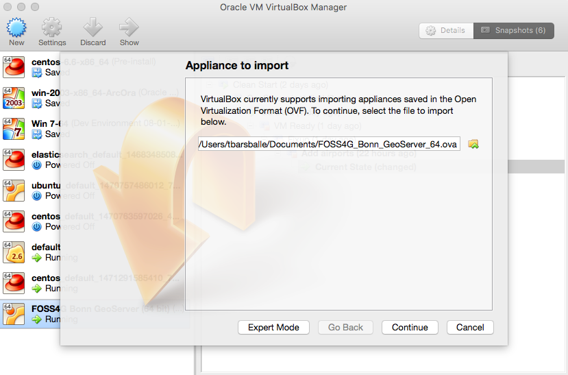
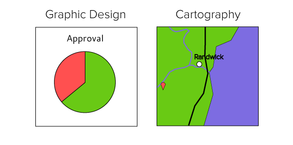
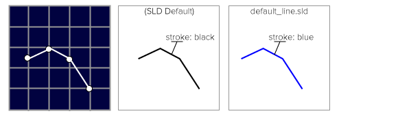
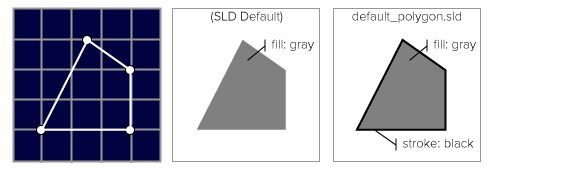
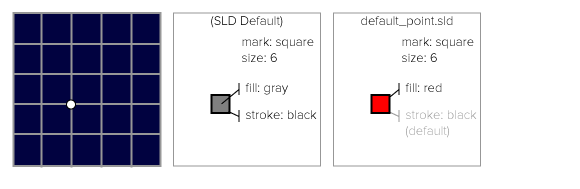
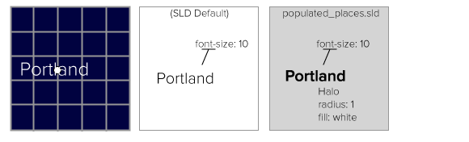
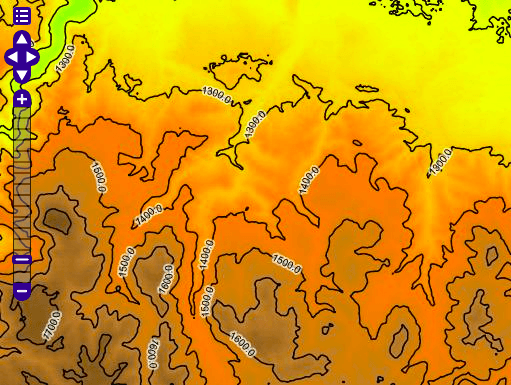

GeoServer Cartography and Style
===============================

.fx: titleslide

.. image:: ../source/img/geoserver.png

Boundless
---------

--------------------------------------------------

Outline
=======

#. VirtualBox and VM setup
#. Mapping
#. Styling

Presenter notes
---------------

* Plan for coffee break!
* 10 mins: Show the setup on screen, cap this at 10 mins using assistents to help anyone having trouble
* 10 mins: Mapping (the difference between style and symbology)
* 5 mins: CSS we are just providing the overview, do not get into selectors people will use them
* 5 mins: YSLD we are just providing the overview, do not get into defines people will use them

--------------------------------------------------

What is GeoServer?
==================

.. image:: ../source/img/geoserver.png

GeoServer is an open source software server written in Java that allows users to share and edit geospatial data

Presenter notes
---------------

GeoServer is an open source software server written in Java that allows users to share and edit geospatial data. Designed for interoperability, it publishes data from any major spatial data source using open standards.

Being a community-driven project, GeoServer is developed, tested, and supported by a diverse group of individuals and organizations from around the world.

GeoServer is the reference implementation of the Open Geospatial Consortium (OGC) Web Feature Service (WFS) and Web Coverage Service (WCS) standards, as well as a high performance certified compliant Web Map Service (WMS). GeoServer forms a core component of the Geospatial Web.

--------------------------------------------------

Section 1: Installing
=====================

* Virtual Box
* Workshop Data

--------------------------------------------------

Virtual Box - Install
=====================

https://www.virtualbox.org/

Presenter notes
---------------
Download and install Virtual Box from the link.

Virtual box allows you to run virtual machines on your system, simulating a native install of an OS on a physical computer.
For this workshop, we are using Virtual box to provide a pre-configured VM with GeoServer set up to include all the necessary data and extensions.

--------------------------------------------------

Virtual Box - VM Import
=======================

File > Import Appliance

Presenter Notes
---------------

Once you have installed virtualbox, import the FOSS4G_Bonn_GeoServer_64.ova.

From the menu, select File > Import Appliance. Click the folder icon and locate the .ova file on your computer.
Click "Continue", then click "Import".

The FOSS4G_Bonn_GeoServer_64 should now show up in your list of VMs. Select it, and click "Start"

--------------------------------------------------

Virtual Box - VM Details
========================

* OS: Ubuntu 14.04 (minimal)
* Username: foss4g

Presenter Notes
---------------
The VM is running a minimal Ubuntu headless install, with GeoServer 2.10-M0 running in Tomcat 8.
The Tomcat 8 service is configured to start up when the VM starts.

Ports 22, 8080, and 8433 have been forwarded to localhost on your native OS. Among other things this means that you will be able to access GeoServer in your host browser without having to log into the VM.

--------------------------------------------------

Workshop Data
=============

* Natural Earth
* USGS GTOPO30 DEM

Presenter Notes
---------------
This workshop uses a subset of the Natural Earth dataset published by the North American Cartographic Information Society.
We also use a Digital ELevation Model (DEM) from the United States Geological Survey (USGS) Global 30 Arc-Second Elevation (GTOPO30) dataset.
This data is included with the VM, and has been preconfigured in GeoServer.

Open up geoserver and select the Layer preview. Natural earth data is in the "ne" workspace. DEM is in the "usgs" workspace.

Now that we have our environment set up, we will give a breif overview of mapping concepts, and then move on to CSS and YSLD styling.

--------------------------------------------------

Section 2: Mapping
==================

Maps are a tool for visual communication.

--------------------------------------------------

Cartography
===========

The practice (art and science) of using a map to communicate information. Key considerations:

* The **idea** you are trying to communicate.
* The **target audience** the map is intended for.
* The **context** in which the map is used

--------------------------------------------------

Thematic Maps
=============

* Symbology changes on a feature-by-feature basis to illustrate attribute values
* Multiple themes can be used to show correlations between attributes

--------------------------------------------------

Map Icons
=========

* In Cartography, each icon type is is its own distinct data set
* In GIS, points of interest are often managed in a single layer, with icon choice determined by attributes of the layer

--------------------------------------------------

Map Design
==========

* Cartography, like any venue for design, is a human endeavour between art and science
* Selection of an appropriate colour palette is difficult, with a tension between what looks good and what can be understood

--------------------------------------------------

Color Brewer
============

http://colorbrewer2.org/

.. image:: ../source/design/img/color_01_brewer.png

--------------------------------------------------

Symbology
=========

The practice of representing information using shapes, colors, and symbols on a map.

.. image:: img/layer_legend.png

--------------------------------------------------

Section 3: Styling
==================

* GeoServer Styling is based on the OGC SLD Standard
* The Symbology Encoding standard provides the terms we will be using to describe style:
  * Stroke: borders and outlines of shapes
  * Fill: interior of shapes

--------------------------------------------------

Line symbolizer
===============

--------------------------------------------------

Polygon symbolizer
==================

--------------------------------------------------

Point symbolizer
================

--------------------------------------------------

Text symbolizer
===============

--------------------------------------------------

Raster symbolizer
=================

--------------------------------------------------

CSS and YSLD
============

* The CSS and YSLD extensions for GeoServer can be used to quickly generate SLD styles
* The CSS styling language uses a CSS-like syntax
* The YSLD Styling language uses a YAML syntax with a 1:1 correspondence with SLD

--------------------------------------------------

Questions?
==========

--------------------------------------------------

