GeoServer Cartography and Style
===============================

.fx: titleslide

.. image:: ../source/img/geoserver.png

Boundless
---------

Presenter notes
---------------

This is where you can write notes to yourself and only you will be able to see them.

--------------------------------------------------

Outline
=======

#. VirtualBox and VM setup
#. Mapping
#. CSS and YSLD
#. Line
#. Polygon
#. Point
#. Raster

Presenter notes
---------------

* Plan for coffee break!
* 10 mins: Show the setup on screen, cap this at 10 mins using assistents to help anyone having trouble
* 10 mins: Mapping (the difference between style and symbology)
* 5 mins: CSS we are just providing the overview, do not get into selectors people will use them
* 5 mins: YSLD we are just providing the overview, do not get into defines people will use them

--------------------------------------------------

What is GeoServer?
==================

.. image:: ../source/img/geoserver.png

GeoServer is an open source software server written in Java that allows users to share and edit geospatial data

Presenter notes
---------------

GeoServer is an open source software server written in Java that allows users to share and edit geospatial data. Designed for interoperability, it publishes data from any major spatial data source using open standards.

Being a community-driven project, GeoServer is developed, tested, and supported by a diverse group of individuals and organizations from around the world.

GeoServer is the reference implementation of the Open Geospatial Consortium (OGC) Web Feature Service (WFS) and Web Coverage Service (WCS) standards, as well as a high performance certified compliant Web Map Service (WMS). GeoServer forms a core component of the Geospatial Web.

--------------------------------------------------

Section 1: Installing
=====================

* Virtual Box Installation
* Description of Data Directory

Presenter notes
---------------

TBD

--------------------------------------------------

Section 5: Mapping
==================

This section introduces mapping as a tool for visual communication.

--------------------------------------------------

Communication
=============

What story are you trying to tell? Who are you telling the story to? And what decision are you encouraging them to make?

.. image:: img/design.png

--------------------------------------------------

Cartography
===========

The practice (art and science) of using a map to communicate information. Key considerations:

* The **idea** you are trying to communicate.
* The **target audience** the map is intended for.
* The **context** in which the map is used

--------------------------------------------------

Choropleth
==========

A thematic map where areas are colored (or themed) in order to communicate differences in magnitude of a measurement.

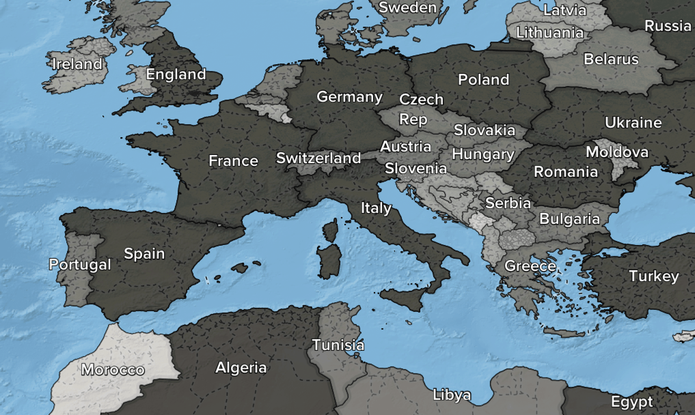

--------------------------------------------------

Heat map
========

A visualization of point data that produces a continuous gradient and changes color intensity to show the density of recorded observations.

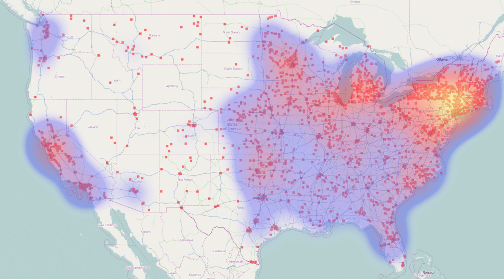

--------------------------------------------------

Barnes surface
==============

A continuous color gradient from a collection of quantitative point measurements.

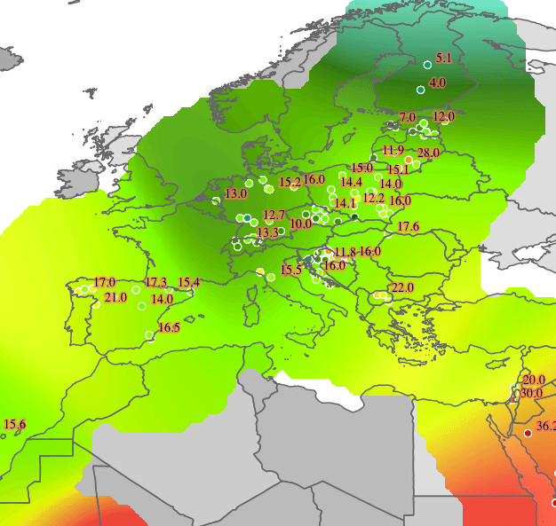

--------------------------------------------------

Cartogram
=========

Adjusts the size of each shape to illustrate a quantity, while preserving topology.

--------------------------------------------------

Cartogram
=========

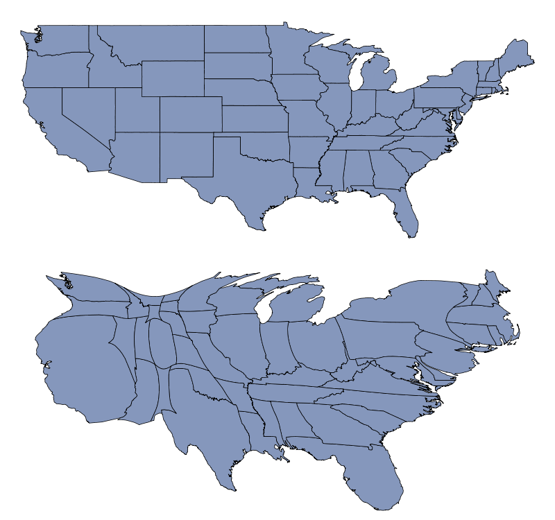

--------------------------------------------------

Elevation map
=============

Provides a direct representation of elevation, either using gray scale or by assigning an appropriate color gradient.

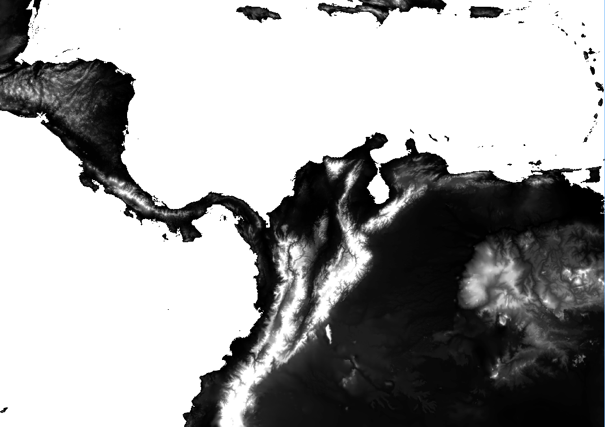

--------------------------------------------------

Shaded relief
=============

Uses the slope and orientation of the land to approximate shadows falling over the landscape in order to reveal its form.

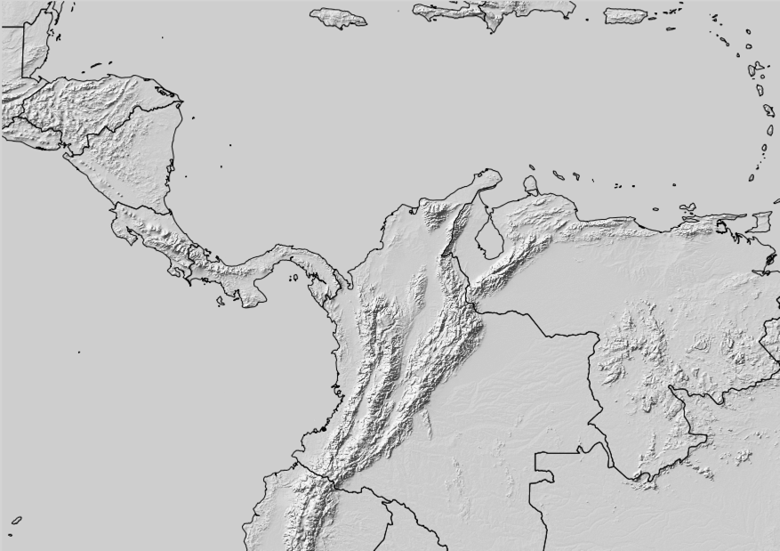

--------------------------------------------------

Contour map
===========

Communicates the shape of the landscape through the use of a consistent contour interval between lines.

.. image:: img/map_contour.png

--------------------------------------------------

General purpose map
===================

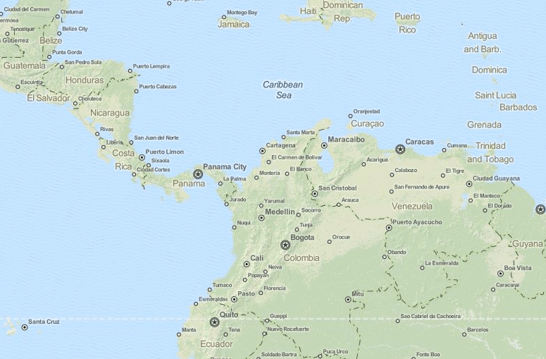

--------------------------------------------------

Layer
=====

A section of geographic content used to compose a map. 

.. image:: img/layer.png

--------------------------------------------------

Layer
=====

Layers are arranged into a drawing order, each drawn in turn as they are merged into the final map.

--------------------------------------------------

Layer
=====

A map legend provides readers with a key to understanding what each layer represents.

.. image:: img/layer_legend.png

--------------------------------------------------

Overlay
=======

Used to add additional details to a map and highlight existing details of the map.

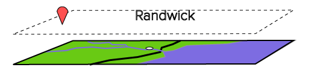

--------------------------------------------------

Basemap
=======

Used as a background for the comparison and display of data.

--------------------------------------------------

Tile set
========

Tile sets are often used to publish a basemap, providing a context for the overlay shown on top.

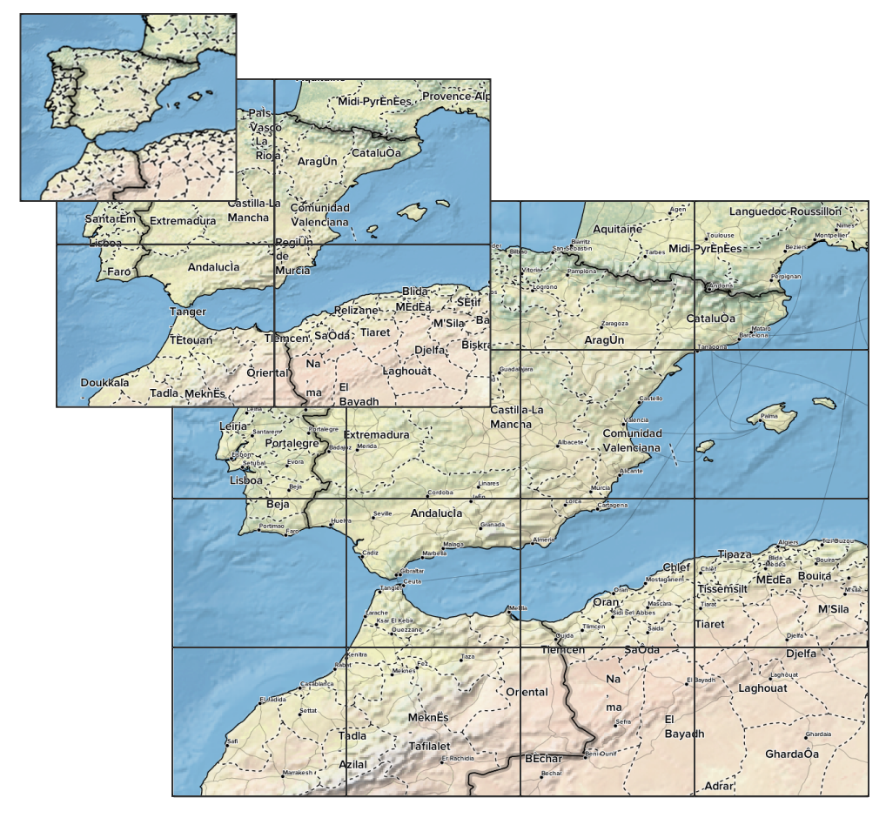

--------------------------------------------------

Zoom level
==========

Increasing detail of features:

* Level 0: 1:500M (Whole world)
* Level 1: 1:250M
* Level 2: 1:150M
* Level 3: 1:70M
* Level 4: 1:35M
* Level 5: 1:15M
* Level 6: 1:10M (State scale)

--------------------------------------------------

Feature
=======

An individual geometry, with attributes.

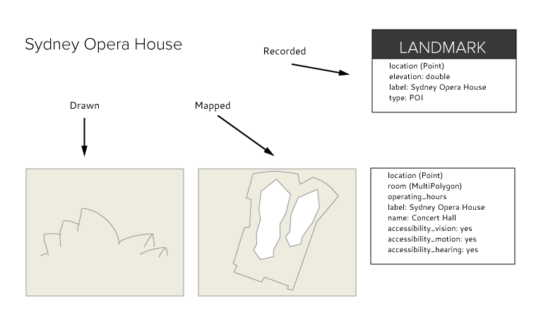

--------------------------------------------------

Coverage
========

A coverage is used to record an attribute whose value changes across an area.

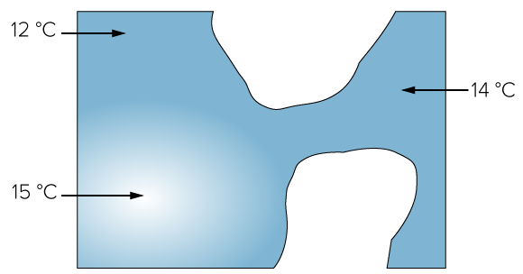

--------------------------------------------------

Symbology
=========

The practice of representing information using shapes, colors, and symbols on a map.

.. image:: img/layer_legend.png

--------------------------------------------------

Style
=====

* The style used when rendering data into a visualization is the result of cartographic decisions.
* GeoServer uses **Styled Layer Descriptor (SLD)** for visualization.

--------------------------------------------------

Style
=====

Line symbolizer:

.. image:: img/LineSymbolizer.png

--------------------------------------------------

Style
=====

Polygon symbolizer:

.. image:: img/PolygonSymbolizer.png

--------------------------------------------------

Style
=====

Point symbolizer:

.. image:: img/PointSymbolizer.png

--------------------------------------------------

Style
=====

Text symbolizer:

.. image:: img/TextSymbolizer.png

--------------------------------------------------

Style
=====

Raster symbolizer:

.. image:: img/map_contour.png

--------------------------------------------------

Composition
===========

The final composition of a map is based on how the map is intended to be used.

Determinations:

* Projection (all have tradeoffs)
* Scale (ratio of distance on a map to distance on the ground)

--------------------------------------------------

Mapping Review
==============

* A cartographer must consider the idea to communicate, the target audience, and the context in which the map is used.
* A choropleth map is a thematic map where areas are colored to communicate differences in a measurement.
* A heat map is a visualization of point data that produces a continuous gradient and changes color intensity to show the density of observations.

--------------------------------------------------

Concepts Review
=======================

* A Barnes surface interpolation map constructs a continuous color gradient from a collection of quantitative point measurements.
* An elevation map provides a direct representation of elevation.
* A layer are sections of geographic content used to compose a map.
* A basemap is used as a background for the comparison of data.

--------------------------------------------------

Concepts Review
===============

* Symbology is the practice of representing information using shapes, colors and symbols on a map.
* A style is a formal definition of how to apply symbology to features.
* The OGC standard for styling spatial data is called Styled Layer Descriptor (SLD).
* Scale is a ratio of distance on a map to distance on the ground.

--------------------------------------------------

Any questions?
==============

--------------------------------------------------

