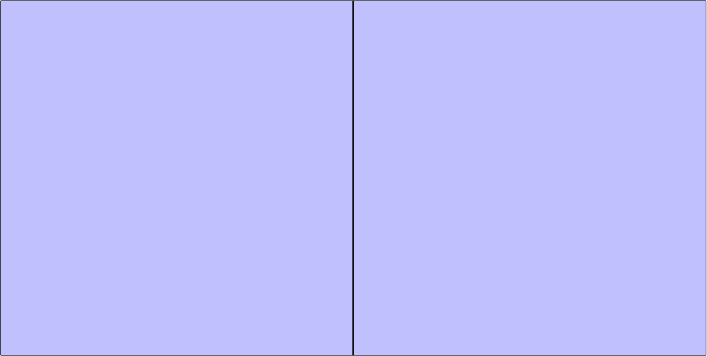
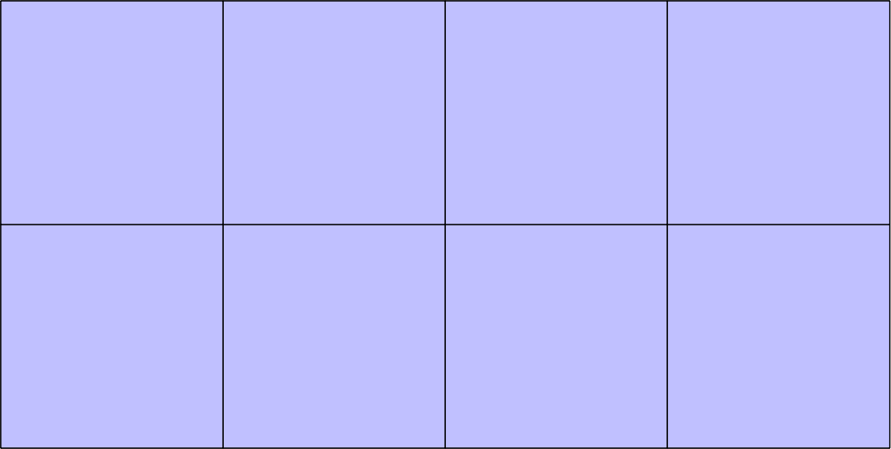
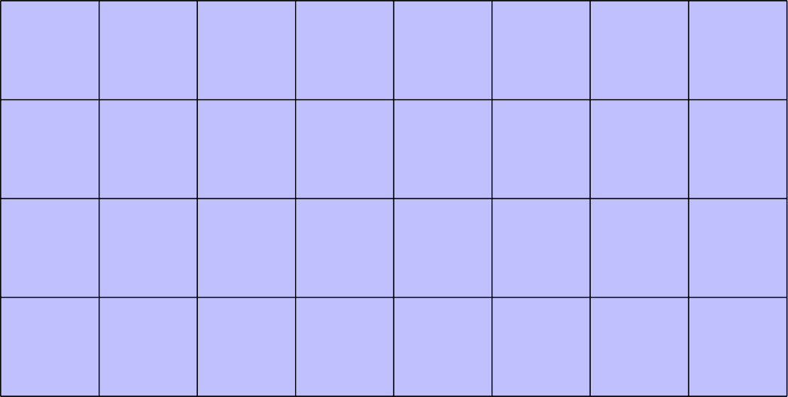
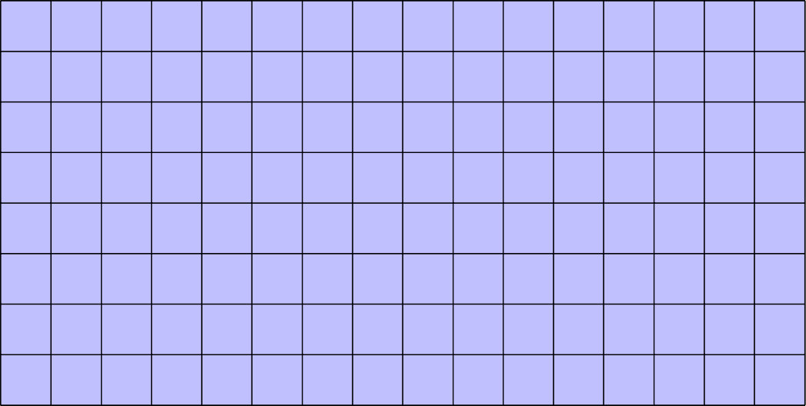

Gridsets
========

GeoWebCache does not cache every tile request that it receives. For an image to be considered a "cacheable" tile, it must align with certain pre-defined :term:`gridsets <gridset>`. 

Gridsets define how to create tiles for a particular spatial reference system at desired zoom levels. For example, GeoServer provides a pre-defined gridset with the following settings:

- **Coordinate reference system:** EPSG:4326
- **Bounds:** -180, -90, 180, 90
- **Tile size:** 256×256 pixels

.. note:: To benefit from caching, a client must request images that match the tile size, the CRS and the coordinates of the tiles as calculated by the definition of the tile matrix set. 

.. note:: It is possible to have gridsets which are smaller than the natural bounds of the CRS.

The gridset also defines a :term:`set <tile matrix set>` of 22 :term:`tile matrices <tile matrix>`, which describe what zoom levels will be handled by GeoWebCache. 

This gridset is twice as wide as it is high, but the tiles themselves are square (256 pixels). Therefore, the first tile matrix set is two square tiles side-by-side.

   
   EPSG:4326:0

At each increasing zoom level, the two starting tiles, are further divided as follows:

   
   EPSG:4326:1

   
   EPSG:4326:2

   
   EPSG:4326:3

.. only:: instructor

   .. admonition:: Instructor Notes
   
      There is no requirement that there is a regular progression between the zoom levels in a gridset. In the example images, there is a regular geometric progression, but there can be any arbitrary sequence of tile matrices.
    
If the request parameters do not align with a gridset, GeoWebCache will be unable to satisfy the request and will return an error document: ``HTTP/1.1 400 Bad Request``.

Tolerance
---------

GeoWebCache is not strict in requiring that the coordinates of a requested image match the gridset exactly; the coordinates can be within a 10% margin of error of the tile size.

For example, if a tile represents ten degrees square on the map, the request can be for up to one degree off the grid in any direction, and the correct tile will still be returned.

If the request is greater than 10% off of the grid, the request will be rejected by GeoWebCache.

.. figure:: images/geowebcache-400.png
   
   Gridset misalignment

.. only:: instructor

   .. admonition:: Instructor Notes

      TODO: A graphic showing this 10% tolerance would be nice here.

Gridsubsets
-----------

Gridsets are defined globally for the server, while :term:`gridsubsets <gridsubset>` are layer-specific definitions. The bounding box and zoom levels of a gridsubset must be subsets of their base gridsets.

We will configure gridsubsets using the GeoServer web interface in a later section.

.. admonition:: Exercise

   Now we can look at one of the default a gridsets that ships with GeoServer. These default gridsets may not be modified. 
  
   #. Click :menuselection:`Tile Caching --> Gridsets`.
  
      .. figure:: ../images/geoserver-tile-caching-menu_gridsets.png
  
         GeoServer's Tile Caching menu
     
   #. Note the default gridsets that are default in GeoServer. Click the :guilabel:`EPSG:4326` link.
  
      .. figure:: images/geoserver-tile-caching-menu-gridsets.png
   
         Default gridsets in GeoServer
     
   #. Note the CRS, description, bounds and tile size for this gridset.
  
      .. figure:: images/geoserver-tile-caching-menu-gridsets-epsg4326_01.png
   
         Default EPSG:4326 gridset settings
        
   #. Note the levels in the tile matrix set as well as the individual scales and number of tiles for each set.
     
      .. figure:: images/geoserver-tile-caching-menu-gridsets-epsg4326_02.png
   
         Default EPSG:4326 gridset tile matrix set

.. only:: instructor

  .. admonition:: Instructor Notes
  
     We will not discuss in detail the relationship between resolutions and scales, but know that it relies on the units the CRS is defined in as well as the size of the tiles.

.. admonition:: Explore

   What is different about the ``GlobalCRS84Scale`` gridset?

   .. only:: instructor

      .. admonition:: Instructor Notes

         The ``GlobalCRS84Scale`` gridset is a good example of a gridset where the scale progression is not geometric, but rather uses common, rounded cartographic scales. The scale values for each zoom level are as follows::

           1:500,000,000
           1:250,000,000
           1:100,000,000
           1:50,000,000
           1:25,000,000
           1:10,000,000
           1:5,000,000
           1:2,500,000
           1:1,000,000
           ...
